<Hero
  title="Caching Patterns and Strategies"
  subtitle="Optimize distributed systems with proven caching patterns: cache-aside, write-through, write-behind, and read-through to balance performance, consistency, and complexity."
  difficulty="intermediate"
  time="15 min read"
/>

## TL;DR

Four primary caching patterns address different latency/consistency requirements: **Cache-Aside** (lazy loading, eventual consistency), **Write-Through** (strong consistency, higher latency), **Write-Behind** (low latency writes, replication lag), and **Read-Through** (transparent cache population). Combine with TTL-based expiration and LRU/LFU eviction policies. Choose based on consistency requirements (strong vs eventual), write patterns (frequent vs rare), and acceptable stale-data windows.

## Learning Objectives

By the end of this article, you'll understand:
- Four core caching patterns and their trade-offs
- Cache invalidation strategies: TTL, event-driven, and invalidation protocols
- Eviction policies: LRU, LFU, and application-specific strategies
- Consistency models: strong, eventual, and relaxed guarantees
- When to cache and when to bypass for correctness

## Motivating Scenario

Your e-commerce platform's product catalog service experiences 10x traffic spike during flash sales. Database load spikes to 95%, query latency balloons from 50ms to 2+ seconds. Users see timeouts, checkout fails, revenue drops. You have a cache layer (Redis) sitting idle because you're unsure which caching pattern prevents stale data while maintaining throughput. Should writes update cache immediately or asynchronously? How do you invalidate when inventory changes? How do you prevent cache stampedes?

## Core Concepts

```mermaid
graph TB
    subgraph "Cache-Aside (Lazy Loading)"
        CA["Application checks cache<br/>Cache miss → Load from DB<br/>Application updates cache"]
        CACONS["Consistency: Eventual<br/>Latency: Mixed<br/>Complexity: Low"]
    end

    subgraph "Write-Through"
        WT["Application writes to cache<br/>Cache writes to DB<br/>Application waits for both"]
        WTCONS["Consistency: Strong<br/>Latency: High<br/>Complexity: Medium"]
    end

    subgraph "Write-Behind (Write-Back)"
        WB["Application writes to cache<br/>Cache returns immediately<br/>Cache async writes to DB"]
        WBCONS["Consistency: Eventual<br/>Latency: Low<br/>Complexity: High"]
    end

    subgraph "Read-Through"
        RT["Cache loader transparently<br/>populates from DB<br/>Application sees cache-only"]
        RTCONS["Consistency: Eventual<br/>Latency: Optimized<br/>Complexity: Medium"]
    end

    CA --> CACONS
    WT --> WTCONS
    WB --> WBCONS
    RT --> RTCONS
```

<Figure title="Caching Patterns Comparison Matrix">

</Figure>

### Cache-Aside Pattern (Lazy Loading)

Application directly manages cache interaction. On read miss, load from source and populate cache.

**Characteristics:**
- Application responsible for cache logic
- Simple to implement and understand
- Works with any cache backend (Redis, Memcached, etc.)
- Eventual consistency model
- Cache misses cause first request to be slow

**Flow:**
1. Application requests data
2. Check cache (hit → return)
3. Cache miss → load from database
4. Update cache with TTL
5. Return to application

**Best for:** Web content, non-critical data, read-heavy workloads, content delivery networks.

### Write-Through Pattern

Application writes to cache first; cache synchronously writes to source. Application waits for both.

**Characteristics:**
- Strong consistency guaranteed
- Higher latency (write to both cache and DB)
- Prevents cache-DB divergence
- Cache always contains valid data
- Useful for critical data

**Flow:**
1. Application writes to cache
2. Cache propagates write to database
3. Both acknowledge completion
4. Application continues

**Best for:** Financial transactions, inventory systems, user account data, audit logs.

### Write-Behind (Write-Back) Pattern

Application writes to cache immediately; cache asynchronously persists to source.

**Characteristics:**
- Low write latency (application doesn't wait for DB)
- Eventual consistency with durability risk
- Cache acts as write-buffer
- Potential data loss if cache fails before flush
- Requires replication for durability

**Flow:**
1. Application writes to cache
2. Cache acknowledges immediately
3. Cache queues write for background flush
4. Eventually persists to database

**Best for:** Analytics, logging, non-critical updates, high-throughput write scenarios.

### Read-Through Pattern

Cache layer transparently loads missing data from source, decoupling application from DB.

**Characteristics:**
- Simplifies application logic
- Cache responsible for population
- Automatic cache warming on misses
- Application sees cache-only interface
- Requires cache-aware data loader

**Flow:**
1. Application requests from cache
2. Cache checks local store
3. Cache miss → cache loader fetches from DB
4. Cache populates and returns
5. Application receives data

**Best for:** Abstracted data layers, microservices, multi-tier caching, transparent performance optimization.

### Cache Invalidation Strategies

**Time-Based (TTL):**
- Simplest approach
- Fixed expiration (e.g., 5 minutes)
- No active invalidation needed
- Trades freshness for simplicity
- Risk: stale data between expiry and access

**Event-Driven Invalidation:**
- Database triggers cache purge on updates
- Message queue notifies cache of changes
- Zero staleness window
- Requires coordinated systems
- More operational complexity

**Hybrid (TTL + Invalidation):**
- TTL as safety net
- Events trigger immediate invalidation
- Best of both: timely updates + eventual consistency guarantee
- Recommended for most systems

### Eviction Policies

**LRU (Least Recently Used):**
- Evict least-accessed items first
- Suits temporal locality (recent accesses predict future)
- Low overhead tracking
- Common default

**LFU (Least Frequently Used):**
- Evict least-frequently accessed items
- Better for skewed access patterns
- Heavier tracking overhead
- Suits stable access patterns

**FIFO (First In, First Out):**
- Evict oldest items regardless of access
- No tracking overhead
- Ignores access patterns
- Rarely optimal

## Practical Example

<Tabs>
<TabItem value="python" label="Python (Redis Caching)">
```python
import redis
import json
from datetime import datetime, timedelta
from typing import Optional, Any
import hashlib

class CacheStrategy:
    def __init__(self, redis_host='localhost', redis_port=6379):
        self.redis = redis.Redis(
            host=redis_host,
            port=redis_port,
            decode_responses=True
        )
        self.cache_ttl = 300  # 5 minutes

    # Cache-Aside Pattern
    def cache_aside_read(self, key: str, loader_func, ttl: int = None):
        """Lazy-load with cache-aside pattern"""
        ttl = ttl or self.cache_ttl

        # Check cache
        cached = self.redis.get(key)
        if cached:
            print(f"Cache HIT: {key}")
            return json.loads(cached)

        # Cache miss - load from source
        print(f"Cache MISS: {key} - loading from source")
        data = loader_func()

        # Update cache
        self.redis.setex(key, ttl, json.dumps(data))
        return data

    # Write-Through Pattern
    def write_through(self, key: str, data: Any, persist_func):
        """Write to both cache and database synchronously"""
        print(f"Write-Through: {key}")

        try:
            # Write to database first (safest)
            persist_func(data)

            # Then update cache
            self.redis.setex(
                key,
                self.cache_ttl,
                json.dumps(data)
            )
            print(f"✓ Write-Through complete: {key}")
            return True
        except Exception as e:
            print(f"✗ Write-Through failed: {e}")
            return False

    # Write-Behind Pattern
    def write_behind(self, key: str, data: Any, queue_func):
        """Write to cache immediately, queue DB persistence"""
        print(f"Write-Behind: {key}")

        # Write to cache first
        self.redis.setex(
            key,
            self.cache_ttl,
            json.dumps(data)
        )

        # Queue for asynchronous persistence
        queue_func(key, data)
        print(f"✓ Cache updated, DB write queued: {key}")

    # Read-Through Pattern
    def read_through(self, key: str, loader_func):
        """Transparent cache population"""
        cached = self.redis.get(key)
        if cached:
            print(f"Cache HIT: {key}")
            return json.loads(cached)

        # Cache miss - transparent load
        print(f"Cache MISS: {key} - loader populating")
        data = loader_func()
        self.redis.setex(key, self.cache_ttl, json.dumps(data))
        return data

    # Cache invalidation
    def invalidate(self, key: str):
        """Event-driven invalidation"""
        deleted = self.redis.delete(key)
        print(f"Invalidated: {key} (deleted: {deleted})")

    def invalidate_pattern(self, pattern: str):
        """Invalidate keys matching pattern"""
        keys = self.redis.keys(pattern)
        if keys:
            self.redis.delete(*keys)
            print(f"Invalidated {len(keys)} keys matching: {pattern}")

    # Cache stampede prevention
    def cache_aside_with_lock(self, key: str, loader_func, ttl: int = None):
        """Prevent cache stampede with lock"""
        ttl = ttl or self.cache_ttl
        lock_key = f"{key}:lock"
        lock_ttl = 10  # Seconds

        cached = self.redis.get(key)
        if cached:
            return json.loads(cached)

        # Try to acquire lock
        lock_acquired = self.redis.set(
            lock_key,
            '1',
            nx=True,
            ex=lock_ttl
        )

        if lock_acquired:
            # We got the lock - load and populate
            print(f"Acquired lock for: {key}")
            data = loader_func()
            self.redis.setex(key, ttl, json.dumps(data))
            self.redis.delete(lock_key)
            return data
        else:
            # Another request is loading - wait for cache
            for _ in range(lock_ttl):
                cached = self.redis.get(key)
                if cached:
                    print(f"Got data from loading process: {key}")
                    return json.loads(cached)
                time.sleep(0.1)

            # Fallback: return from source if still no cache
            return loader_func()

    # Cache statistics
    def get_stats(self) -> dict:
        """Get cache statistics"""
        return {
            'memory_used_mb': int(
                self.redis.info()['used_memory']
            ) / 1024 / 1024,
            'keys_count': self.redis.dbsize(),
            'evicted_keys': int(
                self.redis.info()['evicted_keys']
            )
        }

# Example usage
def main():
    cache = CacheStrategy()

    # Simulated database loader
    def load_user(user_id=1):
        print("  [DB] Loading user from database...")
        return {'id': user_id, 'name': 'Alice', 'email': 'alice@example.com'}

    def persist_user(data):
        print("  [DB] Persisting user to database...")

    # Cache-Aside
    print("=== Cache-Aside Pattern ===")
    user = cache.cache_aside_read(f"user:1", load_user)
    print(f"User: {user}\n")

    # Write-Through
    print("=== Write-Through Pattern ===")
    new_user = {'id': 2, 'name': 'Bob', 'email': 'bob@example.com'}
    cache.write_through("user:2", new_user, persist_user)
    print()

    # Write-Behind
    print("=== Write-Behind Pattern ===")
    updated_user = {'id': 1, 'name': 'Alice Updated'}
    cache.write_behind("user:1", updated_user,
                       lambda k, v: print(f"  [Queue] {k} queued"))
    print()

    # Cache stats
    print(f"Cache stats: {cache.get_stats()}")
```
</TabItem>

<TabItem value="go" label="Go (Redis with Invalidation)">
```go
package main

import (
	"context"
	"encoding/json"
	"fmt"
	"time"

	"github.com/redis/go-redis/v9"
)

type User struct {
	ID    int    `json:"id"`
	Name  string `json:"name"`
	Email string `json:"email"`
}

type CacheManager struct {
	client *redis.Client
	ttl    time.Duration
}

func NewCacheManager(addr string) *CacheManager {
	return &CacheManager{
		client: redis.NewClient(&redis.Options{
			Addr: addr,
		}),
		ttl: 5 * time.Minute,
	}
}

// Cache-Aside Pattern
func (cm *CacheManager) CacheAsideRead(
	ctx context.Context,
	key string,
	loader func() (interface{}, error),
) (interface{}, error) {
	// Check cache
	cached, err := cm.client.Get(ctx, key).Result()
	if err == nil {
		fmt.Printf("Cache HIT: %s\n", key)
		var data interface{}
		json.Unmarshal([]byte(cached), &data)
		return data, nil
	}

	// Cache miss
	fmt.Printf("Cache MISS: %s - loading from source\n", key)
	data, err := loader()
	if err != nil {
		return nil, err
	}

	// Update cache
	jsonData, _ := json.Marshal(data)
	cm.client.SetEx(ctx, key, string(jsonData), cm.ttl)

	return data, nil
}

// Write-Through Pattern
func (cm *CacheManager) WriteThrough(
	ctx context.Context,
	key string,
	data interface{},
	persist func() error,
) error {
	fmt.Printf("Write-Through: %s\n", key)

	// Write to DB first
	if err := persist(); err != nil {
		return err
	}

	// Then update cache
	jsonData, _ := json.Marshal(data)
	return cm.client.SetEx(ctx, key, string(jsonData), cm.ttl).Err()
}

// Write-Behind Pattern
func (cm *CacheManager) WriteBehind(
	ctx context.Context,
	key string,
	data interface{},
	queueFunc func() error,
) error {
	fmt.Printf("Write-Behind: %s\n", key)

	// Write to cache immediately
	jsonData, _ := json.Marshal(data)
	if err := cm.client.SetEx(ctx, key, string(jsonData), cm.ttl).Err(); err != nil {
		return err
	}

	// Queue for async persistence (goroutine)
	go func() {
		if err := queueFunc(); err != nil {
			fmt.Printf("Error queuing write: %v\n", err)
		}
	}()

	return nil
}

// Event-driven invalidation
func (cm *CacheManager) Invalidate(ctx context.Context, key string) error {
	return cm.client.Del(ctx, key).Err()
}

// Batch invalidation with pattern
func (cm *CacheManager) InvalidatePattern(ctx context.Context, pattern string) error {
	iter := cm.client.Scan(ctx, 0, pattern, 100).Iterator()
	var keys []string

	for iter.Next(ctx) {
		keys = append(keys, iter.Val())
	}

	if len(keys) > 0 {
		return cm.client.Del(ctx, keys...).Err()
	}
	return nil
}

// Prevent cache stampede with distributed lock
func (cm *CacheManager) CacheAsideWithLock(
	ctx context.Context,
	key string,
	loader func() (interface{}, error),
) (interface{}, error) {
	lockKey := key + ":lock"
	lockTTL := 10 * time.Second

	// Check cache
	cached, err := cm.client.Get(ctx, key).Result()
	if err == nil {
		var data interface{}
		json.Unmarshal([]byte(cached), &data)
		return data, nil
	}

	// Try to acquire lock
	lockAcquired, _ := cm.client.SetNX(ctx, lockKey, "1", lockTTL).Result()

	if lockAcquired {
		fmt.Printf("Acquired lock for: %s\n", key)
		data, err := loader()
		if err != nil {
			cm.client.Del(ctx, lockKey)
			return nil, err
		}

		jsonData, _ := json.Marshal(data)
		cm.client.SetEx(ctx, key, string(jsonData), cm.ttl)
		cm.client.Del(ctx, lockKey)
		return data, nil
	}

	// Wait for another request to populate cache
	for i := 0; i < 10; i++ {
		time.Sleep(100 * time.Millisecond)
		cached, err := cm.client.Get(ctx, key).Result()
		if err == nil {
			fmt.Printf("Got data from loading process: %s\n", key)
			var data interface{}
			json.Unmarshal([]byte(cached), &data)
			return data, nil
		}
	}

	// Fallback to loader
	return loader()
}

func main() {
	cm := NewCacheManager("localhost:6379")
	ctx := context.Background()

	// Database loader
	dbLoader := func() (interface{}, error) {
		fmt.Println("  [DB] Loading from database...")
		return User{ID: 1, Name: "Alice", Email: "alice@example.com"}, nil
	}

	// Cache-Aside
	fmt.Println("=== Cache-Aside Pattern ===")
	user, _ := cm.CacheAsideRead(ctx, "user:1", dbLoader)
	fmt.Printf("User: %+v\n\n", user)

	// Write-Through
	fmt.Println("=== Write-Through Pattern ===")
	newUser := User{ID: 2, Name: "Bob", Email: "bob@example.com"}
	cm.WriteThrough(ctx, "user:2", newUser, func() error {
		fmt.Println("  [DB] Persisting to database...")
		return nil
	})

	// Invalidation
	fmt.Println("\n=== Invalidation ===")
	cm.Invalidate(ctx, "user:1")
	fmt.Println("Cache invalidated")
}
```
</TabItem>

<TabItem value="node" label="Node.js (Cache Pattern Strategies)">
```javascript
const redis = require('redis');

class CacheStrategy {
  constructor(redisUrl = 'redis://localhost:6379') {
    this.client = redis.createClient({ url: redisUrl });
    this.client.connect();
    this.ttl = 300; // 5 minutes
  }

  // Cache-Aside Pattern
  async cacheAsideRead(key, loaderFunc) {
    // Check cache
    const cached = await this.client.get(key);
    if (cached) {
      console.log(`Cache HIT: ${key}`);
      return JSON.parse(cached);
    }

    // Cache miss
    console.log(`Cache MISS: ${key} - loading from source`);
    const data = await loaderFunc();

    // Update cache
    await this.client.setEx(key, this.ttl, JSON.stringify(data));
    return data;
  }

  // Write-Through Pattern
  async writeThrough(key, data, persistFunc) {
    console.log(`Write-Through: ${key}`);

    try {
      // Write to DB first
      await persistFunc(data);

      // Then update cache
      await this.client.setEx(key, this.ttl, JSON.stringify(data));
      console.log(`✓ Write-Through complete: ${key}`);
      return true;
    } catch (error) {
      console.error(`✗ Write-Through failed: ${error.message}`);
      return false;
    }
  }

  // Write-Behind Pattern
  async writeBehind(key, data, queueFunc) {
    console.log(`Write-Behind: ${key}`);

    // Write to cache immediately
    await this.client.setEx(key, this.ttl, JSON.stringify(data));

    // Queue for async persistence
    await queueFunc(key, data);
    console.log(`✓ Cache updated, DB write queued: ${key}`);
  }

  // Read-Through Pattern
  async readThrough(key, loaderFunc) {
    const cached = await this.client.get(key);
    if (cached) {
      console.log(`Cache HIT: ${key}`);
      return JSON.parse(cached);
    }

    console.log(`Cache MISS: ${key} - loader populating`);
    const data = await loaderFunc();
    await this.client.setEx(key, this.ttl, JSON.stringify(data));
    return data;
  }

  // Event-driven invalidation
  async invalidate(key) {
    const deleted = await this.client.del(key);
    console.log(`Invalidated: ${key} (deleted: ${deleted})`);
  }

  // Pattern invalidation
  async invalidatePattern(pattern) {
    const keys = await this.client.keys(pattern);
    if (keys.length > 0) {
      await this.client.del(keys);
      console.log(`Invalidated ${keys.length} keys matching: ${pattern}`);
    }
  }

  // Cache stampede prevention with lock
  async cacheAsideWithLock(key, loaderFunc, maxWaitMs = 10000) {
    const lockKey = `${key}:lock`;
    const lockTtl = 10; // seconds

    // Check cache
    const cached = await this.client.get(key);
    if (cached) {
      return JSON.parse(cached);
    }

    // Try to acquire lock
    const lockAcquired = await this.client.set(
      lockKey,
      '1',
      { EX: lockTtl, NX: true }
    );

    if (lockAcquired) {
      console.log(`Acquired lock for: ${key}`);
      const data = await loaderFunc();
      await this.client.setEx(key, this.ttl, JSON.stringify(data));
      await this.client.del(lockKey);
      return data;
    }

    // Wait for data to appear in cache
    const startTime = Date.now();
    while (Date.now() - startTime < maxWaitMs) {
      const cached = await this.client.get(key);
      if (cached) {
        console.log(`Got data from loading process: ${key}`);
        return JSON.parse(cached);
      }
      await new Promise(resolve => setTimeout(resolve, 100));
    }

    // Fallback to loader
    return await loaderFunc();
  }

  // Cache stats
  async getStats() {
    const info = await this.client.info('memory');
    return {
      memory_used_mb: parseInt(
        info.match(/used_memory:(\d+)/)[1]
      ) / 1024 / 1024,
      keys_count: await this.client.dbSize()
    };
  }

  async disconnect() {
    await this.client.quit();
  }
}

// Example usage
async function main() {
  const cache = new CacheStrategy();

  // Database loader
  const dbLoader = async () => {
    console.log('  [DB] Loading from database...');
    return { id: 1, name: 'Alice', email: 'alice@example.com' };
  };

  // Cache-Aside
  console.log('=== Cache-Aside Pattern ===');
  const user = await cache.cacheAsideRead('user:1', dbLoader);
  console.log(`User: ${JSON.stringify(user)}\n`);

  // Write-Through
  console.log('=== Write-Through Pattern ===');
  const newUser = { id: 2, name: 'Bob', email: 'bob@example.com' };
  await cache.writeThrough('user:2', newUser, async (data) => {
    console.log('  [DB] Persisting to database...');
  });

  // Write-Behind
  console.log('\n=== Write-Behind Pattern ===');
  const updated = { id: 1, name: 'Alice Updated' };
  await cache.writeBehind('user:1', updated, async (k, v) => {
    console.log(`  [Queue] ${k} queued`);
  });

  // Cache stats
  const stats = await cache.getStats();
  console.log(`\nCache stats: ${JSON.stringify(stats)}`);

  await cache.disconnect();
}

main().catch(console.error);
```
</TabItem>
</Tabs>

## When to Use / When Not to Use

<Vs items={[
{
    label: "Cache-Aside When:",
    points: ["Reads outnumber writes by 10:1 or more", "Acceptable eventual consistency (stale data okay)", "Cache failures don", ",", ","]
  },
{
    label: "Write-Through When:",
    points: ["Strong consistency critical (financial data)", "Can tolerate higher write latency", "Cache failures must not lose data", "Inventory/account systems", "Audit and compliance requirements"]
  }
]} />

## Patterns & Pitfalls

<Showcase  sections={[{
      title: "Cache Stampede Prevention",
      description: "When cache expires, 1000 requests hit DB simultaneously. Use distributed locks, probabilistic early expiration (xfetch), or probabilistic recomputation.",
      icon: "✓",
      positive: true
    }, {
      title: "Wrong TTL Selection",
      description: "Too short TTL = cache thrashing and DB load. Too long = stale data frustration. Profile access patterns; use 5-15 min for web content, 1-5 min for real-time data.",
      icon: "✓",
      positive: true
    }, {
      title: "Cache-Aside Data Loss",
      description: "Crashed cache means DB is never checked again. Implement fallback to DB on cache errors instead of failing.",
      icon: "✗",
      positive: false
    }, {
      title: "Write-Behind Without Durability",
      description: "Cache-only writes can be lost if cache fails. Queue writes to durable messaging system before acknowledging to application.",
      icon: "✓",
      positive: true
    }, {
      title: "Unbounded Cache Growth",
      description: "Missing eviction policies cause memory to fill and cache to stop accepting writes. Configure max memory with LRU/LFU eviction.",
      icon: "✗",
      positive: false
    }, {
      title: "Cache Coherence Issues",
      description: "Multiple cache layers without invalidation protocol cause divergence. Use cache hierarchy with TTL at each level and invalidation broadcasts.",
      icon: "✓",
      positive: true
    }]}
/>

## Design Review Checklist

<Checklist
  items={[
    { label: "Caching pattern selected matches consistency requirements", checked: false },
    { label: "TTL tuned to access patterns (profile before guessing)", checked: false },
    { label: "Eviction policy configured (LRU/LFU with max memory bounds)", checked: false },
    { label: "Cache invalidation strategy documented (TTL, event-driven, hybrid)", checked: false },
    { label: "Cache stampede prevention implemented if needed", checked: false },
    { label: "Write-Behind durability guaranteed (durable queue before ACK)", checked: false },
    { label: "Write-Through latency impact measured and acceptable", checked: false },
    { label: "Cache failures handled gracefully (fallback to DB)", checked: false },
    { label: "Monitoring tracks hit rate, evictions, replication lag", checked: false },
    { label: "Documentation explains pattern choice and consistency guarantees", checked: false }
  ]}
/>

## Self-Check

Ask yourself:
- What consistency model does my data require (strong vs eventual)?
- What's my cache hit rate and is it acceptable?
- Can my application tolerate seeing stale data?
- What happens if the cache fails completely?
- Are cache writes persisted durably before I acknowledge?

## One Key Takeaway

:::info
**Choose caching patterns based on consistency requirements, not just performance. Cache-Aside suits eventual consistency; Write-Through guarantees consistency at latency cost; Write-Behind maximizes throughput but risks data loss. Always measure hit rates and profile before tuning TTL.**

:::

## Next Steps

1. **Measure current hit rates** - Add cache metrics to all layers
2. **Profile access patterns** - Identify hot keys and access frequency
3. **Simulate cache failures** - Test application behavior on cache loss
4. **Tune TTL** - Start conservative (5 min), adjust based on freshness needs
5. **Implement invalidation** - Add event-driven invalidation for critical data
6. **Monitor evictions** - Alert when eviction rate exceeds thresholds
7. **Test failover** - Ensure application doesn't fail when cache is unavailable

## References

- <a href="https://redis.io/docs/latest/develop/use/patterns/" target="_blank" rel="nofollow noopener noreferrer">Redis Patterns and Use Cases ↗️</a>
- <a href="https://aws.amazon.com/caching/best-practices/" target="_blank" rel="nofollow noopener noreferrer">AWS Caching Best Practices ↗️</a>
- <a href="https://martinfowler.com/bliki/BloomFilter.html" target="_blank" rel="nofollow noopener noreferrer">Martin Fowler on Caching ↗️</a>
- <a href="https://en.wikipedia.org/wiki/Cache_replacement_policies" target="_blank" rel="nofollow noopener noreferrer">Cache Replacement Policies ↗️</a>
- <a href="https://cloud.google.com/docs/caching/overview" target="_blank" rel="nofollow noopener noreferrer">Google Cloud Caching Overview ↗️</a>
