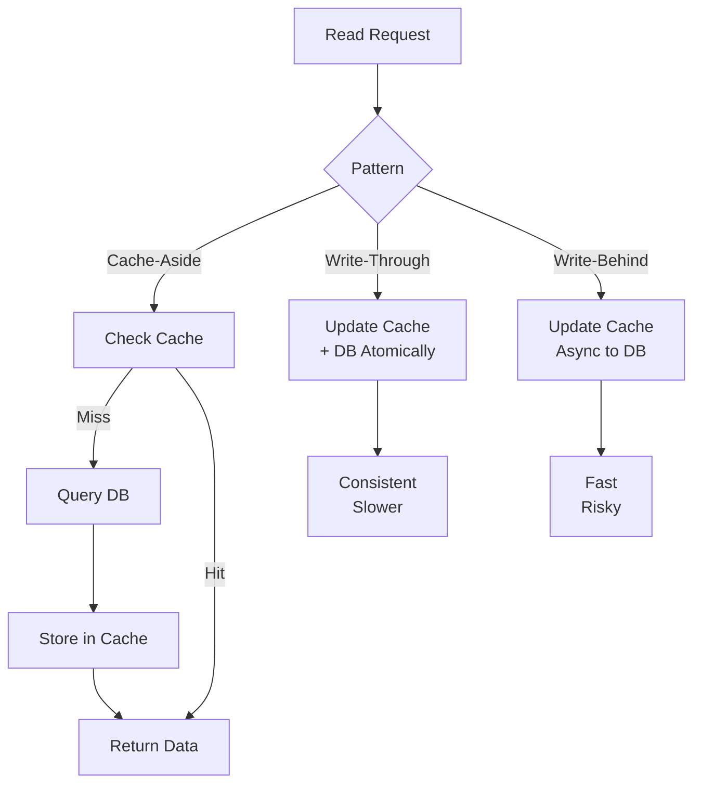

<Hero title="Caching Patterns" subtitle="Strategic data caching to reduce database load and improve latency" size="large" />

## TL;DR

Caching strategically trades memory for latency, reducing database load and improving response times. Cache-aside: application checks cache, miss hits database—simplest, best for read-heavy patterns. Write-through: update cache and DB together—consistent, slower. Write-behind: update cache only, async DB—fastest but risky. Choose based on consistency requirements and read/write ratio. Always plan TTL (expiration), cache invalidation, and monitor hit rates to ensure effectiveness.

## Learning Objectives

By the end of this article, you will understand:
- Three core caching patterns: cache-aside, write-through, write-behind
- When to use each pattern and their trade-offs
- Cache invalidation strategies: TTL vs event-driven
- Cache stampede problem and solutions
- Monitoring cache effectiveness
- Operational considerations and best practices
- Warming, coherence, and failure scenarios

## Motivating Scenario

Your user profile service queries the database 10,000 times per second. Database CPU at 80%; each query takes 5ms. Adding caching to serve profiles from Redis (0.5ms) reduces database load by 90%. But cache must stay synchronized with database writes. If cached profile is stale, users see old data. Strategy: use cache-aside with TTL for freshness, or event-driven invalidation for critical updates.

## Core Concepts

### Three Caching Patterns

<Figure caption="Caching Patterns Comparison">

</Figure>

**1. Cache-Aside (Lazy Loading)**

Application is responsible for managing cache:

```python
def get_user(user_id):
    # Check cache first
    cached = redis.get(f"user:{user_id}")
    if cached:
        return json.loads(cached)

    # Cache miss: query database
    user = db.query("SELECT * FROM users WHERE id = ?", user_id)
    if user:
        redis.setex(f"user:{user_id}", 3600, json.dumps(user))  # TTL: 1 hour
    return user
```

**Pros:** Simple, handles missing data naturally, flexible
**Cons:** First request slow (cold cache), stale data possible
**When:** Read-heavy workloads, can tolerate eventual consistency

**2. Write-Through**

Update cache and database atomically:

```python
def update_user(user_id, data):
    # Update cache and DB together
    try:
        db.update("UPDATE users SET ... WHERE id = ?", user_id, **data)
        redis.set(f"user:{user_id}", json.dumps(data))
        return True
    except:
        return False
```

**Pros:** Cache always consistent, no stale data
**Cons:** Slower writes, requires transaction support
**When:** Consistency critical, acceptable write latency

**3. Write-Behind (Write-Back)**

Update cache immediately, DB asynchronously:

```python
def update_user(user_id, data):
    # Update cache immediately (fast)
    redis.set(f"user:{user_id}", json.dumps(data))

    # Queue for async DB write
    queue.enqueue(update_database, user_id, data)
    return True

def update_database(user_id, data):
    # Background worker: write to database
    db.update("UPDATE users SET ... WHERE id = ?", user_id, **data)
```

**Pros:** Very fast writes, excellent performance
**Cons:** Data loss if cache fails before DB write, complex
**When:** Performance critical, acceptable data loss risk

## Practical Example

### Implementing Cache-Aside with Invalidation

<Tabs>
  <TabItem value="python" label="Python (Redis)">
```python
import redis
import json
import hashlib
from functools import wraps
from datetime import datetime, timedelta

class CachedDatabase:
    def __init__(self, db_conn, redis_host='localhost'):
        self.db = db_conn
        self.cache = redis.Redis(host=redis_host, decode_responses=True)

    def cached_get(self, key, ttl=3600):
        """Cache-aside pattern with TTL"""
        def decorator(func):
            @wraps(func)
            def wrapper(*args, **kwargs):
                # Check cache
                cached_value = self.cache.get(key)
                if cached_value:
                    return json.loads(cached_value)

                # Cache miss: call function
                result = func(*args, **kwargs)

                # Store in cache with TTL
                if result:
                    self.cache.setex(key, ttl, json.dumps(result))
                return result

            return wrapper
        return decorator

    def invalidate(self, pattern):
        """Invalidate cache by key pattern"""
        keys = self.cache.keys(pattern)
        if keys:
            self.cache.delete(*keys)

    def get_user(self, user_id):
        @self.cached_get(f"user:{user_id}", ttl=1800)  # 30 min TTL
        def _fetch():
            cursor = self.db.cursor()
            cursor.execute("SELECT * FROM users WHERE id = ?", (user_id,))
            row = cursor.fetchone()
            return dict(row) if row else None
        return _fetch()

    def update_user(self, user_id, **data):
        # Update database
        cursor = self.db.cursor()
        cursor.execute(
            "UPDATE users SET {} WHERE id = ?".format(
                ", ".join([f"{k} = ?" for k in data.keys()])
            ),
            (*data.values(), user_id)
        )
        self.db.commit()

        # Invalidate cache
        self.invalidate(f"user:{user_id}*")
        return True

    def prevent_cache_stampede(self, key, ttl=3600):
        """Use probabilistic early expiration (XFetch pattern)"""
        cached = self.cache.get(key)
        if not cached:
            return None

        # Get TTL
        remaining_ttl = self.cache.ttl(key)

        # Refresh if TTL < 20% of original
        if remaining_ttl < ttl * 0.2:
            # Background refresh (simplified)
            self.cache.expire(key, ttl)

        return json.loads(cached)

    def warm_cache(self, query, prefix, ttl=3600):
        """Pre-populate cache on startup"""
        cursor = self.db.cursor()
        cursor.execute(query)
        count = 0
        for row in cursor.fetchall():
            key = f"{prefix}:{row[0]}"
            self.cache.setex(key, ttl, json.dumps(dict(row)))
            count += 1
        return count

    def cache_hit_rate(self):
        """Monitor cache effectiveness"""
        info = self.cache.info('stats')
        hits = info.get('keyspace_hits', 0)
        misses = info.get('keyspace_misses', 0)
        total = hits + misses
        rate = (hits / total * 100) if total > 0 else 0
        return {'hits': hits, 'misses': misses, 'hit_rate': rate}

# Usage
import sqlite3
db = sqlite3.connect(':memory:')
cache_db = CachedDatabase(db)

# Warm cache
cache_db.warm_cache("SELECT id, name FROM users", "user")

# Read with caching
user = cache_db.get_user(1)
print(f"User: {user}")

# Monitor
stats = cache_db.cache_hit_rate()
print(f"Cache hit rate: {stats['hit_rate']:.2f}%")
```
  </TabItem>
  <TabItem value="go" label="Go (Redis Client)">
```go
package main

import (
    "context"
    "database/sql"
    "encoding/json"
    "time"
    "github.com/redis/go-redis/v9"
)

type CacheDB struct {
    db    *sql.DB
    cache *redis.Client
}

func NewCacheDB(db *sql.DB, redisAddr string) *CacheDB {
    return &CacheDB{
        db:    db,
        cache: redis.NewClient(&redis.Options{Addr: redisAddr}),
    }
}

// Cache-aside pattern
func (c *CacheDB) GetUser(ctx context.Context, userID int64) (map[string]interface{}, error) {
    key := fmt.Sprintf("user:%d", userID)

    // Check cache
    cached, err := c.cache.Get(ctx, key).Result()
    if err == nil {
        var user map[string]interface{}
        json.Unmarshal([]byte(cached), &user)
        return user, nil
    }

    // Cache miss: query database
    var user map[string]interface{}
    row := c.db.QueryRowContext(ctx, "SELECT id, name, email FROM users WHERE id = ?", userID)
    // Scan into user map...

    // Store in cache (TTL: 1 hour)
    data, _ := json.Marshal(user)
    c.cache.Set(ctx, key, string(data), 1*time.Hour)

    return user, nil
}

// Write-through with transaction
func (c *CacheDB) UpdateUserWriteThrough(ctx context.Context, userID int64, updates map[string]interface{}) error {
    tx, _ := c.db.BeginTx(ctx, nil)

    // Update DB
    for key, value := range updates {
        _, err := tx.ExecContext(ctx, "UPDATE users SET "+key+" = ? WHERE id = ?", value, userID)
        if err != nil {
            tx.Rollback()
            return err
        }
    }

    if err := tx.Commit(); err != nil {
        return err
    }

    // Update cache
    updatedUser, _ := c.GetUser(ctx, userID)
    data, _ := json.Marshal(updatedUser)
    c.cache.Set(ctx, fmt.Sprintf("user:%d", userID), string(data), 1*time.Hour)

    return nil
}

// Prevent cache stampede: probabilistic early expiration
func (c *CacheDB) GetUserWithRefresh(ctx context.Context, userID int64, originalTTL time.Duration) (map[string]interface{}, error) {
    key := fmt.Sprintf("user:%d", userID)

    cached, _ := c.cache.Get(ctx, key).Result()
    if cached != "" {
        // Check remaining TTL
        ttl, _ := c.cache.TTL(ctx, key).Result()

        // Refresh if < 20% of original TTL
        if ttl < originalTTL/5 {
            c.cache.Expire(ctx, key, originalTTL)
        }

        var user map[string]interface{}
        json.Unmarshal([]byte(cached), &user)
        return user, nil
    }

    // Cache miss: fetch and store
    return c.GetUser(ctx, userID)
}

// Monitor cache health
func (c *CacheDB) CacheStats(ctx context.Context) map[string]interface{} {
    info := c.cache.Info(ctx, "stats")
    // Parse and return hit rate
    return map[string]interface{}{}
}
```
  </TabItem>
  <TabItem value="nodejs" label="Node.js (ioredis)">
```javascript
const Redis = require('ioredis');
const redis = new Redis();

class CachedDB {
    constructor(dbConnection) {
        this.db = dbConnection;
        this.redis = redis;
    }

    async getUser(userId, ttl = 3600) {
        const key = `user:${userId}`;

        try {
            // Check cache
            const cached = await this.redis.get(key);
            if (cached) {
                return JSON.parse(cached);
            }
        } catch (err) {
            console.error('Cache error:', err);
            // Fall through to DB
        }

        // Cache miss: query database
        const [rows] = await this.db.query(
            'SELECT * FROM users WHERE id = ?',
            [userId]
        );

        if (rows.length === 0) return null;

        const user = rows[0];

        // Store in cache
        await this.redis.setex(key, ttl, JSON.stringify(user));

        return user;
    }

    async updateUser(userId, data) {
        // Update database
        await this.db.query(
            'UPDATE users SET ? WHERE id = ?',
            [data, userId]
        );

        // Invalidate cache
        await this.redis.del(`user:${userId}`);

        return true;
    }

    async preventCacheStampede(key, ttl, fetchFn) {
        // Probabilistic early expiration (XFetch)
        const cached = await this.redis.get(key);
        if (!cached) {
            const value = await fetchFn();
            await this.redis.setex(key, ttl, JSON.stringify(value));
            return value;
        }

        const remainingTtl = await this.redis.ttl(key);

        // Refresh if TTL < 20% of original
        if (remainingTtl < ttl * 0.2) {
            // Schedule background refresh
            setImmediate(async () => {
                const fresh = await fetchFn();
                await this.redis.setex(key, ttl, JSON.stringify(fresh));
            });
        }

        return JSON.parse(cached);
    }

    async warmCache(query, keyPrefix, ttl = 3600) {
        const [rows] = await this.db.query(query);
        for (const row of rows) {
            const key = `${keyPrefix}:${row.id}`;
            await this.redis.setex(key, ttl, JSON.stringify(row));
        }
        return rows.length;
    }

    async getCacheStats() {
        const info = await this.redis.info('stats');
        // Parse info string...
        return { hitRate: 0 };  // Simplified
    }
}

// Usage
(async () => {
    const cache = new CachedDB(dbConnection);

    // Warm cache
    await cache.warmCache('SELECT * FROM users LIMIT 1000', 'user');

    // Read with caching
    const user = await cache.getUser(1);

    // Update with invalidation
    await cache.updateUser(1, { name: 'Alice Updated' });

    // Stats
    const stats = await cache.getCacheStats();
    console.log('Cache stats:', stats);
})();
```
  </TabItem>
</Tabs>

## When to Use / When Not to Use

<Vs highlight={[0,1,2,0,0,0]} items={[
{
    label: "Use Cache-Aside When:",
    points: [
      "Read-to-write ratio is high (reads >> writes)",
      "Occasional stale data is acceptable",
      "Application can handle cache misses",
      "Simple to implement and debug",
      "Most web application read patterns"
    ],
    highlightTone: "positive"
  },
{
    label: "Use Write-Through When:",
    points: [
      "Strong consistency is critical",
      "Write latency is acceptable",
      "Can support atomic cache+DB updates",
      "Financial transactions, critical data",
      "Cannot tolerate cache-DB divergence"
    ],
    highlightTone: "positive"
  },
{
    label: "Use Write-Behind When:",
    points: [
      "Write performance is paramount",
      "Acceptable to lose recent writes if cache fails",
      "Have message queue for reliable async writes",
      "Can monitor queue and ensure DB catches up",
      "Analytics, event logging, non-critical writes"
    ],
    highlightTone: "positive"
  }
]} />

## Patterns and Pitfalls

<Showcase
  sections={[
    {
      label: "Cache Stampede",
      body: "Multiple requests miss cache simultaneously (TTL expired), all query database. Use probabilistic early expiration (refresh before expiry) or locks (only first request refreshes)."
    },
    {
      label: "Cache Invalidation",
      body: "TTL-based: simple, eventual staleness. Event-driven: immediate freshness, requires coordination. Hybrid: short TTL + event-driven for critical updates."
    },
    {
      label: "Warm Cache on Startup",
      body: "Pre-populate cache with hot data. Prevents cold start period. Trade-off: slower startup vs faster runtime. Load top N records by popularity/access frequency."
    },
    {
      label: "Cache Coherence",
      body: "Multiple caches (replicas, regions) must stay synchronized. Use consistent invalidation (publish invalidation events). Monitor for divergence."
    },
    {
      label: "Monitoring Hit Rate",
      body: "Track hits vs misses. < 50% hit rate may indicate poor cache strategy or wrong TTL. Aim for > 80% for effective caching."
    },
    {
      label: "Memory Management",
      body: "Monitor cache memory usage. Set eviction policy (LRU, LFU). If memory full, old entries evicted. Plan capacity: 2-3x hot working set."
    }
  ]}
/>

## Operational Considerations

### 1. Cache Failure Handling

```python
# Graceful degradation: if cache fails, fall back to database
def get_user_resilient(user_id):
    try:
        return get_user_cached(user_id)
    except redis.ConnectionError:
        logger.warn(f"Cache unavailable, querying DB for user {user_id}")
        return get_user_from_db(user_id)
```

### 2. Cache Invalidation Strategies

```python
# 1. TTL-based (simple)
redis.setex("user:1", 3600, data)  # Expires after 1 hour

# 2. Event-driven (immediate)
def on_user_updated(user_id):
    redis.delete(f"user:{user_id}")  # Invalidate immediately
    publish_event("user.updated", user_id)

# 3. Hybrid (best of both)
redis.setex("user:1", 300, data)  # 5 min TTL
publish_event("user.updated", 1)  # Also notify immediately
```

### 3. Measuring Cache Effectiveness

```python
# Prometheus metrics
cache_hits = Counter('cache_hits_total', 'Cache hits')
cache_misses = Counter('cache_misses_total', 'Cache misses')

hit_rate = cache_hits / (cache_hits + cache_misses)
if hit_rate < 0.5:
    alert("Low cache hit rate")
```

## Design Review Checklist

<Checklist items={[
  "Identified high-read-volume queries suitable for caching",
  "Measured current latency and target latency with caching",
  "Chose appropriate caching pattern (cache-aside, write-through, write-behind)",
  "Designed TTL strategy: what staleness is acceptable?",
  "Planned cache invalidation: TTL vs event-driven vs hybrid",
  "Calculated hot working set size; allocated sufficient memory",
  "Implemented cache stampede prevention (early expiration or locks)",
  "Set up monitoring: hit rate, memory usage, eviction rate",
  "Designed cache warm-up on application startup",
  "Planned failure handling: graceful degradation if cache down",
  "Documented cache keys, TTL, and invalidation strategy",
  "Tested cache behavior under high concurrency and failures"
]} />

## Self-Check Questions

1. **When would you use write-through vs cache-aside?**
   - Write-through: consistency critical. Cache-aside: read-heavy, eventual consistency acceptable.

2. **How do you prevent cache stampede?**
   - Probabilistic early expiration: refresh before TTL expires. Locks: only one request refreshes.

3. **What's cache coherence and why does it matter?**
   - Multiple caches staying synchronized. Matters for consistency across replicas/regions.

4. **How do you measure cache effectiveness?**
   - Track hit rate (hits / total requests). Aim for > 80%. < 50% indicates poor strategy.

## Next Steps

1. **Audit query patterns**: Identify slow, frequently-repeated queries
2. **Measure baseline**: Latency without caching
3. **Implement cache-aside**: Start with simplest pattern
4. **Set TTL conservatively**: Start short (5-15 min), extend if staleness acceptable
5. **Monitor hit rate**: Set up dashboards and alerts
6. **Optimize**: Based on hit rate, adjust TTL or cache strategy
7. **Scale**: Add Redis replicas as needed

## References

- Redis Documentation: <a href="https://redis.io/docs/" target="_blank" rel="nofollow noopener noreferrer">Official Docs ↗️</a>
- Cache Stampede: <a href="https://en.wikipedia.org/wiki/Cache_stampede" target="_blank" rel="nofollow noopener noreferrer">Wikipedia ↗️</a>
- Caching Patterns: <a href="https://aws.amazon.com/blogs/database/caching-strategies-to-optimize-database-performance/" target="_blank" rel="nofollow noopener noreferrer">AWS Guide ↗️</a>
