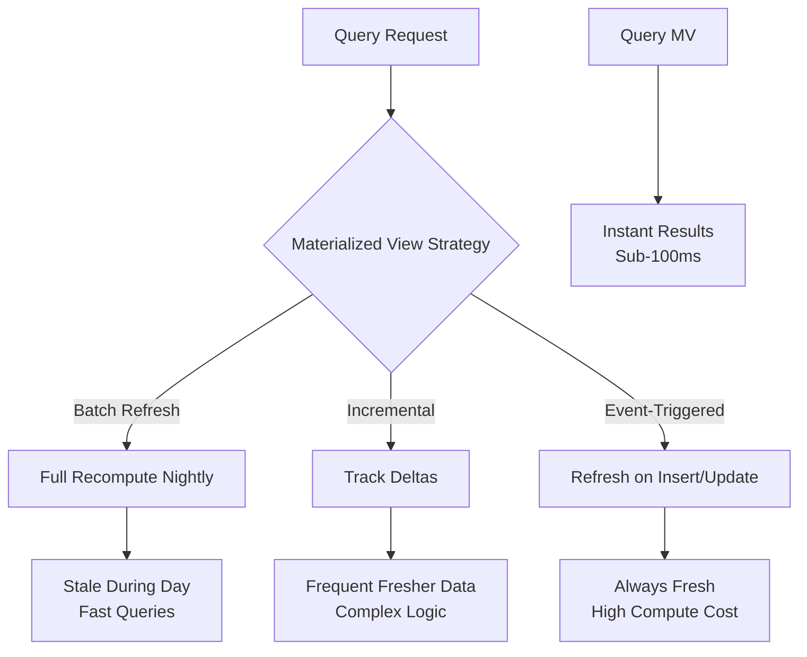

<Hero title="Materialized Views & Precomputation" subtitle="Pre-compute and cache expensive query results" size="large" />

## TL;DR

Materialized views store pre-computed query results as physical tables, refreshed on schedule or via triggers. They trade storage for query speed—critical for complex aggregations, reporting dashboards, and real-time analytics. Refresh strategies include batch (nightly full recompute), incremental (delta updates), and event-triggered (immediate on data change), each with distinct trade-offs between freshness, compute cost, and implementation complexity.

## Learning Objectives

By the end of this article, you will understand:
- What materialized views are and how they differ from regular database views
- When materialized views outperform other caching strategies
- How to design effective refresh strategies (batch, incremental, event-triggered)
- Operational considerations: storage costs, staleness windows, recomputation overhead
- How to monitor and troubleshoot materialized view performance
- Integration patterns with ETL pipelines and data warehouses

## Motivating Scenario

You're building a real-time analytics dashboard for an e-commerce platform. Queries aggregate millions of rows:

```sql
SELECT category, SUM(revenue) as total_revenue, COUNT(DISTINCT user_id) as unique_customers
FROM orders
WHERE created_at > NOW() - INTERVAL '30 days'
GROUP BY category
```

This query runs in 45 seconds. Users need results in under 1 second. Computing on-demand is prohibitively slow. Caching in Redis works, but requires complex invalidation logic. Materialized views solve this: pre-compute the aggregation, store as a table, refresh periodically.

## Core Concepts

### What is a Materialized View?

A materialized view is a physical table containing the results of a query, persisted to disk. Unlike regular views (which recompute on each access), materialized views exist as actual data.

**Regular View (Virtual):**
```sql
CREATE VIEW sales_summary AS
SELECT category, SUM(revenue) as total FROM sales GROUP BY category;
-- Recomputes every query
```

**Materialized View (Physical):**
```sql
CREATE MATERIALIZED VIEW sales_summary AS
SELECT category, SUM(revenue) as total FROM sales GROUP BY category;
-- Computed once, queried instantly
```

### Storage vs Speed Trade-Off

- **Cost**: Materialized views consume disk storage (replicate data)
- **Benefit**: Queries run in milliseconds instead of seconds
- **Staleness**: Data is as fresh as the last refresh

For a 500GB sales table with 10 complex materialized views, expect 100GB+ additional storage. This is acceptable for dashboards; unacceptable if every table needs materialization.

<Figure caption="Materialized View Query Performance">

</Figure>

### Refresh Strategies

#### 1. Batch Refresh

Full recomputation on schedule (nightly, hourly). Simplest to implement; accepts staleness window.

**When to use:** Reporting, dashboards with daily data, non-critical metrics
**Staleness:** Up to refresh interval (e.g., 24 hours)
**Compute cost:** High spike during refresh window

#### 2. Incremental Refresh

Only recompute changed data. Requires tracking which source data changed since last refresh.

**When to use:** Real-time metrics, fraud detection, live dashboards
**Staleness:** Minutes (depends on refresh frequency)
**Compute cost:** Lower per refresh, but requires complex logic

#### 3. Event-Triggered Refresh

Refresh immediately when underlying data changes (via triggers or CDC pipelines). Most current, most expensive.

**When to use:** Critical reports, compliance dashboards, audit tables
**Staleness:** Seconds to minutes
**Compute cost:** Per-transaction overhead

## Practical Example

### Setting Up a Materialized View with Incremental Refresh

<Tabs>
  <TabItem value="python" label="Python (dbt)">
```python
# models/marts/daily_sales_summary.sql
{{ config(
    materialized='table',
    indexes=[
        {'columns': ['date'], 'type': 'btree'},
        {'columns': ['category'], 'type': 'hash'}
    ]
) }}

SELECT
    DATE(order_date) as date,
    category,
    SUM(amount) as total_revenue,
    COUNT(DISTINCT user_id) as unique_customers,
    COUNT(*) as order_count
FROM {{ ref('orders') }}
WHERE order_date >= CURRENT_DATE - INTERVAL '90 days'
GROUP BY DATE(order_date), category

-- dbt run to materialize; dbt snapshot for incremental tracking
```
  </TabItem>
  <TabItem value="go" label="Go (Manual Refresh)">
```go
package main

import (
    "database/sql"
    "context"
    "log"
    "time"
)

func RefreshMaterializedView(db *sql.DB, viewName string) error {
    ctx, cancel := context.WithTimeout(context.Background(), 5*time.Minute)
    defer cancel()

    // PostgreSQL: REFRESH MATERIALIZED VIEW
    query := `REFRESH MATERIALIZED VIEW CONCURRENTLY ` + viewName
    _, err := db.ExecContext(ctx, query)
    if err != nil {
        log.Printf("Failed to refresh %s: %v", viewName, err)
        return err
    }
    log.Printf("Successfully refreshed %s", viewName)
    return nil
}

// Schedule periodic refresh via cron job
func StartRefreshScheduler(db *sql.DB) {
    ticker := time.NewTicker(1 * time.Hour)
    defer ticker.Stop()

    for range ticker.C {
        RefreshMaterializedView(db, "sales_summary_mv")
    }
}
```
  </TabItem>
  <TabItem value="nodejs" label="Node.js (Incremental Pattern)">
```javascript
const pg = require('pg');

// Track last refresh timestamp
const mvMetadata = {
    'sales_summary': {
        lastRefresh: null,
        refreshInterval: 15 * 60 * 1000, // 15 minutes
    }
};

async function incrementalRefresh(client, viewName) {
    const metadata = mvMetadata[viewName];
    const lastRefresh = metadata.lastRefresh || new Date(0);

    // Only process changes since last refresh
    const query = `
        INSERT INTO ${viewName}_temp
        SELECT
            category,
            SUM(amount) as total_revenue,
            COUNT(DISTINCT user_id) as unique_customers
        FROM orders
        WHERE updated_at > $1
        GROUP BY category
        ON CONFLICT (category) DO UPDATE
        SET total_revenue = EXCLUDED.total_revenue,
            unique_customers = EXCLUDED.unique_customers;
    `;

    try {
        await client.query(query, [lastRefresh]);
        // Swap temp table with materialized view
        await client.query(`
            ALTER TABLE ${viewName} RENAME TO ${viewName}_old;
            ALTER TABLE ${viewName}_temp RENAME TO ${viewName};
            DROP TABLE ${viewName}_old;
        `);
        metadata.lastRefresh = new Date();
        console.log(`Incremental refresh of ${viewName} completed`);
    } catch (err) {
        console.error(`Failed to refresh ${viewName}:`, err);
    }
}

// Schedule incremental refreshes
setInterval(() => {
    const client = new pg.Client();
    incrementalRefresh(client, 'sales_summary');
    client.end();
}, mvMetadata['sales_summary'].refreshInterval);
```
  </TabItem>
</Tabs>

## When to Use / When Not to Use

<Vs highlight={[1]} items={[
{
    label: "Use When:",
    points: [
      "Query involves complex aggregations (GROUP BY, SUM, COUNT)",
      "Same aggregation queried frequently (high read-to-write ratio)",
      "Acceptable staleness window exists (hours or days)",
      "Storage cost is acceptable vs query performance gain",
      "Reporting/dashboard workload (not transactional)",
      "Query latency is blocking user experience"
    ],
    highlightTone: "positive"
  },
{
    label: "Avoid When:",
    points: [
      "Data must always be current (< 1 minute staleness unacceptable)",
      "Underlying source data changes every few seconds",
      "Storage is severely constrained",
      "Queries already run in acceptable time",
      "Simple primary key lookups (indexes are cheaper)",
      "One-off analytical queries (pre-compute isn't justified)"
    ],
    highlightTone: "warning"
  }
]} />

## Patterns and Pitfalls

<Showcase
  sections={[
    {
      label: "Batch Refresh",
      body: "Recompute entire view on schedule (nightly, hourly). Simple to implement, predictable compute spike, controlled staleness window. Accept that data is stale between refreshes."
    },
    {
      label: "Incremental Refresh",
      body: "Only recompute changed rows using delta detection. Complex to implement correctly (requires tracking source changes), more frequent freshness. Tools like dbt and cloud data warehouses automate this."
    },
    {
      label: "Event-Triggered Refresh",
      body: "Refresh immediately via database triggers or CDC pipelines (Debezium, Postgres logical replication). Always-current data but high compute overhead per transaction. Best for critical compliance reports."
    },
    {
      label: "Aggregation Pipeline",
      body: "Use data warehouse (Snowflake, BigQuery) for massive aggregations. Separate compute from transactional database. Warehouse handles billions of rows efficiently. Stream results to OLTP database as needed."
    },
    {
      label: "Partial Views (Pre-computation)",
      body: "Don't materialize entire query. Pre-compute intermediate aggregates. E.g., store daily summaries, compute monthly on-demand from daily. Reduces storage, balances freshness and cost."
    },
    {
      label: "Staleness and SLA Mismatch",
      body: "If dashboard refreshes every hour but view updates nightly, users see 24-hour stale data. Define clear SLAs: 'Sales dashboard refreshes at 2 AM daily.' Communicate staleness to users."
    }
  ]}
/>

## Operational Considerations

### 1. Refresh Concurrency

Refreshing a materialized view locks it (if using standard REFRESH). Use `REFRESH MATERIALIZED VIEW CONCURRENTLY` (PostgreSQL) to allow reads during refresh.

### 2. Storage Monitoring

Monitor materialized view growth. Large views can consume significant storage:
- Run `SELECT * FROM information_schema.tables WHERE table_type='MATERIALIZED VIEW'` (PostgreSQL)
- Archive old materialized views if not queried

### 3. Query Performance After Refresh

New materialized view data won't automatically update query plans. Force statistics refresh:
```sql
ANALYZE sales_summary_mv;  -- PostgreSQL
DBCC UPDATEUSAGE (sales_summary_mv);  -- SQL Server
```

### 4. Dependencies and Cascading Refreshes

If MV A depends on MV B (B is refreshed first, then A), automate refresh order:
```python
# Refresh order: base → intermediate → derived
refresh_order = ['orders_mv', 'daily_sales_mv', 'monthly_trends_mv']
for view in refresh_order:
    refresh_materialized_view(db, view)
```

## Design Review Checklist

<Checklist items={[
  "Identified all aggregations currently computed on-demand from OLTP database",
  "Calculated storage cost vs query latency savings (cost-benefit analysis)",
  "Defined acceptable staleness window for each materialized view",
  "Chose refresh strategy based on freshness requirements (batch/incremental/event-triggered)",
  "Set up monitoring and alerting for failed refreshes",
  "Documented MV refresh schedule and SLA expectations for stakeholders",
  "Indexed materialized views on commonly filtered columns",
  "Tested refresh performance under production data volume",
  "Planned cascading refresh order if multiple views are interdependent",
  "Implemented query-routing logic to prefer MV when appropriate",
  "Set up automated cleanup or archival of unused materialized views",
  "Verified statistics are refreshed after each MV refresh for optimal query plans"
]} />

## Self-Check Questions

1. **When would you use materialized views vs caching (Redis)?**
   - MVs for schema-integrated aggregations, redis for session data or temporary caches

2. **What refresh strategy minimizes staleness while controlling compute load?**
   - Incremental refresh: update only changed data, run frequently (every 15 min vs nightly)

3. **How do incremental refreshes reduce cost compared to batch?**
   - Batch: recompute entire 1 billion row table nightly. Incremental: only process 10 million new rows hourly

4. **What queries benefit most from materialization?**
   - Complex GROUP BY with multiple aggregates, queries filtering on indexed columns, frequently repeated queries

## Next Steps

1. **Audit current queries**: Identify slow aggregations running repeatedly
2. **Build first materialized view**: Start with one high-impact dashboard, measure latency improvement
3. **Automate refresh**: Set up scheduled refresh jobs (dbt, Airflow, cron)
4. **Monitor performance**: Track refresh duration, staleness, storage growth
5. **Extend incrementally**: Add more views as volume/complexity grows
6. **Consider data warehouse**: For truly massive aggregations, offload to BigQuery, Snowflake, or Redshift

## References

- PostgreSQL Materialized Views: <a href="https://www.postgresql.org/docs/current/sql-creatematerializedview.html" target="_blank" rel="nofollow noopener noreferrer">Official Documentation ↗️</a>
- dbt Materializations: <a href="https://docs.getdbt.com/docs/build/materializations" target="_blank" rel="nofollow noopener noreferrer">Guide to dbt ↗️</a>
- Google Cloud BigQuery Materialized Views: <a href="https://cloud.google.com/bigquery/docs/materialized-views-intro" target="_blank" rel="nofollow noopener noreferrer">BigQuery Docs ↗️</a>