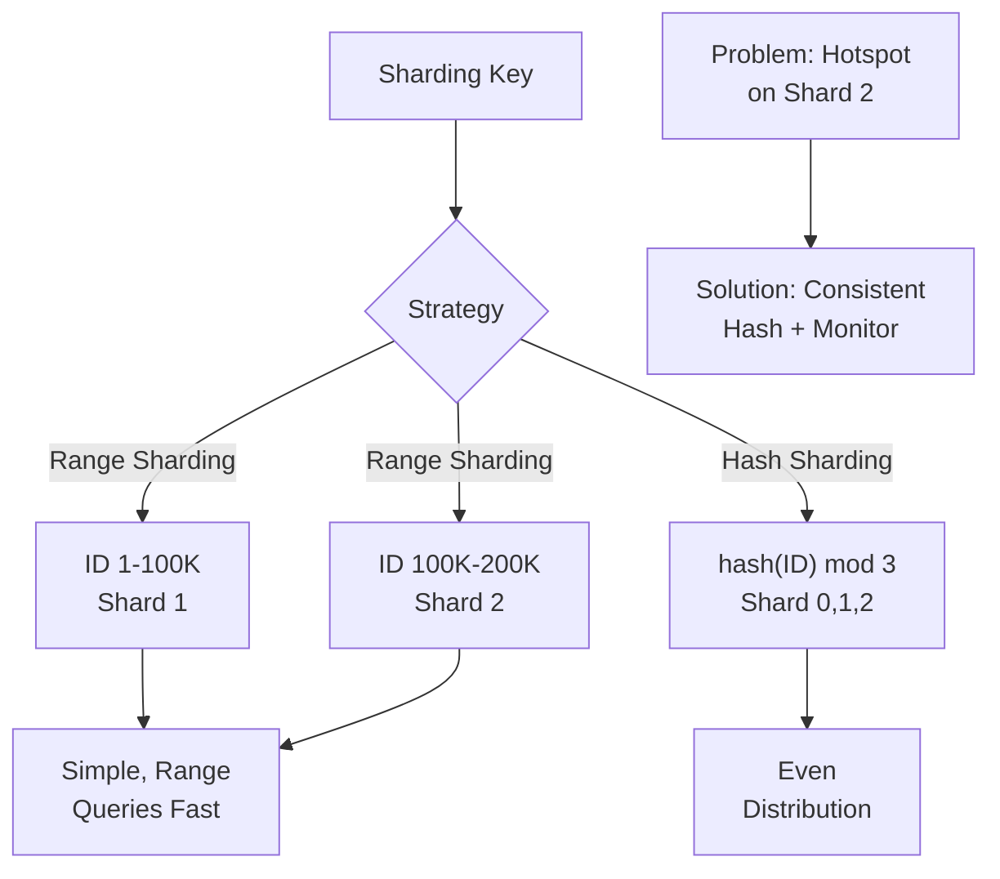

<Hero title="Sharding Strategies & Rebalancing" subtitle="Scale writes by partitioning data across nodes" size="large" />

## TL;DR

Sharding partitions data horizontally across independent databases/nodes. Range sharding divides by continuous ranges (User ID 1-100K on Shard A), simple but risks hotspots. Hash sharding uses consistent hashing for even distribution, mitigating hotspots but complicating rebalancing. Challenge: cross-shard queries require fan-out to multiple shards. Plan sharding key upfront—changing it later is extremely costly.

## Learning Objectives

By the end of this article, you will understand:
- Difference between range and hash sharding strategies
- How consistent hashing minimizes rebalancing pain
- Hotspot detection and mitigation techniques
- Cross-shard query challenges and solutions
- Rebalancing data when adding/removing nodes
- Directory services and lookup strategies
- Monitoring and operational considerations

## Motivating Scenario

Your social network serves 500 million users. A single database maxes out at 10 million users before CPU/memory becomes saturated. Obvious solution: split users across multiple databases. User 1-10M on Shard 1, 10M-20M on Shard 2, etc. But celebrity users (10 million followers) create a hotspot: Shard 5 becomes bottleneck. Plus, adding Shard 51 requires rebalancing ~100M rows. Consistent hashing and proper monitoring solve these problems.

## Core Concepts

### Range Sharding

Partition by key ranges. E.g., User ID:

```
Shard 1: user_id 1-100,000
Shard 2: user_id 100,001-200,000
Shard 3: user_id 200,001-300,000
```

**Pros:**
- Simple to implement and understand
- Range queries efficient (all 50-100K users on same shard)
- Easy to add shards (extend upper range)

**Cons:**
- Prone to hotspots (active users may concentrate on one shard)
- Uneven growth (some ranges fill faster than others)
- Rebalancing adds/removes continuous ranges

<Figure caption="Range Sharding vs Hash Sharding">

</Figure>

### Hash Sharding with Consistent Hashing

Use a hash function to distribute keys evenly. Consistent hashing allows adding shards without rehashing entire dataset.

```python
# Basic hash sharding (not consistent)
shard_id = hash(user_id) % num_shards  # Problem: adding shard changes all keys!

# Consistent hashing (Rendezvous hashing)
def find_shard(key, shard_ring):
    hash_val = hash(key)
    # Find closest shard on ring
    for shard in sorted(shard_ring):
        if shard.hash_range[0] <= hash_val < shard.hash_range[1]:
            return shard
    return shard_ring[0]  # Wrap around
```

**Benefit:** Adding a shard only rehashes ~1/n of the data instead of all data.

### Hotspot Detection and Mitigation

Hotspots occur when a shard handles disproportionate load:

```
Shard 1: 5 million users, 10K QPS (good)
Shard 2: 3 million users, 50K QPS (hotspot!)
```

**Detection:**
- Monitor query rate per shard
- Monitor storage per shard
- Alert if any shard > 2x average

**Mitigation:**
1. **Sub-sharding**: Further partition hot shard (Shard 2 → 2a, 2b)
2. **Rebalancing**: Move users from hot shard to under-utilized shard
3. **Caching**: Cache hot data locally (Redis)
4. **Shard key redesign**: If inherent to key distribution, consider different key

## Practical Example

### Implementing Sharded Database with Consistent Hashing

<Tabs>
  <TabItem value="python" label="Python">
```python
import hashlib
from bisect import bisect_right

class ConsistentHashRing:
    """Map keys to shards using consistent hashing"""

    def __init__(self, shards, virtual_nodes=160):
        self.shards = shards
        self.virtual_nodes = virtual_nodes
        self.ring = {}
        self.sorted_keys = []
        self._build_ring()

    def _build_ring(self):
        for shard in self.shards:
            for i in range(self.virtual_nodes):
                virtual_key = f"{shard}-{i}"
                hash_val = int(hashlib.md5(virtual_key.encode()).hexdigest(), 16)
                self.ring[hash_val] = shard

        self.sorted_keys = sorted(self.ring.keys())

    def get_shard(self, key):
        """Find shard for given key"""
        hash_val = int(hashlib.md5(key.encode()).hexdigest(), 16)
        idx = bisect_right(self.sorted_keys, hash_val)
        if idx == len(self.sorted_keys):
            idx = 0
        return self.ring[self.sorted_keys[idx]]

    def add_shard(self, new_shard):
        """Add new shard to ring"""
        self.shards.append(new_shard)
        self._build_ring()

    def remove_shard(self, shard):
        """Remove shard from ring"""
        self.shards.remove(shard)
        self._build_ring()

class ShardedDatabase:
    def __init__(self, shard_configs):
        # shard_configs: {'shard-0': {...}, 'shard-1': {...}}
        import sqlite3
        self.connections = {
            name: sqlite3.connect(config['path'])
            for name, config in shard_configs.items()
        }
        self.hash_ring = ConsistentHashRing(list(shard_configs.keys()))

    def write(self, user_id, data):
        """Write to appropriate shard"""
        shard = self.hash_ring.get_shard(str(user_id))
        conn = self.connections[shard]
        conn.execute(
            "INSERT INTO users (id, data) VALUES (?, ?)",
            (user_id, str(data))
        )
        conn.commit()

    def read(self, user_id):
        """Read from appropriate shard"""
        shard = self.hash_ring.get_shard(str(user_id))
        conn = self.connections[shard]
        cursor = conn.execute(
            "SELECT data FROM users WHERE id = ?",
            (user_id,)
        )
        return cursor.fetchone()

    def scan_all_shards(self, query):
        """Cross-shard query: fan-out and merge"""
        results = []
        for shard, conn in self.connections.items():
            cursor = conn.execute(query)
            results.extend(cursor.fetchall())
        return results

    def get_hotspots(self):
        """Monitor shard load"""
        sizes = {}
        for shard, conn in self.connections.items():
            cursor = conn.execute("SELECT COUNT(*) FROM users")
            count = cursor.fetchone()[0]
            sizes[shard] = count

        avg = sum(sizes.values()) / len(sizes)
        hotspots = {s: c for s, c in sizes.items() if c > avg * 2}
        return hotspots

    def rebalance(self, source_shard, target_shard, count):
        """Move 'count' users from source to target shard"""
        # Complex operation: move data, update routing
        print(f"Rebalancing {count} users from {source_shard} to {target_shard}")

# Usage
config = {
    'shard-0': {'path': '/data/shard-0.db'},
    'shard-1': {'path': '/data/shard-1.db'},
    'shard-2': {'path': '/data/shard-2.db'},
}

db = ShardedDatabase(config)

# Write: routes to appropriate shard
db.write(12345, {'name': 'Alice', 'email': 'alice@example.com'})

# Read: routes to same shard
result = db.read(12345)
print(f"User: {result}")

# Monitor hotspots
hotspots = db.get_hotspots()
if hotspots:
    print(f"Hotspots detected: {hotspots}")
    # Trigger rebalancing
```
  </TabItem>
  <TabItem value="go" label="Go">
```go
package main

import (
    "database/sql"
    "crypto/md5"
    "encoding/hex"
    "fmt"
    "sort"
    _ "github.com/mattn/go-sqlite3"
)

type ShardRing struct {
    ring       map[uint64]string
    sortedKeys []uint64
    shards     []string
}

func NewShardRing(shards []string, virtualNodes int) *ShardRing {
    sr := &ShardRing{
        ring:   make(map[uint64]string),
        shards: shards,
    }

    for _, shard := range shards {
        for i := 0; i < virtualNodes; i++ {
            virtualKey := fmt.Sprintf("%s-%d", shard, i)
            hash := md5Hash(virtualKey)
            sr.ring[hash] = shard
        }
    }

    sr.sortedKeys = make([]uint64, 0, len(sr.ring))
    for k := range sr.ring {
        sr.sortedKeys = append(sr.sortedKeys, k)
    }
    sort.Slice(sr.sortedKeys, func(i, j int) bool {
        return sr.sortedKeys[i] < sr.sortedKeys[j]
    })

    return sr
}

func md5Hash(s string) uint64 {
    h := md5.Sum([]byte(s))
    var result uint64
    for i := 0; i < 8; i++ {
        result = (result << 8) | uint64(h[i])
    }
    return result
}

func (sr *ShardRing) GetShard(key string) string {
    hash := md5Hash(key)
    idx := sort.Search(len(sr.sortedKeys), func(i int) bool {
        return sr.sortedKeys[i] >= hash
    })
    if idx == len(sr.sortedKeys) {
        idx = 0
    }
    return sr.ring[sr.sortedKeys[idx]]
}

type ShardedDB struct {
    conns    map[string]*sql.DB
    ring     *ShardRing
}

func NewShardedDB(shardPaths map[string]string) *ShardedDB {
    conns := make(map[string]*sql.DB)
    shards := make([]string, 0, len(shardPaths))

    for shard, path := range shardPaths {
        db, _ := sql.Open("sqlite3", path)
        conns[shard] = db
        shards = append(shards, shard)
    }

    return &ShardedDB{
        conns: conns,
        ring:  NewShardRing(shards, 160),
    }
}

func (sdb *ShardedDB) Write(userID string, data string) error {
    shard := sdb.ring.GetShard(userID)
    _, err := sdb.conns[shard].Exec(
        "INSERT INTO users (id, data) VALUES (?, ?)",
        userID, data,
    )
    return err
}

func (sdb *ShardedDB) Read(userID string) (string, error) {
    shard := sdb.ring.GetShard(userID)
    var data string
    err := sdb.conns[shard].QueryRow(
        "SELECT data FROM users WHERE id = ?",
        userID,
    ).Scan(&data)
    return data, err
}

func (sdb *ShardedDB) GetHotspots() map[string]int {
    sizes := make(map[string]int)
    totalSize := 0

    for shard, db := range sdb.conns {
        var count int
        db.QueryRow("SELECT COUNT(*) FROM users").Scan(&count)
        sizes[shard] = count
        totalSize += count
    }

    avg := totalSize / len(sizes)
    hotspots := make(map[string]int)
    for shard, count := range sizes {
        if count > avg*2 {
            hotspots[shard] = count
        }
    }
    return hotspots
}

func main() {
    shardPaths := map[string]string{
        "shard-0": "/data/shard-0.db",
        "shard-1": "/data/shard-1.db",
        "shard-2": "/data/shard-2.db",
    }

    sdb := NewShardedDB(shardPaths)

    // Write
    sdb.Write("user-12345", `{"name": "Alice", "email": "alice@example.com"}`)

    // Read
    data, _ := sdb.Read("user-12345")
    fmt.Println("User:", data)

    // Monitor hotspots
    hotspots := sdb.GetHotspots()
    fmt.Println("Hotspots:", hotspots)
}
```
  </TabItem>
  <TabItem value="nodejs" label="Node.js">
```javascript
const crypto = require('crypto');
const sqlite3 = require('sqlite3').verbose();

class ShardRing {
    constructor(shards, virtualNodes = 160) {
        this.shards = shards;
        this.ring = {};
        this.sortedKeys = [];
        this.buildRing(virtualNodes);
    }

    buildRing(virtualNodes) {
        for (const shard of this.shards) {
            for (let i = 0; i < virtualNodes; i++) {
                const virtualKey = `${shard}-${i}`;
                const hash = this.hashKey(virtualKey);
                this.ring[hash] = shard;
            }
        }

        this.sortedKeys = Object.keys(this.ring)
            .map(k => BigInt(k))
            .sort((a, b) => (a < b ? -1 : 1));
    }

    hashKey(key) {
        const md5 = crypto.createHash('md5').update(key).digest('hex');
        return md5.substring(0, 8);  // Take first 32 bits
    }

    getShard(key) {
        const hash = this.hashKey(key);
        for (const ringKey of this.sortedKeys) {
            if (ringKey.toString(16).padStart(8, '0') >= hash) {
                return this.ring[ringKey.toString()];
            }
        }
        return this.ring[this.sortedKeys[0]];
    }
}

class ShardedDatabase {
    constructor(shardConfigs) {
        this.connections = {};
        this.shards = [];

        for (const [shardName, path] of Object.entries(shardConfigs)) {
            this.connections[shardName] = new sqlite3.Database(path);
            this.shards.push(shardName);
        }

        this.ring = new ShardRing(this.shards);
    }

    write(userId, data) {
        return new Promise((resolve, reject) => {
            const shard = this.ring.getShard(String(userId));
            const db = this.connections[shard];

            db.run(
                'INSERT INTO users (id, data) VALUES (?, ?)',
                [userId, JSON.stringify(data)],
                (err) => (err ? reject(err) : resolve())
            );
        });
    }

    read(userId) {
        return new Promise((resolve, reject) => {
            const shard = this.ring.getShard(String(userId));
            const db = this.connections[shard];

            db.get(
                'SELECT data FROM users WHERE id = ?',
                [userId],
                (err, row) => (err ? reject(err) : resolve(row ? JSON.parse(row.data) : null))
            );
        });
    }

    async getHotspots() {
        const sizes = {};
        let totalSize = 0;

        for (const [shard, db] of Object.entries(this.connections)) {
            const count = await new Promise((resolve, reject) => {
                db.get('SELECT COUNT(*) as count FROM users', (err, row) => {
                    if (err) reject(err);
                    resolve(row.count);
                });
            });

            sizes[shard] = count;
            totalSize += count;
        }

        const avg = totalSize / this.shards.length;
        const hotspots = {};

        for (const [shard, count] of Object.entries(sizes)) {
            if (count > avg * 2) {
                hotspots[shard] = count;
            }
        }

        return hotspots;
    }
}

// Usage
(async () => {
    const db = new ShardedDatabase({
        'shard-0': '/data/shard-0.db',
        'shard-1': '/data/shard-1.db',
        'shard-2': '/data/shard-2.db',
    });

    await db.write('user-12345', { name: 'Alice', email: 'alice@example.com' });
    const user = await db.read('user-12345');
    console.log('User:', user);

    const hotspots = await db.getHotspots();
    console.log('Hotspots:', hotspots);
})();
```
  </TabItem>
</Tabs>

## When to Use / When Not to Use

<Vs highlight={[1]} items={[
{
    label: "Use When:",
    points: [
      "Single database can't handle throughput (write or storage volume)",
      "Data naturally partitionable (by user ID, tenant ID, region)",
      "Acceptable to operate multiple independent databases",
      "Can tolerate operational complexity of distributed system",
      "Planned upfront (changing shard key later is very costly)"
    ],
    highlightTone: "positive"
  },
{
    label: "Avoid When:",
    points: [
      "Database still has headroom (single machine sufficient)",
      "Frequent cross-shard queries that must combine data",
      "Complex joins across shards (normalized schemas)",
      "Transactions span multiple shards",
      "Shard key not obvious or changes frequently"
    ],
    highlightTone: "warning"
  }
]} />

## Patterns and Pitfalls

<Showcase
  sections={[
    {
      label: "Range Sharding",
      body: "Partition by key ranges (user 1-100K on Shard A). Simple, good for range queries. Risk: hotspots (active users cluster). Rebalancing adds ranges. Good for initial sharding; graduate to hash sharding at scale."
    },
    {
      label: "Hash Sharding",
      body: "Consistent hashing distributes keys evenly. Mitigates hotspots. Adding shard only rehashes ~1/n data. Downside: range queries inefficient (scattered across shards)."
    },
    {
      label: "Hotspot Detection",
      body: "Monitor data size and QPS per shard. Alert if any shard > 2x average. Investigate: Is key naturally skewed? Can sub-shard further? Cache hot data locally?"
    },
    {
      label: "Cross-Shard Queries",
      body: "Queries spanning multiple shards are complex. Fan-out to all shards, collect results, merge. Performance degrades with shard count. Avoid for user-facing latency-sensitive queries."
    },
    {
      label: "Shard Key Selection",
      body: "Choose key that won't change (user ID good, email bad). Key determines data locality. Wrong key leads to rebalancing. Poor choice causes hotspots. Think deeply upfront."
    },
    {
      label: "Rebalancing Directory",
      body: "Maintain shard directory: maps shard key range to shard location. Update on rebalancing. Use etcd, Zookeeper, or custom for high-consistency directory."
    }
  ]}
/>

## Operational Considerations

### 1. Directory Service

```python
# Shard directory: maps key range to shard
shard_directory = {
    'user': {
        (0, 100000000): 'shard-0',
        (100000001, 200000000): 'shard-1',
        (200000001, 300000000): 'shard-2',
    }
}

def find_shard(key_type, key_id):
    for (min_id, max_id), shard in shard_directory[key_type].items():
        if min_id <= key_id <= max_id:
            return shard
    raise ValueError(f"No shard for {key_type}:{key_id}")
```

### 2. Rebalancing Workflow

When adding Shard N:
1. Update directory to include new shard ranges
2. Copy affected data from old shards to new shard
3. Verify data consistency
4. Update routing logic
5. Monitor for correctness

### 3. Monitoring Cross-Shard Queries

```python
# Log fan-out queries
def scan_all_shards(query):
    start = time.time()
    results = []
    for shard in all_shards:
        result = execute_on_shard(shard, query)
        results.extend(result)
    duration = time.time() - start

    # Alert if slow
    if duration > 1.0:
        logger.warn(f"Slow cross-shard query: {duration}s")

    return results
```

## Design Review Checklist

<Checklist items={[
  "Identified bottleneck: storage, throughput, or latency?",
  "Confirmed single database insufficient (measured actual load)",
  "Designed shard key: immutable, well-distributed, naturally partitionable",
  "Chose strategy: range (simple) vs hash (even distribution)",
  "Planned directory service: etcd, Zookeeper, or custom lookup",
  "Implemented hotspot detection and monitoring",
  "Designed cross-shard query strategy (fan-out, merge, timeouts)",
  "Tested rebalancing procedure in staging",
  "Documented shard topology and key mapping",
  "Set up alerting for hotspots, replication failures",
  "Prepared runbook for adding/removing shards",
  "Verified transactions don't span multiple shards (or use distributed TXN)"
]} />

## Self-Check Questions

1. **What's the difference between range and hash sharding?**
   - Range: continuous key ranges per shard (simple, hotspots). Hash: distribute evenly (complex rebalancing).

2. **How does consistent hashing prevent full rebalancing?**
   - Adding shard only rehashes ~1/n of keys, not all. Other shards mostly unaffected.

3. **What are hotspots and how do you detect them?**
   - Shards with disproportionate load/data. Monitor QPS and storage per shard. Alert if > 2x average.

4. **Why are cross-shard queries problematic?**
   - Must fan-out to multiple shards, merge results. Latency increases with shard count. Avoid for user-facing queries.

## Next Steps

1. **Measure current bottleneck**: Is it storage, throughput, or latency?
2. **Start with single database**: Shard only when necessary
3. **Design shard key carefully**: Think about future growth and partitioning
4. **Pilot with one shard pair**: Test routing, monitoring, rebalancing
5. **Plan directory service**: etcd, Zookeeper, or custom
6. **Monitor hotspots continuously**: Act early on rebalancing

## References

- Consistent Hashing: <a href="https://www.akamai.com/us/en/multimedia/documents/technical-publication/consistent-hashing-and-random-trees-distributed-caching-protocols-for-relieving-hot-spots-on-the-world-wide-web-technical-publication.pdf" target="_blank" rel="nofollow noopener noreferrer">Original Paper ↗️</a>
- Vitess Sharding: <a href="https://vitess.io/overview/" target="_blank" rel="nofollow noopener noreferrer">MySQL Sharding Middleware ↗️</a>
- CockroachDB Ranges: <a href="https://www.cockroachlabs.com/docs/stable/architecture/distribution-layer.html" target="_blank" rel="nofollow noopener noreferrer">Distributed SQL ↗️</a>