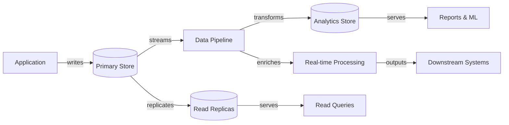

## What this is

The foundation of how data flows through distributed systems, from storage design to real-time processing. It covers data modeling decisions, consistency trade-offs, partitioning strategies, pipeline architectures, and streaming patterns. Essential when data becomes the bottleneck, when consistency requirements vary across use cases, or when processing volumes exceed single-node capabilities.

## When to use it

- Systems handling millions of records where query performance and storage efficiency matter significantly.
- Multi-service architectures where data consistency requirements differ (financial transactions vs. user preferences vs. analytics).
- Applications requiring real-time data processing (recommendations, fraud detection, monitoring dashboards).
- Global systems where data locality and replication strategies affect user experience and compliance.
- High-growth products where current data architecture cannot scale with business needs.
- Migration projects moving from monolithic to distributed data architectures.

## When not to

- Single-service applications with straightforward Create, Read, Update, Delete (CRUD) operations and modest data volumes.
- Early-stage products where data patterns and scale requirements remain undefined.
- Read-heavy systems with simple queries that benefit from mature Relational Database Management System (RDBMS) features.
- Batch-only processing where real-time requirements do not justify streaming complexity.

## Core decisions

- Data modeling approach: normalized relational vs. denormalized document vs. graph structures based on access patterns and query requirements.
- Consistency model: strong consistency for critical operations vs. eventual consistency for performance vs. hybrid approaches per use case.
- Partitioning strategy: horizontal sharding by key vs. vertical partitioning by feature vs. functional decomposition by bounded context.
- Pipeline architecture: batch Extract, Transform, Load (ETL) for accuracy vs. real-time streaming for latency vs. lambda architecture for both.
- Storage technology: transactional databases vs. analytical stores vs. object storage vs. specialized engines (search, time-series, graph).
- Trade-off: data consistency vs. system availability — the Consistency, Availability, Partition tolerance (CAP) theorem forces explicit choices during network failures.

## Mental model

_Figure: Data flow from operational systems through pipelines to analytical and real-time processing._

## What to read next

- [Design effective data structures with Data Modeling](/docs/data/modeling)
- [Choose the right trade-offs with Consistency models](/docs/data/consistency)
- [Scale data storage with Partitioning and Sharding](/docs/data/partitioning-sharding)
- [Move and transform data with Data Pipelines](/docs/data/pipelines)
- [Process continuous data with Streaming architectures](/docs/data/streaming)

:::note
Orientation: Data Modeling and Consistency address foundational design decisions, while Partitioning and Streaming solve specific scale and performance challenges.
:::
