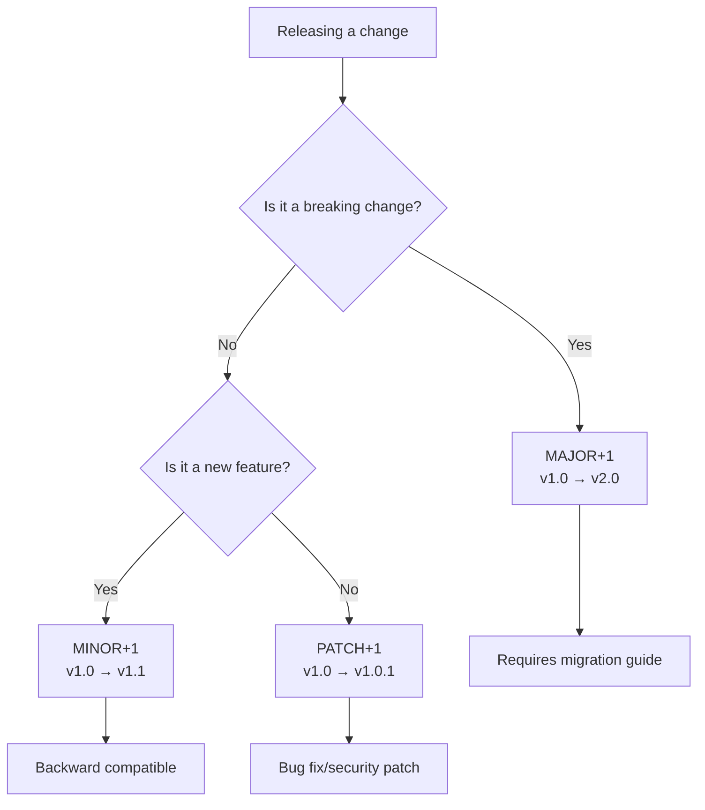

<Hero title="Release Versioning and Release Notes" subtitle="Version releases meaningfully; communicate changes clearly to stakeholders." imageAlt="Release notes illustration" size="large" />

## TL;DR

**Semantic Versioning** (semver): MAJOR.MINOR.PATCH. MAJOR increments for breaking changes (v1.0 → v2.0), MINOR for backward-compatible features (v1.0 → v1.1), PATCH for bug fixes (v1.0 → v1.0.1). This simple scheme tells users at a glance whether they can upgrade safely.

**Release notes** communicate what changed and why it matters. Include: version number and date, new features (with impact), bug fixes (critical ones highlighted), breaking changes (with migration guide), deprecations (with timelines), known issues, security notes. Write for your audience: customers care about business impact, ops teams care about deployment notes, product cares about features shipped.

**Automation**: Generate release notes from commit messages using tools like Conventional Commits. This ensures consistent, automated release documentation.

## Learning Objectives

- Design a clear versioning strategy
- Communicate releases effectively to different stakeholders
- Document breaking changes and migration paths
- Deprecate safely with advance notice
- Automate release note generation
- Track and report on release quality

## Motivating Scenario

Your company publishes a widely-used API library. Three months ago, you released version 2.0 with a breaking API change. The release notes said "See migration guide." But customers had to search your wiki to find it—it was 6 clicks away. One customer didn't find it and their application broke in production. Another customer saw "2.0.1" released a week later but had no idea if they should upgrade. Was it security critical? A bugfix? A new feature they didn't need?

You need a clear versioning scheme and release communication that tells users exactly what they need to know.

## Core Concepts

### Semantic Versioning (SemVer)

Semantic Versioning is a simple, machine-readable scheme: **MAJOR.MINOR.PATCH**.

**MAJOR** (Breaking changes):
- Increment when you change the API in an incompatible way
- v1.0.0 → v2.0.0
- Example: Removing a function, changing a function signature, changing behavior
- Users must read migration guide and potentially modify code

**MINOR** (New features, backward compatible):
- Increment when you add functionality that's backward compatible
- v1.0.0 → v1.1.0
- Example: Adding a new function, adding an optional parameter
- Users can upgrade safely; old code still works

**PATCH** (Bug fixes):
- Increment when you fix bugs without changing functionality
- v1.0.0 → v1.0.1
- Users should upgrade (bug fixes improve reliability)

<Figure caption="Semantic Versioning Decision Tree">

</Figure>

**Pre-release versions**: v1.0.0-beta.1, v1.0.0-rc.1. These are unstable; users shouldn't use in production.

**Build metadata**: v1.0.0+20250214. The part after + is metadata and doesn't affect version precedence.

### Release Notes Structure

Effective release notes follow a consistent structure:

1. **Header**: Version number, release date
2. **Breaking Changes** (if any): Explain what changed and why; provide migration guide
3. **New Features**: What can users do now? How does it improve their workflow?
4. **Bug Fixes**: Critical ones highlighted
5. **Deprecations**: What's being removed? When? What's the alternative?
6. **Known Issues**: What doesn't work? When will it be fixed?
7. **Security**: Any CVEs fixed? Upgrade urgency?
8. **Contributors**: Who built this?

**Audience-specific notes**:
- **Customers**: Focus on impact. "Authentication now works offline" (benefit-driven)
- **Operations**: Focus on deployment. "Requires new environment variable: AUTH_ENDPOINT"
- **Product/Leadership**: Focus on business value. "Shipped 3 requested features, 12 bug fixes, improved performance by 20%"

### Versioning Schemes for Different Types of Software

| Type | Scheme | Example | Notes |
|------|--------|---------|-------|
| **Library/API** | SemVer | v2.3.4 | Users depend on stable interface; breaking changes are critical |
| **Web App** | Time-based or continuous | 2025.02.14 or build #12345 | Users don't control upgrades; backward compatibility less critical |
| **Operating System** | Hybrid | Ubuntu 22.04 LTS | Year.month. LTS = long-term support |
| **Data Service** | Schema version + release | db_v5 + release 2.1.0 | Schema changes are breaking; must be managed carefully |
| **Internal Services** | Simplified | v1, v2 | If only used internally, simpler versioning acceptable |

### Deprecation Strategy

Deprecating features safely requires advance notice:

**Phase 1** (Announcement): Release version 1.5, document deprecated feature
- Example: "Function `get_user()` is deprecated; use `get_user_v2()` instead. Removing in v2.0."
- Release notes: "Three functions deprecated. See migration guide for alternatives."

**Phase 2** (Grace period): 2-4 releases (typically 3-6 months)
- Feature still works but shows warnings in logs
- Documentation updated to steer new users to replacement
- Continue release notes reminding of upcoming removal

**Phase 3** (Removal): Next major version
- Example: v2.0 removes deprecated functions
- Release notes have prominent section: "Breaking Changes" with migration guide

### Automating Release Notes

Modern teams automate release notes from commit messages using **Conventional Commits**:

```
feat: add user authentication
fix: correct off-by-one error in pagination
docs: update API reference
perf: optimize database queries
BREAKING CHANGE: remove deprecated getUser() method
```

Tools parse these and generate release notes:

```markdown
## v2.0.0 (2025-02-14)

### Breaking Changes
- Remove deprecated getUser() method (use getUserV2 instead)

### New Features
- Add user authentication system
- Add role-based access control

### Bug Fixes
- Fix off-by-one error in pagination
- Fix race condition in cache invalidation

### Performance
- Optimize database queries (40% faster)

### Contributors
- Alice (features), Bob (bugfixes), Carol (docs)
```

## Practical Examples

<Tabs>
<TabItem value="semver-examples" label="Semantic Versioning Examples">
```
Scenario 1: Bug fix
Current: v1.2.3
Fix: Database connection pooling bug
New version: v1.2.4

Scenario 2: New feature
Current: v1.2.4
Feature: Add webhook support
New version: v1.3.0 (users can upgrade safely)

Scenario 3: Breaking change
Current: v1.3.0
Change: Rename API endpoint /users → /api/v1/users
New version: v2.0.0 (migration required)

Scenario 4: Pre-release
Feature branch: v2.0.0-beta.1
For early testing by interested users

Scenario 5: Multiple pre-releases
Beta testing: v2.0.0-beta.1, v2.0.0-beta.2, v2.0.0-beta.3
Release candidate: v2.0.0-rc.1
Stable: v2.0.0
```
</TabItem>
<TabItem value="release-notes" label="Well-Written Release Notes">
```markdown
# Version 2.1.0 - Database Connection Pool Improvements

**Release Date**: February 14, 2025

## Summary
This release improves database connection performance, adds support for read replicas, and fixes several stability issues. All changes are backward compatible. Upgrade recommended for all users.

## Highlights
- 40% reduction in connection setup time
- Support for read-only replica connections
- Automatic connection retry with exponential backoff
- New metrics for connection pool monitoring

## New Features

### Read Replica Support
You can now route read queries to read replicas while writes go to the primary:

```python
from mydb import Pool

pool = Pool(
    primary="db.example.com:5432",
    replicas=["replica1.example.com:5432", "replica2.example.com:5432"]
)

# Reads distributed across replicas
result = pool.read_query("SELECT * FROM users")

# Writes go to primary
pool.write_query("UPDATE users SET active = true WHERE id = ?")
```

### Connection Pool Metrics
New metrics exported:
- `pool_size`: Current connections in pool
- `pool_utilization`: Percentage of max connections in use
- `connection_wait_time_ms`: Time spent waiting for available connection
- `connection_errors_total`: Total failed connection attempts

### Automatic Retry Logic
Failed connections now retry with exponential backoff. Configurable:

```python
pool = Pool(config, retry_max_attempts=5, retry_initial_delay_ms=100)
```

## Bug Fixes
- Fix memory leak in connection cleanup (affects long-running processes)
- Fix race condition when pool reaches max connections
- Fix incorrect timeout calculation in some edge cases
- Fix logging not capturing all errors

## Deprecations

### Deprecated: `pool.execute()` shorthand
Old: `pool.execute("SELECT * FROM users")`
New: `pool.read_query("SELECT * FROM users")` or `pool.write_query(...)`

The old method will be removed in v3.0 (expected Q3 2025). Update your code now.

### Deprecated: `direct_connection` parameter
Old: `Pool(config, direct_connection=True)`
New: `Pool(config, pool_mode='direct')` (more explicit)

## Migration Guide
**If upgrading from v2.0.x**: No code changes required. Existing code works unchanged.

**If upgrading from v1.x**: See [migration guide](https://docs.example.com/v1-to-v2-migration).

## Known Issues
- Connection pool doesn't properly rebalance after replica failure (will be fixed in v2.1.1)
- Metrics endpoint may return stale data for first 5 seconds after startup

## Security
No security issues found in v2.1.0. All dependencies updated to latest secure versions.

## Performance Improvements
- Connection setup time: 1200ms → 750ms (40% improvement)
- Query execution: negligible change
- Memory usage: slight increase (~5MB per pool for improved reliability)

## What's Next (Roadmap)
- v2.2 (planned Q2): Connection pool auto-scaling
- v3.0 (planned Q4): Remove deprecated APIs, async/await support

## Contributors
- Alice Chen - Lead, connection pool refactor
- Bob Smith - Read replica implementation
- Carol Johnson - Testing and reliability fixes
- @community - Bug reports and feedback

## Download
- PyPI: `pip install mydb==2.1.0`
- GitHub: <a href="https://github.com/example/mydb/releases/tag/v2.1.0" target="_blank" rel="nofollow noopener noreferrer">v2.1.0 Release ↗️</a>
```
</TabItem>
<TabItem value="conventional-commits" label="Conventional Commits & Automation">
```bash
# Conventional Commits format

feat: add database connection pool metrics
^--^  ^-----------------------------------^
|     |
|     +-- Description: short, imperative, not capitalized
|        - no period (.) at the end
|        - imperative: "add" not "added" or "adds"
|
+------- Type: feat, fix, docs, style, refactor, perf, test, chore

# With body (optional)
feat: add database connection pool metrics

The pool now exports prometheus-compatible metrics:
- pool_size: current connections
- pool_utilization: percentage of max
- connection_wait_time_ms: time waiting for connection

Closes #1234

# With breaking change indicator
feat!: change pool.execute() API

BREAKING CHANGE: pool.execute() removed. Use pool.read_query() or pool.write_query() instead.

# Examples of commits
feat: add read replica support
fix: correct off-by-one error in pagination
docs: update installation instructions
perf: optimize query execution time by 40%
test: add tests for connection retry logic
chore: update dependencies to latest versions
```

**Tools that auto-generate release notes**:
- `standard-version`: Reads conventional commits, bumps version, generates CHANGELOG
- `semantic-release`: Fully automated versioning and releasing
- GitHub/GitLab: Built-in release note generation from commits
- `conventional-changelog`: Generates markdown changelogs

Example workflow:
1. Developer makes commits with conventional format
2. CI/CD pipeline runs: `standard-version`
3. Version auto-incremented based on commits
4. CHANGELOG automatically updated
5. Release created on GitHub with auto-generated notes
6. No manual release note writing needed

</TabItem>
<TabItem value="changelog-template" label="CHANGELOG.md Template">
```markdown
# Changelog

All notable changes to this project will be documented in this file.

The format is based on [Keep a Changelog](https://keepachangelog.com/),
and this project adheres to [Semantic Versioning](https://semver.org/).

## [Unreleased]

### Added
- Database read replica support
- Connection pool metrics export

### Changed
- Connection timeout calculation (more accurate)

### Deprecated
- `pool.execute()` method (use `pool.read_query()`)

### Removed

### Fixed
- Memory leak in connection cleanup
- Race condition at max pool capacity

### Security

## [2.1.0] - 2025-02-14

### Added
- Read replica routing
- Prometheus-compatible metrics
- Automatic retry with exponential backoff

### Fixed
- Memory leak in connection cleanup
- Race condition when pool reaches max connections

### Changed
- Connection setup performance improved 40%

## [2.0.0] - 2025-01-10

### Added
- New connection pool API
- Support for multiple databases

### Changed
- **BREAKING**: `pool.execute()` → `pool.read_query()` / `pool.write_query()`
- Minimum Python version: 3.8

## [1.0.0] - 2024-12-01

Initial release
```
</TabItem>
</Tabs>

## When to Use / When Not to Use

<Vs highlight={[0,1,0,0]} items={[
{
    label: "Use Semantic Versioning When:",
    points: [
      "You publish a library, SDK, or API that external users depend on",
      "Breaking changes require customer migration",
      "You need users to understand upgrade safety at a glance",
      "You have multiple releases per month",
      "Compatibility matters to your business"
    ],
    highlightTone: "positive"
  },
{
    label: "Use Time-Based or Continuous Versioning When:",
    points: [
      "You run a web app with continuous deployment (internal or users don't control upgrades)",
      "Breaking changes don't affect external users",
      "Version number is less important than feature flags for managing rollouts",
      "You deploy multiple times per day"
    ],
    highlightTone: "positive"
  }
]} />

## Patterns and Pitfalls

<Showcase title="Patterns and Pitfalls" sections={[
  {
    label: "Release Notes That Don't Help Users",
    body: "Anti-pattern: Release notes with only technical jargon: 'Refactored auth handler. Updated deps. Fixed race condition.' Users don't know if they need to upgrade or what changed. Better: 'Fixed critical authentication bug (could allow access without proper credentials). Upgrade immediately. No code changes required.' Include impact and migration steps."
  },
  {
    label: "Breaking Changes Without Migration Guide",
    body: "Anti-pattern: MAJOR version bump with no explanation of what changed or how to migrate. Users are angry. Better: Prominent section in release notes with before/after code examples. Link to detailed migration guide. Explain why the change was necessary."
  },
  {
    label: "Vague Deprecation Timelines",
    body: "Anti-pattern: 'Function X is deprecated and will be removed.' When? Users don't know if they have 1 month or 2 years. Better: 'Function X deprecated in v1.5, will be removed in v3.0 (expected Q3 2025). Use Y instead.' Clear timeline."
  },
  {
    label: "No Release Notes",
    body: "Anti-pattern: Just a version number and commit messages. Users don't know what's new. Better: Even short release notes help. At minimum: new features, bug fixes, breaking changes. Automate from conventional commits if manual writing is too much overhead."
  },
  {
    label: "Wrong Audience for Release Notes",
    body: "Anti-pattern: Same release notes for customers, ops, and developers. Customers don't care about internal refactoring; ops doesn't care about new features. Better: Tailor release notes. Customer-facing: business impact. Ops: deployment requirements and config changes. Developers: API changes and deprecations."
  },
  {
    label: "Semantic Versioning Without Meaning",
    body: "Anti-pattern: Using SemVer but not being consistent about what breaks. MAJOR bumps from v1 to v2 for minor changes, then keep v2.x for major changes. Users can't trust the version number. Better: Strict adherence to SemVer rules. If in doubt, bump MAJOR."
  }
]} />

## Design Review Checklist

<Checklist items={[
  "Do you use Semantic Versioning or a documented versioning scheme?",
  "Are release notes written and published for every release?",
  "Do release notes include breaking changes and migration guides?",
  "Are deprecations announced with clear timelines?",
  "Can release notes be understood by non-technical stakeholders?",
  "Is security information included in release notes?",
  "Are release notes automated (from commits or conventional changelog)?",
  "Do you have a CHANGELOG.md file in version control?",
  "Are pre-release versions clearly marked and discouraged for production use?",
  "Do you communicate major version deprecation at least 2 releases in advance?",
  "Is there a process for communicating critical security releases immediately?",
  "Do release notes link to migration guides for major changes?"
]} />

## Self-Check Questions

1. **Versioning Scheme**: What's your versioning scheme? Can someone unfamiliar with your project understand the version number?
2. **Breaking Changes**: How do you communicate breaking changes? Do users have time to plan migration?
3. **Deprecation Timeline**: When you deprecate a feature, how much notice do users get? (Ideal: at least 2-3 releases)
4. **Automation**: Are release notes generated automatically or written manually?
5. **Audience**: Who reads your release notes? Do they contain information relevant to each audience?

## Next Steps

1. **Adopt Semantic Versioning**: If you're not already using it, switch now.
2. **Write Release Notes**: For the next release, write comprehensive release notes.
3. **Automate**: Set up conventional commits and automated release note generation.
4. **Deprecation Policy**: Document how you deprecate features (timeline, notice period).
5. **Communicate**: Share release notes proactively (email, RSS, Slack, docs).

## References

1. <a href="https://semver.org/" target="_blank" rel="nofollow noopener noreferrer">Semantic Versioning ↗️</a>
2. <a href="https://keepachangelog.com/" target="_blank" rel="nofollow noopener noreferrer">Keep a Changelog ↗️</a>
3. <a href="https://www.conventionalcommits.org/" target="_blank" rel="nofollow noopener noreferrer">Conventional Commits ↗️</a>
4. Humble, J., & Farley, D. (2010). Continuous Delivery. Addison-Wesley.
5. <a href="https://github.com/semantic-release/semantic-release" target="_blank" rel="nofollow noopener noreferrer">Semantic Release (GitHub) ↗️</a>
