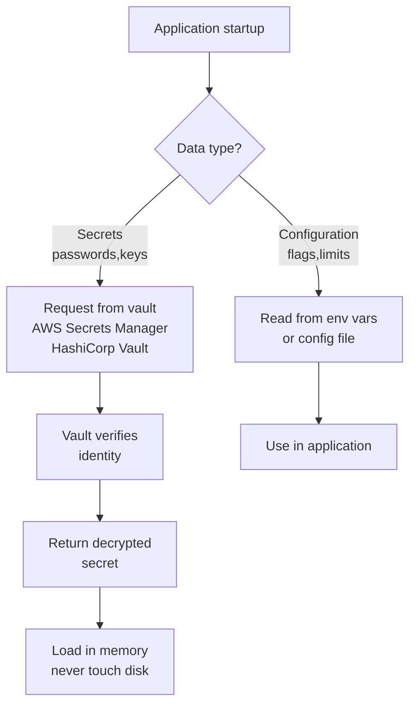

<Hero title="Secrets and Configuration Management" subtitle="Manage credentials, API keys, and configuration safely; never commit secrets to version control." imageAlt="Secrets illustration" size="large" />

## TL;DR

**Never commit secrets to version control.** Not in `.env` files, not encrypted (keys leak), not hardcoded. A vault (HashiCorp Vault, AWS Secrets Manager, Azure Key Vault) stores secrets securely with access control, rotation, audit trails, and encryption. Applications request secrets at runtime; they're never stored on disk.

**Configuration** (feature flags, limits, timeouts) is different: it's not secret but environment-specific. Parameterize it in code; use environment variables or config files to inject values per environment. Separate secrets from config: secrets go to vault, config can go in code, environment variables, or config management.

## Learning Objectives

- Distinguish secrets from configuration
- Design a secrets management architecture
- Implement vault integration
- Rotate secrets automatically
- Control access with least privilege
- Audit and monitor secret access

## Motivating Scenario

A developer commits a database password to GitHub "temporarily" while debugging. They intend to remove it before pushing, but forget. The password is now in Git history—visible to all engineers and bots scanning public repos. Two hours later, an attacker uses the credentials to access your production database, exfiltrating customer data.

This is preventable with proper secrets management.

## Core Concepts

### Secrets vs Configuration

**Secrets**: Passwords, API keys, tokens, private keys, database credentials. Sensitive. Change infrequently. If exposed, security is breached. Never in version control.

**Configuration**: Feature flags, max connection pool, timeout values, log level, environment name. Not sensitive. Changes per environment. Can be in code or config files.

<Figure caption="Secrets and Configuration Flow">

</Figure>

### Vault Architecture

A vault provides:
- **Secure storage**: Encrypted at rest, only decryption key is secured differently
- **Access control**: Who can read what? Role-based access
- **Rotation**: Automatic secret rotation; old secrets stop working
- **Audit trail**: Log of who accessed what when
- **Encryption in transit**: TLS/mTLS

### Secret Types and Handling

**Database credentials**: Change password. Update vault. Old connections drop.

**API keys**: Rotate regularly. Vault stores new key; app uses new key.

**Private keys** (SSL certs, SSH keys): High risk. Rotate immediately if exposed.

**Tokens**: Often short-lived. Refresh automatically.

## Practical Examples

<Tabs>
<TabItem value="vault" label="HashiCorp Vault Setup">
```bash
# Initialize Vault (standalone mode, for demo)
vault server -dev

# In another terminal, set environment
export VAULT_ADDR="http://127.0.0.1:8200"
export VAULT_TOKEN="..." # From server output

# Enable KV secrets engine
vault secrets enable -path=secret kv

# Store a secret
vault kv put secret/database/prod \
  username="dbuser" \
  password="ComplexPassword123!" \
  host="db.example.com"

# Retrieve a secret
vault kv get secret/database/prod

# Output: Retrieves the secret for use in application

# Set up access control: only myapp can read this secret
vault policy write myapp-policy - <<EOF
path "secret/database/prod" {
  capabilities = ["read", "list"]
}
EOF

# Create an AppRole for application
vault auth enable approle
vault write auth/approle/role/myapp \
  bind_secret_id=true \
  secret_id_ttl=3600

# Get role ID and secret ID
vault read auth/approle/role/myapp/role-id
vault write -f auth/approle/role/myapp/secret-id

# Application uses these to authenticate and request secret
```

**In Python application:**
```python
import hvac

client = hvac.Client(url="http://vault.example.com:8200")

# Authenticate with AppRole
client.auth.approle.login(role_id="...", secret_id="...")

# Read secret
secret = client.secrets.kv.read_secret_version(path="database/prod")
db_password = secret["data"]["data"]["password"]

# Use password to connect to database
import psycopg2
conn = psycopg2.connect(
    host=secret["data"]["data"]["host"],
    user=secret["data"]["data"]["username"],
    password=db_password
)
```
</TabItem>
<TabItem value="aws-secrets" label="AWS Secrets Manager">
```bash
# Create a secret
aws secretsmanager create-secret \
  --name prod/database/postgres \
  --secret-string '{"username":"dbuser","password":"pwd123!","host":"db.example.com"}'

# Retrieve a secret
aws secretsmanager get-secret-value \
  --secret-id prod/database/postgres \
  --query SecretString \
  --output text | jq .

# Output: {"username":"dbuser","password":"pwd123!","host":"db.example.com"}

# Rotate secret automatically
aws secretsmanager rotate-secret \
  --secret-id prod/database/postgres \
  --rotation-rules AutomaticallyAfterDays=30

# List all secrets (for audit)
aws secretsmanager list-secrets

# Set access policy
aws secretsmanager put-resource-policy \
  --secret-id prod/database/postgres \
  --resource-policy file://policy.json
```

**In Python application:**
```python
import boto3
import json

client = boto3.client('secretsmanager', region_name='us-east-1')

try:
    response = client.get_secret_value(SecretId='prod/database/postgres')
    secret = json.loads(response['SecretString'])

    db_password = secret['password']
    # Use password to connect
except Exception as e:
    print(f"Error retrieving secret: {e}")
```
</TabItem>
<TabItem value="env-vars" label="Environment Variables for Config">
```bash
# .env file (NEVER COMMIT THIS)
DATABASE_HOST=localhost
DATABASE_PORT=5432
MAX_CONNECTIONS=10
LOG_LEVEL=debug
FEATURE_FLAG_NEW_UI=true

# Load in application
import os
from dotenv import load_dotenv

load_dotenv()

config = {
    'db_host': os.getenv('DATABASE_HOST'),
    'db_port': int(os.getenv('DATABASE_PORT')),
    'max_connections': int(os.getenv('MAX_CONNECTIONS')),
    'log_level': os.getenv('LOG_LEVEL'),
    'features': {
        'new_ui': os.getenv('FEATURE_FLAG_NEW_UI').lower() == 'true'
    }
}

# In Docker/Kubernetes, env vars injected at runtime
# In CI/CD, secrets injected from vault
```
</TabItem>
<TabItem value="ci-cd" label="CI/CD Pipeline Integration">
```yaml
# GitHub Actions: Secrets injected as environment variables
name: Deploy

on: [push]

jobs:
  deploy:
    runs-on: ubuntu-latest
    steps:
      - uses: actions/checkout@v3

      - name: Authenticate with AWS
        uses: aws-actions/configure-aws-credentials@v2
        with:
          role-to-assume: arn:aws:iam::123456789:role/github-actions
          aws-region: us-east-1

      - name: Retrieve secrets from AWS Secrets Manager
        run: |
          SECRET=$(aws secretsmanager get-secret-value \
            --secret-id prod/database/postgres \
            --query SecretString \
            --output text)
          echo "DB_PASSWORD=$(echo $SECRET | jq -r .password)" >> $GITHUB_ENV

      - name: Deploy with secret
        run: |
          docker run \
            -e DATABASE_PASSWORD=${{ env.DB_PASSWORD }} \
            myapp:latest
```

**GitLab CI:**
```yaml
# Secrets stored in GitLab CI/CD variables
deploy:
  stage: deploy
  script:
    - docker run -e DB_PASSWORD=$DB_PASSWORD myapp:latest
  environment: production
```

**Jenkins:**
```groovy
pipeline {
    agent any

    environment {
        // Retrieve from HashiCorp Vault
        VAULT_ADDR = credentials('vault-addr')
        VAULT_TOKEN = credentials('vault-token')
    }

    stages {
        stage('Deploy') {
            steps {
                script {
                    // Fetch secrets from Vault
                    sh '''
                        curl -H "X-Vault-Token: $VAULT_TOKEN" \
                        $VAULT_ADDR/v1/secret/database/prod \
                        | jq .data.data.password > /tmp/dbpwd

                        docker run -e DB_PASSWORD=$(cat /tmp/dbpwd) myapp:latest

                        # Cleanup
                        rm /tmp/dbpwd
                    '''
                }
            }
        }
    }
}
```
</TabItem>
<TabItem value="rotation" label="Secret Rotation Strategy">
```python
# Automatic secret rotation with HashiCorp Vault

import hvac
import time
from datetime import datetime, timedelta

class SecretRotator:
    def __init__(self, vault_addr, vault_token):
        self.client = hvac.Client(url=vault_addr, token=vault_token)

    def rotate_database_password(self, secret_path):
        """
        Rotate database password:
        1. Generate new password
        2. Update database
        3. Update vault
        4. Old password expires
        """
        # Generate new password (30 chars, mix of types)
        import secrets
        new_password = secrets.token_urlsafe(30)

        # Get current connection info
        secret = self.client.secrets.kv.read_secret_version(path=secret_path)
        db_config = secret["data"]["data"]

        # Update database password (application-specific)
        import psycopg2
        conn = psycopg2.connect(
            host=db_config['host'],
            user=db_config['username'],
            password=db_config['password']  # Old password
        )
        cursor = conn.cursor()
        cursor.execute(f"ALTER USER {db_config['username']} WITH PASSWORD %s",
                      (new_password,))
        conn.commit()
        conn.close()

        # Update vault with new password
        self.client.secrets.kv.create_or_update_secret(
            path=secret_path,
            secret_dict={
                'username': db_config['username'],
                'password': new_password,
                'host': db_config['host'],
                'rotated_at': datetime.now().isoformat()
            }
        )

        print(f"Successfully rotated {secret_path}")

    def schedule_rotations(self):
        """Rotate secrets every 30 days"""
        secrets = [
            'secret/database/prod',
            'secret/database/staging',
            'secret/api/stripe',
        ]

        rotation_interval = timedelta(days=30)

        while True:
            for secret_path in secrets:
                try:
                    self.rotate_database_password(secret_path)
                except Exception as e:
                    print(f"Error rotating {secret_path}: {e}")

            # Sleep until next rotation
            time.sleep(rotation_interval.total_seconds())

if __name__ == "__main__":
    rotator = SecretRotator(
        vault_addr="http://vault.example.com:8200",
        vault_token="hvs.xxx"
    )
    rotator.schedule_rotations()
```
</TabItem>
</Tabs>

## When to Use / When Not to Use

<Vs highlight={[0,0]} items={[
{
    label: "Use a Vault When:",
    points: [
      "You have multiple environments needing different secrets",
      "You need to rotate secrets without redeploying",
      "Security and compliance are critical",
      "Multiple applications need to access the same secret",
      "You need audit trails of secret access",
      "You have many secrets to manage"
    ],
    highlightTone: "positive"
  },
{
    label: "Environment Variables May Suffice When:",
    points: [
      "Small project with few secrets",
      "Single environment",
      "Secrets never change (unlikely but possible)",
      "You're early stage and moving fast"
    ]
  }
]} />

## Patterns and Pitfalls

<Showcase title="Patterns and Pitfalls" sections={[
  {
    label: "Store Secrets in Git",
    body: "Anti-pattern: Committing .env files, encrypted credentials, or hardcoded API keys. Even if deleted, they remain in Git history. Once pushed to a public repo, assume compromised. Better: Use a vault. If you must use env files locally, add .env to .gitignore and never commit it."
  },
  {
    label: "Logging Secrets",
    body: "Anti-pattern: Logging database passwords, API keys, or other secrets when debugging. Logs are stored for days/weeks and can be accessed by multiple people. Better: Sanitize logs. Never log secrets. Use structured logging with sensitive field redaction."
  },
  {
    label: "Storing Secrets in Application Code",
    body: "Anti-pattern: Hardcoding API keys or passwords. Every build includes them; every engineer has access; they're in every deployment. Better: External configuration from environment or vault."
  },
  {
    label: "Not Rotating Secrets",
    body: "If a secret is exposed, it works forever until manually rotated (weeks later). Better: Automatic rotation every 30-90 days. If secret is compromised, it only works for days."
  },
  {
    label: "Overly Permissive Access",
    body: "Anti-pattern: Every engineer and service has access to all secrets. If one service is compromised, attacker has all credentials. Better: Least privilege. Service A can only read its secrets, not others'."
  },
  {
    label: "No Audit Trail",
    body: "If a breach occurs, you don't know who accessed what when. Better: Vault provides audit logs. Review them regularly. Alert on unusual access patterns."
  }
]} />

## Design Review Checklist

<Checklist items={[
  "Are all secrets stored in a vault (not in code or version control)?",
  "Are environment variables used only for non-sensitive config?",
  "Is .env file (if used locally) in .gitignore?",
  "Are secrets rotated automatically (at least every 90 days)?",
  "Are access controls enforced (least privilege)?",
  "Is there an audit trail of secret access?",
  "Can you revoke access immediately if a secret is compromised?",
  "Are secrets encrypted in transit (TLS)?",
  "Are secrets encrypted at rest?",
  "Are database passwords different per environment?",
  "Do applications request secrets at runtime (not baked in)?",
  "Are secrets never logged or exposed in errors?",
  "Is the vault itself highly available and backed up?"
]} />

## Self-Check Questions

1. **Secrets Storage**: Where are your production secrets stored? Are they accessible only to authorized systems?
2. **Rotation**: How often are secrets rotated? What's the process?
3. **Audit**: Can you see who accessed which secret when?
4. **Least Privilege**: Does every application have access to all secrets or only its own?
5. **Emergency Access**: If a secret is compromised, how fast can you revoke it?

## Next Steps

1. **Audit Current State**: List all secrets and where they're stored.
2. **Choose a Vault**: HashiCorp Vault, AWS Secrets Manager, or Azure Key Vault.
3. **Migrate Secrets**: Move secrets from code/env files to vault.
4. **Set Up Rotation**: Configure automatic rotation.
5. **Enable Audit**: Turn on and regularly review access logs.
6. **Train Team**: Ensure all engineers understand secret management.

## References

1. <a href="https://www.vaultproject.io/" target="_blank" rel="nofollow noopener noreferrer">HashiCorp Vault ↗️</a>
2. <a href="https://aws.amazon.com/secrets-manager/" target="_blank" rel="nofollow noopener noreferrer">AWS Secrets Manager ↗️</a>
3. <a href="https://cheatsheetseries.owasp.org/cheatsheets/Secrets_Management_Cheat_Sheet.html" target="_blank" rel="nofollow noopener noreferrer">OWASP Secrets Management ↗️</a>
4. Humble, J., & Farley, D. (2010). Continuous Delivery. Addison-Wesley.
