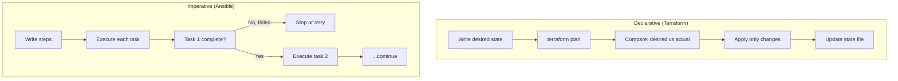

<Hero title="Declarative vs Imperative IaC" subtitle="Declarative says what you want; imperative says how to build it. Each has tradeoffs." imageAlt="IaC illustration" size="large" />

## TL;DR

**Declarative Infrastructure as Code** (Terraform, CloudFormation, Kubernetes): You describe the desired state—"I want 3 servers with 4GB RAM running on private subnet." The tool figures out how to achieve it. Idempotent: running twice has the same effect as running once. You can see what will change before applying (`terraform plan`). Better for drift detection and reproducibility.

**Imperative Infrastructure as Code** (Ansible, Bash, Python scripts): You write step-by-step instructions—"Install Python package. Edit config file. Restart service." What if the package is already installed? The script might fail or succeed unpredictably. Better for complex, stateful changes with conditional logic. Harder to understand at a glance.

**Best practice**: Use declarative for cloud infrastructure (VMs, networks, databases, load balancers). Use imperative for configuration inside instances (install packages, configure application). Combine them: Terraform creates VMs, Ansible configures them.

## Learning Objectives

- Understand the fundamental differences between declarative and imperative approaches
- Recognize the strengths and limitations of each paradigm
- Choose the right tool for the right problem
- Design infrastructure that's reproducible and maintainable
- Combine both approaches effectively
- Manage state and handle updates safely

## Motivating Scenario

Your team has grown from 5 to 30 engineers. Six months ago, you had one person managing infrastructure—they'd SSH into servers and tweak configs. As the team grew, this became untenable. Someone wrote Bash scripts to automate it, but they're fragile: run them twice and weird things happen. You tried Ansible, which is more predictable, but describing a multi-region deployment is tedious—you write 50 lines of Ansible when one Terraform resource would suffice.

You need a paradigm that scales with your team and complexity.

## Core Concepts

### Declarative Infrastructure

Declarative says "what, not how." You define the desired end state, and the tool figures out the steps to reach it.

```hcl
# Terraform (Declarative)
resource "aws_instance" "web_server" {
  ami           = "ami-0c94855ba95c574c8"
  instance_type = "t3.medium"

  tags = {
    Name = "web-server"
  }
}
```

You're not saying "launch an EC2 instance." You're saying "I want a resource of type aws_instance with these properties." Terraform manages the details.

**Idempotency**: Run this same Terraform twice, and the second time does nothing—the resource already exists in the desired state. This is crucial: you can safely re-run infrastructure code.

**State management**: Terraform maintains a state file representing the infrastructure it manages. When you run `terraform apply`, it compares desired state (your code) to actual state (the cloud) to the known state (the state file) and determines what changes are needed.

**Drift detection**: Declarative systems can detect drift—if something was modified outside the code, the system knows. `Terraform plan` shows discrepancies between your code and reality.

### Imperative Infrastructure

Imperative says "how." You write steps that the system executes sequentially.

```yaml
# Ansible (Imperative)
- name: Configure web server
  hosts: web_servers
  tasks:
    - name: Install dependencies
      apt:
        name:
          - python3
          - pip
        state: present

    - name: Install application packages
      pip:
        name: flask
        state: present

    - name: Copy application code
      copy:
        src: app/
        dest: /opt/myapp

    - name: Start application
      service:
        name: myapp
        state: started
```

You're writing a recipe: "Do this, then do that." It reads like instructions for a human.

**Conditional execution**: Imperative code can branch: "If package is not installed, install it. If config file doesn't exist, create it." This flexibility is powerful but also makes it harder to reason about—running the same code twice might follow different paths.

**Complex workflows**: Some tasks are inherently procedural. Example: "Migrate a database: export data from old database, transform it, load into new database, verify counts match." Imperative handles this naturally.

**Idempotency by convention**: Imperative code isn't automatically idempotent. Each task must be written carefully. Good Ansible practices use built-in modules that are idempotent (e.g., `apt` with `state: present`), but it's up to the developer to ensure re-runs are safe.

### Comparison

<Figure caption="Declarative vs Imperative Workflow">

</Figure>

| Aspect | Declarative | Imperative |
|--------|-------------|-----------|
| **What you write** | Desired end state | Step-by-step instructions |
| **Idempotent** | Yes, by design | Only if carefully written |
| **Drift detection** | Can detect divergence | Harder to detect |
| **Diff before apply** | Yes (`terraform plan`) | Harder to predict |
| **Conditional logic** | Supported but complex | Natural and easy |
| **Cloud resources** | Excellent | Awkward |
| **Server configuration** | Possible but verbose | Natural fit |
| **Debugging** | Clear: compare desired to actual | Follow step-by-step execution |
| **Learning curve** | Moderate (new paradigm) | Easy (like scripting) |

## Practical Examples

<Tabs>
<TabItem value="declarative" label="Declarative: Terraform">
```hcl
# main.tf - Declarative infrastructure as code

terraform {
  required_version = ">= 1.0"
  required_providers {
    aws = {
      source  = "hashicorp/aws"
      version = "~> 5.0"
    }
  }
}

provider "aws" {
  region = var.aws_region
}

# VPC
resource "aws_vpc" "main" {
  cidr_block           = "10.0.0.0/16"
  enable_dns_hostnames = true

  tags = {
    Name = "main-vpc"
  }
}

# Public subnet
resource "aws_subnet" "public" {
  vpc_id                  = aws_vpc.main.id
  cidr_block              = "10.0.1.0/24"
  availability_zone       = "${var.aws_region}a"
  map_public_ip_on_launch = true

  tags = {
    Name = "public-subnet"
  }
}

# Security group
resource "aws_security_group" "web" {
  name   = "web-security-group"
  vpc_id = aws_vpc.main.id

  ingress {
    from_port   = 80
    to_port     = 80
    protocol    = "tcp"
    cidr_blocks = ["0.0.0.0/0"]
  }

  egress {
    from_port   = 0
    to_port     = 0
    protocol    = "-1"
    cidr_blocks = ["0.0.0.0/0"]
  }

  tags = {
    Name = "web-sg"
  }
}

# EC2 instance
resource "aws_instance" "web_server" {
  ami           = data.aws_ami.amazon_linux.id
  instance_type = "t3.medium"

  subnet_id              = aws_subnet.public.id
  vpc_security_group_ids = [aws_security_group.web.id]

  user_data = base64encode(<<-EOF
              #!/bin/bash
              yum update -y
              yum install -y httpd
              systemctl start httpd
              echo "<h1>Hello from $(hostname -f)</h1>" > /var/www/html/index.html
              EOF
  )

  tags = {
    Name = "web-server"
  }

  lifecycle {
    create_before_destroy = true
  }
}

# Data source to find latest Amazon Linux 2 AMI
data "aws_ami" "amazon_linux" {
  most_recent = true
  owners      = ["amazon"]

  filter {
    name   = "name"
    values = ["amzn2-ami-minimal-*"]
  }
}

# Output
output "instance_ip" {
  value = aws_instance.web_server.public_ip
}

variable "aws_region" {
  type    = string
  default = "us-east-1"
}
```

**Key characteristics:**
- Describe what you want, not how to build it
- Idempotent: run twice, same result
- `terraform plan` shows exactly what will change before applying
- State file tracks known infrastructure
- Easy to version control and code review

</TabItem>
<TabItem value="imperative" label="Imperative: Ansible">
```yaml
# playbook.yml - Imperative configuration management
---
- name: Configure web server
  hosts: web_servers
  become: yes  # Run with sudo

  vars:
    app_version: "1.2.3"
    app_user: webapp
    app_group: webapp

  tasks:
    # Update system
    - name: Update all packages
      yum:
        name: "*"
        state: latest

    # Install dependencies
    - name: Install dependencies
      yum:
        name:
          - httpd
          - python3
          - python3-pip
          - git
        state: present

    # Create application user
    - name: Create application user
      user:
        name: "{{ app_user }}"
        group: "{{ app_group }}"
        shell: /bin/bash
        home: /home/{{ app_user }}

    # Clone application code
    - name: Clone application from Git
      git:
        repo: "https://github.com/myorg/myapp.git"
        dest: "/opt/myapp"
        version: "{{ app_version }}"
      notify: restart httpd

    # Set permissions
    - name: Set application ownership
      file:
        path: "/opt/myapp"
        owner: "{{ app_user }}"
        group: "{{ app_group }}"
        mode: "0755"
        recurse: yes

    # Copy configuration
    - name: Copy application config
      template:
        src: app.conf.j2
        dest: "/opt/myapp/config.conf"
        owner: "{{ app_user }}"
        group: "{{ app_group }}"
        mode: "0644"
      notify: restart httpd

    # Install Python dependencies
    - name: Install Python packages
      pip:
        requirements: "/opt/myapp/requirements.txt"
        state: present

    # Start service
    - name: Ensure httpd is started and enabled
      service:
        name: httpd
        state: started
        enabled: yes

    # Health check (conditional)
    - name: Wait for application to be ready
      wait_for:
        port: 80
        delay: 2
        timeout: 30

    - name: Health check
      uri:
        url: "http://localhost:80/health"
        method: GET
        status_code: 200
      register: health_check
      until: health_check.status == 200
      retries: 3
      delay: 5

  handlers:
    - name: restart httpd
      service:
        name: httpd
        state: restarted
```

**Key characteristics:**
- Write procedural steps
- Flexible branching and conditionals
- Handlers allow actions to trigger on change
- Good for complex configurations
- Requires careful writing to be idempotent

</TabItem>
<TabItem value="hybrid" label="Hybrid Approach (Recommended)">
```hcl
# Terraform + Ansible: Best of both worlds

# main.tf - Declare cloud infrastructure with Terraform
resource "aws_instance" "web_server" {
  ami           = "ami-0c94855ba95c574c8"
  instance_type = "t3.medium"

  key_name = aws_key_pair.deployer.key_name

  user_data = base64encode(templatefile("${path.module}/user-data.sh", {
    ansible_pull_repo = var.ansible_repository
  }))

  tags = {
    Name = "web-server"
  }
}

# user-data.sh - Bootstrap script that runs Ansible
#!/bin/bash
set -e

yum update -y
yum install -y python3 git

# Clone Ansible repository
git clone ${ansible_pull_repo} /tmp/ansible

# Run Ansible playbook locally
cd /tmp/ansible
ansible-playbook site.yml -c local --inventory-file localhost,
```

**Best practice**: Use Terraform to declare cloud infrastructure (networks, load balancers, databases), use Ansible to configure what runs inside (packages, application code, services).

</TabItem>
<TabItem value="kubernetes" label="Kubernetes: Declarative at Scale">
```yaml
# kubernetes manifest - Pure declarative

apiVersion: apps/v1
kind: Deployment
metadata:
  name: web-server
spec:
  replicas: 3
  selector:
    matchLabels:
      app: web-server
  template:
    metadata:
      labels:
        app: web-server
    spec:
      containers:
      - name: nginx
        image: nginx:1.21
        ports:
        - containerPort: 80
        resources:
          requests:
            cpu: "100m"
            memory: "128Mi"
          limits:
            cpu: "500m"
            memory: "256Mi"
        livenessProbe:
          httpGet:
            path: /
            port: 80
          initialDelaySeconds: 10
          periodSeconds: 10
        readinessProbe:
          httpGet:
            path: /
            port: 80
          initialDelaySeconds: 5
          periodSeconds: 5
---
apiVersion: v1
kind: Service
metadata:
  name: web-server-service
spec:
  selector:
    app: web-server
  ports:
  - port: 80
    targetPort: 80
  type: LoadBalancer
```

**Kubernetes is purely declarative**: You describe desired state, Kubernetes continuously reconciles actual to desired. If a pod crashes, Kubernetes creates a replacement. If you scale from 3 to 5 replicas, Kubernetes creates 2 new pods.

</TabItem>
</Tabs>

## When to Use / When Not to Use

<Vs highlight={[0,1,0,0]} items={[
{
    label: "Use Declarative When:",
    points: [
      "Managing cloud infrastructure (VMs, networks, databases, load balancers)",
      "You need reproducibility and drift detection",
      "Multiple people maintain the same infrastructure",
      "You want to see changes before applying them (terraform plan)",
      "You're using Kubernetes or other orchestration platforms",
      "Infrastructure changes frequently and you need safety"
    ],
    highlightTone: "positive"
  },
{
    label: "Use Imperative When:",
    points: [
      "Configuring servers (install packages, edit config files)",
      "You have complex, conditional logic (if X then Y else Z)",
      "You're making changes to running systems that can't be replaced",
      "You need easy debugging (step-by-step execution)",
      "Your team is comfortable with procedural scripting",
      "You're doing data migrations or other stateful operations"
    ],
    highlightTone: "positive"
  }
]} />

## Patterns and Pitfalls

<Showcase title="Patterns and Pitfalls" sections={[
  {
    label: "Hybrid: Declarative + Imperative",
    body: "Best practice: Terraform declares cloud infrastructure (immutable), Ansible configures what runs inside (mutable). Terraform creates the instance; Ansible installs packages and deploys code. This combines the strengths: declarative for repeatability, imperative for flexibility."
  },
  {
    label: "Imperative Scripts That Break on Reruns",
    body: "Anti-pattern: Writing imperative code that works once but fails on second run. Example: mkdir /opt/app (fails if directory exists). Better: Use modules with idempotent operations (apt state:present, systemctl start). Or add guards: if [ ! -d /opt/app ]; then mkdir /opt/app; fi"
  },
  {
    label: "Declarative Complexity Explosion",
    body: "Anti-pattern: Using purely declarative for things that need imperatives. Example: Trying to do a database migration with Terraform becomes verbose and awkward. Better: Terraform sets up the database infrastructure; a deployment script runs the migration steps. Accept that some tasks need imperative."
  },
  {
    label: "State File Problems (Declarative)",
    body: "Terraform's power comes from state. But state files can get corrupted, or reality diverges from state (manual changes). Best practice: Use remote state (S3, Terraform Cloud), enable locking, never manually edit state. If state is lost, you've lost your source of truth."
  },
  {
    label: "Lack of Idempotency (Imperative)",
    body: "If you write Ansible and running it twice breaks things, you've lost a key benefit. Invest in idempotence. Use built-in modules (apt, service, file) that are idempotent. Test by running playbooks twice. Document any non-idempotent tasks."
  },
  {
    label: "Mixing Paradigms Without Clear Boundaries",
    body: "Anti-pattern: Terraform code calling into shell scripts that then call imperative commands. At that point, what's declarative and what's not? Better: Clear boundaries. Terraform is declarative (cloud infrastructure). Ansible is imperative (server configuration). They communicate clearly."
  }
]} />

## Design Review Checklist

<Checklist items={[
  "Is all infrastructure defined in code (declarative or imperative)?",
  "Can you reproduce any environment from code alone?",
  "Are infrastructure changes code reviewed before applying?",
  "Is version control the source of truth?",
  "Are declarative tools used for cloud infrastructure?",
  "Are imperative tools used for server configuration?",
  "Are state files (Terraform) stored remotely and encrypted?",
  "Is your code idempotent (safe to run multiple times)?",
  "Can you see what changes before applying (terraform plan)?",
  "Is drift detection in place?",
  "Are credentials and secrets never stored in IaC?",
  "Is there a clear process for emergency changes?"
]} />

## Self-Check Questions

1. **Infrastructure Definition**: Can you describe your entire infrastructure from code? What percentage is declarative vs imperative?
2. **Reproducibility**: Can a new engineer reproduce your environment from scratch?
3. **Change Safety**: Can you see proposed changes before applying them?
4. **Idempotence**: Can you run your IaC twice and get the same result?
5. **Drift**: Can you detect when actual infrastructure diverges from code?

## Next Steps

1. **Declarative First**: Use Terraform or CloudFormation for cloud infrastructure.
2. **Add Imperative for Config**: Use Ansible or similar for server configuration.
3. **State Management**: If using Terraform, move to remote state (S3, Terraform Cloud).
4. **Plan Before Apply**: Always run `terraform plan` before `terraform apply`.
5. **Test Idempotency**: Run your IaC twice and verify same result.
6. **Drift Detection**: Set up regular drift checks to catch unauthorized changes.

## References

1. <a href="https://www.terraform.io/" target="_blank" rel="nofollow noopener noreferrer">Terraform Documentation ↗️</a>
2. <a href="https://docs.ansible.com/" target="_blank" rel="nofollow noopener noreferrer">Ansible Documentation ↗️</a>
3. Humble, J., & Farley, D. (2010). Continuous Delivery. Addison-Wesley.
4. <a href="https://kubernetes.io/docs/" target="_blank" rel="nofollow noopener noreferrer">Kubernetes Documentation ↗️</a>
5. Newman, S. (2015). Building Microservices. O'Reilly Media.
