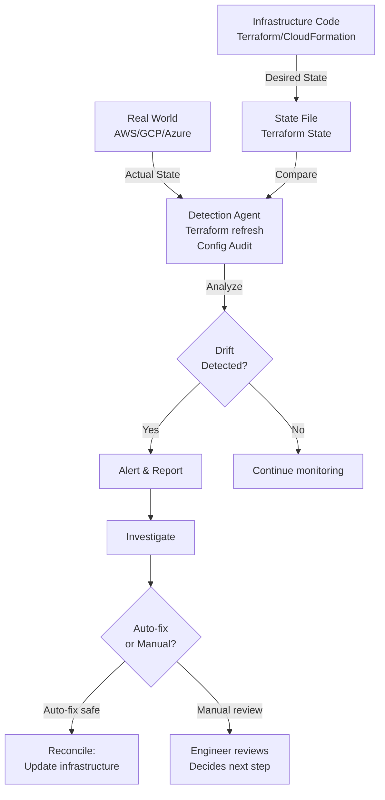

<Hero title="Drift Detection and Prevention" subtitle="Detect when infrastructure diverges from code; prevent manual changes from bypassing version control." imageAlt="Drift illustration" size="large" />

## TL;DR

Infrastructure drift occurs when the actual deployed infrastructure diverges from the infrastructure-as-code definition. A developer SSHs into a production server and changes a configuration file. Someone creates an S3 bucket through the AWS console instead of Terraform. A load balancer is modified manually. Now the live system doesn't match the code, creating a "source of truth" problem. If the server crashes and is rebuilt from code, the manual changes are lost. Worse, security audits can't reason about the actual configuration; it exists in someone's head. Prevention requires forbidding manual changes and enforcing automation. Detection requires regularly comparing code to reality and alerting on divergence.

## Learning Objectives

- Understand the causes and risks of configuration drift
- Implement drift detection mechanisms
- Prevent unauthorized manual changes through process and tooling
- Reconcile discovered drift safely
- Monitor and report on compliance
- Design immutable infrastructure practices

## Motivating Scenario

Your company manages a microservices platform on AWS with 200+ resources. Six months ago, you switched to Terraform for infrastructure management. Three weeks ago, on Friday evening, the API service crashed. While investigating, you found that someone had manually increased the RDS instance size through the AWS console to handle a traffic spike. The Terraform code still specified the smaller size. When the instance crashed and restarted, it reverted to the smaller size, causing the outage.

A security audit the next week revealed multiple manual security group modifications that didn't match the code. Production had become a snowflake—undocumented, unreproducible, fragile.

## Core Concepts

### What Is Drift?

Drift is the gap between desired state (code) and actual state (deployed infrastructure).

**Sources of drift:**

- **Manual changes**: SSH, console, API calls made outside version control
- **Failed automation**: A deployment partially completes, leaving the system in an inconsistent state
- **Third-party modifications**: An external service changes your infrastructure (e.g., auto-scaling modifies capacity, updates are applied by patching systems)
- **Time-dependent changes**: Certificates expire, credentials are rotated without updating code
- **Environmental effects**: Network issues cause state files to be stale

**Impact of drift:**

- **Unreproducibility**: You can't rebuild infrastructure from code because it won't match production
- **Security vulnerabilities**: Security groups, firewall rules, encryption settings may diverge from secure defaults
- **Compliance violations**: Audit trails can't match code to reality; regulatory audits fail
- **Incident response failure**: During an incident, you can't quickly understand the actual configuration
- **Team knowledge loss**: If the person who made manual changes leaves, the knowledge walks out the door

### Drift Detection Strategies

<Figure caption="Drift Detection Loop">

</Figure>

**Refresh-based detection**: Terraform's `terraform refresh` command queries the cloud provider to see if resources still match the state file. If a resource was modified outside Terraform, refresh detects it. This is passive—it only reports drift, doesn't fix it.

**Policy-based detection**: Run policies (OPA, Sentinel) against infrastructure to detect violations. Different from refresh—you're not checking if actual equals planned, but whether actual configuration meets compliance requirements. Example: "All databases must be encrypted. Is this database encrypted?"

**Inventory scanning**: Regularly query cloud providers for all resources and compare to your IaC definitions. Useful for finding resources that were created manually but never added to IaC.

**Continuous monitoring**: In cloud-native environments (Kubernetes), control planes continuously reconcile actual state to desired state. Kubernetes controllers constantly compare the cluster's actual state to the desired state expressed in YAML manifests.

### Drift Prevention: Immutable Infrastructure

The strongest drift prevention is immutable infrastructure—infrastructure that never changes after deployment. To update configuration, you replace the entire resource, never modify it.

**Benefits:**

- No drift by definition (you can't change things after creation)
- Quick rollback (keep the old version running, redirect traffic)
- Clear audit trail (every change is a new deployment)
- Easier testing (test the exact artifact you'll deploy)

**Implementation:**

- Use containers (Docker) for application servers—rebuild the image, deploy new containers
- Use immutable machine images (AMIs, custom VM images)—changes mean building a new image and deploying new instances
- Treat databases differently—they contain state and can't truly be immutable, but use snapshots for backup/rollback

## Practical Example

Let's implement a comprehensive drift detection and prevention system.

<Tabs>
<TabItem value="terraform" label="Terraform with State Management">
```hcl
# main.tf - Infrastructure with drift prevention

terraform {
  required_version = ">= 1.5"
  required_providers {
    aws = {
      source  = "hashicorp/aws"
      version = "~> 5.0"
    }
  }

  # Remote state prevents local modifications and enables team collaboration
  backend "s3" {
    bucket         = "my-terraform-state"
    key            = "prod/terraform.tfstate"
    region         = "us-east-1"
    encrypt        = true
    dynamodb_table = "terraform-locks"
  }
}

provider "aws" {
  region = var.aws_region

  # Prevent accidental modifications from console
  default_tags {
    tags = {
      ManagedBy   = "Terraform"
      Environment = var.environment
      CreatedAt   = timestamp()
    }
  }
}

# Launch configuration for immutable infrastructure
resource "aws_launch_template" "api_server" {
  name_prefix   = "api-server-"
  image_id      = data.aws_ami.amazon_linux.id
  instance_type = "t3.medium"

  # Immutability: use public cloud images, not custom configs
  user_data = base64encode(templatefile("${path.module}/user-data.sh", {
    app_version = var.app_version
  }))

  tag_specifications {
    resource_type = "instance"
    tags = {
      Name = "api-server"
    }
  }

  # Prevent console modifications
  metadata_options {
    http_endpoint               = "enabled"
    http_tokens                 = "required"
    http_put_response_hop_limit = 1
  }

  monitoring {
    enabled = true
  }

  lifecycle {
    create_before_destroy = true
  }
}

# Auto Scaling Group - immutable replacement policy
resource "aws_autoscaling_group" "api_servers" {
  name                = "api-asg"
  vpc_zone_identifier = var.private_subnet_ids
  target_group_arns   = [aws_lb_target_group.api.arn]
  health_check_type   = "ELB"
  health_check_grace_period = 300

  launch_template {
    id      = aws_launch_template.api_server.id
    version = "$Latest"
  }

  min_size         = 3
  max_size         = 10
  desired_capacity = 3

  # Immutable infrastructure: replace entire ASG on changes
  instance_refresh {
    strategy = "Rolling"
    preferences {
      min_healthy_percentage = 90
      instance_warmup_seconds = 300
    }
  }

  tag {
    key                 = "Name"
    value               = "api-server"
    propagate_at_launch = true
  }

  lifecycle {
    create_before_destroy = true
  }
}

# Database with immutability considerations
resource "aws_db_instance" "postgres" {
  identifier            = "production-postgres"
  engine                = "postgres"
  engine_version        = "15.3"
  instance_class        = "db.t3.medium"
  allocated_storage     = 100

  # Encryption at rest
  storage_encrypted = true
  kms_key_id        = aws_kms_key.db.arn

  # Encryption in transit
  db_subnet_group_name   = aws_db_subnet_group.private.name
  publicly_accessible    = false
  skip_final_snapshot    = false
  final_snapshot_identifier = "production-postgres-snapshot-${formatdate("YYYY-MM-DD-hhmm", timestamp())}"

  # Backups
  backup_retention_period = 30
  backup_window           = "03:00-04:00"
  copy_tags_to_snapshot   = true

  # Logging
  enabled_cloudwatch_logs_exports = ["postgresql"]

  # Apply immediately is dangerous in prod
  apply_immediately = false
  maintenance_window = "mon:04:00-mon:05:00"

  tags = {
    Name = "production-postgres"
  }

  lifecycle {
    # Prevent accidental deletion
    prevent_destroy = true
    ignore_changes = [
      # Ignore changes from manual modifications
      allocated_storage
    ]
  }
}

# Data source to find AMI
data "aws_ami" "amazon_linux" {
  most_recent = true
  owners      = ["amazon"]

  filter {
    name   = "name"
    values = ["amzn2-ami-minimal-*"]
  }
}

# Variables
variable "aws_region" {
  type = string
  default = "us-east-1"
}

variable "environment" {
  type = string
}

variable "app_version" {
  type = string
  description = "Version of application to deploy"
}

variable "private_subnet_ids" {
  type = list(string)
}

# KMS key for encryption
resource "aws_kms_key" "db" {
  description = "Encryption key for RDS database"
  enable_key_rotation = true
}

resource "aws_db_subnet_group" "private" {
  name = "private-db-subnet-group"
  subnet_ids = var.private_subnet_ids
}

resource "aws_lb_target_group" "api" {
  name   = "api-tg"
  port   = 8080
  protocol = "HTTP"
  vpc_id = var.vpc_id
}

variable "vpc_id" {
  type = string
}

# CloudWatch alarms for drift detection
resource "aws_cloudwatch_metric_alarm" "asg_desired_mismatch" {
  alarm_name          = "api-asg-desired-mismatch"
  comparison_operator = "NotEqual"
  evaluation_periods  = 2
  metric_name         = "GroupDesiredCapacity"
  namespace           = "AWS/AutoScaling"
  period              = 300
  statistic           = "Average"
  threshold           = 3

  dimensions = {
    AutoScalingGroupName = aws_autoscaling_group.api_servers.name
  }

  alarm_description = "Alert if ASG actual capacity diverges from desired"
}
```
</TabItem>
<TabItem value="drift-detection-script" label="Drift Detection Script">
```python
#!/usr/bin/env python3
"""
Drift detection script that compares Terraform state to actual AWS resources
Usage: python drift_detect.py --region us-east-1 --state-file terraform.tfstate
"""

import json
import subprocess
import sys
from typing import Dict, List, Set
import boto3
from botocore.exceptions import ClientError

class DriftDetector:
    def __init__(self, region: str, state_file: str):
        self.region = region
        self.state_file = state_file
        self.tf_state = self.load_terraform_state()
        self.ec2 = boto3.client("ec2", region_name=region)
        self.rds = boto3.client("rds", region_name=region)

    def load_terraform_state(self) -> Dict:
        """Load and parse Terraform state file"""
        try:
            with open(self.state_file, 'r') as f:
                return json.load(f)
        except FileNotFoundError:
            print(f"Error: State file {self.state_file} not found")
            sys.exit(1)

    def get_terraform_resources(self) -> Dict[str, List[str]]:
        """Extract resources from Terraform state"""
        resources = {}

        for resource in self.tf_state.get("resources", []):
            resource_type = resource["type"]
            if resource_type not in resources:
                resources[resource_type] = []

            for instance in resource.get("instances", []):
                resource_id = instance["attributes"].get("id", "unknown")
                resources[resource_type].append(resource_id)

        return resources

    def get_ec2_instances(self) -> Dict[str, Dict]:
        """Get all EC2 instances from AWS"""
        instances = {}
        try:
            response = self.ec2.describe_instances()
            for reservation in response.get("Reservations", []):
                for instance in reservation.get("Instances", []):
                    instance_id = instance["InstanceId"]
                    instances[instance_id] = {
                        "state": instance["State"]["Name"],
                        "instance_type": instance.get("InstanceType"),
                        "key_name": instance.get("KeyName"),
                        "security_groups": [sg["GroupId"] for sg in instance.get("SecurityGroups", [])]
                    }
        except ClientError as e:
            print(f"Error querying EC2: {e}")

        return instances

    def get_rds_instances(self) -> Dict[str, Dict]:
        """Get all RDS instances from AWS"""
        instances = {}
        try:
            response = self.rds.describe_db_instances()
            for instance in response.get("DBInstances", []):
                db_id = instance["DBInstanceIdentifier"]
                instances[db_id] = {
                    "engine": instance.get("Engine"),
                    "instance_class": instance.get("DBInstanceClass"),
                    "storage_encrypted": instance.get("StorageEncrypted"),
                    "publicly_accessible": instance.get("PubliclyAccessible"),
                    "backup_retention": instance.get("BackupRetentionPeriod")
                }
        except ClientError as e:
            print(f"Error querying RDS: {e}")

        return instances

    def detect_unmanaged_resources(self) -> List[str]:
        """Find resources created outside Terraform"""
        tf_resources = self.get_terraform_resources()
        aws_instances = self.get_ec2_instances()

        managed_ids = set(tf_resources.get("aws_instance", []))
        actual_ids = set(aws_instances.keys())

        unmanaged = actual_ids - managed_ids
        return list(unmanaged)

    def detect_missing_resources(self) -> List[str]:
        """Find resources in Terraform that don't exist in AWS"""
        tf_resources = self.get_terraform_resources()
        aws_instances = self.get_ec2_instances()

        managed_ids = set(tf_resources.get("aws_instance", []))
        actual_ids = set(aws_instances.keys())

        missing = managed_ids - actual_ids
        return list(missing)

    def detect_configuration_drift(self) -> Dict[str, List[str]]:
        """Compare Terraform state to actual AWS configuration"""
        drift_findings = {
            "unmanaged_resources": self.detect_unmanaged_resources(),
            "missing_resources": self.detect_missing_resources(),
            "configuration_differences": []
        }

        # Check EC2 instances for modified security groups
        tf_resources = self.get_terraform_resources()
        aws_instances = self.get_ec2_instances()

        for instance_id, config in aws_instances.items():
            if instance_id in tf_resources.get("aws_instance", []):
                # In production, compare actual to planned configuration
                # This is simplified for demonstration
                pass

        return drift_findings

    def generate_report(self) -> None:
        """Generate and print drift report"""
        print("=== Infrastructure Drift Detection Report ===\n")

        findings = self.detect_configuration_drift()

        if findings["unmanaged_resources"]:
            print(f"WARNING: Found {len(findings['unmanaged_resources'])} unmanaged EC2 instances:")
            for instance_id in findings["unmanaged_resources"]:
                print(f"  - {instance_id} (created outside Terraform)")

        if findings["missing_resources"]:
            print(f"\nWARNING: Found {len(findings['missing_resources'])} resources in Terraform not in AWS:")
            for instance_id in findings["missing_resources"]:
                print(f"  - {instance_id} (may have been deleted)")

        if not findings["unmanaged_resources"] and not findings["missing_resources"]:
            print("OK: No drift detected. Infrastructure matches code.")

        return len(findings["unmanaged_resources"]) > 0 or len(findings["missing_resources"]) > 0

if __name__ == "__main__":
    import argparse

    parser = argparse.ArgumentParser()
    parser.add_argument("--region", default="us-east-1")
    parser.add_argument("--state-file", default="terraform.tfstate")
    args = parser.parse_args()

    detector = DriftDetector(args.region, args.state_file)
    has_drift = detector.generate_report()

    sys.exit(1 if has_drift else 0)
```
</TabItem>
<TabItem value="github-actions" label="GitHub Actions CI/CD">
```yaml
# .github/workflows/drift-detection.yml
name: Scheduled Drift Detection

on:
  schedule:
    # Check for drift every 6 hours
    - cron: '0 */6 * * *'
  workflow_dispatch:

jobs:
  detect-drift:
    runs-on: ubuntu-latest
    permissions:
      id-token: write
      contents: read

    steps:
      - uses: actions/checkout@v3

      - name: Configure AWS credentials
        uses: aws-actions/configure-aws-credentials@v2
        with:
          role-to-assume: arn:aws:iam::${{ secrets.AWS_ACCOUNT_ID }}:role/GitHubActionsRole
          aws-region: us-east-1

      - name: Download Terraform state
        run: |
          aws s3 cp s3://my-terraform-state/prod/terraform.tfstate . --region us-east-1

      - name: Setup Python
        uses: actions/setup-python@v4
        with:
          python-version: 3.11

      - name: Install dependencies
        run: |
          pip install boto3 click

      - name: Run drift detection
        run: |
          python3 scripts/drift_detect.py --region us-east-1 --state-file terraform.tfstate | tee drift-report.txt

      - name: Parse results
        id: drift_check
        run: |
          if grep -q "WARNING" drift-report.txt; then
            echo "drift_detected=true" >> $GITHUB_OUTPUT
          else
            echo "drift_detected=false" >> $GITHUB_OUTPUT
          fi

      - name: Create GitHub Issue if drift found
        if: steps.drift_check.outputs.drift_detected == 'true'
        uses: actions/github-script@v6
        with:
          script: |
            const fs = require('fs');
            const report = fs.readFileSync('drift-report.txt', 'utf8');

            github.rest.issues.create({
              owner: context.repo.owner,
              repo: context.repo.repo,
              title: 'Infrastructure Drift Detected',
              body: '```\n' + report + '\n```\n\nPlease review and reconcile drift.',
              labels: ['drift', 'infrastructure']
            });

      - name: Slack notification
        if: failure() || steps.drift_check.outputs.drift_detected == 'true'
        uses: slackapi/slack-github-action@v1
        with:
          webhook-url: ${{ secrets.SLACK_WEBHOOK }}
          payload: |
            {
              "text": "Infrastructure drift detected!",
              "blocks": [{
                "type": "section",
                "text": {
                  "type": "mrkdwn",
                  "text": "*Infrastructure Drift Alert*\nDrift was detected in production infrastructure. Review the GitHub issue for details."
                }
              }]
            }
```
</TabItem>
<TabItem value="reconcile" label="Reconciliation Script">
```bash
#!/bin/bash
# reconcile-drift.sh - Fix drift by reapplying Terraform

set -e

ENVIRONMENT=${1:-prod}
DRY_RUN=${2:-true}

echo "=== Infrastructure Drift Reconciliation ==="
echo "Environment: $ENVIRONMENT"
echo "Dry run: $DRY_RUN"
echo ""

cd "terraform/$ENVIRONMENT"

# Refresh state to see current reality
echo "Step 1: Refreshing Terraform state..."
terraform refresh

# Show what will change
echo "Step 2: Planning changes..."
terraform plan -out=drift-fix.tfplan

# Display plan
echo ""
echo "=== Proposed Changes ==="
terraform show drift-fix.tfplan

# Confirm before applying
if [ "$DRY_RUN" = "false" ]; then
  echo ""
  read -p "Apply drift fix? (yes/no) " -r
  if [[ $REPLY =~ ^[Yy]$ ]]; then
    echo "Applying Terraform..."
    terraform apply drift-fix.tfplan

    echo ""
    echo "Drift reconciliation complete."

    # Verify reconciliation
    echo "Verifying reconciliation..."
    terraform refresh

    if terraform plan -out=verification.tfplan | grep -q "No changes"; then
      echo "OK: Infrastructure now matches code."
    else
      echo "WARNING: Drift still present after reconciliation."
      exit 1
    fi
  else
    echo "Cancelled."
    rm drift-fix.tfplan
  fi
else
  echo ""
  echo "Dry run mode: no changes applied."
fi
```
</TabItem>
</Tabs>

## When to Use / When Not to Use

<Vs highlight={[1]} items={[
{
    label: "Use Drift Detection When:",
    points: [
      "You use IaC (Terraform, CloudFormation, Ansible) but can't enforce exclusive IaC usage",
      "Multiple teams deploy to the same environments",
      "You have compliance or audit requirements to verify configurations",
      "You've experienced manual changes causing incidents",
      "You want to detect unintended modifications quickly",
      "You're migrating to IaC and need to identify manual infrastructure"
    ],
    highlightTone: "positive"
  },
{
    label: "Avoid Drift Detection When:",
    points: [
      "You've already eliminated manual access (strong drift prevention)",
      "Your infrastructure is purely immutable (containers, serverless)",
      "You have a small, well-coordinated team with clear processes",
      "You lack the expertise to maintain detection scripts",
      "The overhead of drift detection exceeds the benefit"
    ],
    highlightTone: "warning"
  }
]} />

## Patterns and Pitfalls

<Showcase title="Patterns and Pitfalls" sections={[
  {
    label: "Prevention is Better Than Detection",
    body: "Detecting drift is useful, but preventing it is better. Use network policies to prevent SSH access to production servers. Use IAM policies to prevent manual resource creation. Make it impossible or at least very difficult to bypass IaC. Detection is a fallback; prevention is the goal."
  },
  {
    label: "Ignoring Expected Changes",
    body: "Not all drift is bad. If a service auto-scales from 3 to 5 instances due to traffic, that's expected drift. Your detection should ignore expected changes (auto-scaling groups, certificates that rotate, backups that are created). Update your ignore list as you learn what's normal."
  },
  {
    label: "Reconciliation Without Understanding",
    body: "Anti-pattern: Automatically fix drift without investigating why it occurred. Better: Alert on drift, investigate the root cause, fix the cause (process issue? missing policy?), then reconcile. If you just auto-fix, you'll keep fighting the same drift repeatedly."
  },
  {
    label: "Drift Detection Performance",
    body: "Comparing state to reality can be slow if you have thousands of resources. Don't run drift detection on every deploy—schedule it as a periodic job (nightly or every 6 hours). Use APIs to query cloud providers in parallel to speed up detection."
  },
  {
    label: "State File Synchronization",
    body: "Terraform state must be synchronized with reality. If state is stale (Terraform doesn't know about changes), drift detection will be inaccurate. Use remote state (S3, Terraform Cloud) with locking to keep state synchronized. Never manually edit state files."
  },
  {
    label: "Communicating Drift Findings",
    body: "When drift is detected, escalate appropriately. Minor drift (auto-scaling groups at higher capacity) might just be logged. Security drift (S3 bucket made public) needs immediate escalation and remediation."
  }
]} />

## Design Review Checklist

<Checklist items={[
  "Can manual infrastructure changes be prevented (SSH access restricted, console access limited)?",
  "Is drift detection implemented and regularly executed?",
  "Are drift detection results reviewed and acted upon?",
  "Is Terraform or IaC the source of truth for your infrastructure?",
  "Is state stored remotely with encryption and access controls?",
  "Can you recreate any environment from IaC without manual steps?",
  "Are unmanaged resources identified and brought under IaC control?",
  "Is drift reconciliation a documented, tested process?",
  "Do you monitor for and alert on security-related drift?",
  "Are expected changes (auto-scaling, rotation) excluded from drift detection?",
  "Do all teams understand the drift prevention policy?",
  "Is there a root cause analysis process when drift is discovered?"
]} />

## Self-Check Questions

1. **Manual Access**: Can you prevent SSH access to production servers? Can you prevent console access to infrastructure creation?
2. **Drift Detection**: How often is drift detected in your infrastructure? What's the average time to remediate?
3. **State Management**: Where is your Terraform state stored? Is it encrypted? Is it locked?
4. **Audit Trail**: Can you see who made manual changes and when? Can you trace all infrastructure changes to code commits?
5. **Immutability**: What percentage of your infrastructure is immutable (can't be changed in-place)?

## Next Steps

1. **Implement Remote State**: Move to remote, locked state storage (Terraform Cloud, S3 with locking).
2. **Enable Access Controls**: Restrict manual changes through IAM, network policies, and process.
3. **Set Up Detection**: Run `terraform refresh` regularly and compare state to actual resources.
4. **Create Runbooks**: Document how to investigate and reconcile drift.
5. **Measure Drift**: Track how often drift is detected, root causes, and time to remediation.
6. **Move to Immutability**: Gradually migrate to immutable infrastructure patterns (containers, AMIs).

## References

1. <a href="https://www.terraform.io/language/state" target="_blank" rel="nofollow noopener noreferrer">Terraform State Management ↗️</a>
2. <a href="https://www.terraform.io/cloud" target="_blank" rel="nofollow noopener noreferrer">Terraform Cloud ↗️</a>
3. Humble, J., & Farley, D. (2010). Continuous Delivery. Addison-Wesley.
4. <a href="https://aws.amazon.com/blogs/infrastructure-and-automation/" target="_blank" rel="nofollow noopener noreferrer">AWS Infrastructure & Automation Blog ↗️</a>
5. Newman, S. (2015). Building Microservices. O'Reilly Media.