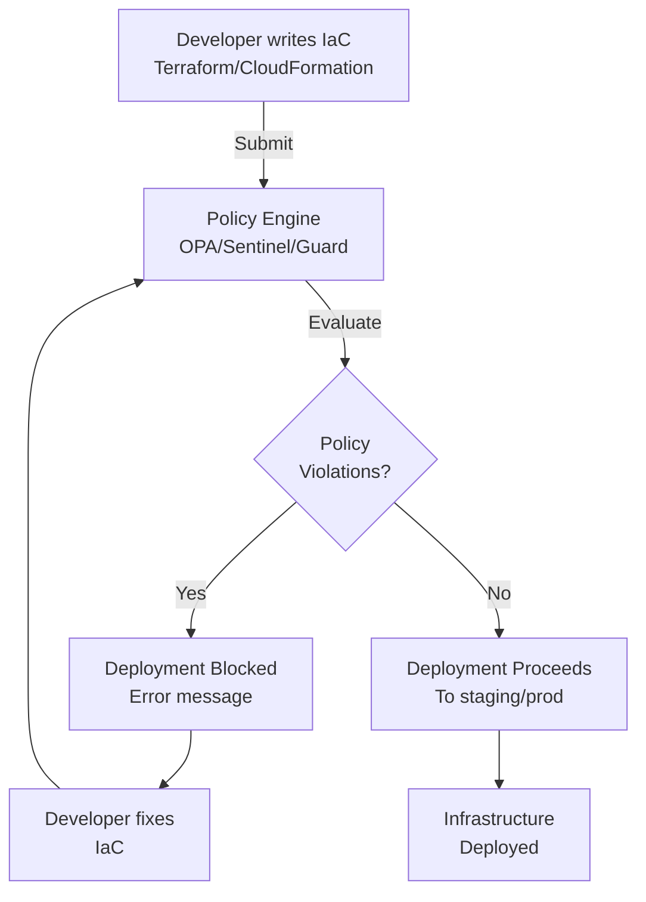

<Hero title="Policy as Code and Guardrails" subtitle="Enforce infrastructure standards and security policies automatically; prevent non-compliant deployments." imageAlt="Policy illustration" size="large" />

## TL;DR

Policy as Code transforms compliance and security governance from manual reviews into automated enforcement. Instead of asking teams to "follow best practices," you encode the rules—"all databases must be encrypted," "S3 buckets must have logging enabled," "resources must have cost-center tags"—and prevent non-compliant infrastructure from deploying. Tools like Open Policy Agent (OPA), HashiCorp Sentinel, and AWS CloudFormation Guard evaluate policies on every infrastructure change. Violations block deployment, shifting left security and compliance decisions into the development workflow rather than discovering problems during manual audits.

## Learning Objectives

- Understand the business value of policy-as-code enforcement
- Design clear, implementable infrastructure policies
- Choose and implement appropriate policy engines
- Balance strictness with developer productivity
- Document and communicate policy exceptions
- Audit and report on policy compliance

## Motivating Scenario

Your organization has grown to 50 engineers deploying infrastructure across AWS. Last month, a database was accidentally left unencrypted, exposing customer data. This month, a developer created an S3 bucket with public read access. You've hired security and compliance staff, but they can't review every infrastructure change—there are hundreds per week. Manual reviews are too slow and unreliable.

You need a system that automatically blocks dangerous configurations before they reach production, regardless of who wrote the code.

## Core Concepts

### What Are Infrastructure Policies?

Policies are rules that define how infrastructure must be configured. They answer questions:

- **Encryption**: Are databases encrypted at rest? Is data encrypted in transit?
- **Access Control**: Are public S3 buckets allowed? Which IAM roles can assume which service roles?
- **Tagging**: Do all resources have required tags (cost-center, owner, environment, compliance-level)?
- **Sizing**: Are oversized instances used (dev environments with prod-level resources waste money)?
- **Compliance**: Do configurations meet regulatory requirements (HIPAA, PCI-DSS, SOC2)?
- **Networking**: Are databases accessible only from private subnets? Are security groups properly restricted?

Policies operate at the infrastructure-as-code level, evaluating Terraform, CloudFormation, or Kubernetes manifests before they're applied.

### Policy Engines and Tools

<Figure caption="Policy as Code Evaluation Flow">

</Figure>

**Open Policy Agent (OPA)**: Language-agnostic policy engine using Rego. Evaluates any JSON/YAML data. Popular in Terraform, Kubernetes, and cloud-native ecosystems. Flexible but requires learning Rego.

**HashiCorp Sentinel**: Policy as Code for Terraform Enterprise. Integrates tightly with Terraform. Simpler than OPA for most use cases but Terraform-specific.

**AWS CloudFormation Guard**: Evaluates CloudFormation templates against rules. AWS-native but limited to CloudFormation.

**Kubernetes Admission Controllers**: Built-in policies for Kubernetes manifests. Examples: Pod Security Policy, NetworkPolicy validation.

**Custom Scripts**: Shell, Python, or Go scripts evaluating IaC before deployment. Simple but not standardized.

### Categories of Policies

Policies typically fall into these categories:

- **Security**: Encryption, public access, firewall rules, secrets not hardcoded
- **Compliance**: Resource naming conventions, audit logging enabled, data residency
- **Cost**: Prevent expensive instance types in dev, require auto-scaling policies
- **Operational**: Resource tags mandatory, backups configured, monitoring enabled
- **Governance**: Limit who can create certain resources, require approval for changes

### Guardrails vs. Gates

**Guardrails** are automatic, infrastructure-level controls that prevent bad configurations. They're passive—the infrastructure itself enforces the policy. Example: a policy that requires all S3 buckets to enable versioning. If you try to create one without it, the policy blocks the deployment.

**Gates** are checkpoints in the deployment process. A policy engine checks your code, reports findings, and blocks if violations exist. Developers can't proceed until the policy passes.

Both are Policy as Code; they just operate at different points.

## Practical Example

Let's implement a practical policy system using OPA and Terraform.

<Tabs>
<TabItem value="rego" label="OPA Policy (Rego)">
```rego
# policies/terraform.rego
# Enforce database encryption policy

package terraform

import future.keywords.contains
import future.keywords.if
import future.keywords.in

# Database encryption required
deny[msg] {
    resource := input.planned_values.root_module.resources[_]
    resource.type == "aws_rds_cluster"
    resource.values.storage_encrypted != true
    msg := sprintf(
        "RDS cluster '%s' must have storage_encrypted = true",
        [resource.address]
    )
}

# S3 bucket logging required
deny[msg] {
    resource := input.planned_values.root_module.resources[_]
    resource.type == "aws_s3_bucket"
    logging := resource.values.logging
    logging == null
    msg := sprintf(
        "S3 bucket '%s' must have logging configuration",
        [resource.address]
    )
}

# All resources must have required tags
deny[msg] {
    resource := input.planned_values.root_module.resources[_]
    required_tags := ["Environment", "CostCenter", "Owner"]
    tags := resource.values.tags
    missing := [tag |
        tag := required_tags[_]
        not tag in object.keys(tags)
    ]
    count(missing) > 0
    msg := sprintf(
        "Resource '%s' missing required tags: %s",
        [resource.address, missing]
    )
}

# Public S3 buckets not allowed
deny[msg] {
    resource := input.planned_values.root_module.resources[_]
    resource.type == "aws_s3_bucket_public_access_block"
    not resource.values.block_public_acls
    msg := sprintf(
        "S3 bucket '%s' must block public ACLs",
        [resource.address]
    )
}

# Database must not be publicly accessible
deny[msg] {
    resource := input.planned_values.root_module.resources[_]
    resource.type == "aws_rds_instance"
    resource.values.publicly_accessible == true
    msg := sprintf(
        "RDS instance '%s' cannot be publicly accessible",
        [resource.address]
    )
}
```
</TabItem>
<TabItem value="terraform" label="Terraform Code">
```hcl
# main.tf - Example infrastructure code that violates policies

terraform {
  required_version = ">= 1.0"
  required_providers {
    aws = {
      source  = "hashicorp/aws"
      version = "~> 5.0"
    }
  }
}

provider "aws" {
  region = var.aws_region
}

# VIOLATES POLICY: No encryption, no logging, missing tags
resource "aws_rds_cluster" "bad_example" {
  cluster_identifier      = "production-db"
  engine                  = "aurora-postgresql"
  master_username         = "admin"
  master_password         = "TempPassword123!"
  storage_encrypted       = false  # VIOLATION: Must be true

  # Missing required tags: Environment, CostCenter, Owner
}

# VIOLATES POLICY: Missing logging
resource "aws_s3_bucket" "bad_bucket" {
  bucket = "my-unlogged-bucket-${data.aws_caller_identity.current.account_id}"

  # VIOLATION: Missing logging configuration

  tags = {
    Environment = "prod"
    CostCenter  = "engineering"
    Owner       = "data-team"
  }
}

# CORRECT: Meets all policies
resource "aws_rds_cluster" "good_example" {
  cluster_identifier      = "production-db-secure"
  engine                  = "aurora-postgresql"
  master_username         = "admin"
  master_password         = random_password.db_password.result
  storage_encrypted       = true  # POLICY: Encrypted
  publicly_accessible     = false # POLICY: Not public

  tags = {
    Environment = "prod"
    CostCenter  = "engineering"
    Owner       = "data-team"
  }
}

# CORRECT: Has logging and blocks public access
resource "aws_s3_bucket" "good_bucket" {
  bucket = "my-logged-bucket-${data.aws_caller_identity.current.account_id}"

  tags = {
    Environment = "prod"
    CostCenter  = "engineering"
    Owner       = "data-team"
  }
}

resource "aws_s3_bucket_logging" "good_bucket_logging" {
  bucket = aws_s3_bucket.good_bucket.id

  target_bucket = aws_s3_bucket.log_bucket.id
  target_prefix = "access-logs/"
}

resource "aws_s3_bucket_public_access_block" "good_bucket_pab" {
  bucket = aws_s3_bucket.good_bucket.id

  block_public_acls       = true
  block_public_policy     = true
  ignore_public_acls      = true
  restrict_public_buckets = true
}

data "aws_caller_identity" "current" {}

variable "aws_region" {
  default = "us-east-1"
}

resource "random_password" "db_password" {
  length  = 32
  special = true
}

resource "aws_s3_bucket" "log_bucket" {
  bucket = "my-log-bucket-${data.aws_caller_identity.current.account_id}"

  tags = {
    Environment = "prod"
    CostCenter  = "engineering"
    Owner       = "data-team"
  }
}
```
</TabItem>
<TabItem value="sentinel" label="Sentinel Policy (HashiCorp)">
```hcl
# policies/require_encryption.sentinel
# Sentinel policy language for Terraform Enterprise

import "tfplan/v2" as tfplan

# Find all RDS instances
rds_instances = filter tfplan.resource_changes as address, rc {
  rc.type == "aws_rds_instance" and
  rc.mode == "managed"
}

# Ensure all RDS instances have encryption enabled
rds_encryption_valid = rule {
  all rds_instances as address, rc {
    rc.after.storage_encrypted is true
  }
}

# Find all S3 buckets
s3_buckets = filter tfplan.resource_changes as address, rc {
  rc.type == "aws_s3_bucket" and
  rc.mode == "managed"
}

# Ensure all S3 buckets are not public
s3_not_public = rule {
  all s3_buckets as address, rc {
    rc.after.publicly_readable is false and
    rc.after.publicly_writable is false
  }
}

# Main rules
main = rule {
  rds_encryption_valid and
  s3_not_public
}
```
</TabItem>
<TabItem value="github-actions" label="GitHub Actions Integration">
```yaml
# .github/workflows/policy-check.yml
name: Policy as Code Check

on:
  pull_request:
    paths:
      - 'terraform/**'
      - '.github/workflows/policy-check.yml'

jobs:
  terraform-plan:
    runs-on: ubuntu-latest
    steps:
      - uses: actions/checkout@v3

      - uses: hashicorp/setup-terraform@v2
        with:
          terraform_version: 1.5.0

      - name: Terraform Format Check
        run: terraform fmt -check -recursive terraform/

      - name: Terraform Validate
        run: |
          cd terraform
          terraform init -backend=false
          terraform validate

      - name: Terraform Plan
        run: |
          cd terraform
          terraform plan -out=tfplan.json
          terraform show -json tfplan.json > tfplan-pretty.json

      - name: Install OPA
        run: |
          curl -L -o opa https://openpolicyagent.org/downloads/latest/opa_linux_amd64
          chmod +x opa

      - name: Run Policy Checks
        run: |
          ./opa eval -d policies/terraform.rego \
            -i terraform/tfplan-pretty.json \
            'data.terraform.deny' || exit 1

      - name: Comment on PR
        if: failure()
        uses: actions/github-script@v6
        with:
          script: |
            github.rest.issues.createComment({
              issue_number: context.issue.number,
              owner: context.repo.owner,
              repo: context.repo.repo,
              body: 'Policy checks failed. Review the logs above.'
            })
```
</TabItem>
</Tabs>

## When to Use / When Not to Use

<Vs highlight={[1]} items={[
{
    label: "Use When:",
    points: [
      "Security and compliance are non-negotiable (financial services, healthcare, government)",
      "You have regulatory requirements (SOC2, HIPAA, PCI-DSS) that mandate certain configurations",
      "You've had security incidents from misconfigured infrastructure",
      "Your organization has grown large enough that manual reviews don't scale",
      "You need to enforce consistent tagging and cost governance",
      "Developers frequently deploy without following organizational standards"
    ],
    highlightTone: "positive"
  },
{
    label: "Avoid When:",
    points: [
      "Your organization is very small (< 5 engineers) and policies change constantly",
      "You're prototyping or experimenting (policies should block after validated learning)",
      "Your infrastructure is simple and low-risk",
      "You lack the expertise to write and maintain policies",
      "Your policies change so frequently they become maintenance burden rather than protection"
    ],
    highlightTone: "warning"
  }
]} />

## Patterns and Pitfalls

<Showcase title="Patterns and Pitfalls" sections={[
  {
    label: "Policy Lifecycle Management",
    body: "Treat policies like code: review them, test them, version control them. When a policy needs to change, socialize the change with teams first. Don't silently change policies and break builds. Use deprecation timelines: announce a policy change 2 weeks in advance, giving teams time to fix violations before the policy becomes blocking."
  },
  {
    label: "Exception Handling",
    body: "Policies will have exceptions. Don't hardcode exceptions in policy code. Instead, maintain an exceptions registry: document why the exception exists, who approved it, and when it expires. Review exceptions quarterly. Example: You might allow a legacy database to remain unencrypted because the cost to migrate is high, but set a 6-month deadline for migration."
  },
  {
    label: "Policy Granularity",
    body: "Start with high-value, low-friction policies (encryption, tagging). Avoid overly strict policies that make common development tasks impossible. If teams routinely violate a policy, it's either poorly designed or too strict. Adjust rather than enforce by punishment."
  },
  {
    label: "Developer Communication",
    body: "When a policy blocks a deployment, the error message must explain why, not just what's wrong. Bad: 'RDS instance fails policy check.' Good: 'RDS instance must have storage_encrypted = true to comply with HIPAA. See https://wiki.example.com/policies/encryption for details.' Clear messages reduce frustration and support tickets."
  },
  {
    label: "Overly Centralized Policies",
    body: "Anti-pattern: Security team writes all policies in isolation and teams are forced to comply. This leads to resentment and circumvention. Better: Security team defines high-level policy goals, teams help implement enforceable policies. Make policies collaborative."
  },
  {
    label: "Measuring Compliance",
    body: "Don't just block deployments; measure compliance continuously. What percentage of infrastructure is compliant? Which policies are most violated? Which teams struggle? Use these metrics to identify systemic problems and prioritize policy improvements."
  }
]} />

## Design Review Checklist

<Checklist items={[
  "Are policy requirements documented and accessible to all engineers?",
  "Do policies exist for security-critical concerns (encryption, public access, secrets)?",
  "Are policy violations blocking deployment automatically?",
  "Do policy error messages explain why and how to fix violations?",
  "Is there a documented process for requesting policy exceptions?",
  "Are exceptions tracked and reviewed regularly (quarterly)?",
  "Do teams understand which policies apply to their infrastructure?",
  "Are policies versioned and reviewed before changes?",
  "Can compliance be measured and reported on?",
  "Are new policies tested in non-blocking mode before enforcement?",
  "Do policies have owners responsible for maintenance?",
  "Is there a feedback mechanism for teams to suggest policy improvements?"
]} />

## Self-Check Questions

1. **Policy Scope**: What are the 5 most important policies for your organization? (Hint: Start with security and compliance.)
2. **Exception Management**: How do you track infrastructure that doesn't comply with policies? Do you have a process to resolve exceptions?
3. **Communication**: Can a developer understand why a policy blocked their deployment within 2 minutes?
4. **Measurement**: Can you report how much of your infrastructure is policy-compliant?
5. **Governance**: Who owns each policy? Who can approve exceptions?

## Next Steps

1. **Identify High-Value Policies**: List the top security and compliance risks in your infrastructure. Start with those.
2. **Choose a Policy Engine**: Evaluate OPA, Sentinel, or CloudFormation Guard based on your IaC tooling.
3. **Write Pilot Policies**: Start with 3-5 policies that address real risks. Test in non-blocking mode.
4. **Set Up Reporting**: Implement compliance dashboards so teams can see their status.
5. **Iterate with Teams**: Get feedback from developers and refine policies based on their input.
6. **Document Exceptions**: Create a process for exceptions with clear timelines for resolution.

## References

1. <a href="https://www.styra.com/opa/" target="_blank" rel="nofollow noopener noreferrer">Styra OPA - Open Policy Agent ↗️</a>
2. <a href="https://www.hashicorp.com/sentinel" target="_blank" rel="nofollow noopener noreferrer">HashiCorp Sentinel ↗️</a>
3. <a href="https://docs.aws.amazon.com/cfn-guard/latest/ug/what-is-cfn-guard.html" target="_blank" rel="nofollow noopener noreferrer">AWS CloudFormation Guard ↗️</a>
4. Humble, J., & Farley, D. (2010). Continuous Delivery. Addison-Wesley.
5. <a href="https://cheatsheetseries.owasp.org/" target="_blank" rel="nofollow noopener noreferrer">OWASP Cheat Sheets ↗️</a>