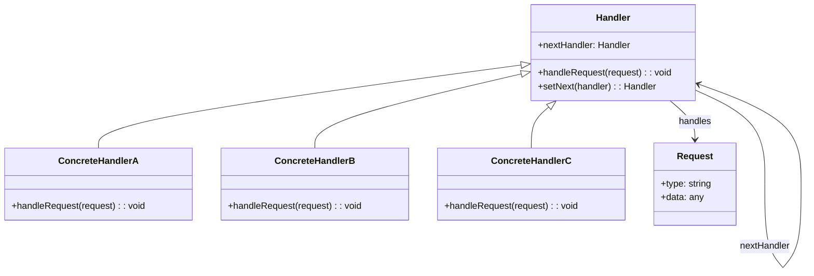

<Hero title="Chain of Responsibility Pattern" subtitle="Route requests through a chain of handlers, each processing or delegating" imageAlt="Chain of Responsibility pattern illustration" size="large" />

## TL;DR

Chain of Responsibility decouples request senders from handlers by passing requests along a dynamic chain. Each handler decides whether to process the request or pass it to the next handler. Use when multiple objects might handle a request, the handler is unknown at compile time, or you want to avoid hard-coded dependencies.

## Learning Objectives

- You will understand when requests should be routed through a chain of handlers.
- You will identify the structure of handler chains and how handlers interconnect.
- You will implement handlers that process or delegate requests appropriately.
- You will design chains that are flexible and maintainable without tight coupling.

## Motivating Scenario

A web application receives HTTP requests. Different middleware components need to process them: authentication, logging, compression, request validation. Adding a new middleware shouldn't require modifying existing code. Chain of Responsibility lets each middleware check the request, process it, and pass it to the next handler—building a clean pipeline without knowing which handlers follow.

## Core Concepts

**Chain of Responsibility** organizes handlers in a sequence where each can process a request or pass it along. Senders don't know which handler will ultimately process the request—they just submit it to the chain.

Key elements:
- **Handler**: interface defining the method to handle requests and a reference to the next handler
- **ConcreteHandler**: implements the handler interface, processing requests or delegating
- **Client**: creates the chain and sends requests to the first handler

<Figure caption="Chain of Responsibility structure">

</Figure>

## Practical Example

Consider a support ticket system where requests are routed to handlers with increasing authority.

<Tabs>
<TabItem value="python" label="Python" default>
```python showLineNumbers title="chain_of_responsibility.py"
from abc import ABC, abstractmethod
from typing import Optional

class SupportRequest:
    def __init__(self, ticket_id: str, priority: int, issue: str):
        self.ticket_id = ticket_id
        self.priority = priority
        self.issue = issue
        self.resolved = False

class Handler(ABC):
    def __init__(self):
        self._next_handler: Optional[Handler] = None

    def set_next(self, handler: 'Handler') -> 'Handler':
        self._next_handler = handler
        return handler

    @abstractmethod
    def handle(self, request: SupportRequest) -> None:
        pass

class Level1Support(Handler):
    def handle(self, request: SupportRequest) -> None:
        if request.priority <= 2:
            print(f"L1 resolved ticket {request.ticket_id}: {request.issue}")
            request.resolved = True
        elif self._next_handler:
            self._next_handler.handle(request)

class Level2Support(Handler):
    def handle(self, request: SupportRequest) -> None:
        if request.priority <= 4:
            print(f"L2 resolved ticket {request.ticket_id}: {request.issue}")
            request.resolved = True
        elif self._next_handler:
            self._next_handler.handle(request)

class Level3Support(Handler):
    def handle(self, request: SupportRequest) -> None:
        print(f"L3 escalated ticket {request.ticket_id}: {request.issue}")
        request.resolved = True

# Usage
level1 = Level1Support()
level2 = Level2Support()
level3 = Level3Support()

level1.set_next(level2).set_next(level3)

requests = [
    SupportRequest("T001", 1, "Password reset"),
    SupportRequest("T002", 3, "Database performance issue"),
    SupportRequest("T003", 5, "System architecture redesign"),
]

for req in requests:
    level1.handle(req)
```
</TabItem>
<TabItem value="go" label="Go">
```go showLineNumbers title="chain_of_responsibility.go"
package main

import "fmt"

type SupportRequest struct {
    TicketID string
    Priority int
    Issue    string
    Resolved bool
}

type Handler interface {
    Handle(request *SupportRequest)
    SetNext(handler Handler) Handler
}

type BaseHandler struct {
    nextHandler Handler
}

func (b *BaseHandler) SetNext(handler Handler) Handler {
    b.nextHandler = handler
    return handler
}

type Level1Support struct {
    BaseHandler
}

func (l *Level1Support) Handle(request *SupportRequest) {
    if request.Priority <= 2 {
        fmt.Printf("L1 resolved ticket %s: %s\n", request.TicketID, request.Issue)
        request.Resolved = true
    } else if l.nextHandler != nil {
        l.nextHandler.Handle(request)
    }
}

type Level2Support struct {
    BaseHandler
}

func (l *Level2Support) Handle(request *SupportRequest) {
    if request.Priority <= 4 {
        fmt.Printf("L2 resolved ticket %s: %s\n", request.TicketID, request.Issue)
        request.Resolved = true
    } else if l.nextHandler != nil {
        l.nextHandler.Handle(request)
    }
}

type Level3Support struct {
    BaseHandler
}

func (l *Level3Support) Handle(request *SupportRequest) {
    fmt.Printf("L3 escalated ticket %s: %s\n", request.TicketID, request.Issue)
    request.Resolved = true
}

func main() {
    level1 := &Level1Support{}
    level2 := &Level2Support{}
    level3 := &Level3Support{}

    level1.SetNext(level2).SetNext(level3)

    requests := []*SupportRequest{
        {TicketID: "T001", Priority: 1, Issue: "Password reset"},
        {TicketID: "T002", Priority: 3, Issue: "Database performance issue"},
        {TicketID: "T003", Priority: 5, Issue: "System architecture redesign"},
    }

    for _, req := range requests {
        level1.Handle(req)
    }
}
```
</TabItem>
<TabItem value="nodejs" label="Node.js">
```javascript showLineNumbers title="chain-of-responsibility.js"
class SupportRequest {
    constructor(ticketId, priority, issue) {
        this.ticketId = ticketId;
        this.priority = priority;
        this.issue = issue;
        this.resolved = false;
    }
}

class Handler {
    setNext(handler) {
        this.nextHandler = handler;
        return handler;
    }

    handle(request) {
        throw new Error('handle() must be implemented');
    }
}

class Level1Support extends Handler {
    handle(request) {
        if (request.priority <= 2) {
            console.log(`L1 resolved ticket ${request.ticketId}: ${request.issue}`);
            request.resolved = true;
        } else if (this.nextHandler) {
            this.nextHandler.handle(request);
        }
    }
}

class Level2Support extends Handler {
    handle(request) {
        if (request.priority <= 4) {
            console.log(`L2 resolved ticket ${request.ticketId}: ${request.issue}`);
            request.resolved = true;
        } else if (this.nextHandler) {
            this.nextHandler.handle(request);
        }
    }
}

class Level3Support extends Handler {
    handle(request) {
        console.log(`L3 escalated ticket ${request.ticketId}: ${request.issue}`);
        request.resolved = true;
    }
}

// Usage
const level1 = new Level1Support();
const level2 = new Level2Support();
const level3 = new Level3Support();

level1.setNext(level2).setNext(level3);

const requests = [
    new SupportRequest('T001', 1, 'Password reset'),
    new SupportRequest('T002', 3, 'Database performance issue'),
    new SupportRequest('T003', 5, 'System architecture redesign'),
];

requests.forEach(req => level1.handle(req));
```
</TabItem>
</Tabs>

## When to Use / When Not to Use

<Vs highlight={[1]} items={[
{
        label: "Use Chain of Responsibility",
        points: ["Multiple handlers might process a single request", "Handlers are determined dynamically at runtime", "You want to add or remove handlers without modifying client code", "Processing pipeline: middleware, event handling, request routing", "Handler responsibility is unclear or context-dependent"],
    highlightTone: "positive"
  },
{
        label: "Avoid Chain of Responsibility",
        points: ["Single, fixed handler always processes requests", "Handler mapping is known and stable at compile time", "Performance is critical and you want direct method calls", "Chain depth might be extreme, causing latency", "You need synchronous request/response patterns only"],
    highlightTone: "warning"
  }
]} />

## Patterns and Pitfalls

<Showcase  sections={[{
            title: "Fluent Chain Building",
            description: "Return the next handler from setNext() to enable fluent syntax: handler1.setNext(handler2).setNext(handler3).",
            codeUrl: "#practical-example"
        }, {
            title: "Terminating Handlers",
            description: "Include a default or terminal handler that always processes requests, preventing unhandled requests from being silently ignored.",
            codeUrl: "#practical-example"
        }, {
            title: "Request Mutation",
            description: "Be careful when handlers modify the request—ensure modifications don't conflict with expectations of downstream handlers.",
            codeUrl: "#practical-example"
        }, {
            title: "Chain Length Management",
            description: "Monitor chain depth to avoid performance degradation. Long chains increase latency as requests traverse multiple handlers.",
            codeUrl: "#practical-example"
        }]}
/>

## Design Review Checklist

<Checklist
    items={[
        "Is the chain of handlers built and configured correctly before processing requests?",
        "Does each handler have a clear, well-defined responsibility?",
        "Are unhandled requests properly managed (logged, rejected, or escalated)?",
        "Can handlers be dynamically added, removed, or reordered without breaking the system?",
        "Is the request state protected from unexpected mutations by handlers?",
        "Do handlers avoid infinite loops or circular dependencies?",
        "Is the chain depth monitored to prevent excessive latency?"
    ]}
/>

## Self-Check

1. **How does Chain of Responsibility differ from a simple if-else cascade for routing requests?** The pattern provides dynamic, runtime configuration of handlers without coupling senders to specific handler types.

2. **What happens if no handler in the chain processes the request?** Design chains with a default handler, or ensure requests are logged or rejected safely.

3. **Can handlers modify the request and pass it along?** Yes—handlers can enrich or transform requests, but this must be coordinated to avoid conflicts.

:::info One Takeaway
Chain of Responsibility transforms rigid, compile-time request routing into flexible, runtime-configurable pipelines. Use it when handlers are uncertain or dynamic—especially in middleware, event processing, and hierarchical escalation systems.

:::

## Next Steps

- [Explore the Mediator pattern for coordinating multiple objects](/docs/design-patterns/behavioral/mediator)
- [Study the Observer pattern for event-driven architectures](/docs/design-patterns/behavioral/observer-pub-sub)
- [Understand the Command pattern for encapsulating requests as objects](/docs/design-patterns/behavioral/command)

## References

- Gang of Four, "Design Patterns: Elements of Reusable Object-Oriented Software"
- Refactoring Guru's [Chain of Responsibility](https://refactoring.guru/design-patterns/chain-of-responsibility) ↗️
- Martin Fowler on [Event Sourcing](https://martinfowler.com/eaaDev/EventSourcing.html) ↗️