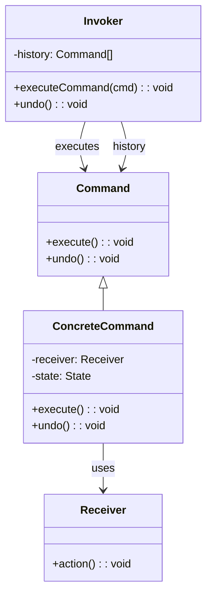

<Hero title="Command Pattern" subtitle="Encapsulate requests as objects to queue, log, and undo operations" imageAlt="Command pattern illustration" size="large" />

## TL;DR

Command encapsulates a request as an object, decoupling the sender from the receiver. This enables queuing commands, logging operations, supporting undo/redo, and composing complex sequences. Use it when you need to parameterize objects with actions, queue requests, or provide undo functionality.

## Learning Objectives

- You will understand how commands decouple request senders from executors.
- You will identify when to encapsulate operations as command objects.
- You will implement commands with execute and optional undo behavior.
- You will compose complex operations from simple command objects.

## Motivating Scenario

A text editor needs undo/redo functionality. Operations like "insert text," "delete," "format bold" must be reversible. Instead of scattering undo logic throughout the editor, wrap each operation as a Command object. Commands execute actions forward and store state for reversal. A command history tracks all operations, enabling step-by-step undo and redo without entangling undo logic with business logic.

## Core Concepts

**Command** encapsulates a request as an object, capturing the action, receiver, and parameters. This enables storing, queueing, and undoing commands without tight coupling.

Key elements:
- **Command**: interface defining execute and optionally undo methods
- **ConcreteCommand**: implements the command interface, storing receiver and parameters
- **Receiver**: object that performs the actual work
- **Invoker**: executes commands and manages their history
- **Client**: creates and configures commands

<Figure caption="Command structure">

</Figure>

## Practical Example

Consider a document editor with undo/redo using commands.

<Tabs>
<TabItem value="python" label="Python" default>
```python showLineNumbers title="command.py"
from abc import ABC, abstractmethod

class Document:
    def __init__(self):
        self.content = ""

    def insert(self, text: str, position: int):
        self.content = self.content[:position] + text + self.content[position:]

    def delete(self, position: int, length: int):
        self.content = self.content[:position] + self.content[position+length:]

class Command(ABC):
    @abstractmethod
    def execute(self) -> None:
        pass

    @abstractmethod
    def undo(self) -> None:
        pass

class InsertCommand(Command):
    def __init__(self, document: Document, text: str, position: int):
        self.document = document
        self.text = text
        self.position = position

    def execute(self) -> None:
        self.document.insert(self.text, self.position)

    def undo(self) -> None:
        self.document.delete(self.position, len(self.text))

class DeleteCommand(Command):
    def __init__(self, document: Document, position: int, length: int):
        self.document = document
        self.position = position
        self.length = length
        self.deleted_text = None

    def execute(self) -> None:
        self.deleted_text = self.document.content[self.position:self.position+self.length]
        self.document.delete(self.position, self.length)

    def undo(self) -> None:
        if self.deleted_text:
            self.document.insert(self.deleted_text, self.position)

class DocumentEditor:
    def __init__(self, document: Document):
        self.document = document
        self.history = []
        self.redo_stack = []

    def execute(self, command: Command):
        command.execute()
        self.history.append(command)
        self.redo_stack.clear()

    def undo(self):
        if self.history:
            cmd = self.history.pop()
            cmd.undo()
            self.redo_stack.append(cmd)

    def redo(self):
        if self.redo_stack:
            cmd = self.redo_stack.pop()
            cmd.execute()
            self.history.append(cmd)

# Usage
doc = Document()
editor = DocumentEditor(doc)

editor.execute(InsertCommand(doc, "Hello ", 0))
editor.execute(InsertCommand(doc, "World!", 6))
print(f"Content: {doc.content}")  # Hello World!

editor.undo()
print(f"After undo: {doc.content}")  # Hello

editor.redo()
print(f"After redo: {doc.content}")  # Hello World!
```
</TabItem>
<TabItem value="go" label="Go">
```go showLineNumbers title="command.go"
package main

import "fmt"

type Document struct {
    Content string
}

func (d *Document) Insert(text string, position int) {
    if position > len(d.Content) {
        position = len(d.Content)
    }
    d.Content = d.Content[:position] + text + d.Content[position:]
}

func (d *Document) Delete(position int, length int) {
    if position+length > len(d.Content) {
        length = len(d.Content) - position
    }
    d.Content = d.Content[:position] + d.Content[position+length:]
}

type Command interface {
    Execute()
    Undo()
}

type InsertCommand struct {
    Document *Document
    Text     string
    Position int
}

func (ic *InsertCommand) Execute() {
    ic.Document.Insert(ic.Text, ic.Position)
}

func (ic *InsertCommand) Undo() {
    ic.Document.Delete(ic.Position, len(ic.Text))
}

type DeleteCommand struct {
    Document    *Document
    Position    int
    Length      int
    DeletedText string
}

func (dc *DeleteCommand) Execute() {
    dc.DeletedText = dc.Document.Content[dc.Position : dc.Position+dc.Length]
    dc.Document.Delete(dc.Position, dc.Length)
}

func (dc *DeleteCommand) Undo() {
    dc.Document.Insert(dc.DeletedText, dc.Position)
}

type DocumentEditor struct {
    Document  *Document
    History   []Command
    RedoStack []Command
}

func (de *DocumentEditor) Execute(cmd Command) {
    cmd.Execute()
    de.History = append(de.History, cmd)
    de.RedoStack = []Command{}
}

func (de *DocumentEditor) Undo() {
    if len(de.History) > 0 {
        cmd := de.History[len(de.History)-1]
        de.History = de.History[:len(de.History)-1]
        cmd.Undo()
        de.RedoStack = append(de.RedoStack, cmd)
    }
}

func (de *DocumentEditor) Redo() {
    if len(de.RedoStack) > 0 {
        cmd := de.RedoStack[len(de.RedoStack)-1]
        de.RedoStack = de.RedoStack[:len(de.RedoStack)-1]
        cmd.Execute()
        de.History = append(de.History, cmd)
    }
}

func main() {
    doc := &Document{Content: ""}
    editor := &DocumentEditor{Document: doc}

    editor.Execute(&InsertCommand{Document: doc, Text: "Hello ", Position: 0})
    editor.Execute(&InsertCommand{Document: doc, Text: "World!", Position: 6})
    fmt.Printf("Content: %s\n", doc.Content)

    editor.Undo()
    fmt.Printf("After undo: %s\n", doc.Content)

    editor.Redo()
    fmt.Printf("After redo: %s\n", doc.Content)
}
```
</TabItem>
<TabItem value="nodejs" label="Node.js">
```javascript showLineNumbers title="command.js"
class Document {
    constructor() {
        this.content = '';
    }

    insert(text, position) {
        this.content = this.content.slice(0, position) + text + this.content.slice(position);
    }

    delete(position, length) {
        this.content = this.content.slice(0, position) + this.content.slice(position + length);
    }
}

class Command {
    execute() {
        throw new Error('execute() must be implemented');
    }

    undo() {
        throw new Error('undo() must be implemented');
    }
}

class InsertCommand extends Command {
    constructor(document, text, position) {
        super();
        this.document = document;
        this.text = text;
        this.position = position;
    }

    execute() {
        this.document.insert(this.text, this.position);
    }

    undo() {
        this.document.delete(this.position, this.text.length);
    }
}

class DeleteCommand extends Command {
    constructor(document, position, length) {
        super();
        this.document = document;
        this.position = position;
        this.length = length;
        this.deletedText = null;
    }

    execute() {
        this.deletedText = this.document.content.slice(this.position, this.position + this.length);
        this.document.delete(this.position, this.length);
    }

    undo() {
        if (this.deletedText) {
            this.document.insert(this.deletedText, this.position);
        }
    }
}

class DocumentEditor {
    constructor(document) {
        this.document = document;
        this.history = [];
        this.redoStack = [];
    }

    execute(command) {
        command.execute();
        this.history.push(command);
        this.redoStack = [];
    }

    undo() {
        if (this.history.length > 0) {
            const cmd = this.history.pop();
            cmd.undo();
            this.redoStack.push(cmd);
        }
    }

    redo() {
        if (this.redoStack.length > 0) {
            const cmd = this.redoStack.pop();
            cmd.execute();
            this.history.push(cmd);
        }
    }
}

// Usage
const doc = new Document();
const editor = new DocumentEditor(doc);

editor.execute(new InsertCommand(doc, 'Hello ', 0));
editor.execute(new InsertCommand(doc, 'World!', 6));
console.log(`Content: ${doc.content}`);

editor.undo();
console.log(`After undo: ${doc.content}`);

editor.redo();
console.log(`After redo: ${doc.content}`);
```
</TabItem>
</Tabs>

## When to Use / When Not to Use

<Vs highlight={[1]} items={[
{
        label: "Use Command",
        points: ["You need to queue, schedule, or defer operations", "Undo/redo functionality is required", "You need transaction-like atomic operations", "Logging and auditing of operations is important", "You want to compose complex operations from simpler ones"],
    highlightTone: "positive"
  },
{
        label: "Avoid Command",
        points: ["Simple direct method calls are sufficient", "No undo/redo or operation history needed", "Performance is critical and indirection adds overhead", "Commands are trivial with single parameters", "Client needs immediate feedback from execution"],
    highlightTone: "warning"
  }
]} />

## Patterns and Pitfalls

<Showcase  sections={[{
            title: "Macro Commands",
            description: "Compose commands within commands to create complex operations from simpler ones, enabling undo of entire sequences.",
            codeUrl: "#practical-example"
        }, {
            title: "Command History",
            description: "Maintain separate stacks for undo and redo to enable stepping backward and forward through operation history.",
            codeUrl: "#practical-example"
        }, {
            title: "State Preservation",
            description: "Store state in commands at execution time, not retrieval time, to correctly undo operations whose context may have changed.",
            codeUrl: "#practical-example"
        }, {
            title: "Command Serialization",
            description: "Make commands serializable to persist operations for recovery, replay, or distributed execution.",
            codeUrl: "#practical-example"
        }]}
/>

## Design Review Checklist

<Checklist
    items={[
        "Does each command encapsulate a single, well-defined action?",
        "Are undo and execute operations correctly inverse to each other?",
        "Is command state captured at execution time, not reference time?",
        "Can commands be safely queued and executed asynchronously?",
        "Is the invoker's history management thread-safe if needed?",
        "Do macro commands correctly compose and decompose into atomic commands?",
        "Are unexecuted commands handled to avoid orphaned redo stacks?"
    ]}
/>

## Self-Check

1. **How does Command enable undo/redo without scattering reversal logic?** Commands encapsulate reversal as the undo() method, keeping forward and reverse logic together.

2. **What's the difference between a command and a simple callback function?** Commands are objects that encapsulate both action and state, enabling queuing, logging, and composition beyond simple callbacks.

3. **Can commands be composed into larger commands?** Yes—macro commands can contain and execute other commands, enabling complex operations to be undone atomically.

:::info One Takeaway
Command transforms methods into first-class objects, enabling queuing, logging, undo/redo, and composable operations. Use it whenever you need to parameterize, defer, or reverse computations.

:::

## Next Steps

- [Explore the Template Method pattern for varying algorithm steps](/docs/design-patterns/behavioral/template-method)
- [Study the Memento pattern for state capture and restoration](/docs/design-patterns/behavioral/memento)
- [Learn the Invoker role in coordinating command execution](/docs/design-patterns/behavioral/chain-of-responsibility)

## References

- Gang of Four, "Design Patterns: Elements of Reusable Object-Oriented Software"
- Refactoring Guru's [Command](https://refactoring.guru/design-patterns/command) ↗️
- Martin Fowler on [Undo/Redo Architecture](https://martinfowler.com/articles/command-pattern.html) ↗️