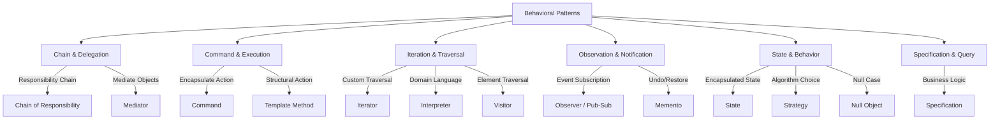

import { useCurrentSidebarCategory } from "@docusaurus/theme-common";

# Behavioral Design Patterns

Behavioral patterns define how objects interact and distribute responsibilities. They establish communication protocols, delegate work, and coordinate object behavior—addressing the "what" and "how" of object interaction rather than object structure.

## Pattern Family Overview

<Figure caption="Behavioral Patterns Classification">

</Figure>

## Categories at a Glance

### Chain & Delegation
Distribute responsibility across a chain of handlers or through a mediator coordinating multiple objects.

### Command & Execution
Encapsulate actions as objects and manage their execution, undo, and sequencing.

### Iteration & Traversal
Define ways to access elements sequentially or traverse complex structures without exposing their implementation.

### Observation & Notification
Establish loose coupling through subscriptions, state capture, and event propagation.

### State & Behavior
Vary object behavior based on internal state or external strategy without conditional logic.

### Specification & Query
Encapsulate business rules and selection criteria as queryable objects.
---

<DocCardList items={useCurrentSidebarCategory().items} />
