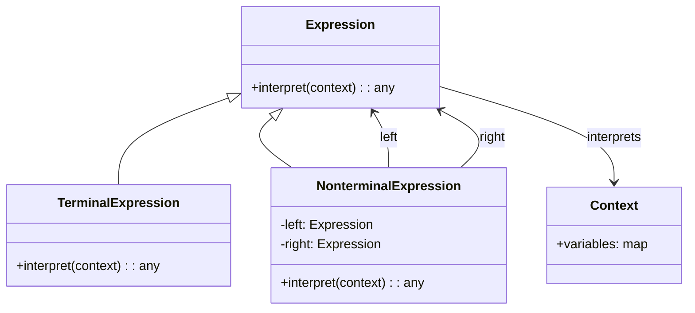

<Hero title="Interpreter Pattern" subtitle="Define a grammar and create interpreters to parse domain-specific languages" imageAlt="Interpreter pattern illustration" size="large" />

## TL;DR

Interpreter defines a grammar for a domain-specific language and implements an interpreter that processes instances of that language. Use it when you have a simple language to parse and execute, recurring patterns of expressions, or need to provide configurable rule processing without hardcoding logic.

## Learning Objectives

- You will understand abstract syntax trees (AST) and grammar representation.
- You will design expression classes that form a language grammar.
- You will implement interpret() methods that execute language expressions.
- You will build parsers that transform input into abstract syntax trees.

## Motivating Scenario

A business rules engine needs to evaluate expressions like "IF age > 18 AND status == 'active' THEN approve". Rather than hardcoding each rule, define a grammar for rule expressions. Parse rule strings into an AST of expression objects. Each expression knows how to interpret itself in context, composing results from sub-expressions. Add new rule types without modifying core interpretation logic.

## Core Concepts

**Interpreter** maps domain language constructs to expression classes. Each expression knows how to interpret itself given a context. Complex expressions compose simpler ones, building an abstract syntax tree.

Key elements:
- **AbstractExpression**: interface defining the interpret method
- **TerminalExpression**: represents literal values or leaf nodes
- **NonterminalExpression**: represents operators, composing sub-expressions
- **Context**: contains shared data needed during interpretation

<Figure caption="Interpreter structure">

</Figure>

## Practical Example

Consider a calculator that parses and evaluates arithmetic expressions.

<Tabs>
<TabItem value="python" label="Python" default>
```python showLineNumbers title="interpreter.py"
from abc import ABC, abstractmethod

class Expression(ABC):
    @abstractmethod
    def interpret(self, context):
        pass

class Number(Expression):
    def __init__(self, value: int):
        self.value = value

    def interpret(self, context):
        return self.value

class Variable(Expression):
    def __init__(self, name: str):
        self.name = name

    def interpret(self, context):
        return context.get(self.name, 0)

class Add(Expression):
    def __init__(self, left: Expression, right: Expression):
        self.left = left
        self.right = right

    def interpret(self, context):
        return self.left.interpret(context) + self.right.interpret(context)

class Subtract(Expression):
    def __init__(self, left: Expression, right: Expression):
        self.left = left
        self.right = right

    def interpret(self, context):
        return self.left.interpret(context) - self.right.interpret(context)

class Multiply(Expression):
    def __init__(self, left: Expression, right: Expression):
        self.left = left
        self.right = right

    def interpret(self, context):
        return self.left.interpret(context) * self.right.interpret(context)

# Usage
context = {'x': 10, 'y': 5}
expr = Add(Variable('x'), Multiply(Number(2), Variable('y')))
result = expr.interpret(context)  # 10 + (2 * 5) = 20
print(f"Result: {result}")
```
</TabItem>
<TabItem value="go" label="Go">
```go showLineNumbers title="interpreter.go"
package main

import "fmt"

type Expression interface {
    Interpret(context map[string]int) int
}

type Number struct {
    Value int
}

func (n *Number) Interpret(context map[string]int) int {
    return n.Value
}

type Variable struct {
    Name string
}

func (v *Variable) Interpret(context map[string]int) int {
    if val, ok := context[v.Name]; ok {
        return val
    }
    return 0
}

type Add struct {
    Left  Expression
    Right Expression
}

func (a *Add) Interpret(context map[string]int) int {
    return a.Left.Interpret(context) + a.Right.Interpret(context)
}

type Multiply struct {
    Left  Expression
    Right Expression
}

func (m *Multiply) Interpret(context map[string]int) int {
    return m.Left.Interpret(context) * m.Right.Interpret(context)
}

func main() {
    context := map[string]int{"x": 10, "y": 5}
    expr := &Add{
        Left: &Variable{Name: "x"},
        Right: &Multiply{
            Left:  &Number{Value: 2},
            Right: &Variable{Name: "y"},
        },
    }
    result := expr.Interpret(context)
    fmt.Printf("Result: %d\n", result)
}
```
</TabItem>
<TabItem value="nodejs" label="Node.js">
```javascript showLineNumbers title="interpreter.js"
class Expression {
    interpret(context) {
        throw new Error('interpret() must be implemented');
    }
}

class Number extends Expression {
    constructor(value) {
        super();
        this.value = value;
    }

    interpret(context) {
        return this.value;
    }
}

class Variable extends Expression {
    constructor(name) {
        super();
        this.name = name;
    }

    interpret(context) {
        return context[this.name] || 0;
    }
}

class Add extends Expression {
    constructor(left, right) {
        super();
        this.left = left;
        this.right = right;
    }

    interpret(context) {
        return this.left.interpret(context) + this.right.interpret(context);
    }
}

class Multiply extends Expression {
    constructor(left, right) {
        super();
        this.left = left;
        this.right = right;
    }

    interpret(context) {
        return this.left.interpret(context) * this.right.interpret(context);
    }
}

// Usage
const context = { x: 10, y: 5 };
const expr = new Add(
    new Variable('x'),
    new Multiply(
        new Number(2),
        new Variable('y')
    )
);
const result = expr.interpret(context);
console.log(`Result: ${result}`);
```
</TabItem>
</Tabs>

## When to Use / When Not to Use

<Vs highlight={[1]} items={[
{
        label: "Use Interpreter",
        points: ["You need to process domain-specific languages or expressions", "Grammar is simple and stable", "Patterns of expressions recur frequently", "You want to avoid hardcoding business rules", "Rule execution traces or debugging is important"],
    highlightTone: "positive"
  },
{
        label: "Avoid Interpreter",
        points: ["Grammar is very complex requiring parser tools", "Performance is critical for large input", "Language is being actively evolved with new constructs", "Standard parsing libraries would be more suitable", "One-off rule processing without reusability"],
    highlightTone: "warning"
  }
]} />

## Patterns and Pitfalls

<Showcase  sections={[{
            title: "Parser Construction",
            description: "Build parsers that transform strings into expression trees. Use recursive descent or other techniques to map grammar rules to parser functions.",
            codeUrl: "#practical-example"
        }, {
            title: "Context Management",
            description: "Pass context through interpret() to provide shared state. Avoid global mutable state to enable parallel evaluation.",
            codeUrl: "#practical-example"
        }, {
            title: "Expression Composition",
            description: "Design terminal and non-terminal expressions so complex rules compose naturally from simpler sub-expressions.",
            codeUrl: "#practical-example"
        }, {
            title: "Error Handling",
            description: "Design interpreters to handle malformed expressions gracefully. Return null, throw exceptions, or collect errors for reporting.",
            codeUrl: "#practical-example"
        }]}
/>

## Design Review Checklist

<Checklist
    items={[
        "Is the grammar well-defined with clear terminal and non-terminal expressions?",
        "Does each expression class represent a meaningful grammar construct?",
        "Are context objects immutable or properly isolated during interpretation?",
        "Can the parser correctly transform input strings into expression trees?",
        "Are error cases in interpretation handled and reported clearly?",
        "Is the interpreter efficient for typical use cases?",
        "Can new expression types be added without modifying existing interpreters?"
    ]}
/>

## Building a Parser for Interpreter

Transform strings into expression trees:

```python
class Parser:
    def __init__(self, tokens):
        self.tokens = tokens
        self.pos = 0

    def parse_expression(self):
        """Parse: term ( ('+' | '-') term )*"""
        left = self.parse_term()

        while self.pos < len(self.tokens) and self.tokens[self.pos] in ['+', '-']:
            op = self.tokens[self.pos]
            self.pos += 1
            right = self.parse_term()

            if op == '+':
                left = Add(left, right)
            else:
                left = Subtract(left, right)

        return left

    def parse_term(self):
        """Parse: factor ( ('*' | '/') factor )*"""
        left = self.parse_factor()

        while self.pos < len(self.tokens) and self.tokens[self.pos] in ['*', '/']:
            op = self.tokens[self.pos]
            self.pos += 1
            right = self.parse_factor()

            if op == '*':
                left = Multiply(left, right)
            else:
                left = Divide(left, right)

        return left

    def parse_factor(self):
        """Parse: number | variable | '(' expression ')'"""
        token = self.tokens[self.pos]

        if token == '(':
            self.pos += 1  # skip '('
            expr = self.parse_expression()
            self.pos += 1  # skip ')'
            return expr

        elif token.isdigit():
            self.pos += 1
            return Number(int(token))

        else:
            self.pos += 1
            return Variable(token)

# Tokenize input
def tokenize(expr_str):
    """Convert "2 + x * 3" to ['2', '+', 'x', '*', '3']"""
    return expr_str.split()

# Usage
tokens = tokenize("2 + x * 3")
parser = Parser(tokens)
expr_tree = parser.parse_expression()

context = {'x': 5}
result = expr_tree.interpret(context)
print(f"Result: {result}")  # 2 + 5 * 3 = 17
```

## Real-World Example: SQL Query Interpreter

```python
# Simple SQL-like language: SELECT col FROM table WHERE condition

class SelectStatement(Expression):
    def __init__(self, columns, table, where=None):
        self.columns = columns
        self.table = table
        self.where = where

    def interpret(self, context):
        """Execute SELECT against in-memory table."""
        data = context['tables'][self.table]
        rows = data

        # Apply WHERE filter
        if self.where:
            rows = [row for row in rows if self.where.interpret(row)]

        # Apply SELECT projection
        result = []
        for row in rows:
            projected_row = {}
            for col in self.columns:
                if col == '*':
                    projected_row = row
                else:
                    projected_row[col] = row[col]
            result.append(projected_row)

        return result

class Comparison(Expression):
    def __init__(self, left, op, right):
        self.left = left
        self.op = op
        self.right = right

    def interpret(self, context):
        """Evaluate comparison: age > 18, name == 'Alice', etc."""
        left_val = self.left.interpret(context)
        right_val = self.right.interpret(context)

        if self.op == '>':
            return left_val > right_val
        elif self.op == '<':
            return left_val < right_val
        elif self.op == '==':
            return left_val == right_val
        # ... other operators

class ColumnAccess(Expression):
    def __init__(self, col_name):
        self.col_name = col_name

    def interpret(self, context):
        """Access column value from row context."""
        return context.get(self.col_name)

class Literal(Expression):
    def __init__(self, value):
        self.value = value

    def interpret(self, context):
        return self.value

# Usage
query = SelectStatement(
    columns=['id', 'name'],
    table='users',
    where=Comparison(
        ColumnAccess('age'),
        '>',
        Literal(18)
    )
)

context = {
    'tables': {
        'users': [
            {'id': 1, 'name': 'Alice', 'age': 25},
            {'id': 2, 'name': 'Bob', 'age': 17},
            {'id': 3, 'name': 'Charlie', 'age': 30}
        ]
    }
}

result = query.interpret(context)
# Result: [{'id': 1, 'name': 'Alice'}, {'id': 3, 'name': 'Charlie'}]
```

## Interpreter Optimization Techniques

### Compilation to Bytecode

```python
# Instead of interpreting expression tree directly,
# compile to bytecode (intermediate form) first

class BytecodeInterpreter:
    def compile(self, expr):
        """Convert expression tree to bytecode."""
        bytecode = []
        self._compile_expr(expr, bytecode)
        return bytecode

    def _compile_expr(self, expr, bytecode):
        if isinstance(expr, Literal):
            bytecode.append(('PUSH', expr.value))
        elif isinstance(expr, Variable):
            bytecode.append(('LOAD_VAR', expr.name))
        elif isinstance(expr, Add):
            self._compile_expr(expr.left, bytecode)
            self._compile_expr(expr.right, bytecode)
            bytecode.append(('ADD',))
        elif isinstance(expr, Multiply):
            self._compile_expr(expr.left, bytecode)
            self._compile_expr(expr.right, bytecode)
            bytecode.append(('MUL',))

    def execute(self, bytecode, context):
        """Execute bytecode with virtual machine."""
        stack = []

        for instruction in bytecode:
            op = instruction[0]

            if op == 'PUSH':
                stack.append(instruction[1])
            elif op == 'LOAD_VAR':
                stack.append(context[instruction[1]])
            elif op == 'ADD':
                right = stack.pop()
                left = stack.pop()
                stack.append(left + right)
            elif op == 'MUL':
                right = stack.pop()
                left = stack.pop()
                stack.append(left * right)

        return stack[0]

# Usage: Compile once, execute multiple times
expr = Add(Number(2), Multiply(Variable('x'), Number(3)))
interpreter = BytecodeInterpreter()
bytecode = interpreter.compile(expr)

# Reuse bytecode
for context in [{'x': 1}, {'x': 2}, {'x': 3}]:
    result = interpreter.execute(bytecode, context)
    print(result)  # 5, 8, 11
```

### Caching Interpretation Results

```python
class CachingInterpreter:
    def __init__(self):
        self.cache = {}

    def interpret(self, expr, context):
        """Cache results for identical subtrees and contexts."""
        cache_key = (id(expr), tuple(sorted(context.items())))

        if cache_key in self.cache:
            return self.cache[cache_key]

        result = expr.interpret(context)
        self.cache[cache_key] = result
        return result

# Benefit: If same expression evaluated multiple times with same context,
# return cached result without re-computing
```

## Self-Check

1. **How does Interpreter differ from a template script with variables?** Interpreter provides structured grammar with composable expressions; templates are more ad-hoc string substitution.

2. **When should you use a parser generator instead?** For complex grammars requiring lookahead, backtracking, or modern syntax features (lex/yacc, ANTLR), parser generators are more suitable than hand-written interpreters.

3. **Can interpreters be optimized by caching?** Yes—cache interpretation results for identical subtrees, compile to bytecode, or use memoization.

4. **What's the difference between parsing and interpreting?** Parsing converts text to expression tree; interpreting executes the tree given context.

5. **When would you use a DSL with Interpreter vs using a scripting language (Python, Lua)?** Use Interpreter for domain-specific, limited languages; use scripting language for general-purpose logic.

:::info One Takeaway
Interpreter enables domain-specific languages without dedicated compilers. Use it when rules follow a regular grammar, interpretation traces matter, or you need domain-specific optimization (validation, caching). For complex grammars, prefer parser generators. For general logic, scripting languages are simpler.

:::

## Next Steps

- [Explore the Visitor pattern for traversing complex structures](/docs/design-patterns/behavioral/visitor)
- [Study the Strategy pattern for conditional behavior selection](/docs/design-patterns/behavioral/strategy)
- [Understand Context usage in the Template Method pattern](/docs/design-patterns/behavioral/template-method)

## References

- Gang of Four, "Design Patterns: Elements of Reusable Object-Oriented Software"
- Refactoring Guru's [Interpreter](https://refactoring.guru/design-patterns/interpreter) ↗️
- Crafting Interpreters by Robert Nystrom [craftinginterpreters.com](https://craftinginterpreters.com/) ↗️