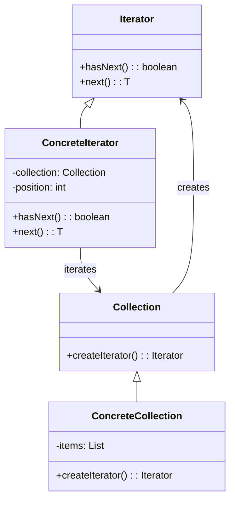

<Hero title="Iterator Pattern" subtitle="Access collection elements sequentially without exposing internal structure" imageAlt="Iterator pattern illustration" size="large" />

## TL;DR

Iterator provides a uniform way to access collection elements sequentially without exposing the collection's internal structure. Use it when you need to traverse diverse collection types with the same client code, or when you want to decouple traversal from collection implementations.

## Learning Objectives

- You will understand how iterators abstract traversal from collection structure.
- You will identify when to separate iteration logic from collection logic.
- You will implement iterators for different collection types.
- You will design collections that can create multiple independent iterators.

## Motivating Scenario

Your system works with lists, trees, graphs, and custom collections. Client code that needs to process all elements in a collection must know how each collection is structured. Adding a new collection type requires updating all client code. Iterator abstracts traversal, so clients use a uniform interface—next(), hasNext()—regardless of whether they iterate a list, tree, or graph.

## Core Concepts

**Iterator** provides sequential access to collection elements while hiding internal representation. Collections create iterators that manage the traversal state independently, enabling multiple concurrent iterations.

Key elements:
- **Iterator**: interface defining methods like hasNext() and next()
- **ConcreteIterator**: implements iteration for a specific collection type
- **Collection**: interface defining a method to create iterators
- **ConcreteCollection**: stores elements and creates iterators

<Figure caption="Iterator structure">

</Figure>

## Practical Example

Implement iterators for different collection structures.

<Tabs>
<TabItem value="python" label="Python" default>
```python showLineNumbers title="iterator.py"
from abc import ABC, abstractmethod
from typing import Iterator as TypingIterator, Generic, TypeVar

T = TypeVar('T')

class Iterator(ABC):
    @abstractmethod
    def has_next(self) -> bool:
        pass

    @abstractmethod
    def next(self) -> T:
        pass

class ListIterator(Iterator):
    def __init__(self, items):
        self.items = items
        self.index = 0

    def has_next(self) -> bool:
        return self.index < len(self.items)

    def next(self):
        item = self.items[self.index]
        self.index += 1
        return item

class TreeNode:
    def __init__(self, value, left=None, right=None):
        self.value = value
        self.left = left
        self.right = right

class TreeIterator(Iterator):
    def __init__(self, root: TreeNode):
        self.stack = []
        self._build_stack(root)

    def _build_stack(self, node):
        if node:
            self._build_stack(node.right)
            self.stack.append(node.value)
            self._build_stack(node.left)

    def has_next(self) -> bool:
        return len(self.stack) > 0

    def next(self):
        return self.stack.pop()

class Collection(ABC):
    @abstractmethod
    def create_iterator(self) -> Iterator:
        pass

class List(Collection):
    def __init__(self):
        self.items = []

    def add(self, item):
        self.items.append(item)

    def create_iterator(self) -> Iterator:
        return ListIterator(self.items)

class Tree(Collection):
    def __init__(self, root: TreeNode):
        self.root = root

    def create_iterator(self) -> Iterator:
        return TreeIterator(self.root)

# Usage
list_col = List()
list_col.add(1)
list_col.add(2)
list_col.add(3)

iterator = list_col.create_iterator()
while iterator.has_next():
    print(iterator.next())
```
</TabItem>
<TabItem value="go" label="Go">
```go showLineNumbers title="iterator.go"
package main

import "fmt"

type Iterator interface {
    HasNext() bool
    Next() interface{}
}

type ListIterator struct {
    items []interface{}
    index int
}

func (li *ListIterator) HasNext() bool {
    return li.index < len(li.items)
}

func (li *ListIterator) Next() interface{} {
    item := li.items[li.index]
    li.index++
    return item
}

type Collection interface {
    CreateIterator() Iterator
}

type List struct {
    items []interface{}
}

func (l *List) Add(item interface{}) {
    l.items = append(l.items, item)
}

func (l *List) CreateIterator() Iterator {
    return &ListIterator{items: l.items}
}

func main() {
    list := &List{}
    list.Add(1)
    list.Add(2)
    list.Add(3)

    iterator := list.CreateIterator()
    for iterator.HasNext() {
        fmt.Println(iterator.Next())
    }
}
```
</TabItem>
<TabItem value="nodejs" label="Node.js">
```javascript showLineNumbers title="iterator.js"
class Iterator {
    hasNext() {
        throw new Error('hasNext() must be implemented');
    }

    next() {
        throw new Error('next() must be implemented');
    }
}

class ListIterator extends Iterator {
    constructor(items) {
        super();
        this.items = items;
        this.index = 0;
    }

    hasNext() {
        return this.index < this.items.length;
    }

    next() {
        return this.items[this.index++];
    }
}

class Collection {
    createIterator() {
        throw new Error('createIterator() must be implemented');
    }
}

class List extends Collection {
    constructor() {
        super();
        this.items = [];
    }

    add(item) {
        this.items.push(item);
    }

    createIterator() {
        return new ListIterator(this.items);
    }
}

// Usage
const list = new List();
list.add(1);
list.add(2);
list.add(3);

const iterator = list.createIterator();
while (iterator.hasNext()) {
    console.log(iterator.next());
}
```
</TabItem>
</Tabs>

## When to Use / When Not to Use

<Vs highlight={[1]} items={[
{
        label: "Use Iterator",
        points: ["You have multiple collection types with different structures", "Clients need uniform traversal regardless of collection type", "You want to support multiple simultaneous iterations", "Traversal logic should be independent of collection logic", "Supporting both sequential and reverse iteration"],
    highlightTone: "positive"
  },
{
        label: "Avoid Iterator",
        points: ["Single collection type used throughout", "Language has built-in iteration support (for-each)", "Traversal order is trivial and known upfront", "Performance-critical tight loops need direct access", "Collections are immutable and never change during iteration"],
    highlightTone: "warning"
  }
]} />

## Patterns and Pitfalls

<Showcase  sections={[{
            title: "Iterator Independence",
            description: "Each iterator maintains its own position state, allowing concurrent iterations without interference.",
            codeUrl: "#practical-example"
        }, {
            title: "Collection Mutation",
            description: "Handle modifications during iteration carefully—either snapshot elements or detect mutations and throw errors.",
            codeUrl: "#practical-example"
        }, {
            title: "Lazy vs Eager",
            description: "Iterators can compute elements on-demand (lazy) or precompute all elements (eager), trading memory for latency.",
            codeUrl: "#practical-example"
        }, {
            title: "Bidirectional Iteration",
            description: "Support both forward and reverse iteration with separate iterator types or methods like previous() and hasPrevious().",
            codeUrl: "#practical-example"
        }]}
/>

## Design Review Checklist

<Checklist
    items={[
        "Does each iterator correctly maintain its position independent of other iterators?",
        "Can iterators detect and handle collection mutations during traversal?",
        "Is the hasNext() check efficient and accurate?",
        "Do all iterator implementations follow the same interface contract?",
        "Can the collection create multiple independent iterators?",
        "Is memory usage acceptable for lazy iteration implementations?",
        "Are edge cases (empty collections, single elements) handled correctly?"
    ]}
/>

## Self-Check

1. **How does Iterator differ from exposing a getAll() method that returns all elements?** Iterator enables lazy evaluation, concurrent independent traversals, and uniform handling of diverse collection types.

2. **What happens if a collection is modified during iteration?** Implementations should either snapshot elements, use versioning, or throw ConcurrentModificationException.

3. **When should iterators be lazy vs eager?** Lazy iteration saves memory for large collections; eager iteration provides immediate detection of collection changes.

:::info One Takeaway
Iterator abstracts traversal mechanisms, enabling clients to process diverse collections uniformly. Use it whenever collection implementations or traversal strategies might vary.

:::

## Real-World Iterator Examples

### Database Result Iteration

```python
# Iterating large result sets without loading all in memory
class DatabaseResultIterator:
    def __init__(self, query, batch_size=1000):
        self.query = query
        self.batch_size = batch_size
        self.offset = 0
        self.current_batch = []
        self.batch_index = 0

    def __iter__(self):
        return self

    def __next__(self):
        # Load next batch if needed
        if self.batch_index >= len(self.current_batch):
            self.current_batch = self.query.limit(self.batch_size).offset(self.offset).fetch()
            if not self.current_batch:
                raise StopIteration
            self.batch_index = 0
            self.offset += self.batch_size

        row = self.current_batch[self.batch_index]
        self.batch_index += 1
        return row

# Usage: Process millions of rows without memory explosion
for user in DatabaseResultIterator("SELECT * FROM users"):
    process_user(user)  # Only one row in memory at a time
```

### File Stream Iteration

```python
# Iterate large files line-by-line
class FileLineIterator:
    def __init__(self, filename, encoding='utf-8'):
        self.filename = filename
        self.encoding = encoding
        self.file = None

    def __enter__(self):
        self.file = open(self.filename, 'r', encoding=self.encoding)
        return self

    def __exit__(self, *args):
        if self.file:
            self.file.close()

    def __iter__(self):
        return self

    def __next__(self):
        line = self.file.readline()
        if not line:
            raise StopIteration
        return line.rstrip('\n')

# Usage: Process huge log files
with FileLineIterator('/var/log/app.log') as lines:
    for line in lines:
        parse_and_analyze_log(line)  # Efficient memory usage
```

### Reverse Iterator

```python
class ReverseIterator:
    def __init__(self, items):
        self.items = items
        self.index = len(items)

    def __iter__(self):
        return self

    def __next__(self):
        if self.index == 0:
            raise StopIteration
        self.index -= 1
        return self.items[self.index]

# Usage
lst = [1, 2, 3, 4, 5]
for item in ReverseIterator(lst):
    print(item)  # Outputs: 5, 4, 3, 2, 1
```

## Iterator vs Enumerable Pattern

**Iterator Pattern**: Step-by-step traversal, maintains position state
**Enumerable Pattern**: Describes *all* elements, collection exposes all

```python
# Bad: Enumerate exposes entire collection
def get_all_users():
    return [user1, user2, user3, user4, user5]  # Load all in memory

for user in get_all_users():
    process(user)

# Good: Iterator abstracts traversal, lazy-loads
def iterate_users():
    for batch in fetch_user_batches():
        for user in batch:
            yield user  # Lazy generator

for user in iterate_users():
    process(user)  # Memory-efficient
```

## Performance Implications

```
Eager (Load All):
- Memory: O(n) - all items in memory
- Latency: High upfront cost
- Use when: Data is small, need random access

Lazy (Load On-Demand):
- Memory: O(1) - one item at a time
- Latency: Distributed cost
- Use when: Data is large, sequential access
```

## Next Steps

- [Study the Visitor pattern for complex collection processing](/docs/design-patterns/behavioral/visitor)
- [Understand the Observer pattern for collection change events](/docs/design-patterns/behavioral/observer-pub-sub)
- [Explore Composite structures that benefit from iterators](/docs/design-patterns/structural/composite)
- [Learn Generators for lazy evaluation in Python](/docs/language-features/generators)
- [Understand Streams for functional iteration](/docs/functional-programming/streams)

## References

- Gang of Four, "Design Patterns: Elements of Reusable Object-Oriented Software"
- Refactoring Guru's [Iterator](https://refactoring.guru/design-patterns/iterator) ↗️
- Python's iterator protocol [docs.python.org](https://docs.python.org/3/library/stdtypes.html#iterator-types) ↗️
- Martin Fowler: "Collection Pipeline" (functional collection processing)