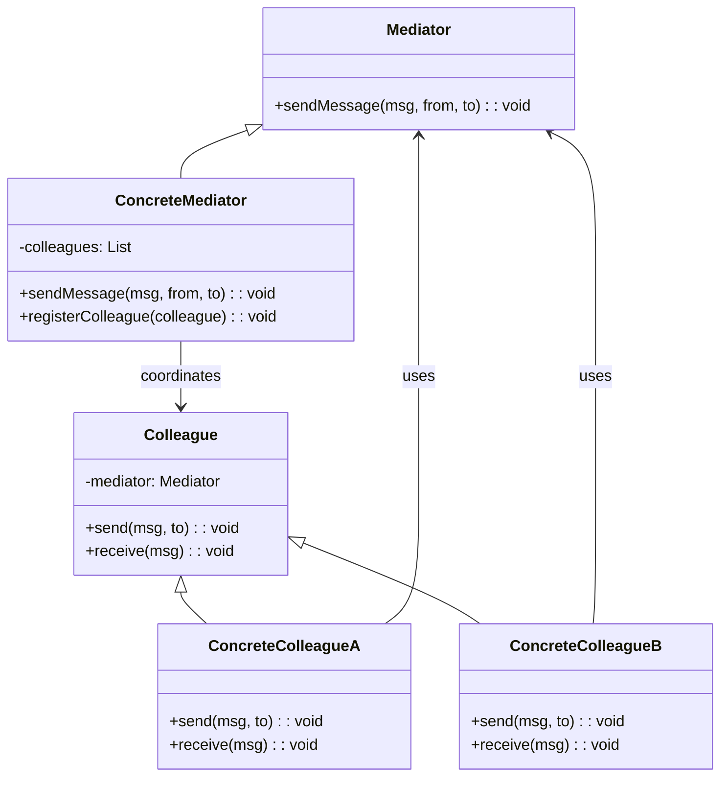

<Hero title="Mediator Pattern" subtitle="Centralize communication between objects through a mediator" imageAlt="Mediator pattern illustration" size="large" />

## TL;DR

Mediator centralizes complex communication logic between multiple objects, reducing coupling. Instead of objects communicating directly, they send messages through a mediator that coordinates interactions. Use it when objects have many interdependencies, communication patterns are complex, or you need centralized control of collaboration.

## Learning Objectives

- You will identify when direct object communication creates problematic coupling.
- You will design mediators that handle coordination logic.
- You will implement colleagues that communicate through a mediator.
- You will manage mediator state and interaction rules centrally.

## Motivating Scenario

A chat room with multiple participants. If each participant sends messages directly to all others, the communication graph becomes dense and complex. When interaction rules change (e.g., moderator features, message filtering), logic scatters across all participants. A Mediator (ChatRoom) handles all interactions—participants only know about the mediator. Adding rules or changing how messages flow becomes isolated in the mediator.

## Core Concepts

**Mediator** centralizes communication protocols between colleagues. Colleagues reference the mediator and send messages through it, not directly to each other. The mediator coordinates responses.

Key elements:
- **Mediator**: interface defining methods for colleague communication
- **ConcreteMediator**: implements interaction logic and colleague coordination
- **Colleague**: interface for objects participating in communication
- **ConcreteColleague**: communicates only with the mediator

<Figure caption="Mediator structure">

</Figure>

## Practical Example

Implement a chat room mediator.

<Tabs>
<TabItem value="python" label="Python" default>
```python showLineNumbers title="mediator.py"
from abc import ABC, abstractmethod
from typing import List

class Colleague(ABC):
    def __init__(self, mediator, name: str):
        self.mediator = mediator
        self.name = name

    @abstractmethod
    def send(self, message: str, to: str) -> None:
        pass

    @abstractmethod
    def receive(self, message: str, sender: str) -> None:
        pass

class User(Colleague):
    def send(self, message: str, to: str) -> None:
        self.mediator.send_message(message, self.name, to)

    def receive(self, message: str, sender: str) -> None:
        print(f"{self.name} received from {sender}: {message}")

class ChatRoom:
    def __init__(self):
        self.users = {}

    def register_user(self, user: User) -> None:
        self.users[user.name] = user

    def send_message(self, message: str, sender: str, recipient: str) -> None:
        if recipient in self.users:
            self.users[recipient].receive(message, sender)
        else:
            print(f"User {recipient} not found")

    def broadcast(self, message: str, sender: str) -> None:
        for name, user in self.users.items():
            if name != sender:
                user.receive(message, sender)

# Usage
chat_room = ChatRoom()

user1 = User(chat_room, "Alice")
user2 = User(chat_room, "Bob")
user3 = User(chat_room, "Charlie")

chat_room.register_user(user1)
chat_room.register_user(user2)
chat_room.register_user(user3)

user1.send("Hello Bob", "Bob")
user1.send("Hello everyone", "all")
user2.send("Hi Alice", "Alice")
```
</TabItem>
<TabItem value="go" label="Go">
```go showLineNumbers title="mediator.go"
package main

import "fmt"

type Colleague interface {
    Send(message, to string)
    Receive(message, sender string)
}

type User struct {
    mediator *ChatRoom
    name     string
}

func (u *User) Send(message, to string) {
    u.mediator.SendMessage(message, u.name, to)
}

func (u *User) Receive(message, sender string) {
    fmt.Printf("%s received from %s: %s\n", u.name, sender, message)
}

type ChatRoom struct {
    users map[string]Colleague
}

func (cr *ChatRoom) RegisterUser(user Colleague, name string) {
    cr.users[name] = user
}

func (cr *ChatRoom) SendMessage(message, sender, recipient string) {
    if user, ok := cr.users[recipient]; ok {
        user.Receive(message, sender)
    } else {
        fmt.Printf("User %s not found\n", recipient)
    }
}

func main() {
    chatRoom := &ChatRoom{users: make(map[string]Colleague)}

    user1 := &User{mediator: chatRoom, name: "Alice"}
    user2 := &User{mediator: chatRoom, name: "Bob"}

    chatRoom.RegisterUser(user1, "Alice")
    chatRoom.RegisterUser(user2, "Bob")

    user1.Send("Hello Bob", "Bob")
    user2.Send("Hi Alice", "Alice")
}
```
</TabItem>
<TabItem value="nodejs" label="Node.js">
```javascript showLineNumbers title="mediator.js"
class Colleague {
    constructor(mediator, name) {
        this.mediator = mediator;
        this.name = name;
    }

    send(message, to) {
        throw new Error('send() must be implemented');
    }

    receive(message, sender) {
        throw new Error('receive() must be implemented');
    }
}

class User extends Colleague {
    send(message, to) {
        this.mediator.sendMessage(message, this.name, to);
    }

    receive(message, sender) {
        console.log(`${this.name} received from ${sender}: ${message}`);
    }
}

class ChatRoom {
    constructor() {
        this.users = {};
    }

    registerUser(user) {
        this.users[user.name] = user;
    }

    sendMessage(message, sender, recipient) {
        if (this.users[recipient]) {
            this.users[recipient].receive(message, sender);
        } else {
            console.log(`User ${recipient} not found`);
        }
    }

    broadcast(message, sender) {
        for (const name in this.users) {
            if (name !== sender) {
                this.users[name].receive(message, sender);
            }
        }
    }
}

// Usage
const chatRoom = new ChatRoom();

const user1 = new User(chatRoom, 'Alice');
const user2 = new User(chatRoom, 'Bob');

chatRoom.registerUser(user1);
chatRoom.registerUser(user2);

user1.send('Hello Bob', 'Bob');
user2.send('Hi Alice', 'Alice');
```
</TabItem>
</Tabs>

## When to Use / When Not to Use

<Vs highlight={[1]} items={[
{
        label: "Use Mediator",
        points: ["Multiple objects have complex interdependencies", "Communication patterns are difficult to understand or maintain", "You want to encapsulate interaction logic centrally", "Colleagues should be reusable in different collaborations", "Coordination rules change frequently"],
    highlightTone: "positive"
  },
{
        label: "Avoid Mediator",
        points: ["Communication is simple and direct", "Objects interact with only one or two other objects", "Performance requires direct method calls without indirection", "Mediator would become too complex or monolithic", "Peer-to-peer communication is the natural model"],
    highlightTone: "warning"
  }
]} />

## Patterns and Pitfalls

<Showcase  sections={[{
            title: "God Mediator",
            description: "Avoid making mediators too powerful—keep them focused on coordination, not business logic.",
            codeUrl: "#practical-example"
        }, {
            title: "Colleague Registration",
            description: "Use registration mechanisms to dynamically add colleagues without hardcoding references.",
            codeUrl: "#practical-example"
        }, {
            title: "Interaction Tracing",
            description: "Log all interactions through the mediator to understand and debug complex collaboration flows.",
            codeUrl: "#practical-example"
        }, {
            title: "Broadcast and Filtering",
            description: "Support both directed communication and broadcasts, with filtering rules for message routing.",
            codeUrl: "#practical-example"
        }]}
/>

## Design Review Checklist

<Checklist
    items={[
        "Does the mediator coordinate communication without becoming a god object?",
        "Can colleagues be added or removed dynamically without mediator code changes?",
        "Are interaction rules clearly expressed in the mediator?",
        "Do colleagues avoid direct references to each other?",
        "Is the mediator interface simple and cohesive?",
        "Can interaction flows be traced and debugged easily?",
        "Are error conditions (unknown recipients, malformed messages) handled?"
    ]}
/>

## Mediator vs Observer Pattern

Both reduce coupling but in different ways:

```python
# Observer: One-way notification
# Publisher sends event; subscribers listen and react independently

class EventBus:
    def __init__(self):
        self.subscribers = {}

    def subscribe(self, event_type, callback):
        if event_type not in self.subscribers:
            self.subscribers[event_type] = []
        self.subscribers[event_type].append(callback)

    def publish(self, event_type, data):
        for callback in self.subscribers.get(event_type, []):
            callback(data)  # Call independently

# Usage
bus = EventBus()
bus.subscribe('user_created', send_welcome_email)
bus.subscribe('user_created', log_analytics)
bus.subscribe('user_created', update_cache)

bus.publish('user_created', {'user_id': 123})
# All 3 callbacks fire independently; none know about others

# Mediator: Centralized two-way coordination
# Mediator coordinates bidirectional interactions

class ChatRoom:
    def __init__(self):
        self.users = {}
        self.moderation_rules = []

    def send_message(self, from_user, to_user, message):
        # Mediator decides what happens
        if self.is_banned(from_user):
            self.notify(from_user, "You are banned")
            return

        if self.contains_spam(message):
            self.log_spam_attempt(from_user)
            self.notify(from_user, "Message blocked (spam detected)")
            return

        # Route message
        self.users[to_user].receive(message, from_user)

        # Mediator handles side effects
        self.log_message(from_user, to_user, message)
        self.update_user_stats(from_user, 'messages_sent')

# Usage
room = ChatRoom()
room.send_message('alice', 'bob', 'Hello!')
# Mediator controls entire flow; users don't coordinate directly
```

**Key difference**:
- Observer: Subscribers independent; don't know about each other
- Mediator: Colleagues coordinate through mediator; mediator controls workflow

## Mediator in Real Systems

### Web Server as Mediator

```
A typical web request flows through multiple middlewares:

Request → AuthMiddleware → ValidationMiddleware → BusinessLogicMiddleware → ResponseMiddleware → Response

Mediator pattern:
- Request is context passed between middlewares
- Each middleware (colleague) handles one concern
- Mediator (framework) coordinates flow
- Prevents direct coupling between middlewares
```

### Message Queue as Mediator

```
Microservices using message queue as mediator:

Service A (Author)  ──┐
                      ├──> Message Queue (Mediator) ──> Service B (Subscriber 1)
Service C (Auditor) ──┤                           ──> Service D (Subscriber 2)

Benefits:
- Services don't know about each other
- Message queue ensures reliable delivery
- Easy to add new subscribers
- Scales to many publishers/subscribers
```

### Orchestration vs Choreography

```
Orchestration (Mediator-like):
- Central orchestrator coordinates steps
- Orchestrator knows all workflow steps
- Example: Saga pattern with central coordinator

BookingOrchestrator
├─> Call PaymentService.charge()
├─> Call InventoryService.reserve()
├─> Call ShippingService.schedule()
└─> Handle failures and compensation

Downside: Central point of failure; orchestrator becomes bottleneck

Choreography (Observer-like):
- Services react to events independently
- PaymentService publishes "payment_completed"
- InventoryService listens and reserves items
- ShippingService listens and schedules

PaymentService → publish(payment_completed)
                 ├→ InventoryService.on_payment_completed()
                 └→ NotificationService.on_payment_completed()

Downside: Hard to debug workflow; implicit dependencies
```

## God Object Anti-Pattern

Mediators can become too powerful and violate single responsibility:

```python
# ❌ God Mediator: Does too much
class ChatRoom:
    def send_message(self, from_user, to_user, message):
        # Moderation
        if self.is_banned(from_user):
            return
        if self.contains_spam(message):
            return

        # Routing
        self.users[to_user].receive(message, from_user)

        # Analytics
        self.log_message(...)
        self.update_user_stats(...)
        self.update_conversation_index(...)

        # Notification
        self.send_notification_to_all_clients(...)
        self.update_unread_count(...)
        self.send_email_if_user_offline(...)

        # Persistence
        self.save_message_to_db(...)
        self.update_user_last_active(...)
        self.trigger_backup_job(...)

    # 20+ more methods...
    # This class does everything!

# ✅ Focused Mediator: Delegates concerns
class ChatRoom:
    def __init__(self, moderator, router, analytics, notifier, storage):
        self.moderator = moderator
        self.router = router
        self.analytics = analytics
        self.notifier = notifier
        self.storage = storage

    def send_message(self, from_user, to_user, message):
        if not self.moderator.is_allowed(from_user, message):
            return

        self.router.send(from_user, to_user, message)
        self.analytics.log(from_user, to_user, message)
        self.notifier.notify(to_user)
        self.storage.save(from_user, to_user, message)

# Single Responsibility: ChatRoom coordinates; delegating specifics
```

## Self-Check

1. **How does Mediator differ from Observer?** Mediator centralizes bidirectional communication and coordination logic; Observer is unidirectional notification where subscribers act independently.

2. **What's the risk of making mediators too powerful?** They become god objects that violate single responsibility, become difficult to test, and create central points of failure.

3. **Can mediators work with asynchronous communication?** Yes—mediators can queue messages, apply backpressure, or relay through async channels (e.g., message queues).

4. **When would you use orchestration (mediator-like) vs choreography (observer-like)?** Use orchestration for complex, ordered workflows; use choreography for loose coupling and independent reaction to events.

:::info One Takeaway
Mediator replaces dense communication graphs with a centralized coordination point. Use it when colleague interactions are complex enough to benefit from isolated orchestration logic, but keep the mediator focused to avoid becoming a god object.

:::

## Next Steps

- [Compare with Observer pattern for event-driven communication](/docs/design-patterns/behavioral/observer-pub-sub)
- [Study Chain of Responsibility for pipeline-style coordination](/docs/design-patterns/behavioral/chain-of-responsibility)
- [Explore the Facade pattern for simplified external interfaces](/docs/design-patterns/structural/facade)

## References

- Gang of Four, "Design Patterns: Elements of Reusable Object-Oriented Software"
- Refactoring Guru's [Mediator](https://refactoring.guru/design-patterns/mediator) ↗️
- Martin Fowler on [Object Collaboration](https://martinfowler.com/articles/refactoring-patterns.html) ↗️