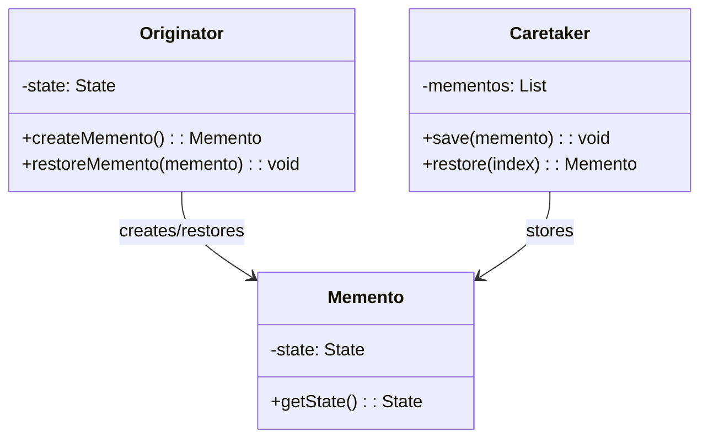

<Hero title="Memento Pattern" subtitle="Capture and restore object state without exposing internal details" imageAlt="Memento pattern illustration" size="large" />

## TL;DR

Memento captures an object's internal state as a separate immutable object (memento) without exposing private details. A caretaker manages saved mementos. Use it for snapshots, checkpoints, or implementing undo/redo by restoring previous states without breaking encapsulation.

## Learning Objectives

- You will understand how to capture state without exposing internal structure.
- You will distinguish between originator, memento, and caretaker roles.
- You will implement mementos that are immutable and externally opaque.
- You will design caretakers that manage state history safely.

## Motivating Scenario

A game needs save/load functionality. If the player object exposes all internal state (health, inventory, position), external code could read and corrupt it. Memento allows the player to create a Snapshot (memento) containing only relevant state. The game engine (caretaker) stores snapshots. Loading restores the player from a snapshot without the game needing to know the player's private fields.

## Core Concepts

**Memento** captures state at a moment in time as an immutable snapshot. The originator creates mementos and can restore from them. A caretaker stores mementos but cannot inspect their contents.

Key elements:
- **Originator**: object whose state is captured; creates and restores mementos
- **Memento**: immutable snapshot of originator state
- **Caretaker**: stores mementos and retrieves them on demand

<Figure caption="Memento structure">

</Figure>

## Practical Example

Implement save/load for a game character.

<Tabs>
<TabItem value="python" label="Python" default>
```python showLineNumbers title="memento.py"
from dataclasses import dataclass
from typing import List

@dataclass
class CharacterSnapshot:
    """Memento: immutable state snapshot"""
    name: str
    level: int
    health: int
    experience: int

class Character:
    """Originator"""
    def __init__(self, name: str):
        self.name = name
        self.level = 1
        self.health = 100
        self.experience = 0

    def take_damage(self, damage: int):
        self.health = max(0, self.health - damage)

    def gain_experience(self, exp: int):
        self.experience += exp
        if self.experience >= 100:
            self.level += 1
            self.experience = 0

    def create_snapshot(self) -> CharacterSnapshot:
        """Create memento"""
        return CharacterSnapshot(
            name=self.name,
            level=self.level,
            health=self.health,
            experience=self.experience
        )

    def restore_snapshot(self, snapshot: CharacterSnapshot):
        """Restore from memento"""
        self.name = snapshot.name
        self.level = snapshot.level
        self.health = snapshot.health
        self.experience = snapshot.experience

class GameSave:
    """Caretaker"""
    def __init__(self):
        self.saves: List[CharacterSnapshot] = []

    def save(self, character: Character):
        self.saves.append(character.create_snapshot())

    def load(self, index: int, character: Character):
        if 0 <= index < len(self.saves):
            character.restore_snapshot(self.saves[index])

# Usage
game_save = GameSave()
hero = Character("Aragorn")

game_save.save(hero)
print(f"Saved: Level {hero.level}, Health {hero.health}")

hero.take_damage(30)
hero.gain_experience(150)
print(f"After action: Level {hero.level}, Health {hero.health}")

game_save.load(0, hero)
print(f"Loaded: Level {hero.level}, Health {hero.health}")
```
</TabItem>
<TabItem value="go" label="Go">
```go showLineNumbers title="memento.go"
package main

import "fmt"

type CharacterSnapshot struct {
    Name       string
    Level      int
    Health     int
    Experience int
}

type Character struct {
    Name       string
    Level      int
    Health     int
    Experience int
}

func (c *Character) TakeDamage(damage int) {
    c.Health -= damage
    if c.Health < 0 {
        c.Health = 0
    }
}

func (c *Character) GainExperience(exp int) {
    c.Experience += exp
    if c.Experience >= 100 {
        c.Level++
        c.Experience = 0
    }
}

func (c *Character) CreateSnapshot() *CharacterSnapshot {
    return &CharacterSnapshot{
        Name:       c.Name,
        Level:      c.Level,
        Health:     c.Health,
        Experience: c.Experience,
    }
}

func (c *Character) RestoreSnapshot(snap *CharacterSnapshot) {
    c.Name = snap.Name
    c.Level = snap.Level
    c.Health = snap.Health
    c.Experience = snap.Experience
}

type GameSave struct {
    Saves []*CharacterSnapshot
}

func (gs *GameSave) Save(character *Character) {
    gs.Saves = append(gs.Saves, character.CreateSnapshot())
}

func (gs *GameSave) Load(index int, character *Character) {
    if index >= 0 && index < len(gs.Saves) {
        character.RestoreSnapshot(gs.Saves[index])
    }
}

func main() {
    gameSave := &GameSave{}
    hero := &Character{Name: "Aragorn", Level: 1, Health: 100}

    gameSave.Save(hero)
    fmt.Printf("Saved: Level %d, Health %d\n", hero.Level, hero.Health)

    hero.TakeDamage(30)
    hero.GainExperience(150)
    fmt.Printf("After action: Level %d, Health %d\n", hero.Level, hero.Health)

    gameSave.Load(0, hero)
    fmt.Printf("Loaded: Level %d, Health %d\n", hero.Level, hero.Health)
}
```
</TabItem>
<TabItem value="nodejs" label="Node.js">
```javascript showLineNumbers title="memento.js"
class CharacterSnapshot {
    constructor(name, level, health, experience) {
        this.name = name;
        this.level = level;
        this.health = health;
        this.experience = experience;
    }
}

class Character {
    constructor(name) {
        this.name = name;
        this.level = 1;
        this.health = 100;
        this.experience = 0;
    }

    takeDamage(damage) {
        this.health = Math.max(0, this.health - damage);
    }

    gainExperience(exp) {
        this.experience += exp;
        if (this.experience >= 100) {
            this.level++;
            this.experience = 0;
        }
    }

    createSnapshot() {
        return new CharacterSnapshot(this.name, this.level, this.health, this.experience);
    }

    restoreSnapshot(snapshot) {
        this.name = snapshot.name;
        this.level = snapshot.level;
        this.health = snapshot.health;
        this.experience = snapshot.experience;
    }
}

class GameSave {
    constructor() {
        this.saves = [];
    }

    save(character) {
        this.saves.push(character.createSnapshot());
    }

    load(index, character) {
        if (index >= 0 && index < this.saves.length) {
            character.restoreSnapshot(this.saves[index]);
        }
    }
}

// Usage
const gameSave = new GameSave();
const hero = new Character('Aragorn');

gameSave.save(hero);
console.log(`Saved: Level ${hero.level}, Health ${hero.health}`);

hero.takeDamage(30);
hero.gainExperience(150);
console.log(`After action: Level ${hero.level}, Health ${hero.health}`);

gameSave.load(0, hero);
console.log(`Loaded: Level ${hero.level}, Health ${hero.health}`);
```
</TabItem>
</Tabs>

## When to Use / When Not to Use

<Vs highlight={[1]} items={[
{
        label: "Use Memento",
        points: ["You need to save and restore object state", "State must not be exposed outside the object", "Undo/redo functionality is required", "Checkpoint or snapshot functionality needed", "Multiple versions of state must coexist"],
    highlightTone: "positive"
  },
{
        label: "Avoid Memento",
        points: ["State is simple and can be exposed without risk", "Creating snapshots is expensive (large state)", "No need to restore previous states", "Serialization frameworks already solve this", "Real-time constraints prevent state copying"],
    highlightTone: "warning"
  }
]} />

## Patterns and Pitfalls

<Showcase  sections={[{
            title: "Memento Immutability",
            description: "Keep mementos immutable to prevent external modifications. Use defensive copying if necessary.",
            codeUrl: "#practical-example"
        }, {
            title: "Caretaker Responsibility",
            description: "Caretakers are opaque to memento contents—they store but never inspect. Maintain strong encapsulation.",
            codeUrl: "#practical-example"
        }, {
            title: "History Management",
            description: "Use strategies like versioning, time-based retention, or compression to manage memento storage.",
            codeUrl: "#practical-example"
        }, {
            title: "Deep Copy Considerations",
            description: "When objects contain references, decide between shallow and deep copies based on mutation needs.",
            codeUrl: "#practical-example"
        }]}
/>

## Design Review Checklist

<Checklist
    items={[
        "Are mementos immutable once created?",
        "Can caretakers store mementos without understanding their structure?",
        "Does restoration correctly populate all necessary state?",
        "Are large state objects handled efficiently in memory?",
        "Is thread safety ensured for concurrent snapshot/restore?",
        "Can partial state be selectively captured if needed?",
        "Is the memento format stable for long-term storage?"
    ]}
/>

## Advanced Patterns and Strategies

### Wide vs Shallow Snapshots

**Full Memento (Shallow Copy)**: Capture all state
```python
@dataclass
class CharacterSnapshot:
    name: str
    level: int
    health: int
    inventory: List[Item]  # Reference, not deep copy
```

**Selective Memento**: Capture only relevant state
```python
@dataclass
class CharacterCheckpoint:
    level: int  # Core progression
    health: int  # Combat state
    # Intentionally omit: cosmetics, temporary buffs
```

**Deep Copy Memento**: For complex objects with nested state
```python
import copy

class Character:
    def create_snapshot(self):
        return CharacterSnapshot(
            name=self.name,
            level=self.level,
            health=self.health,
            inventory=copy.deepcopy(self.inventory)  # Deep copy
        )
```

### History Management Strategies

**Time-based Retention**: Keep snapshots for last 24 hours
```python
class GameSave:
    def __init__(self, max_age_hours=24):
        self.saves = []
        self.max_age = max_age_hours

    def save(self, character):
        self.saves.append({
            'snapshot': character.create_snapshot(),
            'timestamp': datetime.now()
        })
        self.cleanup_old()

    def cleanup_old(self):
        cutoff = datetime.now() - timedelta(hours=self.max_age)
        self.saves = [s for s in self.saves if s['timestamp'] > cutoff]
```

**Compression Strategy**: Store deltas instead of full snapshots
```python
class DeltaSnapshot:
    def __init__(self, base_snapshot, changes):
        self.base = base_snapshot
        self.changes = changes  # Only modified fields

    def restore(self):
        snapshot = copy.deepcopy(self.base)
        snapshot.__dict__.update(self.changes)
        return snapshot
```

### Transaction-Style State Management

```python
class Transaction:
    """Group multiple state changes into atomic operation"""
    def __init__(self, character):
        self.character = character
        self.initial_snapshot = character.create_snapshot()
        self.changes = []
        self.active = True

    def add_change(self, change_description, operation):
        if not self.active:
            raise RuntimeError("Transaction already committed/rolled back")
        self.changes.append((change_description, operation))
        operation()

    def commit(self):
        self.active = False
        # Transaction succeeds; initial snapshot becomes fallback
        return self.initial_snapshot

    def rollback(self):
        self.active = False
        # Restore to initial snapshot
        self.character.restore_snapshot(self.initial_snapshot)
        return self.initial_snapshot

# Usage
txn = Transaction(character)
try:
    txn.add_change("Take damage", lambda: character.take_damage(30))
    txn.add_change("Gain XP", lambda: character.gain_experience(100))
    txn.add_change("Level up", lambda: character.level_up())
    committed = txn.commit()  # All changes applied
except Exception:
    rolled_back = txn.rollback()  # Revert all changes
```

### Undo/Redo Implementation

```python
class UndoRedoManager:
    def __init__(self):
        self.undo_stack = []
        self.redo_stack = []

    def do_action(self, action, character):
        # Save before state
        self.undo_stack.append(character.create_snapshot())
        self.redo_stack = []  # Clear redo on new action

        # Execute
        action.execute(character)

    def undo(self, character):
        if self.undo_stack:
            self.redo_stack.append(character.create_snapshot())
            snapshot = self.undo_stack.pop()
            character.restore_snapshot(snapshot)

    def redo(self, character):
        if self.redo_stack:
            self.undo_stack.append(character.create_snapshot())
            snapshot = self.redo_stack.pop()
            character.restore_snapshot(snapshot)
```

### Persisted Memento (Database Storage)

```python
import json

class CharacterSnapshotRepository:
    def save_to_db(self, character_id, snapshot):
        """Persist snapshot to database"""
        data = json.dumps({
            'character_id': character_id,
            'level': snapshot.level,
            'health': snapshot.health,
            'experience': snapshot.experience,
            'timestamp': datetime.now().isoformat()
        })
        # Store in database
        db.insert('snapshots', data)

    def load_from_db(self, character_id, timestamp):
        """Restore snapshot from database"""
        row = db.query('snapshots',
            where={'character_id': character_id, 'timestamp': timestamp})
        data = json.loads(row)
        return CharacterSnapshot(**data)
```

## Performance Considerations

### Memory Impact

Large objects with many snapshots consume significant memory:

```python
class MemoryEfficientSnapshot:
    """Only snapshot changed fields"""
    def __init__(self, object_state, changed_fields=None):
        self.changed_fields = changed_fields or {}
        self.full_state = None
        if not changed_fields:
            # Full snapshot only if necessary
            self.full_state = copy.deepcopy(object_state)

    def get_estimated_size_bytes(self):
        """Estimate memory used by snapshot"""
        import sys
        size = sys.getsizeof(self.changed_fields)
        if self.full_state:
            size += sys.getsizeof(self.full_state)
        return size
```

### Cleanup Strategies

```python
class SnapshotManager:
    """Manage memento lifecycle and cleanup"""
    def __init__(self, max_snapshots=100, max_age_hours=24):
        self.snapshots = []
        self.max_snapshots = max_snapshots
        self.max_age = max_age_hours

    def add_snapshot(self, snapshot):
        self.snapshots.append({
            'snapshot': snapshot,
            'timestamp': datetime.now()
        })
        self._cleanup()

    def _cleanup(self):
        # Remove old snapshots
        cutoff = datetime.now() - timedelta(hours=self.max_age)
        self.snapshots = [s for s in self.snapshots if s['timestamp'] > cutoff]

        # Remove excess snapshots (keep most recent N)
        if len(self.snapshots) > self.max_snapshots:
            self.snapshots = self.snapshots[-self.max_snapshots:]
```

## Variations and Related Patterns

**Command + Memento**: Command pattern stores action; Memento stores state. Together: undo/redo
**Observer + Memento**: Observer notified of state changes; Memento captures the changed state
**Prototype + Memento**: Prototype clones objects; Memento captures specific state points

## Self-Check

1. **How does Memento differ from cloning an object?** Memento captures specific state intentionally and prevents external inspection; cloning copies the entire object structure.

2. **What prevents external code from modifying a memento?** Make mementos immutable—use private fields and expose only necessary accessor methods.

3. **Can mementos be serialized for persistent storage?** Yes—design them as plain data objects that serialize to JSON, binary, or other formats.

4. **How do you implement unlimited undo/redo?** Keep stacks of snapshots; memory-intensive but simple. For large objects, use delta encoding or compression.

5. **When would you use selective vs. full mementos?** Selective when you have large state but only care about certain fields (saves memory). Full when you need complete restoration.

:::info One Takeaway
Memento preserves object encapsulation while enabling state capture and restoration. Use it for save/load, undo/redo, or transaction-like rollback without exposing internals.

:::

## Next Steps

- [Combine with Command pattern for enhanced undo/redo](/docs/design-patterns/behavioral/command)
- [Use with Caretaker for history management](/docs/design-patterns/behavioral/memento)
- [Study the State pattern for behavior-based state handling](/docs/design-patterns/behavioral/state)

## References

- Gang of Four, "Design Patterns: Elements of Reusable Object-Oriented Software"
- Refactoring Guru's [Memento](https://refactoring.guru/design-patterns/memento) ↗️
- Martin Fowler on [Event Sourcing](https://martinfowler.com/eaaDev/EventSourcing.html) ↗️