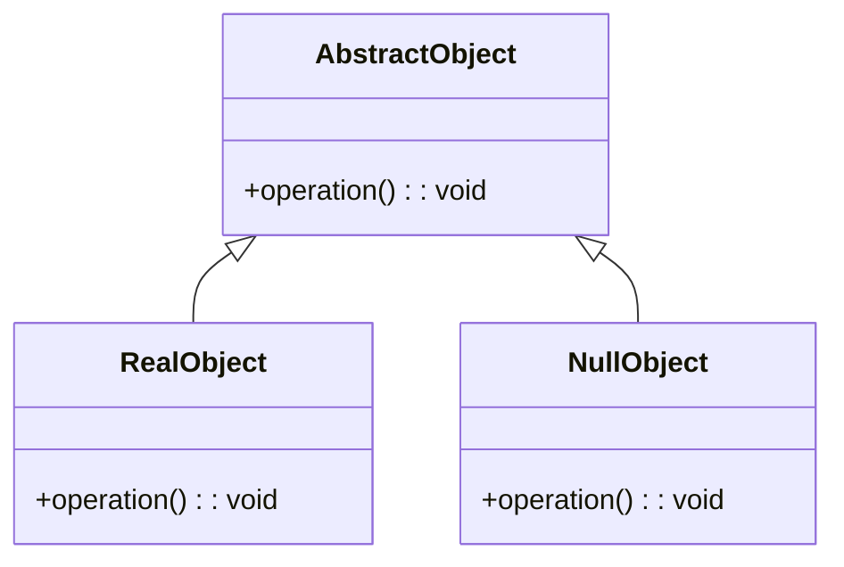

<Hero title="Null Object Pattern" subtitle="Provide a neutral object to avoid null reference checks" imageAlt="Null Object pattern illustration" size="large" />

## TL;DR

Null Object provides an object that implements the expected interface but does nothing (or returns neutral defaults). This eliminates null checks by replacing null references with harmless no-op objects. Use it to reduce conditional logic, improve code clarity, and prevent null pointer exceptions.

## Learning Objectives

- You will understand when null references create unnecessary complexity.
- You will design Null Objects with appropriate neutral behavior.
- You will replace null checks with polymorphic method calls.
- You will maintain type safety without null handling code.

## Motivating Scenario

Logger interface is used throughout an application. In testing or production without logging, you might set logger to null and check before each log call. Null Object provides a NullLogger that implements Logger but does nothing. Code calls logger.log() without null checks—in test environments, use NullLogger; in production, use RealLogger. No conditionals needed.

## Core Concepts

**Null Object** is an object that implements the expected interface but performs no operations or returns default values. It eliminates null checks by providing a safe, harmless substitute.

Key elements:
- **AbstractObject**: interface or base class
- **RealObject**: implements actual behavior
- **NullObject**: implements interface with no-op methods

<Figure caption="Null Object structure">

</Figure>

## Practical Example

Implement Null Object for logging.

<Tabs>
<TabItem value="python" label="Python" default>
```python showLineNumbers title="null_object.py"
from abc import ABC, abstractmethod

class Logger(ABC):
    @abstractmethod
    def log(self, message: str) -> None:
        pass

class ConsoleLogger(Logger):
    def log(self, message: str) -> None:
        print(f"[LOG] {message}")

class NullLogger(Logger):
    def log(self, message: str) -> None:
        pass  # Do nothing

class Application:
    def __init__(self, logger: Logger):
        self.logger = logger

    def process(self, data: str) -> None:
        self.logger.log(f"Processing: {data}")
        # business logic
        self.logger.log("Processing complete")

# Usage
console_app = Application(ConsoleLogger())
console_app.process("data")

test_app = Application(NullLogger())
test_app.process("test")  # No output
```
</TabItem>
<TabItem value="go" label="Go">
```go showLineNumbers title="null_object.go"
package main

import "fmt"

type Logger interface {
    Log(message string)
}

type ConsoleLogger struct{}

func (c *ConsoleLogger) Log(message string) {
    fmt.Printf("[LOG] %s\n", message)
}

type NullLogger struct{}

func (n *NullLogger) Log(message string) {
    // Do nothing
}

type Application struct {
    logger Logger
}

func (a *Application) Process(data string) {
    a.logger.Log(fmt.Sprintf("Processing: %s", data))
    // business logic
    a.logger.Log("Processing complete")
}

func main() {
    consoleApp := &Application{logger: &ConsoleLogger{}}
    consoleApp.Process("data")

    testApp := &Application{logger: &NullLogger{}}
    testApp.Process("test")
}
```
</TabItem>
<TabItem value="nodejs" label="Node.js">
```javascript showLineNumbers title="null-object.js"
class Logger {
    log(message) {
        throw new Error('log() must be implemented');
    }
}

class ConsoleLogger extends Logger {
    log(message) {
        console.log(`[LOG] ${message}`);
    }
}

class NullLogger extends Logger {
    log(message) {
        // Do nothing
    }
}

class Application {
    constructor(logger) {
        this.logger = logger;
    }

    process(data) {
        this.logger.log(`Processing: ${data}`);
        // business logic
        this.logger.log('Processing complete');
    }
}

// Usage
const consoleApp = new Application(new ConsoleLogger());
consoleApp.process('data');

const testApp = new Application(new NullLogger());
testApp.process('test');
```
</TabItem>
</Tabs>

## When to Use / When Not to Use

<Vs highlight={[1]} items={[
{
        label: "Use Null Object",
        points: ["Null checks scatter throughout code", "Safe default behavior is needed when object absent", "Testing requires disabling or ignoring functionality", "Polymorphism is available (language supports it)", "Multiple call sites depend on the same object"],
    highlightTone: "positive"
  },
{
        label: "Avoid Null Object",
        points: ["Presence/absence of object carries semantic meaning", "Null checks are localized and infrequent", "Special handling for null is required", "Language lacks good polymorphism (e.g., some procedural code)", "NullObject behavior would be more confusing than null"],
    highlightTone: "warning"
  }
]} />

## Patterns and Pitfalls

<Showcase  sections={[{
            title: "Neutral Behavior",
            description: "Null Objects should do nothing or return sensible defaults, never throwing exceptions.",
            codeUrl: "#practical-example"
        }, {
            title: "Default Values",
            description: "Methods can return empty collections, zero, false, or other neutral values as appropriate.",
            codeUrl: "#practical-example"
        }, {
            title: "Shared Instances",
            description: "NullObjects are typically stateless and immutable—use singleton instances to save memory.",
            codeUrl: "#practical-example"
        }, {
            title: "Transparency",
            description: "Code should work the same whether using NullObject or real objects—transparency is key.",
            codeUrl: "#practical-example"
        }]}
/>

## Design Review Checklist

<Checklist
    items={[
        "Does NullObject implement the full interface correctly?",
        "Are NullObject methods truly no-ops or returning neutral values?",
        "Will callers be surprised by NullObject behavior?",
        "Is NullObject used consistently instead of null checks?",
        "Can NullObject be shared across multiple contexts (is it stateless)?",
        "Are edge cases (empty collections, zero values) handled appropriately?",
        "Is the distinction between NullObject and real object invisible to callers?"
    ]}
/>

## Self-Check

1. **When should NullObject methods throw exceptions?** Generally never—they should do nothing or return safe defaults. Exceptions defeat the purpose of avoiding null checks.

2. **How does Null Object differ from a default implementation?** Null Object does nothing; default implementation provides minimal working behavior.

3. **Can NullObject be used for all optional objects?** Mostly—when absence has semantic meaning (e.g., checking "is logger null?"), use null or Optional instead.

:::info One Takeaway
Null Object eliminates null checks through harmless polymorphic implementations. Use it when null handling creates boilerplate and safe defaults exist.

:::

## Next Steps

- [Use with Optional/Maybe patterns for type safety](/docs/design-patterns/behavioral/null-object)
- [Combine with Factory for object creation](/docs/design-patterns/creational/factory-method)
- [Study the Strategy pattern for alternative behaviors](/docs/design-patterns/behavioral/strategy)

## Complex Null Object Examples

### Null Repository Pattern

```python
class Repository:
    def save(self, entity): pass
    def get(self, id): pass
    def delete(self, id): pass

class RealRepository(Repository):
    def __init__(self, connection):
        self.conn = connection

    def save(self, entity):
        sql = f"INSERT INTO {entity.__class__.__name__} ..."
        self.conn.execute(sql, entity.to_dict())

    def get(self, id):
        return self.conn.query(f"SELECT * FROM ... WHERE id = {id}")

    def delete(self, id):
        self.conn.execute(f"DELETE FROM ... WHERE id = {id}")

class NullRepository(Repository):
    """No-op repository for testing."""
    def __init__(self):
        self.saved = []
        self.get_calls = []

    def save(self, entity):
        self.saved.append(entity)
        # Don't actually save to DB

    def get(self, id):
        self.get_calls.append(id)
        return None  # Return None (no DB)

    def delete(self, id):
        pass  # No-op delete

# In tests
class UserServiceTest:
    def test_user_creation_without_db(self):
        repo = NullRepository()
        service = UserService(repo)

        service.create_user('Alice')

        # Verify logic without database
        assert len(repo.saved) == 1
        assert repo.saved[0].name == 'Alice'
```

### Null Payment Gateway

```python
class PaymentGateway:
    def charge(self, amount: Money) -> PaymentResult: pass
    def refund(self, transaction_id: str, amount: Money) -> PaymentResult: pass

class StripeGateway(PaymentGateway):
    def __init__(self, api_key):
        self.api_key = api_key

    def charge(self, amount):
        response = stripe.Charge.create(
            amount=int(amount.cents),
            currency='usd',
            source='tok_visa'
        )
        return PaymentResult(success=True, transaction_id=response.id)

    def refund(self, transaction_id, amount):
        response = stripe.Refund.create(charge=transaction_id)
        return PaymentResult(success=True, transaction_id=response.id)

class NullPaymentGateway(PaymentGateway):
    """In-memory payment for testing."""
    def __init__(self):
        self.charges = []
        self.refunds = []

    def charge(self, amount):
        self.charges.append(amount)
        return PaymentResult(success=True, transaction_id='test-' + str(len(self.charges)))

    def refund(self, transaction_id, amount):
        self.refunds.append((transaction_id, amount))
        return PaymentResult(success=True, transaction_id=transaction_id)

# Usage in tests
def test_refund_process():
    gateway = NullPaymentGateway()
    service = RefundService(gateway)

    # Charge first
    result = gateway.charge(Money(100))
    transaction_id = result.transaction_id

    # Test refund without real API calls
    refund_result = service.refund(transaction_id, Money(100))
    assert refund_result.success
    assert len(gateway.refunds) == 1
```

### Null Observer/Listener

```python
class EventListener:
    def on_event(self, event): pass

class LoggingListener(EventListener):
    def on_event(self, event):
        logger.info(f"Event occurred: {event.type}")

class NullListener(EventListener):
    """No-op listener when logging disabled."""
    def on_event(self, event):
        pass  # Do nothing

class EventPublisher:
    def __init__(self, listener=None):
        self.listener = listener or NullListener()

    def publish(self, event):
        # Process event
        result = self._process(event)
        # Notify listener (always safe)
        self.listener.on_event(event)
        return result

# Usage: In production with logging
publisher = EventPublisher(LoggingListener())
publisher.publish(event)  # Logs event

# Usage: In testing without logging
publisher = EventPublisher(NullListener())
publisher.publish(event)  # Silent
```

## Common Pitfalls with Null Objects

### Pitfall 1: Making Null Obvious

```python
# WRONG: NullObject that announces itself
class NullObject:
    def is_null(self):
        return True

# Client code becomes
if obj.is_null():
    do_something_else()
else:
    obj.do_something()

# This defeats the purpose!
```

**Solution**: NullObject should be transparent:

```python
# RIGHT: NullObject is indistinguishable
class NullObject:
    def do_something(self):
        pass  # No-op, but same interface

# Client code doesn't check
obj.do_something()  # Works whether obj is real or null
```

### Pitfall 2: Null Behavior That's Incorrect

```python
# WRONG: NullObject returns incorrect defaults
class User:
    def get_email(self) -> str: pass

class NullUser(User):
    def get_email(self) -> str:
        return "no-email@example.com"  # Wrong! This is a real email

# Now code that checks for this gets confused
if user.get_email() == "no-email@example.com":
    treat_as_unverified()  # But what if that's the actual email?
```

**Solution**: Return truly neutral values:

```python
# RIGHT: NullUser returns empty/zero/false
class NullUser(User):
    def get_email(self) -> str:
        return ""  # Empty, not a real email

class NullUser(User):
    def get_balance(self) -> Money:
        return Money(0)  # Zero balance

class NullUser(User):
    def is_verified(self) -> bool:
        return False  # Default to unverified
```

### Pitfall 3: NullObject with Side Effects

```python
# WRONG: NullObject that has side effects
class NullLogger(Logger):
    def log(self, message):
        # Still writes to a file!
        with open('/tmp/null.log', 'a') as f:
            f.write(message)

# This is not a no-op anymore!
```

**Solution**: Truly no-op:

```python
# RIGHT: NullLogger does absolutely nothing
class NullLogger(Logger):
    def log(self, message):
        pass  # Literally does nothing
```

## Comparison: Null Object vs Optional/Maybe

When should you use Null Object vs Optional?

```python
# Option 1: Null Object (Polymorphic)
class User:
    pass

class RealUser(User):
    def get_name(self): return self.name

class NullUser(User):
    def get_name(self): return ""

user = get_user(id)  # Returns User (real or null)
print(user.get_name())  # Works either way

# Option 2: Optional (Type-Safe)
from typing import Optional

def get_user(id: int) -> Optional[User]:
    return user if found else None

user = get_user(id)
if user:
    print(user.get_name())  # Must check first

# Option 3: Monadic Optional
user = get_user(id).map(lambda u: u.get_name()).unwrap_or("")
```

**When to use Null Object**:
- Absence doesn't have semantic meaning
- Safe default behavior exists
- Polymorphism is natural
- Want to avoid if-checks

**When to use Optional**:
- Absence has semantic meaning ("not found" is important)
- No safe default exists
- Type safety is priority
- Want to be explicit about null checks

## Null Object with Dependency Injection

```python
class UserService:
    def __init__(self, repo: UserRepository, logger: Logger = None):
        self.repo = repo
        # Default to NullLogger if not provided
        self.logger = logger or NullLogger()

    def create_user(self, name):
        user = User(name=name)
        self.repo.save(user)
        # This works whether logger is real or null
        self.logger.log(f"User created: {name}")
        return user

# In production: explicit logger
service = UserService(repo, LoggingLogger())

# In testing: implicit null logger
service = UserService(repo)  # Uses NullLogger by default
```

## Null Object with Builder Pattern

```python
class RequestBuilder:
    def __init__(self):
        self.logger = NullLogger()
        self.cache = NullCache()
        self.metrics = NullMetrics()

    def with_logger(self, logger):
        self.logger = logger
        return self

    def with_cache(self, cache):
        self.cache = cache
        return self

    def with_metrics(self, metrics):
        self.metrics = metrics
        return self

    def build(self):
        return Request(self.logger, self.cache, self.metrics)

# Usage: Everything is optional with safe defaults
request = (RequestBuilder()
    .with_logger(FileLogger())
    .build())

# Cache and metrics use null objects

# Or fully configured
request = (RequestBuilder()
    .with_logger(FileLogger())
    .with_cache(RedisCache())
    .with_metrics(PrometheusMetrics())
    .build())
```

## References

- Gang of Four, "Design Patterns: Elements of Reusable Object-Oriented Software"
- Refactoring Guru's [Null Object](https://refactoring.guru/design-patterns/null-object) ↗️
- Martin Fowler on [Null Object](https://martinfowler.com/eaaCatalog/nullObject.html) ↗️
- "Refactoring to Patterns" by Joshua Kerievsky
- "Pattern Languages of Program Design" (Vol. 3)