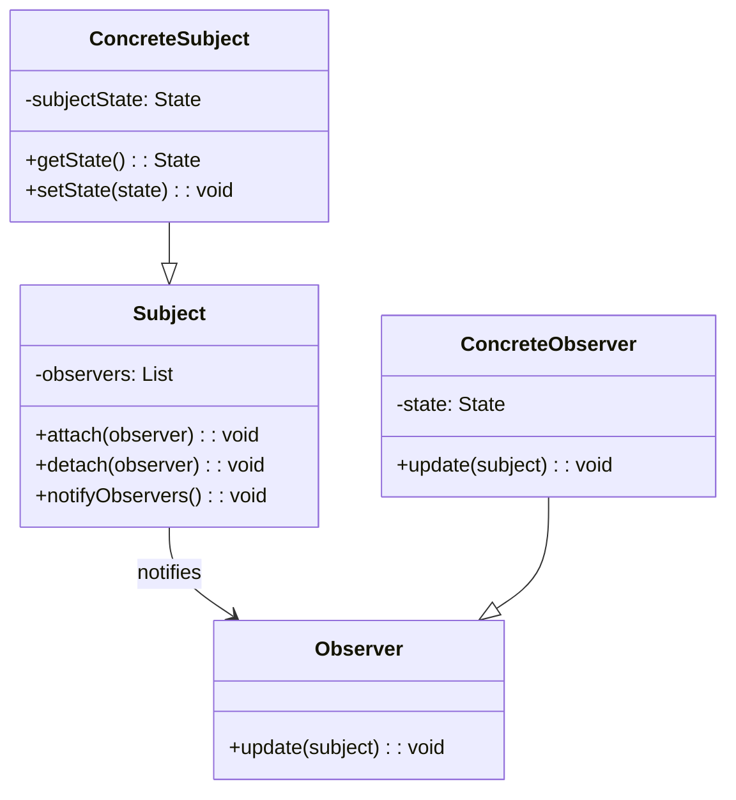

<Hero title="Observer / Pub-Sub Pattern" subtitle="Notify multiple objects of state changes without tight coupling" imageAlt="Observer pattern illustration" size="large" />

## TL;DR

Observer establishes a one-to-many relationship where observers (subscribers) automatically receive notifications when a subject (publisher) changes state. This enables loose coupling—observers don't need to know about each other, and subjects don't depend on specific observer implementations. Use it for event-driven architectures, reactive systems, and decoupled notification.

## Learning Objectives

- You will understand one-to-many dependency relationships.
- You will identify when to decouple subjects from observers.
- You will implement push vs. pull notification models.
- You will manage observer lifecycle (subscription, unsubscription, notification).

## Motivating Scenario

A stock price system updates multiple displays. If each display directly polls the stock, overhead scales with display count. If the stock calls display.update() directly for each display type, adding new displays requires modifying the stock class. Observer allows the stock to notify all registered observers when its price changes. New displays simply subscribe without modifying the stock.

## Core Concepts

**Observer** decouples subjects from observers through notifications. Subjects maintain a list of observers and notify them of changes. Observers subscribe to subjects and unsubscribe when no longer interested.

Key elements:
- **Subject**: maintains observers and notifies them of state changes
- **Observer**: interface for objects that receive notifications
- **ConcreteObserver**: implements observer interface, reacts to notifications

<Figure caption="Observer structure">

</Figure>

## Practical Example

Implement a stock price system with observer notifications.

<Tabs>
<TabItem value="python" label="Python" default>
```python showLineNumbers title="observer.py"
from abc import ABC, abstractmethod
from typing import List

class Observer(ABC):
    @abstractmethod
    def update(self, subject: 'Subject') -> None:
        pass

class Subject:
    def __init__(self):
        self._observers: List[Observer] = []
        self._state = None

    def attach(self, observer: Observer) -> None:
        if observer not in self._observers:
            self._observers.append(observer)

    def detach(self, observer: Observer) -> None:
        self._observers.remove(observer)

    def notify(self) -> None:
        for observer in self._observers:
            observer.update(self)

    @property
    def state(self):
        return self._state

    @state.setter
    def state(self, value):
        self._state = value
        self.notify()

class StockPrice(Subject):
    def __init__(self, symbol: str, price: float):
        super().__init__()
        self.symbol = symbol
        self._state = price

    def get_price(self) -> float:
        return self._state

    def set_price(self, price: float) -> None:
        self.state = price

class Display(Observer):
    def __init__(self, name: str):
        self.name = name

    def update(self, subject: StockPrice) -> None:
        print(f"{self.name} displays: {subject.symbol} = ${subject.get_price():.2f}")

# Usage
stock = StockPrice("AAPL", 150.0)

display1 = Display("Display 1")
display2 = Display("Display 2")

stock.attach(display1)
stock.attach(display2)

stock.set_price(152.50)  # Notifies both displays
stock.set_price(151.75)  # Notifies both displays
```
</TabItem>
<TabItem value="go" label="Go">
```go showLineNumbers title="observer.go"
package main

import "fmt"

type Observer interface {
    Update(subject *StockPrice)
}

type StockPrice struct {
    observers []Observer
    symbol    string
    price     float64
}

func (s *StockPrice) Attach(observer Observer) {
    s.observers = append(s.observers, observer)
}

func (s *StockPrice) Detach(observer Observer) {
    for i, obs := range s.observers {
        if obs == observer {
            s.observers = append(s.observers[:i], s.observers[i+1:]...)
            break
        }
    }
}

func (s *StockPrice) Notify() {
    for _, observer := range s.observers {
        observer.Update(s)
    }
}

func (s *StockPrice) SetPrice(price float64) {
    s.price = price
    s.Notify()
}

type Display struct {
    Name string
}

func (d *Display) Update(subject *StockPrice) {
    fmt.Printf("%s displays: %s = $%.2f\n", d.Name, subject.symbol, subject.price)
}

func main() {
    stock := &StockPrice{symbol: "AAPL", price: 150.0}

    display1 := &Display{Name: "Display 1"}
    display2 := &Display{Name: "Display 2"}

    stock.Attach(display1)
    stock.Attach(display2)

    stock.SetPrice(152.50)
    stock.SetPrice(151.75)
}
```
</TabItem>
<TabItem value="nodejs" label="Node.js">
```javascript showLineNumbers title="observer.js"
class Observer {
    update(subject) {
        throw new Error('update() must be implemented');
    }
}

class Subject {
    constructor() {
        this.observers = [];
    }

    attach(observer) {
        if (!this.observers.includes(observer)) {
            this.observers.push(observer);
        }
    }

    detach(observer) {
        const index = this.observers.indexOf(observer);
        if (index > -1) {
            this.observers.splice(index, 1);
        }
    }

    notify() {
        this.observers.forEach(observer => observer.update(this));
    }
}

class StockPrice extends Subject {
    constructor(symbol, price) {
        super();
        this.symbol = symbol;
        this._price = price;
    }

    getPrice() {
        return this._price;
    }

    setPrice(price) {
        this._price = price;
        this.notify();
    }
}

class Display extends Observer {
    constructor(name) {
        super();
        this.name = name;
    }

    update(subject) {
        console.log(`${this.name} displays: ${subject.symbol} = $${subject.getPrice().toFixed(2)}`);
    }
}

// Usage
const stock = new StockPrice('AAPL', 150.0);
const display1 = new Display('Display 1');
const display2 = new Display('Display 2');

stock.attach(display1);
stock.attach(display2);

stock.setPrice(152.50);
stock.setPrice(151.75);
```
</TabItem>
</Tabs>

## When to Use / When Not to Use

<Vs highlight={[1]} items={[
{
        label: "Use Observer",
        points: ["Subject and observers should be loosely coupled", "A change in one object affects others, count unknown", "Object should notify others without assumptions about them", "Event-driven or reactive architecture needed", "Multiple independent consumers of state changes"],
    highlightTone: "positive"
  },
{
        label: "Avoid Observer",
        points: ["Direct method calls are sufficient", "Only one observer or direct dependency is acceptable", "Performance requires synchronous tight coupling", "Observer lifetimes are trivial or predictable", "Notification order matters critically"],
    highlightTone: "warning"
  }
]} />

## Patterns and Pitfalls

### Pattern: Push vs Pull

**Push Model**: Subject sends state to observers.
```python
class Subject:
    def notify(self):
        for observer in self._observers:
            observer.update(self.state)  # Subject sends data
```
- Pros: Efficient for small data, observers always current
- Cons: Subject must know what observers need

**Pull Model**: Observers query subject for state.
```python
class Subject:
    def notify(self):
        for observer in self._observers:
            observer.update()  # Observer asks for state if needed
            observer.update(self.get_state())  # Callback with data
```
- Pros: Observers control what they need, flexible
- Cons: More queries if many observers

### Pattern: Detach on Cleanup

Memory leak risk: observers hang around after being deleted.

```python
# Good: clean up explicitly
display = Display("Display 1")
stock.attach(display)
# ...later
stock.detach(display)  # Without this, display stays in memory
```

### Pattern: Exception Handling During Notification

One observer throws exception; should others be notified?

```python
# Good: catch exceptions, notify everyone
def notify(self):
    for observer in self._observers:
        try:
            observer.update(self)
        except Exception as e:
            logger.error(f"Observer {observer} failed: {e}")
            # Continue notifying others
```

### Pitfall: Circular Notifications

Observer modifies subject, subject notifies again, observer modifies again...

```python
# BAD: Observer modifies subject during update
class BadObserver:
    def update(self, subject):
        subject.price *= 1.1  # Modifies during notification

# Subject notifies again with new price
# Infinite loop or unexpected behavior
```

**Solution**: Observer queues changes; applies after notification completes.

### Pitfall: Notification Order Dependencies

Observers assume specific notification order. Bad idea.

```python
# BAD
class OrderProcessor(Observer):
    def update(self, order):
        # Assumes LoggingObserver was notified first
        # If notification order changes, breaks

# BETTER: Each observer is independent
```

<Showcase  sections={[{
            title: "Push vs. Pull",
            description: "Push: subject sends state to observers (efficient, subject knows needs). Pull: observers query (flexible, observers decide). Choose based on data volume and update frequency.",
            codeUrl: "#practical-example"
        }, {
            title: "Observer Memory Leaks",
            description: "Detach observers when done. Use weak references in some languages. Lingering observer references prevent garbage collection and cause hidden bugs.",
            codeUrl: "#practical-example"
        }, {
            title: "Exception Safety",
            description: "Catch exceptions in observer.update() to ensure all observers are notified even if one fails. Don't let one bad observer break notification.",
            codeUrl: "#practical-example"
        }, {
            title: "Async Notifications",
            description: "Consider async/event-queue patterns for systems where notification handling must not block the subject. Decouples timing.",
            codeUrl: "#practical-example"
        }, {
            title: "Avoid Circular Dependencies",
            description: "Observer should not modify subject during update; causes loops and unpredictable behavior. Queue changes for later.",
            codeUrl: "#practical-example"
        }]}
/>

## Design Review Checklist

<Checklist
    items={[
        "Are observers correctly detached to prevent memory leaks?",
        "Can observers be safely added/removed during notification?",
        "Does notification order matter, and is it documented?",
        "Are exceptions in observer.update() handled without breaking notification?",
        "Is the push/pull model appropriate for data volumes?",
        "Can observers safely access subject state during update()?",
        "Is there a risk of infinite loops (observer modifies subject)?"
    ]}
/>

## Self-Check

1. **How does Observer differ from Mediator?** Observer is one-to-many unidirectional notification; Mediator is bidirectional coordination between specific objects.

2. **What's the risk of observers modifying subjects during update()?** Can cause notification loops or inconsistent state if multiple observers modify in unpredictable orders.

3. **Should observers be notified synchronously or asynchronously?** Synchronous: simple but blocks; asynchronous: responsive but harder to debug and test.

:::info One Takeaway
Observer enables event-driven architectures by decoupling subjects from their dependents through subscriptions. Use it whenever one change should ripple to multiple unknowns.

:::

## Next Steps

- [Compare with Mediator for coordinated communication](/docs/design-patterns/behavioral/mediator)
- [Combine with Command for queued events](/docs/design-patterns/behavioral/command)
- [Study event-sourcing patterns for audit trails](../../architectural-styles/event-sourcing)

## Real-World Applications

### Example 1: Event-Driven Microservices

When order is created, multiple services need to know:

```python
class OrderCreatedEvent:
    def __init__(self, order_id, customer_id, total):
        self.order_id = order_id
        self.customer_id = customer_id
        self.total = total

class Order(Subject):
    def __init__(self, order_id, customer_id, total):
        super().__init__()
        self.order_id = order_id
        self.customer_id = customer_id
        self.total = total

    def create(self):
        # ... business logic
        event = OrderCreatedEvent(self.order_id, self.customer_id, self.total)
        self.notify_observers(event)

# Subscribers
class EmailNotificationService(Observer):
    def update(self, event):
        if isinstance(event, OrderCreatedEvent):
            self.send_confirmation_email(event.customer_id, event.order_id)

class InventoryService(Observer):
    def update(self, event):
        if isinstance(event, OrderCreatedEvent):
            self.reserve_inventory(event.order_id)

class AnalyticsService(Observer):
    def update(self, event):
        if isinstance(event, OrderCreatedEvent):
            self.track_sale(event.order_id, event.total)

class RecommendationService(Observer):
    def update(self, event):
        if isinstance(event, OrderCreatedEvent):
            self.update_customer_profile(event.customer_id)
```

### Example 2: UI Reactive Updates

GUI elements observe data model changes:

```python
class DataModel(Subject):
    def __init__(self):
        super().__init__()
        self._data = {}

    def set_value(self, key, value):
        self._data[key] = value
        self.notify_observers()

class TextInput(Observer):
    def __init__(self, model, key):
        self.model = model
        self.key = key
        self.text_field = None

    def update(self):
        # Update UI when model changes
        self.text_field.text = self.model._data.get(self.key, "")

class Label(Observer):
    def __init__(self, model, key):
        self.model = model
        self.key = key
        self.label = None

    def update(self):
        self.label.text = str(self.model._data.get(self.key, ""))

# Usage
model = DataModel()
input_field = TextInput(model, "username")
label = Label(model, "username")
model.attach(input_field)
model.attach(label)

model.set_value("username", "alice")  # Both input and label update
```

### Example 3: Stock Market Updates

Multiple displays monitoring stock prices:

```python
class Stock(Subject):
    def __init__(self, symbol, price):
        super().__init__()
        self.symbol = symbol
        self._price = price

    @property
    def price(self):
        return self._price

    @price.setter
    def price(self, new_price):
        if new_price != self._price:
            self._price = new_price
            self.notify_observers()

class DesktopDisplay(Observer):
    def update(self, stock):
        print(f"Desktop: {stock.symbol} = ${stock.price}")

class MobileDisplay(Observer):
    def update(self, stock):
        print(f"Mobile: {stock.symbol} = ${stock.price}")

class AlertService(Observer):
    def __init__(self, threshold_percentage=5):
        self.threshold_percentage = threshold_percentage
        self.previous_price = None

    def update(self, stock):
        if self.previous_price:
            change_pct = ((stock.price - self.previous_price) / self.previous_price) * 100
            if abs(change_pct) > self.threshold_percentage:
                print(f"ALERT: {stock.symbol} changed {change_pct:.1f}%")
        self.previous_price = stock.price
```

## Advanced Implementation: Weak References

In languages like Python, strong references prevent garbage collection. Use weak references:

```python
import weakref

class SubjectWithWeakReferences(Subject):
    def __init__(self):
        self._weak_observers = []

    def attach(self, observer):
        # Store weak reference
        weak_observer = weakref.ref(observer, self._on_observer_deleted)
        self._weak_observers.append(weak_observer)

    def _on_observer_deleted(self, weak_ref):
        # Auto-cleanup when observer is deleted
        self._weak_observers = [
            obs for obs in self._weak_observers
            if obs() is not None
        ]

    def notify(self):
        for weak_obs in self._weak_observers:
            obs = weak_obs()
            if obs is not None:  # Check if still alive
                obs.update(self)
```

## References

- Gang of Four, "Design Patterns: Elements of Reusable Object-Oriented Software"
- Refactoring Guru's [Observer](https://refactoring.guru/design-patterns/observer) ↗️
- Reactive Extensions (RxJS) [rxjs.dev](https://rxjs.dev/) ↗️
- "The Reactive Extensions for Python" (RxPY) documentation
- Event-driven architecture resources on Martin Fowler's site