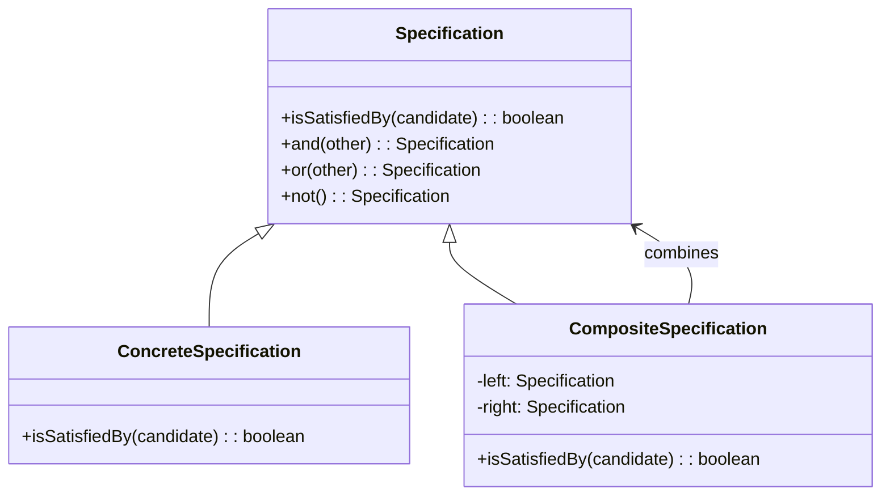

<Hero title="Specification Pattern" subtitle="Encapsulate business rules as composable queryable objects" imageAlt="Specification pattern illustration" size="large" />

## TL;DR

Specification encapsulates business rules as queryable objects implementing a standard interface (isSatisfiedBy). Rules can be composed, tested independently, and reused across filtering, validation, and query contexts. Use it when business logic is complex, rules recur frequently, or you need to dynamically build queries.

## Learning Objectives

- You will understand how to encapsulate business rules as objects.
- You will identify when rules justify separate specification classes.
- You will compose specifications to build complex conditions.
- You will apply specifications to filtering, validation, and query generation.

## Motivating Scenario

An e-commerce system needs to find customers eligible for discount campaigns. Criteria include: account age > 6 months, purchase history > $1000, no recent chargebacks, account not flagged. Scattering these checks throughout code creates duplication. Specification creates reusable rule objects: AgeSpecification, PurchaseHistorySpecification, etc. Rules compose into complex queries (age AND history AND NOT flags). Tests verify rules independently. Queries adapt without touching customer objects.

## Core Concepts

**Specification** encapsulates a business rule as an object. Specifications implement isSatisfiedBy() to test if an object meets criteria. Complex rules compose simpler specifications through and(), or(), not() operations.

Key elements:
- **Specification**: interface defining isSatisfiedBy(candidate)
- **ConcreteSpecification**: implements a specific business rule
- **CompositeSpecification**: combines specifications with logical operators

<Figure caption="Specification structure">

</Figure>

## Practical Example

Implement specifications for customer eligibility.

<Tabs>
<TabItem value="python" label="Python" default>
```python showLineNumbers title="specification.py"
from abc import ABC, abstractmethod

class Customer:
    def __init__(self, age: int, total_spent: float, has_chargeback: bool):
        self.age = age
        self.total_spent = total_spent
        self.has_chargeback = has_chargeback

class Specification(ABC):
    @abstractmethod
    def is_satisfied_by(self, candidate: Customer) -> bool:
        pass

    def and_spec(self, other: 'Specification') -> 'Specification':
        return AndSpecification(self, other)

    def or_spec(self, other: 'Specification') -> 'Specification':
        return OrSpecification(self, other)

    def not_spec(self) -> 'Specification':
        return NotSpecification(self)

class MinimumAgeSpecification(Specification):
    def __init__(self, min_age: int):
        self.min_age = min_age

    def is_satisfied_by(self, candidate: Customer) -> bool:
        return candidate.age >= self.min_age

class MinimumSpendSpecification(Specification):
    def __init__(self, min_spent: float):
        self.min_spent = min_spent

    def is_satisfied_by(self, candidate: Customer) -> bool:
        return candidate.total_spent >= self.min_spent

class NoChargebackSpecification(Specification):
    def is_satisfied_by(self, candidate: Customer) -> bool:
        return not candidate.has_chargeback

class AndSpecification(Specification):
    def __init__(self, left: Specification, right: Specification):
        self.left = left
        self.right = right

    def is_satisfied_by(self, candidate: Customer) -> bool:
        return self.left.is_satisfied_by(candidate) and self.right.is_satisfied_by(candidate)

class OrSpecification(Specification):
    def __init__(self, left: Specification, right: Specification):
        self.left = left
        self.right = right

    def is_satisfied_by(self, candidate: Customer) -> bool:
        return self.left.is_satisfied_by(candidate) or self.right.is_satisfied_by(candidate)

class NotSpecification(Specification):
    def __init__(self, spec: Specification):
        self.spec = spec

    def is_satisfied_by(self, candidate: Customer) -> bool:
        return not self.spec.is_satisfied_by(candidate)

# Usage
customers = [
    Customer(25, 1500, False),
    Customer(20, 500, False),
    Customer(30, 2000, True),
]

age_spec = MinimumAgeSpecification(21)
spend_spec = MinimumSpendSpecification(1000)
no_chargeback = NoChargebackSpecification()

discount_spec = age_spec.and_spec(spend_spec).and_spec(no_chargeback)

for customer in customers:
    if discount_spec.is_satisfied_by(customer):
        print(f"Customer eligible for discount")
    else:
        print(f"Customer not eligible")
```
</TabItem>
<TabItem value="go" label="Go">
```go showLineNumbers title="specification.go"
package main

import "fmt"

type Customer struct {
    Age          int
    TotalSpent   float64
    HasChargeback bool
}

type Specification interface {
    IsSatisfiedBy(candidate *Customer) bool
}

type MinimumAgeSpecification struct {
    MinAge int
}

func (m *MinimumAgeSpecification) IsSatisfiedBy(candidate *Customer) bool {
    return candidate.Age >= m.MinAge
}

type MinimumSpendSpecification struct {
    MinSpent float64
}

func (m *MinimumSpendSpecification) IsSatisfiedBy(candidate *Customer) bool {
    return candidate.TotalSpent >= m.MinSpent
}

type NoChargebackSpecification struct{}

func (n *NoChargebackSpecification) IsSatisfiedBy(candidate *Customer) bool {
    return !candidate.HasChargeback
}

type AndSpecification struct {
    Left  Specification
    Right Specification
}

func (a *AndSpecification) IsSatisfiedBy(candidate *Customer) bool {
    return a.Left.IsSatisfiedBy(candidate) && a.Right.IsSatisfiedBy(candidate)
}

func main() {
    customers := []*Customer{
        {Age: 25, TotalSpent: 1500, HasChargeback: false},
        {Age: 20, TotalSpent: 500, HasChargeback: false},
        {Age: 30, TotalSpent: 2000, HasChargeback: true},
    }

    ageSpec := &MinimumAgeSpecification{MinAge: 21}
    spendSpec := &MinimumSpendSpecification{MinSpent: 1000}
    noChargeback := &NoChargebackSpecification{}

    discountSpec := &AndSpecification{
        Left: &AndSpecification{Left: ageSpec, Right: spendSpec},
        Right: noChargeback,
    }

    for _, customer := range customers {
        if discountSpec.IsSatisfiedBy(customer) {
            fmt.Println("Customer eligible for discount")
        } else {
            fmt.Println("Customer not eligible")
        }
    }
}
```
</TabItem>
<TabItem value="nodejs" label="Node.js">
```javascript showLineNumbers title="specification.js"
class Customer {
    constructor(age, totalSpent, hasChargeback) {
        this.age = age;
        this.totalSpent = totalSpent;
        this.hasChargeback = hasChargeback;
    }
}

class Specification {
    isSatisfiedBy(candidate) {
        throw new Error('isSatisfiedBy() must be implemented');
    }

    and(other) {
        return new AndSpecification(this, other);
    }

    or(other) {
        return new OrSpecification(this, other);
    }

    not() {
        return new NotSpecification(this);
    }
}

class MinimumAgeSpecification extends Specification {
    constructor(minAge) {
        super();
        this.minAge = minAge;
    }

    isSatisfiedBy(candidate) {
        return candidate.age >= this.minAge;
    }
}

class MinimumSpendSpecification extends Specification {
    constructor(minSpent) {
        super();
        this.minSpent = minSpent;
    }

    isSatisfiedBy(candidate) {
        return candidate.totalSpent >= this.minSpent;
    }
}

class NoChargebackSpecification extends Specification {
    isSatisfiedBy(candidate) {
        return !candidate.hasChargeback;
    }
}

class AndSpecification extends Specification {
    constructor(left, right) {
        super();
        this.left = left;
        this.right = right;
    }

    isSatisfiedBy(candidate) {
        return this.left.isSatisfiedBy(candidate) && this.right.isSatisfiedBy(candidate);
    }
}

// Usage
const customers = [
    new Customer(25, 1500, false),
    new Customer(20, 500, false),
    new Customer(30, 2000, true),
];

const ageSpec = new MinimumAgeSpecification(21);
const spendSpec = new MinimumSpendSpecification(1000);
const noChargeback = new NoChargebackSpecification();

const discountSpec = ageSpec.and(spendSpec).and(noChargeback);

customers.forEach(customer => {
    if (discountSpec.isSatisfiedBy(customer)) {
        console.log('Customer eligible for discount');
    } else {
        console.log('Customer not eligible');
    }
});
```
</TabItem>
</Tabs>

## When to Use / When Not to Use

<Vs highlight={[1]} items={[
{
        label: "Use Specification",
        points: ["Business rules are complex and frequently change", "Same criteria used in multiple contexts (validation, filtering, queries)", "Rules should be composable and testable independently", "Domain-driven design with rich business logic", "Query complexity grows dynamically based on user input"],
    highlightTone: "positive"
  },
{
        label: "Avoid Specification",
        points: ["Rules are simple and used only once", "No need for composability or reuse", "Query builders or ORM tools are more appropriate", "Business logic is stable and rarely changes", "Performance requirements demand direct database queries"],
    highlightTone: "warning"
  }
]} />

## Patterns and Pitfalls

<Showcase  sections={[{
            title: "Composable Specifications",
            description: "Design specifications to combine freely. Use and(), or(), not() to build complex rules from simple ones.",
            codeUrl: "#practical-example"
        }, {
            title: "Testability",
            description: "Test specifications independently with unit tests before composing them.",
            codeUrl: "#practical-example"
        }, {
            title: "Repository Integration",
            description: "Translate specifications to database queries in repositories for efficient filtering.",
            codeUrl: "#practical-example"
        }, {
            title: "Reusability Across Layers",
            description: "Use same specifications in domain logic, API validation, and repository queries.",
            codeUrl: "#practical-example"
        }]}
/>

## Design Review Checklist

<Checklist
    items={[
        "Is each specification focused on a single business rule?",
        "Can specifications be composed safely without side effects?",
        "Are specification implementations testable in isolation?",
        "Are and/or/not operations well-defined and documented?",
        "Can specifications be translated to database queries (if needed)?",
        "Is composite specification nesting depth reasonable?",
        "Are edge cases and null values handled appropriately?"
    ]}
/>

## Self-Check

1. **How does Specification differ from Strategy?** Strategy selects algorithms; Specification encapsulates rules for testing/querying.

2. **Can specifications be translated to SQL queries?** Yes—sophisticated implementations can convert specifications to parameterized SQL for database-side filtering.

3. **What happens if specifications become too complex?** Reconsider breaking them into smaller rules or using domain events to express complex conditions.

:::info One Takeaway
Specification encapsulates reusable business rules as composable objects. Use it when rules recur across validation, filtering, and querying contexts.

:::

## Advanced Applications

### E-Commerce Eligibility Specifications

```python
# Complex eligibility rules for promotions/loyalty tiers

class MinimumPurchaseSpecification(Specification):
    def __init__(self, min_amount):
        self.min_amount = min_amount

    def is_satisfied_by(self, customer):
        return customer.total_purchases >= self.min_amount

class AccountAgeSpecification(Specification):
    def __init__(self, min_months):
        self.min_months = min_months

    def is_satisfied_by(self, customer):
        from datetime import datetime, timedelta
        min_date = datetime.now() - timedelta(days=30 * self.min_months)
        return customer.created_at <= min_date

class NoChargebacksSpecification(Specification):
    def is_satisfied_by(self, customer):
        return customer.chargebacks_count == 0

class NoReturnsAbuseSpecification(Specification):
    def __init__(self, max_returns_percent):
        self.max_returns_percent = max_returns_percent

    def is_satisfied_by(self, customer):
        if customer.total_orders == 0:
            return True
        return_rate = customer.returns_count / customer.total_orders
        return return_rate <= self.max_returns_percent

# Compose complex eligibility rules
prime_eligible = (
    MinimumPurchaseSpecification(1000)
    .and_spec(AccountAgeSpecification(6))
    .and_spec(NoChargebacksSpecification())
    .and_spec(NoReturnsAbuseSpecification(0.05))
)

# Filter customers for prime eligibility
eligible_customers = [c for c in customers if prime_eligible.is_satisfied_by(c)]
```

### Search and Filtering Specifications

```python
# Product search with composable filters

class PriceRangeSpecification(Specification):
    def __init__(self, min_price, max_price):
        self.min_price = min_price
        self.max_price = max_price

    def is_satisfied_by(self, product):
        return self.min_price <= product.price <= self.max_price

class InStockSpecification(Specification):
    def is_satisfied_by(self, product):
        return product.inventory > 0

class BrandSpecification(Specification):
    def __init__(self, brand):
        self.brand = brand

    def is_satisfied_by(self, product):
        return product.brand == self.brand

class RatingSpecification(Specification):
    def __init__(self, min_rating):
        self.min_rating = min_rating

    def is_satisfied_by(self, product):
        return product.average_rating >= self.min_rating

# Build search filters from user input
filters = (
    PriceRangeSpecification(50, 200)
    .and_spec(InStockSpecification())
    .and_spec(BrandSpecification('Nike'))
    .and_spec(RatingSpecification(4.0))
)

# Apply to product catalog
matching_products = [p for p in catalog if filters.is_satisfied_by(p)]
```

### Database Query Integration

```python
# Translate specifications to efficient SQL queries

class SpecificationToSQL:
    @staticmethod
    def to_sql(spec: Specification, entity_type: str):
        """Convert specification to SQL WHERE clause."""
        if isinstance(spec, MinimumPurchaseSpecification):
            return f"total_purchases >= {spec.min_amount}"
        elif isinstance(spec, InStockSpecification):
            return "inventory > 0"
        elif isinstance(spec, PriceRangeSpecification):
            return f"price BETWEEN {spec.min_price} AND {spec.max_price}"
        elif isinstance(spec, AndSpecification):
            left = SpecificationToSQL.to_sql(spec.left, entity_type)
            right = SpecificationToSQL.to_sql(spec.right, entity_type)
            return f"({left}) AND ({right})"
        elif isinstance(spec, OrSpecification):
            left = SpecificationToSQL.to_sql(spec.left, entity_type)
            right = SpecificationToSQL.to_sql(spec.right, entity_type)
            return f"({left}) OR ({right})"
        # ... handle other specifications

# Execute database query
spec = PriceRangeSpecification(50, 200).and_spec(InStockSpecification())
where_clause = SpecificationToSQL.to_sql(spec, 'Product')
# where_clause = "(price BETWEEN 50 AND 200) AND (inventory > 0)"

# Database-driven filtering: efficient, no in-memory filtering
results = db.query(f"SELECT * FROM products WHERE {where_clause}")
```

### Testing Specifications

```python
def test_minimum_age_specification():
    from datetime import datetime, timedelta

    spec = MinimumAgeSpecification(18)

    young_customer = Customer(age=17)
    adult_customer = Customer(age=25)

    assert not spec.is_satisfied_by(young_customer)
    assert spec.is_satisfied_by(adult_customer)

def test_composite_specification():
    age_spec = MinimumAgeSpecification(21)
    spend_spec = MinimumSpendSpecification(1000)

    composite = age_spec.and_spec(spend_spec)

    # Customer fails one condition
    young_shopper = Customer(age=20, total_spent=2000)
    assert not composite.is_satisfied_by(young_shopper)

    # Customer fails other condition
    teen_big_spender = Customer(age=25, total_spent=500)
    assert not composite.is_satisfied_by(teen_big_spender)

    # Customer satisfies both
    eligible = Customer(age=25, total_spent=2000)
    assert composite.is_satisfied_by(eligible)

def test_specification_composition():
    """Test that specifications compose correctly."""
    spec_a = MinimumAgeSpecification(18)
    spec_b = MinimumSpendSpecification(100)
    spec_c = NoChargebackSpecification()

    # Complex composition
    complex_spec = spec_a.and_spec(spec_b).and_spec(spec_c).or_spec(spec_a.not_spec())

    # Should have clear semantics after composition
    customer = Customer(age=25, total_spent=150, has_chargeback=False)
    result = complex_spec.is_satisfied_by(customer)
    # Result should be predictable and testable
```

## Migration Path

**From Scattered Business Logic**:
```python
# Before: Business logic scattered in validation, filtering, querying
if customer.age >= 21 and customer.total_spent >= 1000 and not customer.has_chargeback:
    apply_discount()

# And again in filtering
eligible = [c for c in customers if c.age >= 21 and c.total_spent >= 1000 and not c.has_chargeback]

# And again in queries
SELECT * FROM customers WHERE age >= 21 AND total_spent >= 1000 AND chargeback_count = 0
```

**To Unified Specification**:
```python
# After: Single specification, reused everywhere
eligibility_spec = (
    MinimumAgeSpecification(21)
    .and_spec(MinimumSpendSpecification(1000))
    .and_spec(NoChargebackSpecification())
)

# Validation
if eligibility_spec.is_satisfied_by(customer):
    apply_discount()

# Filtering
eligible = [c for c in customers if eligibility_spec.is_satisfied_by(c)]

# Querying
where = SpecificationToSQL.to_sql(eligibility_spec)
SELECT * FROM customers WHERE {where}
```

**Benefits**:
- Single source of truth for business rules
- Consistent logic across validation, filtering, querying
- Easier to test business rules in isolation
- Easier to extend with new rules (compose new specifications)

## Next Steps

- [Combine with Repository pattern for database queries](/docs/design-patterns/creational/factory-method)
- [Use with Domain-Driven Design for business logic](/docs/design-patterns/behavioral/specification)
- [Study Observer pattern for reactive rule evaluation](/docs/design-patterns/behavioral/observer-pub-sub)
- Implement specifications for your domain and measure code duplication reduction

## References

- Gang of Four, "Design Patterns: Elements of Reusable Object-Oriented Software"
- Martin Fowler on [Specification Pattern](https://martinfowler.com/apsupp/spec.pdf) ↗️
- Eric Evans, "Domain-Driven Design" (Specification chapter) ↗️