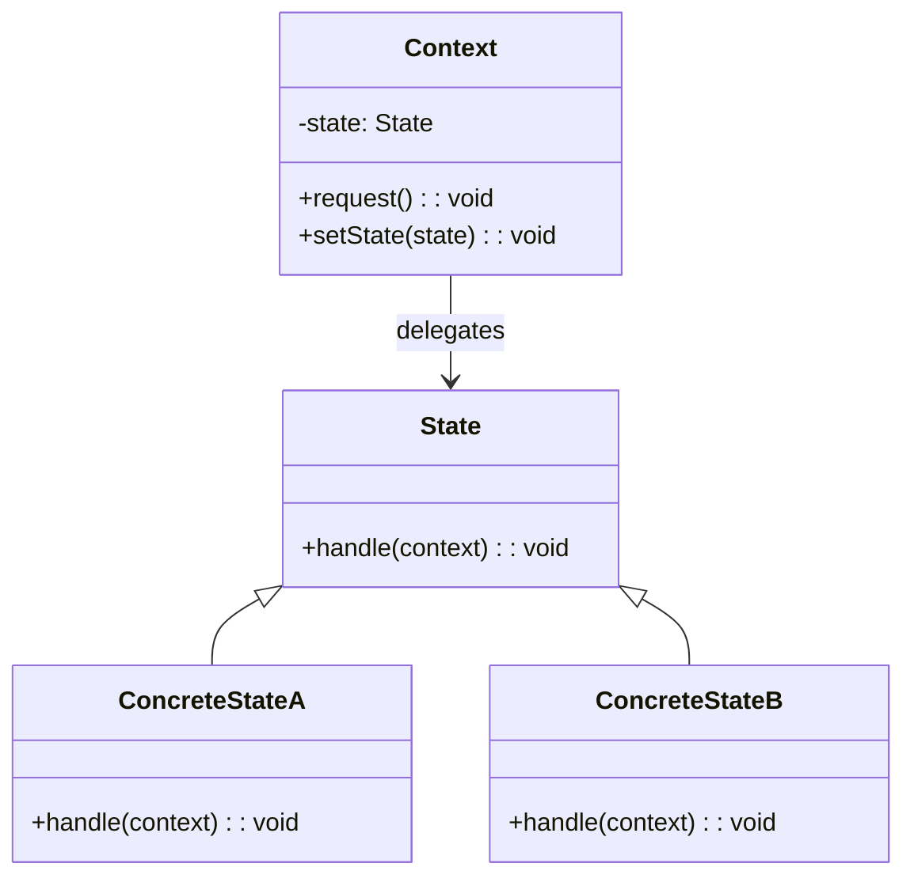

<Hero title="State Pattern" subtitle="Encapsulate state-specific behavior without conditional logic" imageAlt="State pattern illustration" size="large" />

## TL;DR

State encapsulates state-specific behavior in separate classes. Objects delegate behavior to their current state object, eliminating complex conditional logic. When state changes, the context switches to a new state object. Use it when behavior varies dramatically based on state, or when conditional logic becomes unwieldy.

## Learning Objectives

- You will understand state machines and their implementation challenges.
- You will identify when state-specific logic justifies separate classes.
- You will implement state classes with behavior isolation.
- You will design state transitions that are clear and maintainable.

## Motivating Scenario

A TCP connection has states: Established, Listen, Closed. The send() method behaves differently in each state. A naive implementation uses cascading if-else checks. Adding states or transitions becomes error-prone. State pattern delegates behavior to state objects. The connection holds a reference to its current state and calls methods on it. Each state knows which transitions are valid.

## Core Concepts

**State** encapsulates behavior specific to a state. The context (connection object) delegates work to its current state, which handles the request and may initiate state transitions.

Key elements:
- **State**: interface defining state-specific methods
- **ConcreteState**: implements behavior for a particular state
- **Context**: holds current state and delegates requests to it

<Figure caption="State structure">

</Figure>

## Practical Example

Implement a TCP connection with state behavior.

<Tabs>
<TabItem value="python" label="Python" default>
```python showLineNumbers title="state.py"
from abc import ABC, abstractmethod

class State(ABC):
    @abstractmethod
    def open(self, context: 'TCPConnection') -> None:
        pass

    @abstractmethod
    def close(self, context: 'TCPConnection') -> None:
        pass

    @abstractmethod
    def send(self, context: 'TCPConnection') -> None:
        pass

class TCPEstablished(State):
    def open(self, context):
        print("Connection already open")

    def close(self, context):
        print("Closing connection")
        context.set_state(TCPClosed())

    def send(self, context):
        print("Sending data")

class TCPListen(State):
    def open(self, context):
        print("Accepting connection")
        context.set_state(TCPEstablished())

    def close(self, context):
        print("Closing listen socket")
        context.set_state(TCPClosed())

    def send(self, context):
        print("Cannot send in listen state")

class TCPClosed(State):
    def open(self, context):
        print("Opening connection")
        context.set_state(TCPListen())

    def close(self, context):
        print("Connection already closed")

    def send(self, context):
        print("Cannot send on closed connection")

class TCPConnection:
    def __init__(self):
        self._state = TCPClosed()

    def set_state(self, state: State) -> None:
        self._state = state

    def open(self) -> None:
        self._state.open(self)

    def close(self) -> None:
        self._state.close(self)

    def send(self) -> None:
        self._state.send(self)

# Usage
conn = TCPConnection()
conn.open()
conn.send()
conn.close()
```
</TabItem>
<TabItem value="go" label="Go">
```go showLineNumbers title="state.go"
package main

import "fmt"

type State interface {
    Open(context *TCPConnection)
    Close(context *TCPConnection)
    Send(context *TCPConnection)
}

type TCPEstablished struct{}

func (t *TCPEstablished) Open(context *TCPConnection) {
    fmt.Println("Connection already open")
}

func (t *TCPEstablished) Close(context *TCPConnection) {
    fmt.Println("Closing connection")
    context.SetState(&TCPClosed{})
}

func (t *TCPEstablished) Send(context *TCPConnection) {
    fmt.Println("Sending data")
}

type TCPListen struct{}

func (t *TCPListen) Open(context *TCPConnection) {
    fmt.Println("Accepting connection")
    context.SetState(&TCPEstablished{})
}

func (t *TCPListen) Close(context *TCPConnection) {
    fmt.Println("Closing listen socket")
    context.SetState(&TCPClosed{})
}

func (t *TCPListen) Send(context *TCPConnection) {
    fmt.Println("Cannot send in listen state")
}

type TCPClosed struct{}

func (t *TCPClosed) Open(context *TCPConnection) {
    fmt.Println("Opening connection")
    context.SetState(&TCPListen{})
}

func (t *TCPClosed) Close(context *TCPConnection) {
    fmt.Println("Connection already closed")
}

func (t *TCPClosed) Send(context *TCPConnection) {
    fmt.Println("Cannot send on closed connection")
}

type TCPConnection struct {
    state State
}

func (c *TCPConnection) SetState(state State) {
    c.state = state
}

func (c *TCPConnection) Open() {
    c.state.Open(c)
}

func (c *TCPConnection) Close() {
    c.state.Close(c)
}

func (c *TCPConnection) Send() {
    c.state.Send(c)
}

func main() {
    conn := &TCPConnection{state: &TCPClosed{}}
    conn.Open()
    conn.Send()
    conn.Close()
}
```
</TabItem>
<TabItem value="nodejs" label="Node.js">
```javascript showLineNumbers title="state.js"
class State {
    open(context) {
        throw new Error('open() must be implemented');
    }

    close(context) {
        throw new Error('close() must be implemented');
    }

    send(context) {
        throw new Error('send() must be implemented');
    }
}

class TCPEstablished extends State {
    open(context) {
        console.log('Connection already open');
    }

    close(context) {
        console.log('Closing connection');
        context.setState(new TCPClosed());
    }

    send(context) {
        console.log('Sending data');
    }
}

class TCPListen extends State {
    open(context) {
        console.log('Accepting connection');
        context.setState(new TCPEstablished());
    }

    close(context) {
        console.log('Closing listen socket');
        context.setState(new TCPClosed());
    }

    send(context) {
        console.log('Cannot send in listen state');
    }
}

class TCPClosed extends State {
    open(context) {
        console.log('Opening connection');
        context.setState(new TCPListen());
    }

    close(context) {
        console.log('Connection already closed');
    }

    send(context) {
        console.log('Cannot send on closed connection');
    }
}

class TCPConnection {
    constructor() {
        this.state = new TCPClosed();
    }

    setState(state) {
        this.state = state;
    }

    open() {
        this.state.open(this);
    }

    close() {
        this.state.close(this);
    }

    send() {
        this.state.send(this);
    }
}

// Usage
const conn = new TCPConnection();
conn.open();
conn.send();
conn.close();
```
</TabItem>
</Tabs>

## When to Use / When Not to Use

<Vs highlight={[1]} items={[
{
        label: "Use State",
        points: ["Behavior varies dramatically based on state", "Many conditional branches checking state", "State transitions are complex or numerous", "State-specific logic should be isolated", "States have their own operations and rules"],
    highlightTone: "positive"
  },
{
        label: "Avoid State",
        points: ["Few states with simple behavior differences", "One or two conditional checks are sufficient", "State transitions are rare or trivial", "Behavior variations are minimal", "Simple flags or booleans work"],
    highlightTone: "warning"
  }
]} />

## Patterns and Pitfalls

<Showcase  sections={[{
            title: "State Transitions",
            description: "States can transition themselves or context can manage transitions. Choose consistency.",
            codeUrl: "#practical-example"
        }, {
            title: "Shared State Objects",
            description: "Stateless state objects can be reused across multiple contexts for memory efficiency.",
            codeUrl: "#practical-example"
        }, {
            title: "Entry and Exit Actions",
            description: "Implement onEnter() and onExit() to handle setup and cleanup when states change.",
            codeUrl: "#practical-example"
        }, {
            title: "Illegal Transitions",
            description: "Prevent invalid transitions by throwing exceptions in state methods.",
            codeUrl: "#practical-example"
        }]}
/>

## Design Review Checklist

<Checklist
    items={[
        "Does each state class have a single, well-defined responsibility?",
        "Are state transitions explicit and validated?",
        "Are illegal state transitions prevented?",
        "Is the initial state clearly established?",
        "Can states be shared (stateless) or must each context have instances?",
        "Is the transition logic clear and maintainable?",
        "Are onEnter/onExit hooks used for cleanup and setup?"
    ]}
/>

## State Machines and Visual Modeling

Complex state systems benefit from visual representation:

```
State Machine Diagram: Order Processing

                ┌─────────────────┐
                │     Pending     │
                └────────┬────────┘
                         │ payment_received()
                         ▼
                ┌─────────────────┐
                │   Processing    │
                └────────┬────────┘
                         │ items_packed()
                         ▼
                ┌─────────────────┐
        ┌──────▶│    Shipped      │──────┐
        │       └────────┬────────┘      │
        │                │               │ delivered()
        │ cancel()       │               ▼
        │                │        ┌─────────────────┐
        │                │        │   Delivered     │
        │                │        └─────────────────┘
        │                │
        │       ┌────────▼────────┐
        └───────│   Cancelled     │
                └─────────────────┘

Implementation: Each state is a class or enum value
Transitions: Methods that move from one state to another
Guard conditions: Only certain transitions allowed from each state
```

### Guard Conditions

Some transitions should be blocked:

```python
class OrderState(Enum):
    PENDING = 1
    PROCESSING = 2
    SHIPPED = 3
    DELIVERED = 4
    CANCELLED = 5

class Order:
    def __init__(self):
        self.state = OrderState.PENDING

    def cancel(self):
        """Can cancel from Pending or Processing, not Shipped."""
        if self.state in [OrderState.PENDING, OrderState.PROCESSING]:
            self.state = OrderState.CANCELLED
        else:
            raise InvalidTransition(
                f"Cannot cancel order in {self.state} state"
            )

    def ship(self):
        """Can only ship from Processing."""
        if self.state == OrderState.PROCESSING:
            self.state = OrderState.SHIPPED
        else:
            raise InvalidTransition(
                f"Cannot ship order in {self.state} state"
            )

# Usage
order = Order()
order.cancel()  # OK: PENDING → CANCELLED
order.ship()    # ERROR: Cannot ship from CANCELLED
```

## State with Entry/Exit Actions

Perform cleanup and setup when entering/exiting states:

```python
class OrderState(ABC):
    @abstractmethod
    def enter(self, order):
        """Called when entering this state."""
        pass

    @abstractmethod
    def exit(self, order):
        """Called when leaving this state."""
        pass

class ProcessingState(OrderState):
    def enter(self, order):
        """Set up processing."""
        order.processing_started_at = datetime.now()
        order.send_notification('Order is being processed')
        order.reserve_inventory()  # Allocate stock

    def exit(self, order):
        """Clean up processing."""
        order.save_processing_duration()
        order.log_event('Left processing state')

class ShippedState(OrderState):
    def enter(self, order):
        """Prepare for shipment."""
        order.scheduled_delivery = datetime.now() + timedelta(days=3)
        order.send_notification('Order shipped')
        order.create_shipment_label()

    def exit(self, order):
        """Clean up shipping state."""
        pass  # No cleanup needed

class Order:
    def __init__(self):
        self._state = PendingState()

    def set_state(self, new_state):
        """Transition: exit old, enter new."""
        self._state.exit(self)
        self._state = new_state
        self._state.enter(self)
```

## Hierarchical States

For complex state machines, use sub-states:

```python
# Order can be either Active or Completed
# Active has sub-states: Pending, Processing, Shipped
# Completed has sub-states: Delivered, Cancelled, Returned

class OrderState(ABC):
    @abstractmethod
    def is_active(self):
        pass

class ActiveState(OrderState):
    def is_active(self):
        return True

class CompletedState(OrderState):
    def is_active(self):
        return False

class PendingState(ActiveState):
    pass

class ShippedState(ActiveState):
    pass

class DeliveredState(CompletedState):
    pass

class ReturnedState(CompletedState):
    pass

# Usage
order = Order()
assert order.is_active()  # True
order.deliver()
assert not order.is_active()  # False
```

## Self-Check

1. **How does State differ from Strategy?** State represents object behavior that changes, with transitions managed by state objects. Strategy is selected externally and doesn't transition.

2. **Can a state transition to itself?** Yes—some actions might keep the state unchanged, which is valid and often required.

3. **What's the advantage over large if-else blocks?** State encapsulates behavior per state, making code modular, testable, and easier to extend with new states.

4. **How would you represent impossible transitions (e.g., can't ship a cancelled order)?** Use guard conditions in the transition method, or throw exceptions for invalid transitions.

5. **When would you use entry/exit actions?** When state transitions require setup (allocate resources) or cleanup (release resources, send notifications).

:::info One Takeaway
State eliminates state-based conditional logic by delegating to state objects. Use it when internal states drive dramatically different behavior. Add entry/exit actions for clean resource management and guard conditions to prevent invalid transitions.

:::

## Next Steps

- [Compare with Strategy pattern for algorithm selection](/docs/design-patterns/behavioral/strategy)
- [Combine with Template Method for state behavior structure](/docs/design-patterns/behavioral/template-method)
- [Study Null Object for handling missing states](/docs/design-patterns/behavioral/null-object)

## References

- Gang of Four, "Design Patterns: Elements of Reusable Object-Oriented Software"
- Refactoring Guru's [State](https://refactoring.guru/design-patterns/state) ↗️
- Martin Fowler on [State Machines](https://martinfowler.com/articles/state-machines.html) ↗️