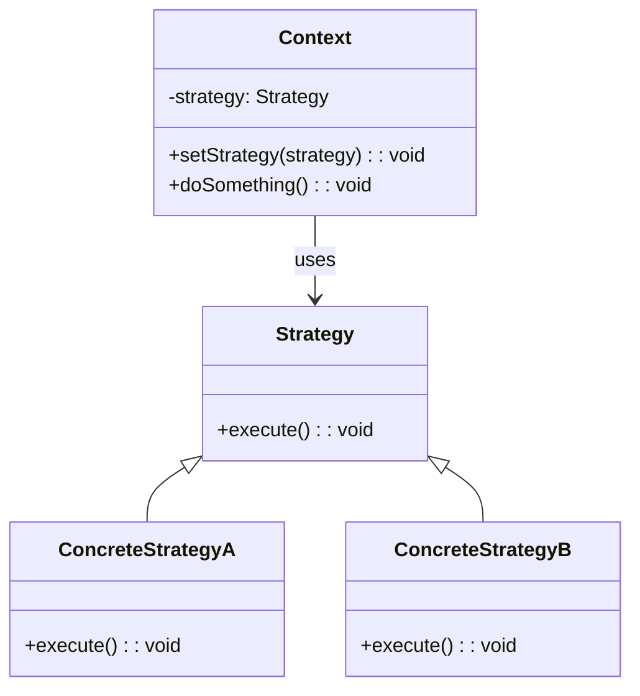

<Hero title="Strategy Pattern" subtitle="Encapsulate algorithms to make them interchangeable at runtime" imageAlt="Strategy pattern illustration" size="large" />

## TL;DR

Strategy encapsulates alternative algorithms into separate classes implementing a common interface. Clients select and use strategies at runtime without knowing implementation details. Use it when an object needs to choose from multiple algorithms, behavior should be selected dynamically, or you want to avoid if-else chains.

## Learning Objectives

- You will understand when to extract algorithms into strategy objects.
- You will design strategy interfaces that unify diverse algorithms.
- You will implement context objects that switch strategies.
- You will parameterize algorithms without modifying client code.

## Motivating Scenario

A payment processor supports multiple payment methods: credit card, PayPal, cryptocurrency. The checkout process iterates through payment methods, using complex if-else logic for each. Adding a new payment method requires modifying checkout code. Strategy encapsulates each payment method as a PaymentStrategy. Checkout delegates to the selected strategy, unaware of implementation details. New payment methods are added without touching checkout.

## Core Concepts

**Strategy** defines a family of algorithms, encapsulating each so they're interchangeable. The context uses a strategy without knowing which concrete variant it uses. This enables runtime algorithm selection.

Key elements:
- **Strategy**: interface defining the algorithm contract
- **ConcreteStrategy**: implements a specific algorithm
- **Context**: uses a strategy; often allows switching at runtime

<Figure caption="Strategy structure">

</Figure>

## Practical Example

Implement payment strategies for different methods.

<Tabs>
<TabItem value="python" label="Python" default>
```python showLineNumbers title="strategy.py"
from abc import ABC, abstractmethod

class PaymentStrategy(ABC):
    @abstractmethod
    def pay(self, amount: float) -> None:
        pass

class CreditCardPayment(PaymentStrategy):
    def __init__(self, card_number: str):
        self.card_number = card_number

    def pay(self, amount: float) -> None:
        print(f"Processing ${amount} via credit card {self.card_number[-4:]}")

class PayPalPayment(PaymentStrategy):
    def __init__(self, email: str):
        self.email = email

    def pay(self, amount: float) -> None:
        print(f"Processing ${amount} via PayPal ({self.email})")

class CryptoPayment(PaymentStrategy):
    def __init__(self, wallet: str):
        self.wallet = wallet

    def pay(self, amount: float) -> None:
        print(f"Processing ${amount} via crypto ({self.wallet})")

class ShoppingCart:
    def __init__(self, strategy: PaymentStrategy):
        self.strategy = strategy
        self.total = 0.0

    def add_item(self, price: float) -> None:
        self.total += price

    def set_payment_method(self, strategy: PaymentStrategy) -> None:
        self.strategy = strategy

    def checkout(self) -> None:
        self.strategy.pay(self.total)

# Usage
cart = ShoppingCart(CreditCardPayment("1234567890123456"))
cart.add_item(29.99)
cart.add_item(15.50)
cart.checkout()

cart.set_payment_method(PayPalPayment("user@example.com"))
cart.checkout()
```
</TabItem>
<TabItem value="go" label="Go">
```go showLineNumbers title="strategy.go"
package main

import "fmt"

type PaymentStrategy interface {
    Pay(amount float64)
}

type CreditCardPayment struct {
    CardNumber string
}

func (c *CreditCardPayment) Pay(amount float64) {
    fmt.Printf("Processing $%.2f via credit card %s\n", amount, c.CardNumber[len(c.CardNumber)-4:])
}

type PayPalPayment struct {
    Email string
}

func (p *PayPalPayment) Pay(amount float64) {
    fmt.Printf("Processing $%.2f via PayPal (%s)\n", amount, p.Email)
}

type ShoppingCart struct {
    strategy PaymentStrategy
    total    float64
}

func (s *ShoppingCart) SetPaymentMethod(strategy PaymentStrategy) {
    s.strategy = strategy
}

func (s *ShoppingCart) AddItem(price float64) {
    s.total += price
}

func (s *ShoppingCart) Checkout() {
    s.strategy.Pay(s.total)
}

func main() {
    cart := &ShoppingCart{strategy: &CreditCardPayment{CardNumber: "1234567890123456"}}
    cart.AddItem(29.99)
    cart.AddItem(15.50)
    cart.Checkout()

    cart.SetPaymentMethod(&PayPalPayment{Email: "user@example.com"})
    cart.Checkout()
}
```
</TabItem>
<TabItem value="nodejs" label="Node.js">
```javascript showLineNumbers title="strategy.js"
class PaymentStrategy {
    pay(amount) {
        throw new Error('pay() must be implemented');
    }
}

class CreditCardPayment extends PaymentStrategy {
    constructor(cardNumber) {
        super();
        this.cardNumber = cardNumber;
    }

    pay(amount) {
        console.log(`Processing $${amount.toFixed(2)} via credit card ${this.cardNumber.slice(-4)}`);
    }
}

class PayPalPayment extends PaymentStrategy {
    constructor(email) {
        super();
        this.email = email;
    }

    pay(amount) {
        console.log(`Processing $${amount.toFixed(2)} via PayPal (${this.email})`);
    }
}

class ShoppingCart {
    constructor(strategy) {
        this.strategy = strategy;
        this.total = 0;
    }

    addItem(price) {
        this.total += price;
    }

    setPaymentMethod(strategy) {
        this.strategy = strategy;
    }

    checkout() {
        this.strategy.pay(this.total);
    }
}

// Usage
const cart = new ShoppingCart(new CreditCardPayment('1234567890123456'));
cart.addItem(29.99);
cart.addItem(15.50);
cart.checkout();

cart.setPaymentMethod(new PayPalPayment('user@example.com'));
cart.checkout();
```
</TabItem>
</Tabs>

## When to Use / When Not to Use

<Vs highlight={[1]} items={[
{
        label: "Use Strategy",
        points: ["Multiple algorithms for the same task exist", "Algorithm selection should be dynamic at runtime", "Complex if-else chains check algorithm variants", "Different data or conditions favor different algorithms", "New algorithms may be added without modifying clients"],
    highlightTone: "positive"
  },
{
        label: "Avoid Strategy",
        points: ["Only one algorithm or choice is needed", "Algorithm selection is fixed at compile time", "Algorithms are too simple to justify encapsulation", "Performance overhead of indirection is unacceptable", "Strategy switching happens rarely if ever"],
    highlightTone: "warning"
  }
]} />

## Patterns and Pitfalls

<Showcase  sections={[{
            title: "Parameterized Strategies",
            description: "Pass data to strategies via constructor or method parameters to avoid tight coupling.",
            codeUrl: "#practical-example"
        }, {
            title: "Default Strategy",
            description: "Provide a sensible default strategy so context works out of the box.",
            codeUrl: "#practical-example"
        }, {
            title: "Strategy Composition",
            description: "Combine strategies to build complex algorithms from simpler ones.",
            codeUrl: "#practical-example"
        }, {
            title: "Performance Caching",
            description: "Share immutable strategy instances across multiple contexts for memory efficiency.",
            codeUrl: "#practical-example"
        }]}
/>

## Design Review Checklist

<Checklist
    items={[
        "Is the strategy interface minimal and focused on the algorithm contract?",
        "Can clients select strategies without knowing concrete implementations?",
        "Are all concrete strategies properly implementing the strategy interface?",
        "Is the default strategy sensible and documented?",
        "Can strategies be safely shared across multiple contexts?",
        "Is the performance impact of strategy dispatch acceptable?",
        "Are new strategies easy to add without modifying existing code?"
    ]}
/>

## Advanced Strategy Patterns

### Strategy Factory

Create strategies dynamically based on configuration:

```python
class PaymentStrategyFactory:
    """Factory for creating appropriate payment strategy."""
    _strategies = {
        "credit_card": CreditCardPayment,
        "paypal": PayPalPayment,
        "crypto": CryptoPayment,
        "bank_transfer": BankTransferPayment,
    }

    @staticmethod
    def create(payment_method: str, **kwargs) -> PaymentStrategy:
        """Create strategy for given method."""
        strategy_class = PaymentStrategyFactory._strategies.get(payment_method)

        if not strategy_class:
            raise ValueError(f"Unknown payment method: {payment_method}")

        return strategy_class(**kwargs)

# Usage
strategy = PaymentStrategyFactory.create("credit_card", card_number="1234567890")
cart.set_payment_method(strategy)
```

### Parameterized Strategies

Pass configuration to strategies:

```python
class CompressionStrategy(ABC):
    @abstractmethod
    def compress(self, data: bytes) -> bytes:
        pass

class GzipCompression(CompressionStrategy):
    def __init__(self, compression_level: int = 6):
        self.compression_level = compression_level

    def compress(self, data: bytes) -> bytes:
        import gzip
        return gzip.compress(data, compresslevel=self.compression_level)

class BrotliCompression(CompressionStrategy):
    def __init__(self, quality: int = 4):
        self.quality = quality

    def compress(self, data: bytes) -> bytes:
        import brotli
        return brotli.compress(data, quality=self.quality)

class DataPipeline:
    def __init__(self, compression_strategy: CompressionStrategy):
        self.strategy = compression_strategy

    def process(self, data: bytes) -> bytes:
        return self.strategy.compress(data)

# Usage with different configurations
fast_pipeline = DataPipeline(GzipCompression(compression_level=1))
best_pipeline = DataPipeline(GzipCompression(compression_level=9))
```

### Strategy Composition

Combine multiple strategies:

```python
class SortingStrategy(ABC):
    @abstractmethod
    def sort(self, items: List) -> List:
        pass

class QuickSortStrategy(SortingStrategy):
    def sort(self, items: List) -> List:
        # Quick sort implementation
        return sorted(items)

class MergeSortStrategy(SortingStrategy):
    def sort(self, items: List) -> List:
        # Merge sort implementation
        return sorted(items)

class FilteringStrategy(ABC):
    @abstractmethod
    def filter(self, items: List) -> List:
        pass

class PriceFilterStrategy(FilteringStrategy):
    def __init__(self, min_price: float, max_price: float):
        self.min_price = min_price
        self.max_price = max_price

    def filter(self, items: List) -> List:
        return [item for item in items
                if self.min_price <= item.price <= self.max_price]

class DataProcessor:
    """Composes multiple strategies."""
    def __init__(self, sort_strategy: SortingStrategy,
                 filter_strategy: FilteringStrategy):
        self.sort_strategy = sort_strategy
        self.filter_strategy = filter_strategy

    def process(self, data: List):
        filtered = self.filter_strategy.filter(data)
        sorted_data = self.sort_strategy.sort(filtered)
        return sorted_data

# Usage: Compose different strategies
processor = DataProcessor(
    sort_strategy=QuickSortStrategy(),
    filter_strategy=PriceFilterStrategy(min_price=10, max_price=100)
)
```

### Strategy with Context Sharing

Strategies that share state with context:

```python
class AuthenticationStrategy(ABC):
    @abstractmethod
    def authenticate(self, user: str, password: str) -> bool:
        pass

class LocalAuthStrategy(AuthenticationStrategy):
    def __init__(self, user_db):
        self.user_db = user_db

    def authenticate(self, user: str, password: str) -> bool:
        stored_password = self.user_db.get(user)
        return stored_password and self.verify_password(password, stored_password)

    def verify_password(self, password: str, hashed: str) -> bool:
        import hashlib
        return hashlib.sha256(password.encode()).hexdigest() == hashed

class LDAPAuthStrategy(AuthenticationStrategy):
    def __init__(self, ldap_server: str):
        self.ldap_server = ldap_server

    def authenticate(self, user: str, password: str) -> bool:
        import ldap
        try:
            conn = ldap.initialize(self.ldap_server)
            conn.simple_bind_s(user, password)
            return True
        except ldap.INVALID_CREDENTIALS:
            return False

class OAuth2AuthStrategy(AuthenticationStrategy):
    def __init__(self, oauth_provider):
        self.oauth_provider = oauth_provider

    def authenticate(self, user: str, password: str) -> bool:
        # OAuth doesn't use password auth directly
        # This is for token validation
        return self.oauth_provider.validate_token(password)

class AuthenticationContext:
    def __init__(self, strategy: AuthenticationStrategy):
        self.strategy = strategy

    def login(self, user: str, password: str) -> bool:
        return self.strategy.authenticate(user, password)

    def change_strategy(self, strategy: AuthenticationStrategy):
        self.strategy = strategy

# Usage
user_db = {"alice": "hashed_pwd"}
context = AuthenticationContext(LocalAuthStrategy(user_db))

if context.login("alice", "password"):
    print("Local auth succeeded")

# Switch to LDAP for enterprise users
context.change_strategy(LDAPAuthStrategy("ldap://corporate.com"))
if context.login("alice", "password"):
    print("LDAP auth succeeded")
```

## Strategy vs. Other Patterns

| Pattern | When to Use | Key Difference |
|---------|-----------|----------------|
| **Strategy** | Multiple algorithms for same task | Algorithm chosen externally, no state transitions |
| **State** | Object behavior changes based on state | Object transitions between states, behavior defined by state |
| **Template Method** | Algorithms with similar structure | Inheritance-based; defines algorithm skeleton |
| **Decorator** | Add responsibilities to object | Adds behavior; doesn't replace algorithm |
| **Factory** | Create objects of different types | Creates instances; doesn't define behavior |

## Performance Considerations

Strategy dispatch overhead is minimal:

```python
# Direct function call
def process_fast(data):
    return data * 2

# Strategy pattern
strategy = MultiplyStrategy(2)
result = strategy.execute(data)

# Difference: ~1-2% overhead (negligible in real applications)
# Tradeoff: Worth it for flexibility
```

## Self-Check

1. **How does Strategy differ from State?** Strategy is selected externally and doesn't transition; State changes internally based on transitions.

2. **Can strategies access context data?** Yes—pass context data via constructor or method parameters, but avoid bidirectional dependencies.

3. **What's the advantage over just hardcoding algorithms?** Strategy makes algorithms interchangeable, testable, and extensible without modifying client code.

4. **When should you use Strategy Factory?** When you have many strategies and need to create them based on dynamic configuration or user input.

5. **How do you handle strategies with different requirements?** Use composition and pass required dependencies via constructor. Avoid tight coupling to context.

:::info One Takeaway
Strategy replaces conditional algorithm selection with encapsulated interchangeable objects. Use it when algorithms are numerous, complex, or frequently changing. Combine with Factory for dynamic selection. Keep strategies focused and stateless when possible.

:::

## Next Steps

- [Compare with State pattern for state-based behavior](/docs/design-patterns/behavioral/state)
- [Combine with Factory for dynamic strategy creation](/docs/design-patterns/creational/factory-method)
- [Study Template Method for algorithm structure](/docs/design-patterns/behavioral/template-method)

## References

- Gang of Four, "Design Patterns: Elements of Reusable Object-Oriented Software"
- Refactoring Guru's [Strategy](https://refactoring.guru/design-patterns/strategy) ↗️
- Martin Fowler on [Replace Conditional with Polymorphism](https://martinfowler.com/bliki/ReplaceConditionalWithPolymorphism.html) ↗️