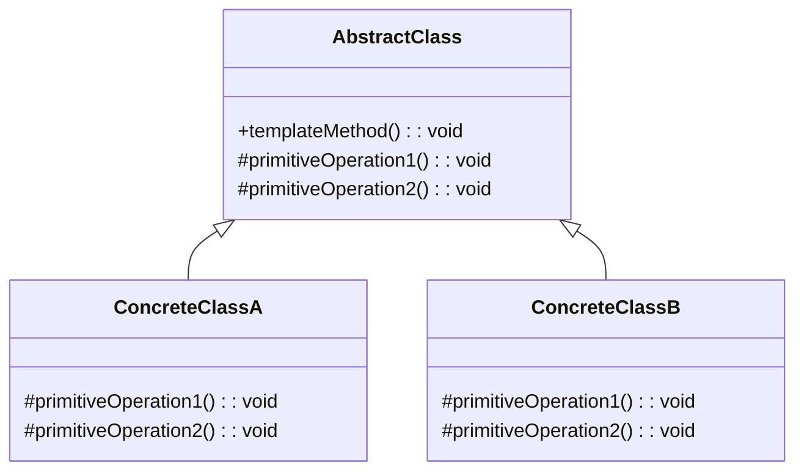

<Hero title="Template Method Pattern" subtitle="Define algorithm skeleton, letting subclasses override specific steps" imageAlt="Template Method pattern illustration" size="large" />

## TL;DR

Template Method defines the skeleton of an algorithm in a base class, deferring specific steps to subclasses. Subclasses override hook methods to customize behavior while the algorithm flow remains unchanged. Use it when algorithms share common structure but vary in implementation, or to prevent code duplication across similar processes.

## Learning Objectives

- You will identify common algorithm structures worth extracting.
- You will design template methods with appropriate hook points.
- You will implement subclasses that override hooks without disrupting flow.
- You will balance flexibility with maintaining the algorithm's integrity.

## Motivating Scenario

Payment processing involves steps: validate, authorize, charge, confirm. Different payment methods share this flow but implement steps differently. Without Template Method, each payment class reimplements the entire flow. Template Method defines the flow once—validate(), authorize(), charge(), confirm()—and lets subclasses override only the methods that differ. Changing the flow updates one place.

## Core Concepts

**Template Method** defines a template (the algorithm skeleton) in a base class. Subclasses override hook methods (the customizable steps) while the template method (calling sequence) remains fixed.

Key elements:
- **AbstractClass**: defines the template method and abstract hook methods
- **ConcreteClass**: implements hook methods specific to a variant
- **HookMethod**: optional method subclasses can override (unlike abstract methods)

<Figure caption="Template Method structure">

</Figure>

## Practical Example

Implement payment processing with Template Method.

<Tabs>
<TabItem value="python" label="Python" default>
```python showLineNumbers title="template_method.py"
from abc import ABC, abstractmethod

class PaymentProcessor(ABC):
    def process_payment(self, amount: float) -> None:
        """Template method defining the payment flow"""
        self.validate(amount)
        self.authorize(amount)
        self.charge(amount)
        self.confirm(amount)

    @abstractmethod
    def validate(self, amount: float) -> None:
        pass

    @abstractmethod
    def authorize(self, amount: float) -> None:
        pass

    @abstractmethod
    def charge(self, amount: float) -> None:
        pass

    def confirm(self, amount: float) -> None:
        """Hook method with default implementation"""
        print(f"Payment of ${amount:.2f} confirmed")

class CreditCardProcessor(PaymentProcessor):
    def validate(self, amount: float) -> None:
        print(f"Validating credit card for ${amount:.2f}")

    def authorize(self, amount: float) -> None:
        print(f"Authorizing credit card transaction")

    def charge(self, amount: float) -> None:
        print(f"Charging ${amount:.2f} to credit card")

class BankTransferProcessor(PaymentProcessor):
    def validate(self, amount: float) -> None:
        print(f"Validating bank account for ${amount:.2f}")

    def authorize(self, amount: float) -> None:
        print(f"Authorizing bank transfer")

    def charge(self, amount: float) -> None:
        print(f"Transferring ${amount:.2f} from bank account")

# Usage
processors = [CreditCardProcessor(), BankTransferProcessor()]
for processor in processors:
    processor.process_payment(99.99)
    print()
```
</TabItem>
<TabItem value="go" label="Go">
```go showLineNumbers title="template_method.go"
package main

import "fmt"

type PaymentProcessor interface {
    ProcessPayment(amount float64)
    Validate(amount float64)
    Authorize(amount float64)
    Charge(amount float64)
    Confirm(amount float64)
}

type BasePaymentProcessor struct{}

func ProcessPaymentTemplate(p PaymentProcessor, amount float64) {
    p.Validate(amount)
    p.Authorize(amount)
    p.Charge(amount)
    p.Confirm(amount)
}

type CreditCardProcessor struct{}

func (c *CreditCardProcessor) ProcessPayment(amount float64) {
    ProcessPaymentTemplate(c, amount)
}

func (c *CreditCardProcessor) Validate(amount float64) {
    fmt.Printf("Validating credit card for $%.2f\n", amount)
}

func (c *CreditCardProcessor) Authorize(amount float64) {
    fmt.Println("Authorizing credit card transaction")
}

func (c *CreditCardProcessor) Charge(amount float64) {
    fmt.Printf("Charging $%.2f to credit card\n", amount)
}

func (c *CreditCardProcessor) Confirm(amount float64) {
    fmt.Printf("Payment of $%.2f confirmed\n", amount)
}

func main() {
    processor := &CreditCardProcessor{}
    processor.ProcessPayment(99.99)
}
```
</TabItem>
<TabItem value="nodejs" label="Node.js">
```javascript showLineNumbers title="template-method.js"
class PaymentProcessor {
    processPayment(amount) {
        this.validate(amount);
        this.authorize(amount);
        this.charge(amount);
        this.confirm(amount);
    }

    validate(amount) {
        throw new Error('validate() must be implemented');
    }

    authorize(amount) {
        throw new Error('authorize() must be implemented');
    }

    charge(amount) {
        throw new Error('charge() must be implemented');
    }

    confirm(amount) {
        console.log(`Payment of $${amount.toFixed(2)} confirmed`);
    }
}

class CreditCardProcessor extends PaymentProcessor {
    validate(amount) {
        console.log(`Validating credit card for $${amount.toFixed(2)}`);
    }

    authorize(amount) {
        console.log('Authorizing credit card transaction');
    }

    charge(amount) {
        console.log(`Charging $${amount.toFixed(2)} to credit card`);
    }
}

class BankTransferProcessor extends PaymentProcessor {
    validate(amount) {
        console.log(`Validating bank account for $${amount.toFixed(2)}`);
    }

    authorize(amount) {
        console.log('Authorizing bank transfer');
    }

    charge(amount) {
        console.log(`Transferring $${amount.toFixed(2)} from bank account`);
    }
}

// Usage
const processors = [new CreditCardProcessor(), new BankTransferProcessor()];
processors.forEach(processor => {
    processor.processPayment(99.99);
    console.log();
});
```
</TabItem>
</Tabs>

## When to Use / When Not to Use

<Vs highlight={[1]} items={[
{
        label: "Use Template Method",
        points: ["Multiple classes share algorithm structure", "Code duplication across similar processes", "Algorithm flow should remain consistent", "Subclasses vary only in specific steps", "You want to prevent subclasses from changing flow order"],
    highlightTone: "positive"
  },
{
        label: "Avoid Template Method",
        points: ["Algorithms are fundamentally different", "Subclasses need to override the entire flow", "Only one or two implementations exist", "Algorithm structure frequently changes", "Composition/Strategy would be more flexible"],
    highlightTone: "warning"
  }
]} />

## Patterns and Pitfalls

<Showcase  sections={[{
            title: "Hook Methods",
            description: "Use protected hook methods for optional customizations and abstract methods for required overrides.",
            codeUrl: "#practical-example"
        }, {
            title: "Inversion of Control",
            description: "Template Method inverts control—subclasses don't call superclass methods; the template calls subclass implementations.",
            codeUrl: "#practical-example"
        }, {
            title: "Step Granularity",
            description: "Choose hook granularity carefully—too few steps limit flexibility; too many create fragmentation.",
            codeUrl: "#practical-example"
        }, {
            title: "Documentation",
            description: "Clearly document the algorithm flow and which steps subclasses should override.",
            codeUrl: "#practical-example"
        }]}
/>

## Design Review Checklist

<Checklist
    items={[
        "Is the algorithm flow in the template method clear and well-documented?",
        "Are hook method names descriptive of what they do?",
        "Are abstract methods truly required, or should they be optional hooks?",
        "Can subclasses safely override hooks without breaking the flow?",
        "Is the step granularity appropriate for intended variations?",
        "Do subclasses avoid calling super() inappropriately?",
        "Is there duplication among subclass implementations that could be lifted?"
    ]}
/>

## Template Method in Different Domains

### Web Request Processing
```python
class RequestHandler(ABC):
    def handle_request(self, request):
        # Template method: fixed flow
        self.authenticate(request)
        self.authorize(request)
        result = self.process(request)
        self.log_result(request, result)
        return result

    @abstractmethod
    def authenticate(self, request): pass

    @abstractmethod
    def authorize(self, request): pass

    @abstractmethod
    def process(self, request): pass

    def log_result(self, request, result):
        # Hook method with default implementation
        logger.info(f"{request.path} -> {result.status}")

class PaymentHandler(RequestHandler):
    def authenticate(self, request):
        # Verify API key
        if not request.headers.get('X-API-Key'):
            raise AuthError("Missing API key")

    def authorize(self, request):
        # Check transaction limit
        if request.amount > self.transaction_limit:
            raise AuthError("Amount exceeds limit")

    def process(self, request):
        return self.charge_card(request.card, request.amount)
```

### Data Processing Pipeline
```python
class DataProcessor(ABC):
    def process_file(self, filename):
        # Template: load → validate → transform → save
        data = self.load_data(filename)
        self.validate_data(data)
        processed = self.transform_data(data)
        self.save_results(processed)
        return processed

    @abstractmethod
    def load_data(self, filename): pass

    @abstractmethod
    def validate_data(self, data): pass

    @abstractmethod
    def transform_data(self, data): pass

    def save_results(self, data):
        # Default: save to JSON
        json.dump(data, open('results.json', 'w'))

class CSVProcessor(DataProcessor):
    def load_data(self, filename):
        return pd.read_csv(filename)

    def validate_data(self, data):
        if data.empty:
            raise ValueError("Empty data")
        if data.isnull().any().any():
            raise ValueError("Contains null values")

    def transform_data(self, data):
        return data.dropna().apply(normalize_values)

class DatabaseProcessor(DataProcessor):
    def load_data(self, filename):
        query = f"SELECT * FROM {filename}"
        return db.query(query)

    def validate_data(self, data):
        # Database validation logic
        pass

    def transform_data(self, data):
        # Database transformation logic
        pass

    def save_results(self, data):
        # Override: save to database instead
        db.insert(data)
```

### Template Method vs. Strategy

```python
# Template Method: inheritance, algorithm structure
class BaseSort(ABC):
    def sort(self, items):
        items = self.partition(items)  # Fixed structure
        items = self.merge(items)
        return items

    @abstractmethod
    def partition(self, items): pass

    @abstractmethod
    def merge(self, items): pass

# Strategy: composition, entire algorithm
class SortStrategy(ABC):
    @abstractmethod
    def sort(self, items): pass

class QuickSort(SortStrategy):
    def sort(self, items):
        # Entire algorithm implemented

class MergeSort(SortStrategy):
    def sort(self, items):
        # Entire algorithm implemented

# Use Template Method when: Structure is stable, steps vary
# Use Strategy when: Entire algorithm varies, no common structure
```

## Design Considerations

### Hook Methods vs. Abstract Methods

**Abstract methods**: Subclass MUST implement
- Use when every subclass needs to customize
- Fails at compile time if not implemented

**Hook methods**: Subclass MAY implement
- Use when only some subclasses customize
- Provide default implementation
- More flexible, less strict

```python
class AlgorithmTemplate(ABC):
    def execute(self):
        self.setup()  # Hook: default implementation
        self.main_logic()  # Abstract: must implement
        self.cleanup()  # Hook: default implementation

    def setup(self):
        pass  # Default: do nothing

    @abstractmethod
    def main_logic(self): pass

    def cleanup(self):
        pass  # Default: do nothing
```

## Self-Check

1. **How does Template Method differ from Strategy?** Template Method uses inheritance to vary steps; Strategy uses composition to swap entire algorithms.

2. **Can a template method call non-abstract methods?** Yes—these are helper methods shared by all subclasses, reducing duplication.

3. **What's the risk of too many hook methods?** Proliferation makes the template method hard to understand and subclasses complex to implement.

4. **When would you make a step abstract vs. a hook?** Abstract = required customization; Hook = optional customization.

5. **How would you test Template Method pattern?** Test each concrete implementation separately; verify template executes in correct order.

:::info One Takeaway
Template Method codifies algorithm structure in a base class while letting subclasses customize steps. Use it when algorithms share flow but vary in implementation. Balance flexibility with maintainability—too many hooks = confusing complexity.

:::

## Next Steps

- [Compare with Strategy pattern for algorithm selection](/docs/design-patterns/behavioral/strategy)
- [Combine with Factory for polymorphic object creation](/docs/design-patterns/creational/factory-method)
- [Study the Visitor pattern for complex traversal](/docs/design-patterns/behavioral/visitor)

## Template Method vs Strategy vs State

Understanding when to use Template Method vs other patterns:

### Template Method
```python
# Algorithm structure in base class
class DataProcessor(ABC):
    def process(self, data):
        # Template: structure fixed
        data = self.load(data)
        data = self.validate(data)
        data = self.transform(data)
        self.save(data)

    @abstractmethod
    def load(self, data): pass
    @abstractmethod
    def validate(self, data): pass
    @abstractmethod
    def transform(self, data): pass
    @abstractmethod
    def save(self, data): pass

# Use Template Method when:
# - Structure is stable
# - Steps vary in implementation
# - Inheritance makes sense
```

### Strategy
```python
# Algorithm swapped entirely
class Processor:
    def __init__(self, strategy):
        self.strategy = strategy

    def process(self, data):
        return self.strategy.execute(data)

class Strategy(ABC):
    @abstractmethod
    def execute(self, data): pass

class CSVStrategy(Strategy):
    def execute(self, data):
        # Entire algorithm for CSV
        load_csv(data)
        validate_csv(data)
        transform_csv(data)
        save_csv(data)

# Use Strategy when:
# - Entire algorithm varies
# - Composition preferred over inheritance
# - Runtime algorithm selection
```

### State
```python
# Behavior changes based on state
class Order:
    def __init__(self):
        self.state = PendingState()

    def pay(self):
        self.state.pay(self)  # Behavior depends on state

    def ship(self):
        self.state.ship(self)

class PendingState:
    def pay(self, order):
        # Can pay from pending state
        order.state = PaidState()

    def ship(self, order):
        # Can't ship without paying
        raise IllegalTransition("Must pay first")

class PaidState:
    def pay(self, order):
        # Can't pay twice
        raise IllegalTransition("Already paid")

    def ship(self, order):
        # Can ship after paying
        order.state = ShippedState()

# Use State when:
# - Behavior depends on state
# - State transitions are complex
# - Object changes type (conceptually)
```

## Real-World Template Method: CI/CD Pipeline

```python
class DeploymentPipeline(ABC):
    """Template method for deployment process."""

    def deploy(self, version):
        """Template method: deployment flow."""
        self.check_prerequisites(version)
        self.build_artifacts(version)
        self.run_tests()
        self.stage_to_qa(version)
        self.get_approval()
        self.deploy_to_production(version)
        self.verify_deployment(version)
        self.notify_team(version)

    @abstractmethod
    def check_prerequisites(self, version): pass

    @abstractmethod
    def build_artifacts(self, version): pass

    @abstractmethod
    def run_tests(self): pass

    @abstractmethod
    def stage_to_qa(self, version): pass

    def get_approval(self):
        """Hook: default implementation, can override."""
        print("Waiting for manual approval...")
        return input("Approve deployment? (y/n): ") == "y"

    @abstractmethod
    def deploy_to_production(self, version): pass

    @abstractmethod
    def verify_deployment(self, version): pass

    def notify_team(self, version):
        """Hook: can override for different notification."""
        email_team(f"Deployed version {version}")

class PythonDeploymentPipeline(DeploymentPipeline):
    def check_prerequisites(self, version):
        # Python-specific checks
        assert_python_version("3.8+")
        assert_dependencies_installed()

    def build_artifacts(self, version):
        # Build Python distribution
        run_command("python setup.py sdist bdist_wheel")

    def run_tests(self):
        run_command("pytest tests/")

    def stage_to_qa(self, version):
        upload_to_staging(f"dist/package-{version}.tar.gz")

    def deploy_to_production(self, version):
        run_command(f"pip install --upgrade package=={version}")

    def verify_deployment(self, version):
        import package
        assert package.__version__ == version
        run_smoke_tests()

# Different implementation: Docker deployment
class DockerDeploymentPipeline(DeploymentPipeline):
    def check_prerequisites(self, version):
        assert_docker_installed()
        assert_registry_credentials()

    def build_artifacts(self, version):
        run_command(f"docker build -t app:{version} .")

    def run_tests(self):
        run_command(f"docker run --rm app:{version} pytest tests/")

    def stage_to_qa(self, version):
        run_command(f"docker tag app:{version} registry/app:qa-{version}")
        run_command(f"docker push registry/app:qa-{version}")

    def deploy_to_production(self, version):
        run_command(f"docker pull registry/app:{version}")
        run_command(f"docker service update --image registry/app:{version} app")

    def verify_deployment(self, version):
        assert_service_healthy("app")
        run_smoke_tests()
```

## References

- Gang of Four, "Design Patterns: Elements of Reusable Object-Oriented Software"
- Refactoring Guru's [Template Method](https://refactoring.guru/design-patterns/template-method) ↗️
- Martin Fowler on [Template Method Refactoring](https://martinfowler.com/articles/refactoring-patterns.html) ↗️
- Design Patterns Comparison Chart