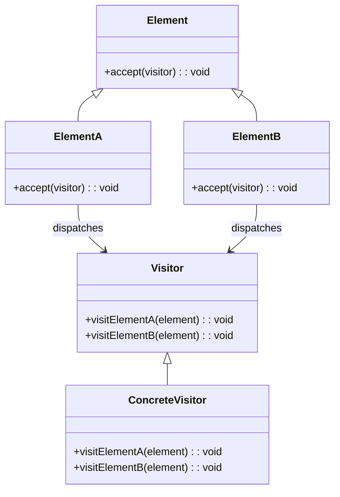

<Hero title="Visitor Pattern" subtitle="Perform operations on elements of a structure without changing their classes" imageAlt="Visitor pattern illustration" size="large" />

## TL;DR

Visitor represents an operation as an object that visits elements of a structure. Each element accepts a visitor and dispatches it appropriately. This allows adding new operations without modifying element classes. Use it when you need diverse operations on stable element structures, especially with complex traversal or multiple operation types.

## Learning Objectives

- You will understand double dispatch and how it enables Visitor.
- You will design visitor interfaces that cover all element types.
- You will implement element accept() methods correctly.
- You will add new operations as visitor implementations without changing elements.

## Motivating Scenario

An AST (Abstract Syntax Tree) represents program code. You need operations: compile, interpret, optimize, pretty-print. Without Visitor, each operation scatters across AST node classes, and adding nodes requires updating all operations. Visitor delegates each operation to a separate object. Nodes accept visitors and dispatch them. Adding new operations requires new visitor classes, not touching node classes.

## Core Concepts

**Visitor** represents an operation through double dispatch. Each element type accepts a visitor and calls the appropriate visitor method. This defers operation implementation to visitor classes while keeping element structure stable.

Key elements:
- **Visitor**: interface with visit methods for each element type
- **ConcreteVisitor**: implements specific operations
- **Element**: interface with accept() method
- **ConcreteElement**: accepts and dispatches visitors

<Figure caption="Visitor structure">

</Figure>

## Practical Example

Implement visitors for an expression tree.

<Tabs>
<TabItem value="python" label="Python" default>
```python showLineNumbers title="visitor.py"
from abc import ABC, abstractmethod

class Visitor(ABC):
    @abstractmethod
    def visit_number(self, element: 'Number') -> float:
        pass

    @abstractmethod
    def visit_add(self, element: 'Add') -> float:
        pass

class EvaluateVisitor(Visitor):
    def visit_number(self, element: 'Number') -> float:
        return element.value

    def visit_add(self, element: 'Add') -> float:
        left = element.left.accept(self)
        right = element.right.accept(self)
        return left + right

class Expression(ABC):
    @abstractmethod
    def accept(self, visitor: Visitor):
        pass

class Number(Expression):
    def __init__(self, value: float):
        self.value = value

    def accept(self, visitor: Visitor):
        return visitor.visit_number(self)

class Add(Expression):
    def __init__(self, left: Expression, right: Expression):
        self.left = left
        self.right = right

    def accept(self, visitor: Visitor):
        return visitor.visit_add(self)

# Usage
expr = Add(Number(5), Add(Number(3), Number(2)))
evaluator = EvaluateVisitor()
result = expr.accept(evaluator)
print(f"Result: {result}")  # 10
```
</TabItem>
<TabItem value="go" label="Go">
```go showLineNumbers title="visitor.go"
package main

import "fmt"

type Visitor interface {
    VisitNumber(n *Number) float64
    VisitAdd(a *Add) float64
}

type Expression interface {
    Accept(v Visitor) float64
}

type Number struct {
    Value float64
}

func (n *Number) Accept(v Visitor) float64 {
    return v.VisitNumber(n)
}

type Add struct {
    Left  Expression
    Right Expression
}

func (a *Add) Accept(v Visitor) float64 {
    return v.VisitAdd(a)
}

type EvaluateVisitor struct{}

func (ev *EvaluateVisitor) VisitNumber(n *Number) float64 {
    return n.Value
}

func (ev *EvaluateVisitor) VisitAdd(a *Add) float64 {
    return a.Left.Accept(ev) + a.Right.Accept(ev)
}

func main() {
    expr := &Add{
        Left: &Number{Value: 5},
        Right: &Add{
            Left:  &Number{Value: 3},
            Right: &Number{Value: 2},
        },
    }
    evaluator := &EvaluateVisitor{}
    result := expr.Accept(evaluator)
    fmt.Printf("Result: %.0f\n", result)
}
```
</TabItem>
<TabItem value="nodejs" label="Node.js">
```javascript showLineNumbers title="visitor.js"
class Visitor {
    visitNumber(element) {
        throw new Error('visitNumber() must be implemented');
    }

    visitAdd(element) {
        throw new Error('visitAdd() must be implemented');
    }
}

class EvaluateVisitor extends Visitor {
    visitNumber(element) {
        return element.value;
    }

    visitAdd(element) {
        const left = element.left.accept(this);
        const right = element.right.accept(this);
        return left + right;
    }
}

class Expression {
    accept(visitor) {
        throw new Error('accept() must be implemented');
    }
}

class Number extends Expression {
    constructor(value) {
        super();
        this.value = value;
    }

    accept(visitor) {
        return visitor.visitNumber(this);
    }
}

class Add extends Expression {
    constructor(left, right) {
        super();
        this.left = left;
        this.right = right;
    }

    accept(visitor) {
        return visitor.visitAdd(this);
    }
}

// Usage
const expr = new Add(new Number(5), new Add(new Number(3), new Number(2)));
const evaluator = new EvaluateVisitor();
const result = expr.accept(evaluator);
console.log(`Result: ${result}`);
```
</TabItem>
</Tabs>

## When to Use / When Not to Use

<Vs highlight={[1]} items={[
{
        label: "Use Visitor",
        points: ["Stable element structure but diverse operations needed", "Many unrelated operations on the same elements", "Operations require access to different element types", "Adding new operations shouldn", ","],
    highlightTone: "positive"
  },
{
        label: "Avoid Visitor",
        points: ["Element structure changes frequently", "Few operations, and element classes change together", "Simple operations that belong on elements", "Performance overhead of double dispatch unacceptable", "Element classes have different access levels"],
    highlightTone: "warning"
  }
]} />

## Patterns and Pitfalls

<Showcase  sections={[{
            title: "Double Dispatch",
            description: "Element.accept(visitor) dispatches to visitor.visit_type(element), enabling type-specific operations.",
            codeUrl: "#practical-example"
        }, {
            title: "Element Visibility",
            description: "Elements must expose data accessible to visitors. Balance encapsulation with visitor needs.",
            codeUrl: "#practical-example"
        }, {
            title: "New Element Types",
            description: "Adding element types requires updating all visitor interfaces, causing ripples across implementations.",
            codeUrl: "#practical-example"
        }, {
            title: "Composite Structures",
            description: "Visitors excel with composite structures—recursive accept() calls process entire trees.",
            codeUrl: "#practical-example"
        }]}
/>

## Design Review Checklist

<Checklist
    items={[
        "Do all element types properly implement accept()?",
        "Does every visitor implement all visit methods?",
        "Are visitor methods correctly dispatched based on element type?",
        "Can visitors safely access element data?",
        "Is the traversal order (depth-first, breadth-first) appropriate?",
        "Are new element types easy to support in existing visitors?",
        "Is the separation between element and operation concerns clear?"
    ]}
/>

## Advanced Visitor Patterns

### Stateful Visitor (Accumulating Results)
```python
# Visitor that accumulates results across traversal
class SumVisitor(Visitor):
    def __init__(self):
        self.total = 0  # Maintain state

    def visit_number(self, element):
        self.total += element.value
        return self.total

    def visit_add(self, element):
        left = element.left.accept(self)
        right = element.right.accept(self)
        return left + right  # Returns cumulative total

# Usage
expr = Add(Number(5), Add(Number(3), Number(2)))
visitor = SumVisitor()
expr.accept(visitor)
print(visitor.total)  # 10 (maintains state across visits)
```

### Cyclic Visitor (Handling Recursion)
```python
# Detect cycles in graph structures
class CycleDetectionVisitor(Visitor):
    def __init__(self):
        self.visited = set()
        self.path = []

    def visit_node(self, node):
        if node.id in self.path:  # Cycle detected
            raise ValueError(f"Cycle detected: {self.path + [node.id]}")

        if node.id in self.visited:  # Already processed
            return

        self.visited.add(node.id)
        self.path.append(node.id)

        for child in node.children:
            child.accept(self)

        self.path.pop()
```

## Visitor vs. Other Patterns

| Pattern | Structure | Operations | When to Use |
|---------|-----------|-----------|-----------|
| **Visitor** | Stable | Diverse | Operations on stable structures |
| **Strategy** | - | Interchangeable | Swap algorithms for same input |
| **Iterator** | Variable | Traversal | Navigate complex structures |
| **Composite** | Hierarchical | Recursive | Trees/composite objects |
| **Decorator** | Wraps | Enhancement | Add behavior to objects |

## Real-World Examples

### Compiler AST (Abstract Syntax Tree)
```
Code → Parser → AST → TypeChecker → Optimizer → CodeGenerator
         |                    |                       |
         └─ All use Visitor pattern

Visitor implementations:
- TypeChecker: traverse AST, check types
- Optimizer: traverse AST, identify improvements
- CodeGenerator: traverse AST, generate code

Add new operation (formatter)? Add FormatterVisitor, no changes to AST
```

### Document Processing
```
Document Tree:
  ├─ Heading
  ├─ Paragraph
  ├─ List
  │  ├─ ListItem
  │  └─ ListItem
  └─ Paragraph

Visitors:
- HtmlGenerator: render to HTML
- PdfGenerator: render to PDF
- MarkdownGenerator: render to Markdown
- SpellChecker: check spelling
- WordCounter: count words
```

## Self-Check

1. **How does Visitor enable adding operations without changing elements?** Operations are visitor implementations; adding operations means adding visitor classes, not modifying elements.

2. **What's the cost of adding a new element type?** All visitor interfaces must add a new visit method, and all visitor implementations must implement it.

3. **Can visitors maintain state across visits?** Yes—visitors can accumulate results or track context as they traverse the structure.

4. **How would you detect cycles in a graph using Visitor?** Maintain visited set and current path; detect when visiting a node already in current path.

:::info One Takeaway
Visitor enables extensible operations on stable structures through double dispatch. Use it when you need diverse operations on elements that rarely change. Avoid it when element types change frequently.

:::

## Next Steps

- [Combine with Composite for tree traversal](/docs/design-patterns/structural/composite)
- [Study Iterator for alternative traversal](/docs/design-patterns/behavioral/iterator)
- [Explore Interpreter for expression processing](/docs/design-patterns/behavioral/interpreter)

## Visitor Pattern Variations

### Acyclic Visitor
For avoiding the cost of adding new visit methods when new element types are added:

```python
# Base visitor with no visit methods
class Visitor(ABC):
    pass

# Separate visitor interface for each element type
class NumberVisitor(Visitor, ABC):
    @abstractmethod
    def visit_number(self, element): pass

class AddVisitor(Visitor, ABC):
    @abstractmethod
    def visit_add(self, element): pass

# Element classes check for visitor type
class Number:
    def accept(self, visitor):
        if isinstance(visitor, NumberVisitor):
            return visitor.visit_number(self)
        return None

class Add:
    def accept(self, visitor):
        if isinstance(visitor, AddVisitor):
            return visitor.visit_add(self)
        return None

# New element type doesn't require modifying existing visitors
class Multiply:
    def accept(self, visitor):
        if isinstance(visitor, MultiplyVisitor):
            return visitor.visit_multiply(self)
        return None
```

### Generic Visitor
Using generics for type-safe visitor patterns:

```java
// Generic visitor
interface Visitor<R> {
    R visit(Number num);
    R visit(Add add);
}

// Implement for specific return type
class InterpretVisitor implements Visitor<Double> {
    @Override
    public Double visit(Number num) {
        return (double) num.value;
    }

    @Override
    public Double visit(Add add) {
        return add.left.accept(this) + add.right.accept(this);
    }
}

// Element implements generic accept
interface Expression {
    <R> R accept(Visitor<R> visitor);
}
```

## When Not to Use Visitor

❌ **Domain model is volatile** (types change frequently)
→ Adding new element types requires updating all visitors
→ Fragile design if requirements shift constantly

❌ **Only one operation** (single visitor)
→ Pattern overhead not justified
→ Methods on elements directly is simpler

❌ **Operations tightly coupled to specific elements**
→ Visitor enforces separation that doesn't match domain
→ Coupling through visitor interfaces may be worse than direct coupling

❌ **Data structures heavily nested with side effects**
→ Traversal order and side effect management becomes complex
→ Iterator or generator patterns might be simpler

## Visitor in Practice: Compilation Pipeline

Real-world example of Visitor in a compiler:

```python
# AST (Abstract Syntax Tree) nodes
class Statement(ABC):
    @abstractmethod
    def accept(self, visitor): pass

class VariableDeclaration(Statement):
    def __init__(self, name, value):
        self.name = name
        self.value = value

    def accept(self, visitor):
        return visitor.visit_variable_declaration(self)

class FunctionCall(Statement):
    def __init__(self, name, args):
        self.name = name
        self.args = args

    def accept(self, visitor):
        return visitor.visit_function_call(self)

class IfStatement(Statement):
    def __init__(self, condition, then_branch, else_branch=None):
        self.condition = condition
        self.then_branch = then_branch
        self.else_branch = else_branch

    def accept(self, visitor):
        return visitor.visit_if_statement(self)

# Compiler stages as visitors
class TypeChecker(Visitor):
    def __init__(self):
        self.type_table = {}
        self.errors = []

    def visit_variable_declaration(self, node):
        # Check types of assigned value
        if not self.is_valid_type(node.value):
            self.errors.append(f"Invalid type for {node.name}")
        self.type_table[node.name] = infer_type(node.value)

    def visit_function_call(self, node):
        # Check function exists and args match signature
        if node.name not in self.functions:
            self.errors.append(f"Unknown function: {node.name}")

    def visit_if_statement(self, node):
        # Check condition is boolean
        if not isinstance(node.condition, BoolExpression):
            self.errors.append("If condition must be boolean")

class CodeGenerator(Visitor):
    def __init__(self):
        self.code = []

    def visit_variable_declaration(self, node):
        self.code.append(f"var {node.name} = {self.emit(node.value)}")

    def visit_function_call(self, node):
        args = ", ".join(self.emit(arg) for arg in node.args)
        self.code.append(f"{node.name}({args})")

    def visit_if_statement(self, node):
        self.code.append(f"if ({self.emit(node.condition)}) {{")
        for statement in node.then_branch:
            statement.accept(self)
        if node.else_branch:
            self.code.append("} else {")
            for statement in node.else_branch:
                statement.accept(self)
        self.code.append("}")

# Compiler pipeline
ast = parse_program(source_code)

# Stage 1: Type checking
type_checker = TypeChecker()
ast.accept(type_checker)
if type_checker.errors:
    raise CompilationError(type_checker.errors)

# Stage 2: Code generation
code_gen = CodeGenerator()
ast.accept(code_gen)
return code_gen.code

# Add new compiler stage? Just create new visitor!
class Optimizer(Visitor):
    def visit_variable_declaration(self, node):
        # Optimize: constant folding, dead code elimination
        pass
```

## Performance Considerations

**Double dispatch overhead**: Visitor requires two method calls (element.accept(visitor), visitor.visit_element())

```python
# Direct approach (one call)
def process(element):
    if isinstance(element, Number):
        return element.value
    elif isinstance(element, Add):
        return process(element.left) + process(element.right)

# Visitor approach (two calls)
result = element.accept(visitor)  # Dispatch 1
# Inside element.accept():
return visitor.visit_number(self)  # Dispatch 2
```

Visitor has ~10-20% overhead vs. direct approach due to extra indirection. For hot paths, consider:
- Inlining visitors
- Using specialized visitors for specific cases
- Combining with Strategy pattern for frequently-changed operations

## References

- Gang of Four, "Design Patterns: Elements of Reusable Object-Oriented Software"
- Refactoring Guru's [Visitor](https://refactoring.guru/design-patterns/visitor) ↗️
- Martin Fowler on [Visitor Pattern](https://martinfowler.com/articles/visitor-pattern.html) ↗️
- Robert Martin on [Acyclic Visitor Pattern](https://en.wikipedia.org/wiki/Visitor_pattern#Acyclic_Visitor) ↗️
- Compiler Design Techniques (Dragon Book) - extensive Visitor usage