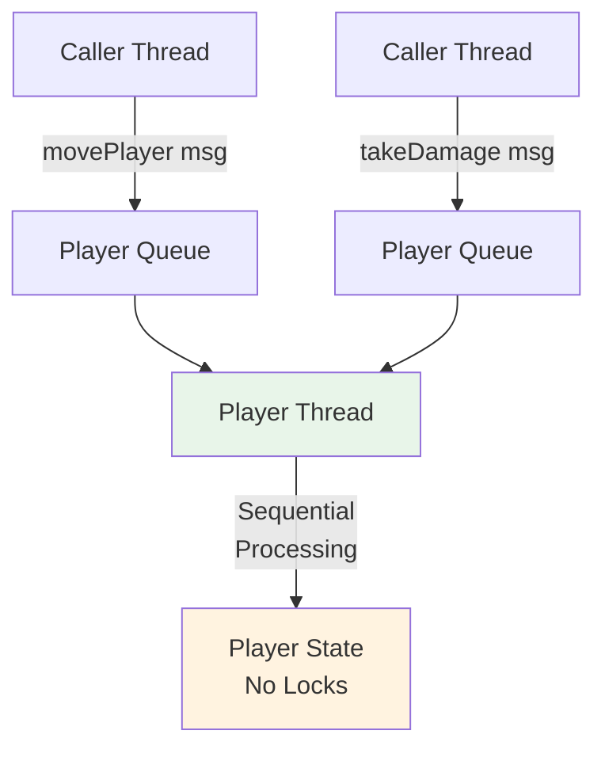

<Hero title="Active Object Pattern" subtitle="Decouple concurrent execution by encapsulating each object as a standalone thread receiving method calls via message passing" imageAlt="illustration" size="large" />

## TL;DR

Active Object encapsulates concurrent execution by giving each object its own thread and message queue. Instead of calling methods directly (synchronous), you send messages to the queue. The object's thread processes messages sequentially, eliminating race conditions on that object's state. This pattern scales naturally across many independent entities.

## Learning Objectives

You will be able to:
- Design concurrent systems using message-passing actor model
- Implement active objects with dedicated threads and queues
- Avoid shared state through isolation
- Handle asynchronous method results with futures
- Debug actor-based concurrent systems

## Motivating Scenario

A game server manages 10,000 player characters. Each player's state (position, inventory, experience) must be protected from concurrent updates. Rather than using locks on a shared character object, Active Object gives each player their own thread. Position updates are messages queued to that player's thread, processed sequentially. No locks needed—messages are naturally serialized.

## Core Concepts

<Figure caption="Active Object message-based concurrency">

</Figure>

## Practical Example

<Tabs groupId="lang" queryString>
<TabItem value="python" label="Python">
```python
import threading
import queue
from typing import Any, Optional

class Player:
    def __init__(self, player_id: str):
        self.player_id = player_id
        self.position = (0, 0)
        self.health = 100
        self.inventory = []
        
        # Message queue for this player
        self._queue: queue.Queue = queue.Queue()
        self._thread = threading.Thread(target=self._process_messages, daemon=False)
        self._thread.start()
    
    def move(self, x: int, y: int):
        """Send move message to player's queue."""
        self._queue.put(('move', x, y))
    
    def take_damage(self, amount: int):
        """Send damage message."""
        self._queue.put(('damage', amount))
    
    def pickup_item(self, item: str):
        """Send pickup message."""
        self._queue.put(('pickup', item))
    
    def _process_messages(self):
        """Process messages sequentially (runs on player's thread)."""
        while True:
            msg = self._queue.get()
            if msg == 'shutdown':
                break
            
            cmd = msg[0]
            try:
                if cmd == 'move':
                    self.position = (msg[1], msg[2])
                    print(f"Player {self.player_id} moved to {self.position}")
                elif cmd == 'damage':
                    self.health -= msg[1]
                    print(f"Player {self.player_id} health: {self.health}")
                elif cmd == 'pickup':
                    self.inventory.append(msg[1])
                    print(f"Player {self.player_id} picked up {msg[1]}")
            except Exception as e:
                print(f"Error processing message: {e}")
    
    def shutdown(self):
        """Gracefully shutdown player."""
        self._queue.put('shutdown')
        self._thread.join()

# Usage
player1 = Player('player1')
player1.move(10, 20)
player1.take_damage(25)
player1.pickup_item('sword')
player1.shutdown()
```
</TabItem>
<TabItem value="go" label="Go">
```go
package main

import (
    "fmt"
    "sync"
)

type PlayerMessage interface{}

type MoveMsg struct{ X, Y int }
type DamageMsg struct{ Amount int }
type PickupMsg struct{ Item string }

type Player struct {
    PlayerID  string
    Position  [2]int
    Health    int
    Inventory []string
    msgQueue  chan PlayerMessage
    done      chan struct{}
}

func NewPlayer(playerID string) *Player {
    p := &Player{
        PlayerID:  playerID,
        Position:  [2]int{0, 0},
        Health:    100,
        Inventory: []string{},
        msgQueue:  make(chan PlayerMessage, 10),
        done:      make(chan struct{}),
    }
    go p.processMessages()
    return p
}

func (p *Player) Move(x, y int) {
    p.msgQueue <- MoveMsg{X: x, Y: y}
}

func (p *Player) TakeDamage(amount int) {
    p.msgQueue <- DamageMsg{Amount: amount}
}

func (p *Player) PickupItem(item string) {
    p.msgQueue <- PickupMsg{Item: item}
}

func (p *Player) processMessages() {
    for {
        select {
        case msg := <-p.msgQueue:
            switch m := msg.(type) {
            case MoveMsg:
                p.Position = [2]int{m.X, m.Y}
                fmt.Printf("Player %s moved to %v\n", p.PlayerID, p.Position)
            case DamageMsg:
                p.Health -= m.Amount
                fmt.Printf("Player %s health: %d\n", p.PlayerID, p.Health)
            case PickupMsg:
                p.Inventory = append(p.Inventory, m.Item)
                fmt.Printf("Player %s picked up %s\n", p.PlayerID, m.Item)
            }
        case <-p.done:
            return
        }
    }
}

func (p *Player) Shutdown() {
    close(p.done)
}

func main() {
    var wg sync.WaitGroup
    players := []*Player{}
    
    for i := 0; i < 5; i++ {
        p := NewPlayer(fmt.Sprintf("player%d", i))
        players = append(players, p)
    }
    
    // Send messages from multiple threads
    for i := 0; i < 5; i++ {
        wg.Add(1)
        go func(idx int) {
            defer wg.Done()
            players[idx].Move(10, 20)
            players[idx].TakeDamage(25)
            players[idx].PickupItem("sword")
        }(i)
    }
    
    wg.Wait()
    
    for _, p := range players {
        p.Shutdown()
    }
}
```
</TabItem>
<TabItem value="nodejs" label="Node.js">
```javascript
const { EventEmitter } = require('events');
const { Worker } = require('worker_threads');

class Player extends EventEmitter {
    constructor(playerId) {
        super();
        this.playerId = playerId;
        this.position = [0, 0];
        this.health = 100;
        this.inventory = [];
        this.messageQueue = [];
        this.processing = false;
    }

    move(x, y) {
        this.messageQueue.push({ cmd: 'move', x, y });
        this.processNext();
    }

    takeDamage(amount) {
        this.messageQueue.push({ cmd: 'damage', amount });
        this.processNext();
    }

    pickupItem(item) {
        this.messageQueue.push({ cmd: 'pickup', item });
        this.processNext();
    }

    async processNext() {
        if (this.processing || this.messageQueue.length === 0) return;
        
        this.processing = true;
        const msg = this.messageQueue.shift();

        try {
            switch (msg.cmd) {
                case 'move':
                    this.position = [msg.x, msg.y];
                    console.log(`Player ${this.playerId} moved to [${this.position}]`);
                    break;
                case 'damage':
                    this.health -= msg.amount;
                    console.log(`Player ${this.playerId} health: ${this.health}`);
                    break;
                case 'pickup':
                    this.inventory.push(msg.item);
                    console.log(`Player ${this.playerId} picked up ${msg.item}`);
                    break;
            }
        } catch (err) {
            console.error(`Error: ${err}`);
        } finally {
            this.processing = false;
            // Process next message
            setImmediate(() => this.processNext());
        }
    }
}

// Usage
const player = new Player('player1');
player.move(10, 20);
player.takeDamage(25);
player.pickupItem('sword');
```
</TabItem>
</Tabs>

## When to Use / When Not to Use

**Use Active Object when:**
- You have many independent concurrent entities (actors, agents, players)
- Message-passing semantics match your domain
- Shared state complexity is high
- You want natural actor-model semantics

**Avoid when:**
- Few concurrent objects (overhead not justified)
- Low-latency request-response is required
- Synchronous method calls are more natural than messaging

## Patterns and Pitfalls

### Pitfall: Message Queue Unbounded Growth

If message producers outpace consumers, queues grow unbounded. Use bounded queues with rejection policies.

### Pattern: Futures for Results

Return futures when you need results from async messages. The requesting thread can block on the future.

## Design Review Checklist

- [ ] Each active object has a dedicated message queue
- [ ] Messages are processed sequentially
- [ ] Message types are well-defined
- [ ] Error handling within message processing
- [ ] Graceful shutdown drains queues
- [ ] No shared state between active objects
- [ ] Monitoring tracks queue depth per actor

## Self-Check

1. **Can two messages for the same active object be processed concurrently?**
2. **What happens if message producers are faster than the consumer?**
3. **How do you return results from async messages?**

:::info One Takeaway
Active Object eliminates locks by giving each entity its own thread and message queue. Natural sequential processing of messages prevents race conditions without explicit synchronization.

:::

## Advanced Active Object Patterns

### Futures and Async Results

Returning futures allows callers to wait for results without blocking the actor's thread:

```python
import concurrent.futures
from typing import Future

class AsyncPlayer:
    def __init__(self, player_id):
        self.player_id = player_id
        self.position = (0, 0)
        self.executor = concurrent.futures.ThreadPoolExecutor(max_workers=1)
        self.queue = queue.Queue()
        self.results = {}

    def move_async(self, x, y) -> Future:
        """Send move and return future for completion"""
        future = concurrent.futures.Future()
        self.queue.put(('move', x, y, future))
        return future

    def get_position_async(self) -> Future:
        """Get position asynchronously"""
        future = concurrent.futures.Future()
        self.queue.put(('get_position', None, None, future))
        return future

    def _process_messages(self):
        while True:
            cmd, x, y, future = self.queue.get()
            if cmd == 'shutdown':
                break

            try:
                if cmd == 'move':
                    self.position = (x, y)
                    future.set_result(f"Moved to {self.position}")
                elif cmd == 'get_position':
                    future.set_result(self.position)
            except Exception as e:
                future.set_exception(e)

# Usage
player = AsyncPlayer('player1')
future = player.move_async(10, 20)
result = future.result(timeout=5)  # Block waiting for result
print(result)
```

### Load Balancing with Multiple Actors

Distribute work across multiple actor instances:

```python
import random

class PlayerPool:
    def __init__(self, num_players=10):
        self.players = [Player(f'player-{i}') for i in range(num_players)]

    def distribute_move(self, player_id, x, y):
        """Route to appropriate player"""
        player_index = hash(player_id) % len(self.players)
        self.players[player_index].move(x, y)

    def get_load_info(self):
        """Return queue depths for load monitoring"""
        return [p._queue.qsize() for p in self.players]

# Load balancing preserves sequential ordering per player
# Different players can be processed in parallel
```

### Error Handling and Supervision

Proper error handling in message processing:

```python
class ResilientPlayer:
    def __init__(self, player_id):
        self.player_id = player_id
        self.errors = []
        self._queue = queue.Queue()
        self._thread = threading.Thread(target=self._process_messages, daemon=False)
        self._thread.start()

    def _process_messages(self):
        while True:
            msg = self._queue.get()
            if msg == 'shutdown':
                break

            try:
                cmd = msg[0]
                if cmd == 'move':
                    self._handle_move(msg[1], msg[2])
                else:
                    raise ValueError(f"Unknown command: {cmd}")
            except Exception as e:
                # Log error but continue processing
                self.errors.append((datetime.now(), str(e)))
                print(f"Error: {e}")

    def _handle_move(self, x, y):
        # Validate input
        if not (-1000 <= x <= 1000) or not (-1000 <= y <= 1000):
            raise ValueError(f"Invalid position: ({x}, {y})")
        self.position = (x, y)

# Supervision: parent actor monitors children
class GameServer:
    def __init__(self):
        self.players = {}

    def supervise_players(self):
        """Check for dead players and restart if needed"""
        for player_id, player in list(self.players.items()):
            if not player._thread.is_alive():
                print(f"Player {player_id} crashed, restarting...")
                self.players[player_id] = Player(player_id)
```

## Comparison with Other Concurrency Patterns

**Active Object vs Thread Pool**: Active Objects have one thread per actor (dedicated). Thread pools distribute work among fewer threads. Active Objects are better when actors have independent state; thread pools are better for stateless task processing.

**Active Object vs Actor Model**: Active Object is similar to actors but typically simpler. Actor frameworks like Akka add distribution, persistence, and supervision out of the box.

**Active Object vs Async/Await**: Async/await uses a single thread with cooperative multitasking. Active Objects use real threads. Async scales better; Active Objects are simpler to understand.

## Design Patterns and Trade-offs

**Benefit: No Locks Needed**: Each actor's state is accessed from only one thread. No race conditions within an actor.

**Benefit: Isolation**: Actors are independent. One slow actor doesn't block others.

**Trade-off: Messaging Overhead**: Creating messages, queueing, and dequeuing adds latency compared to direct method calls.

**Trade-off: Thread Resources**: Each actor consumes a thread. For 100K actors, you need 100K threads (possible but expensive).

**Trade-off: Debugging**: Message-based communication is harder to debug than traditional method calls.

## Next Steps

- Explore [Producer-Consumer](/docs/design-patterns/concurrency-patterns/producer-consumer) for work distribution
- Study [Futures & Promises](/docs/design-patterns/concurrency-patterns/futures-promises-async-await) for async results
- Learn actor frameworks like Akka, Erlang/OTP, or Orleans
- Investigate [Supervision Strategies](/docs/design-patterns/concurrency-patterns/supervision-strategies) for fault tolerance

## References

1. "Concurrent Programming in Java" by Doug Lea
2. "The Reactive Manifesto" at https://www.reactivemanifesto.org/
3. "Programming Erlang" by Joe Armstrong (actor model pioneered in Erlang)
4. Akka Documentation: https://akka.io/
5. Jonas Bonér: "The Reactive Principles"
