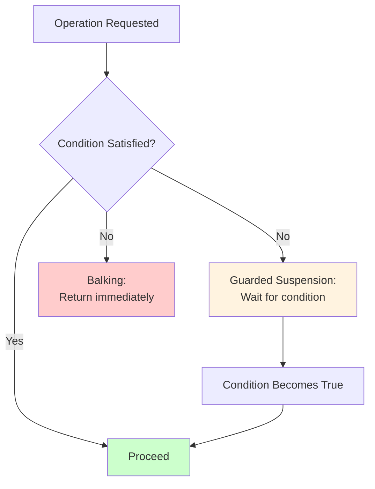

<Hero title="Balking Pattern" subtitle="Fail fast rather than waiting when a condition isn't satisfied, for non-blocking operations with immediate response" imageAlt="illustration" size="large" />

## TL;DR

Balking immediately fails (returns or throws) if a condition isn't satisfied, rather than blocking. Perfect for operations that must complete now or not at all. Differs from Guarded Suspension (which waits) by being non-blocking. Use balking for cleanup operations, optimization attempts, and optional actions where staleness is unacceptable.

## Learning Objectives

You will be able to:
- Distinguish between balking and guarded suspension
- Implement fail-fast operations
- Handle rejection cases gracefully
- Apply balking to optimization and optional work
- Recognize when staleness matters

## Motivating Scenario

A cache invalidation operation should happen immediately or not at all. If the cache is busy being updated, you can skip the invalidation—the next write will be fresh anyway. Balking returns immediately rather than waiting: "I'm busy, balk." Waiting (Guarded Suspension) would be wrong here; stale data is acceptable.

## Core Concepts

<Figure caption="Balking vs. Guarded Suspension">

</Figure>

## Practical Example

<Tabs groupId="lang" queryString>
<TabItem value="python" label="Python">
```python
import threading
import time

class CacheInvalidator:
    def __init__(self):
        self.lock = threading.Lock()
        self.is_updating = False
    
    def invalidate_if_idle(self) -> bool:
        """Balk if cache is currently being updated."""
        acquired = self.lock.acquire(blocking=False)
        if not acquired:
            print("Cache busy, balking invalidation")
            return False  # Balk: condition not met
        
        try:
            if self.is_updating:
                print("Update in progress, balking")
                return False  # Balk
            
            # Proceed with invalidation
            print("Invalidating cache")
            return True
        finally:
            self.lock.release()
    
    def update(self):
        """Long-running cache update."""
        with self.lock:
            self.is_updating = True
            print("Cache update started")
            time.sleep(2)  # Simulate update
            self.is_updating = False
            print("Cache update finished")

# Usage
cache = CacheInvalidator()

def updater():
    cache.update()

def invalidator():
    time.sleep(0.5)
    result = cache.invalidate_if_idle()
    if not result:
        print("Invalidation was skipped (balk)")

t1 = threading.Thread(target=updater)
t2 = threading.Thread(target=invalidator)
t1.start()
t2.start()
t1.join()
t2.join()
```
</TabItem>
<TabItem value="go" label="Go">
```go
package main

import (
    "fmt"
    "sync"
    "time"
)

type CacheInvalidator struct {
    mu        sync.Mutex
    isUpdating bool
}

// Balk if cache is busy
func (c *CacheInvalidator) InvalidateIfIdle() bool {
    if !c.mu.TryLock() {
        fmt.Println("Cache busy, balking invalidation")
        return false // Balk
    }
    defer c.mu.Unlock()
    
    if c.isUpdating {
        fmt.Println("Update in progress, balking")
        return false // Balk
    }
    
    fmt.Println("Invalidating cache")
    return true
}

// Long-running update
func (c *CacheInvalidator) Update() {
    c.mu.Lock()
    defer c.mu.Unlock()
    
    c.isUpdating = true
    fmt.Println("Cache update started")
    time.Sleep(2 * time.Second)
    c.isUpdating = false
    fmt.Println("Cache update finished")
}

func main() {
    cache := &CacheInvalidator{}
    
    go func() {
        cache.Update()
    }()
    
    go func() {
        time.Sleep(500 * time.Millisecond)
        if !cache.InvalidateIfIdle() {
            fmt.Println("Invalidation was skipped (balk)")
        }
    }()
    
    time.Sleep(3 * time.Second)
}
```
</TabItem>
<TabItem value="nodejs" label="Node.js">
```javascript
class CacheInvalidator {
    constructor() {
        this.locked = false;
        this.isUpdating = false;
    }

    invalidateIfIdle() {
        // Balk if already locked
        if (this.locked) {
            console.log('Cache busy, balking invalidation');
            return false;
        }

        if (this.isUpdating) {
            console.log('Update in progress, balking');
            return false;
        }

        // Proceed with invalidation
        console.log('Invalidating cache');
        return true;
    }

    async update() {
        this.locked = true;
        this.isUpdating = true;
        console.log('Cache update started');
        await new Promise(resolve => setTimeout(resolve, 2000));
        this.isUpdating = false;
        this.locked = false;
        console.log('Cache update finished');
    }
}

// Usage
const cache = new CacheInvalidator();

(async () => {
    const updatePromise = cache.update();
    
    await new Promise(resolve => setTimeout(resolve, 500));
    const result = cache.invalidateIfIdle();
    
    if (!result) {
        console.log('Invalidation was skipped (balk)');
    }
    
    await updatePromise;
})();
```
</TabItem>
</Tabs>

## When to Use / When Not to Use

**Use Balking when:**
- Operations should complete now or fail (no waiting)
- Results become stale if delayed (time-critical)
- Optimization attempts that can be skipped
- Cleanup or maintenance that can defer
- Real-time responsiveness is critical

**Avoid when:**
- The operation must eventually complete
- Client code requires the operation to succeed
- Waiting is acceptable and results won't be stale
- Resource constraints force queueing

## Patterns and Pitfalls

### Pitfall: Silent Failures

Silently balking without notifying the caller can hide problems. Log or return status codes.

### Pattern: Retry Elsewhere

If an operation balks, schedule a retry later (e.g., in a background job).

## Design Review Checklist

- [ ] Balking conditions are explicit
- [ ] Failure is logged or reported
- [ ] Callers handle rejection gracefully
- [ ] Non-blocking lock attempts are safe
- [ ] Retry mechanisms exist if needed
- [ ] Documentation clarifies fail-fast semantics

## Self-Check

1. **When is balking better than guarded suspension?**
2. **How do you handle repeated rejections?**
3. **Can silent failures hide bugs?**

## Real-World Balking Scenarios

### Scenario 1: Background Job Deduplication

```python
class JobProcessor:
    def __init__(self):
        self.processing = False
        self.job_queue = []

    def process_batch(self):
        """Balk if already processing to avoid duplicate work"""
        # Non-blocking lock attempt
        if not self.try_acquire_lock():
            logger.info("Already processing, balking new batch")
            return False  # Balk

        try:
            # Safely process batch
            logger.info(f"Processing {len(self.job_queue)} jobs")
            for job in self.job_queue:
                self.process(job)
            self.job_queue.clear()
            return True
        finally:
            self.release_lock()

# Usage: Scheduled job runs every minute
# Minute 0: Lock acquired, processing 1000 jobs (takes 50 seconds)
# Minute 1: Try to process, lock held, BALK (return immediately)
# Minute 2: Previous batch finished, lock acquired, processing continues

# Benefit: No duplicate processing, no queue buildup, fast rejection
```

### Scenario 2: Cache Refresh with Staleness Tolerance

```python
class CacheRefresher:
    def __init__(self, ttl_seconds=3600):
        self.cache = {}
        self.ttl = ttl_seconds
        self.refreshing = False
        self.last_refresh = {}

    def refresh_cache_if_not_busy(self, key):
        """Balk if cache is already being refreshed"""
        if self.refreshing:
            logger.debug(f"Cache refresh in progress, returning stale {key}")
            return self.cache.get(key)  # Return stale

        # Non-blocking attempt
        if not self.try_lock_refresh():
            logger.debug(f"Another thread refreshing, balking")
            return self.cache.get(key)  # Return stale

        try:
            # Fetch fresh data
            fresh_value = self.fetch_from_source(key)
            self.cache[key] = fresh_value
            self.last_refresh[key] = datetime.now()
            return fresh_value
        finally:
            self.release_lock_refresh()

    def is_stale(self, key):
        """Check if cached value is stale"""
        if key not in self.cache:
            return True
        age = datetime.now() - self.last_refresh.get(key, datetime.min)
        return age.seconds > self.ttl

# Usage in HTTP handler
def get_product_data(product_id):
    value = cache.refresh_cache_if_not_busy(product_id)
    if value:
        return value

    # Cache miss or refresh failed
    if cache.is_stale(product_id):
        # Wait for refresh (guarded suspension)
        # OR fetch directly (if tolerating inconsistency)
        return fetch_from_source(product_id)

# Benefit: Non-blocking for reads, accepts staleness
```

### Scenario 3: UI Update with Cancellation

```javascript
class UIUpdater {
    constructor() {
        this.updating = false;
        this.updateQueue = [];
    }

    requestUpdate(changes) {
        // If already updating, balk (discard this update)
        if (this.updating) {
            console.log("UI already updating, discarding request");
            return false;
        }

        // Try to acquire update lock
        if (!this.tryLock()) {
            console.log("Update locked, balking");
            return false;
        }

        try {
            this.updateUI(changes);
            return true;
        } finally {
            this.unlock();
        }
    }

    updateUI(changes) {
        this.updating = true;
        // Batch update: process most recent changes
        this.updateQueue.push(changes);

        // Debounce: only process after 50ms of no new requests
        setTimeout(() => {
            const merged = this.mergeChanges(this.updateQueue);
            this.applyChanges(merged);
            this.updateQueue = [];
            this.updating = false;
        }, 50);
    }
}

// Usage
updater.requestUpdate({ color: 'red' });  // Proceeds
updater.requestUpdate({ text: 'Hello' });  // Balks (already updating)
updater.requestUpdate({ size: 'large' });  // Balks

// After 50ms, merged update applies all three changes
```

## Balking vs Guarded Suspension vs Timeout

| Pattern | Behavior | Use Case |
|---------|----------|----------|
| **Balking** | Fail immediately if condition not met | Operations that must complete now or not at all |
| **Guarded Suspension** | Wait for condition to be true | Operations that must eventually complete |
| **Timeout** | Wait for condition, then fail if timeout | Operations with maximum wait time |

Example comparison:

```python
# Balking: Try to acquire lock, fail immediately if busy
if not lock.try_acquire(blocking=False):
    return False  # Balk

# Guarded Suspension: Wait for lock
with lock:  # Blocks until acquired
    proceed()

# Timeout: Wait up to 100ms
if lock.try_acquire(timeout=0.1):
    proceed()
else:
    raise TimeoutError()
```

## Performance Implications

Balking is faster than guarded suspension for non-blocking scenarios:

```
Scenario: Cache update (lock held 20ms)

Guarded Suspension (blocking):
  - Thread 1: Acquire lock (0ms), process (20ms), release
  - Thread 2: Request comes, blocks waiting for lock (20ms+)
  - Thread 3: Request comes, blocks (40ms+ wait time)
  Total wait time across threads: 60ms+

Balking (non-blocking):
  - Thread 1: Acquire lock (0ms), process (20ms), release
  - Thread 2: Request comes, try_lock fails immediately (0.1ms)
    → Returns cached value or null (immediate response)
  - Thread 3: Request comes, try_lock fails (0.1ms)
    → Returns cached value or null (immediate response)
  Total wait time: 0.2ms (much better!)

Trade-off: Balking rejects when busy, Guarded Suspension waits
Choice depends on requirements: prefer balking for caches/optimization.
```

## Error Handling with Balking

Always communicate rejections:

```python
def perform_operation_balk():
    if not can_proceed():
        # ❌ Bad: Silent balk
        return None  # Caller doesn't know why

        # ✅ Good: Signal rejection
        raise BalkedException("Operation busy")
        # OR return specific status
        return OperationStatus.REJECTED_BUSY

# Client must handle rejection
try:
    result = perform_operation_balk()
except BalkedException:
    logger.warn("Operation rejected, retrying later")
    # Schedule retry in background job
    background_queue.enqueue('retry_operation')
```

:::info One Takeaway
Balking fails fast when conditions aren't met, avoiding unnecessary waiting. Perfect for operations where immediacy matters and staleness is acceptable. Always communicate rejections explicitly; silent failures hide bugs.

:::

## Next Steps

- Compare with [Guarded Suspension](/docs/design-patterns/concurrency-patterns/guarded-suspension) for blocking alternatives
- Learn [Double-Checked Locking](/docs/design-patterns/concurrency-patterns/double-checked-locking) for related patterns
- Explore [Active Object](/docs/design-patterns/concurrency-patterns/active-object) for related non-blocking coordination
- Study [Timeout Pattern](/docs/design-patterns/concurrency-patterns/timeout) for time-bounded waiting

## References

1. "Concurrent Programming in Java" by Doug Lea
2. "Pattern-Oriented Software Architecture Volume 2" by Kircher & Jän
3. <a href="https://en.wikipedia.org/wiki/Balking_pattern" target="_blank" rel="nofollow noopener noreferrer">Balking Pattern - Wikipedia ↗</a>
