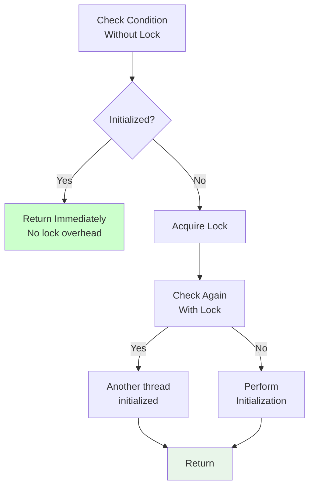

<Hero title="Double-Checked Locking Pattern" subtitle="Minimize synchronization overhead for already-initialized state by checking conditions before acquiring locks" imageAlt="illustration" size="large" />

## TL;DR

Double-Checked Locking checks a condition without a lock, acquires the lock only if a second check still shows uninitialized state, then performs initialization. This avoids lock overhead for the common case (already initialized). Critical to use volatile fields to ensure visibility. Note: many languages provide better lazy initialization patterns; use DCL only when necessary.

## Learning Objectives

You will be able to:
- Understand memory visibility and the volatile keyword
- Implement double-checked locking safely
- Recognize when this optimization is justified
- Use language-specific lazy initialization features
- Avoid common DCL pitfalls

## Motivating Scenario

A singleton database connection is lazily initialized. On every method call, acquiring a lock (even uncontended) has overhead. If the connection is already initialized (99% of cases), the lock acquisition is pure waste. Double-Checked Locking checks without a lock first, acquiring the lock only if initialization is needed.

## Core Concepts

<Figure caption="Double-Checked Locking flow">

</Figure>

## Practical Example

<Tabs groupId="lang" queryString>
<TabItem value="python" label="Python">
```python
import threading

class DatabaseConnection:
    _instance = None
    _lock = threading.Lock()
    
    @staticmethod
    def get_instance():
        # First check (no lock)
        if DatabaseConnection._instance is None:
            # Acquire lock only if needed
            with DatabaseConnection._lock:
                # Second check (with lock)
                # Another thread might have initialized meanwhile
                if DatabaseConnection._instance is None:
                    print("Initializing database connection...")
                    DatabaseConnection._instance = DatabaseConnection()
        
        return DatabaseConnection._instance
    
    def __init__(self):
        self.connected = True
        print("Database connection established")

# Usage
def worker():
    conn = DatabaseConnection.get_instance()
    print(f"Got connection: {conn}")

# Create multiple threads
threads = [threading.Thread(target=worker) for _ in range(5)]
for t in threads:
    t.start()
for t in threads:
    t.join()
```
</TabItem>
<TabItem value="go" label="Go">
```go
package main

import (
    "fmt"
    "sync"
)

type DatabaseConnection struct {
    Connected bool
}

var (
    instance *DatabaseConnection
    mu       sync.Mutex
)

func GetInstance() *DatabaseConnection {
    // First check (no lock)
    if instance == nil {
        // Acquire lock only if needed
        mu.Lock()
        defer mu.Unlock()
        
        // Second check (with lock)
        if instance == nil {
            fmt.Println("Initializing database connection...")
            instance = &DatabaseConnection{Connected: true}
        }
    }
    
    return instance
}

func main() {
    var wg sync.WaitGroup
    
    for i := 0; i < 5; i++ {
        wg.Add(1)
        go func(id int) {
            defer wg.Done()
            conn := GetInstance()
            fmt.Printf("Thread %d got connection: %v\n", id, conn)
        }(i)
    }
    
    wg.Wait()
}
```
</TabItem>
<TabItem value="nodejs" label="Node.js">
```javascript
// In JavaScript/Node.js, use module patterns instead

class DatabaseConnection {
    constructor() {
        this.connected = true;
        console.log('Initializing database connection...');
    }
}

// Module-level singleton (best approach in Node.js)
let instance = null;

function getInstance() {
    if (!instance) {
        instance = new DatabaseConnection();
    }
    return instance;
}

// Or using a class with private constructor pattern
class Singleton {
    static #instance = null;
    
    static getInstance() {
        if (this.#instance === null) {
            this.#instance = new Singleton();
        }
        return this.#instance;
    }
    
    constructor() {
        if (Singleton.#instance !== null) {
            throw new Error('Use getInstance() instead');
        }
        this.connected = true;
    }
}

// Test
const conn1 = getInstance();
const conn2 = getInstance();
console.log(conn1 === conn2); // true
```
</TabItem>
</Tabs>

## When to Use / When Not to Use

**Use Double-Checked Locking when:**
- Singleton initialization is a measurable bottleneck
- Initialization happens infrequently (lazy)
- Lock-free fast path is critical
- Language/framework doesn't provide better lazy initialization

**Avoid when:**
- Framework provides lazy initialization (use it instead)
- Initialization is frequent (lock contention doesn't matter)
- Simplicity matters more than micro-optimization
- Uncontended locks are acceptable

## Patterns and Pitfalls

### Pitfall: Volatility Issues (Language-Dependent)

In Java, the instance field MUST be `volatile` to ensure proper memory visibility. Without it, the second thread might see partially initialized state. In Python and Go, the GIL and memory model mostly eliminate this issue.

### Pattern: Better Alternatives

Languages offer better approaches: Python's `functools.lru_cache`, Go's `sync.Once`, JavaScript's module patterns.

## Design Review Checklist

- [ ] Instance field is volatile (if language requires it)
- [ ] Both checks are present
- [ ] Lock is acquired between checks
- [ ] Second check re-validates the condition
- [ ] Initialization is atomic or thread-safe
- [ ] Consider simpler alternatives first
- [ ] Document why DCL was necessary

## Self-Check

1. **What happens if you forget the second check?**
2. **Why must the instance field be volatile in Java?**
3. **Is DCL a good choice for this use case, or are simpler patterns better?**

## Common DCL Pitfalls and Solutions

### Pitfall 1: Forgetting the Second Check

```java
// ❌ BROKEN: No second check
public class Singleton {
    private static Singleton instance;  // Not volatile!
    private static Object lock = new Object();

    public static Singleton getInstance() {
        if (instance == null) {
            synchronized(lock) {
                // Another thread might have initialized meanwhile
                // We don't check again!
                instance = new Singleton();
            }
        }
        return instance;
    }
}

// Problem: Two threads both see null, both acquire lock in sequence
// Result: instance created twice (not a true singleton)

// ✅ CORRECT: Second check
public class Singleton {
    private static volatile Singleton instance;
    private static Object lock = new Object();

    public static Singleton getInstance() {
        if (instance == null) {
            synchronized(lock) {
                if (instance == null) {  // Second check
                    instance = new Singleton();
                }
            }
        }
        return instance;
    }
}

// Now: Only one thread creates instance
```

### Pitfall 2: Missing Volatile Keyword (Java)

```java
// ❌ BROKEN: No volatile
private static Singleton instance;

// Problem (Java memory model):
// Thread 1: Create new Singleton(), assign to instance
// Thread 2: See instance != null, but fields not visible (memory reordering)
// Result: Thread 2 reads partially initialized instance (data race)

// ✅ CORRECT: Volatile keyword
private static volatile Singleton instance;

// Volatile ensures:
// - Write (assign instance) is immediately visible to other threads
// - No reordering of reads/writes across volatile boundary
```

### Pitfall 3: Over-Engineering

Most modern languages have better solutions:

```python
# ❌ Over-engineering with DCL
class Singleton:
    _instance = None
    _lock = threading.Lock()

    @staticmethod
    def get_instance():
        if Singleton._instance is None:
            with Singleton._lock:
                if Singleton._instance is None:
                    Singleton._instance = Singleton()
        return Singleton._instance

# ✅ Better: Use Python's module system (natural singleton)
# singleton.py
class Singleton:
    pass

instance = Singleton()  # Created once on import

# Usage
from singleton import instance  # Same instance everywhere

# ✅ Even better: Use @lru_cache (for functions)
from functools import lru_cache

@lru_cache(maxsize=1)
def get_expensive_resource():
    return ExpensiveResource()

# First call: Creates resource
# Second call: Returns cached value
```

```go
// ✅ Best in Go: sync.Once
var (
    instance *Singleton
    once     sync.Once
)

func GetInstance() *Singleton {
    once.Do(func() {
        instance = &Singleton{}
    })
    return instance
}

// Pros:
// - Built-in, idiomatic
// - No manual volatile/synchronization
// - Clearer intent
```

```javascript
// ✅ Best in JavaScript: ES6 modules (auto-singleton)
// singleton.js
class Singleton {
    constructor() {
        this.value = Math.random();
    }
}

export default new Singleton();

// Usage
import singleton from './singleton.js';
// Same instance always (module loaded once)

// No DCL needed!
```

## Performance Analysis

When is DCL worth using?

```
Scenario: 1 million threads calling getInstance() per second

With full locking (always acquire lock):
  - Lock acquisition: ~100ns per thread
  - Total overhead: 100ms per second (1%)

With DCL (check first):
  - Fast path (already initialized): 2ns per thread
  - Total overhead: 2ms per second (0.2%)
  - Savings: 98ms per second (98% faster for fast path!)

But: If initialization takes 1ms, lock overhead is negligible
      If initialization takes 0.1ms, lock overhead matters more

Breakeven: When initialization takes less than lock contention time
```

**When DCL is worth using:**
- Lock-free fast path is absolutely critical (high throughput)
- Initialization is truly lazy (might never happen)
- Benchmarks confirm the bottleneck is lock acquisition

**When DCL is NOT worth using (most cases):**
- Simplicity matters more than micro-optimization
- Languages provide better primitives (sync.Once, @lru_cache)
- Initialization is not on critical path

## Language-Specific Best Practices

| Language | Best Approach | Why |
|----------|---|---|
| Java | `synchronized getInstance()` or enum singleton | Volatile/DCL error-prone; VM handles synchronization well |
| Python | Module-level singleton | Python GIL makes DCL unnecessary |
| Go | `sync.Once` | Idiomatic, simple, correct |
| JavaScript | ES6 modules | Auto-singleton on load |
| C++ | Local static variable | Thread-safe in C++11+ |
| Rust | `lazy_static!` or `once_cell` | Safe, idiomatic |

## Self-Check

1. **What happens if you forget the second check?** Two threads might both acquire the lock and initialize. Result: Not a singleton (two instances).

2. **Why must the instance field be volatile in Java?** To ensure visibility of writes across threads and prevent instruction reordering. Without it, another thread might see partially initialized instance.

3. **Is DCL a good choice for this use case, or are simpler patterns better?** Usually simpler is better. Use DCL only when benchmarks confirm lock contention is a problem, and language doesn't provide better alternatives.

:::info One Takeaway
Double-Checked Locking is a micro-optimization that's usually not needed. Use language-specific lazy initialization instead: `sync.Once` (Go), module patterns (JavaScript), `lru_cache` (Python), enum (Java). If you must use DCL, ensure the second check AND volatile keyword are both present.

:::

## Next Steps

- Learn [Guarded Suspension](/docs/design-patterns/concurrency-patterns/guarded-suspension) for general condition waiting
- Explore [Balking](/docs/design-patterns/concurrency-patterns/balking) for non-blocking alternatives
- Study lazy initialization in your language's standard library

## References

1. "Java Concurrency in Practice" by Goetz et al. - Chapter on Double-Checked Locking
2. "Effective Java" by Joshua Bloch - Item on lazy initialization
3. <a href="https://en.wikipedia.org/wiki/Double-checked_locking" target="_blank" rel="nofollow noopener noreferrer">Double-Checked Locking - Wikipedia ↗</a>
4. <a href="https://www.cs.umd.edu/~pugh/java/memoryModel/DoubleCheckedLocking.html" target="_blank" rel="nofollow noopener noreferrer">Double-Checked Locking Is Broken (Java Memory Model) ↗</a>
