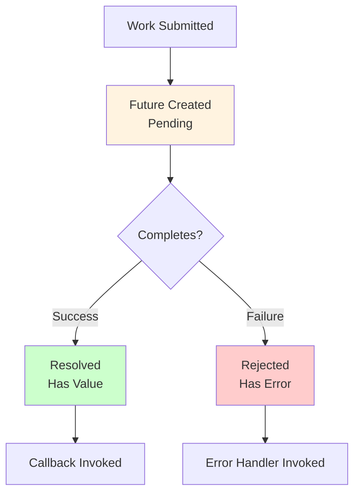

<Hero title="Futures, Promises, and Async/Await" subtitle="Represent deferred values and asynchronous computations for cleaner, more readable concurrent code" imageAlt="illustration" size="large" />

## TL;DR

Futures represent eventual values. Promises are mechanisms to fulfill futures. Async/await is syntactic sugar that makes asynchronous code read like synchronous code. These abstractions decouple work submission from result collection and dramatically improve code readability compared to callbacks or explicit thread management.

## Learning Objectives

You will be able to:
- Understand futures, promises, and their relationship
- Use async/await to write readable asynchronous code
- Compose futures/promises for complex workflows
- Handle errors in asynchronous chains
- Avoid common pitfalls like promise rejection and deadlock

## Motivating Scenario

Fetching user data from an API, then their posts, then comments requires chaining dependent operations. With callbacks (callback hell), code becomes deeply nested and error-prone. With promises/futures, you chain operations cleanly. With async/await, it reads like synchronous code while remaining fully asynchronous.

## Core Concepts

<Figure caption="Futures and Promises progression">

</Figure>

## Practical Example

<Tabs groupId="lang" queryString>
<TabItem value="python" label="Python">
```python
import asyncio
from typing import Any

# Example: Fetch user, posts, and comments
async def fetch_user(user_id: int) -> dict:
    """Simulate API call to fetch user."""
    await asyncio.sleep(0.5)
    return {"id": user_id, "name": f"User {user_id}"}

async def fetch_posts(user_id: int) -> list:
    """Simulate API call to fetch user's posts."""
    await asyncio.sleep(0.5)
    return [
        {"id": 1, "title": "Post 1", "user_id": user_id},
        {"id": 2, "title": "Post 2", "user_id": user_id},
    ]

async def fetch_comments(post_id: int) -> list:
    """Simulate API call to fetch comments on a post."""
    await asyncio.sleep(0.3)
    return [
        {"id": 1, "text": "Great post!", "post_id": post_id},
        {"id": 2, "text": "Thanks!", "post_id": post_id},
    ]

async def get_user_content(user_id: int) -> dict:
    """Compose async operations: fetch user, then posts, then comments."""
    try:
        # Fetch user first
        user = await fetch_user(user_id)
        print(f"Fetched user: {user}")
        
        # Then fetch posts
        posts = await fetch_posts(user_id)
        print(f"Fetched {len(posts)} posts")
        
        # Fetch comments for each post concurrently
        comment_tasks = [fetch_comments(post["id"]) for post in posts]
        all_comments = await asyncio.gather(*comment_tasks)
        print(f"Fetched {sum(len(c) for c in all_comments)} comments")
        
        return {
            "user": user,
            "posts": posts,
            "comments": all_comments,
        }
    except Exception as e:
        print(f"Error: {e}")
        raise

# Run async function
async def main():
    result = await get_user_content(42)
    print(f"Result: {result}")

# asyncio.run(main())
```
</TabItem>
<TabItem value="go" label="Go">
```go
package main

import (
    "fmt"
    "sync"
    "time"
)

type User struct {
    ID   int
    Name string
}

type Post struct {
    ID     int
    Title  string
    UserID int
}

type Comment struct {
    ID     int
    Text   string
    PostID int
}

// Simulate async work with goroutines and channels
func fetchUser(userID int) <-chan User {
    ch := make(chan User, 1)
    go func() {
        time.Sleep(500 * time.Millisecond)
        ch <- User{ID: userID, Name: fmt.Sprintf("User %d", userID)}
    }()
    return ch
}

func fetchPosts(userID int) <-chan []Post {
    ch := make(chan []Post, 1)
    go func() {
        time.Sleep(500 * time.Millisecond)
        ch <- []Post{
            {ID: 1, Title: "Post 1", UserID: userID},
            {ID: 2, Title: "Post 2", UserID: userID},
        }
    }()
    return ch
}

func fetchComments(postID int) <-chan []Comment {
    ch := make(chan []Comment, 1)
    go func() {
        time.Sleep(300 * time.Millisecond)
        ch <- []Comment{
            {ID: 1, Text: "Great post!", PostID: postID},
            {ID: 2, Text: "Thanks!", PostID: postID},
        }
    }()
    return ch
}

func getUserContent(userID int) map[string]interface{} {
    // Fetch user
    userCh := fetchUser(userID)
    user := <-userCh
    fmt.Printf("Fetched user: %+v\n", user)
    
    // Fetch posts
    postsCh := fetchPosts(userID)
    posts := <-postsCh
    fmt.Printf("Fetched %d posts\n", len(posts))
    
    // Fetch comments concurrently
    var wg sync.WaitGroup
    commentMap := make(map[int][]Comment)
    for _, post := range posts {
        wg.Add(1)
        go func(postID int) {
            defer wg.Done()
            commentMap[postID] = <-fetchComments(postID)
        }(post.ID)
    }
    wg.Wait()
    
    return map[string]interface{}{
        "user":     user,
        "posts":    posts,
        "comments": commentMap,
    }
}

func main() {
    result := getUserContent(42)
    fmt.Printf("Result: %+v\n", result)
}
```
</TabItem>
<TabItem value="nodejs" label="Node.js">
```javascript
// Promises and async/await
const util = require('util');
const sleep = util.promisify(setTimeout);

async function fetchUser(userId) {
    await sleep(500);
    return { id: userId, name: `User ${userId}` };
}

async function fetchPosts(userId) {
    await sleep(500);
    return [
        { id: 1, title: 'Post 1', userId },
        { id: 2, title: 'Post 2', userId },
    ];
}

async function fetchComments(postId) {
    await sleep(300);
    return [
        { id: 1, text: 'Great post!', postId },
        { id: 2, text: 'Thanks!', postId },
    ];
}

async function getUserContent(userId) {
    try {
        // Fetch user
        const user = await fetchUser(userId);
        console.log(`Fetched user: ${JSON.stringify(user)}`);
        
        // Fetch posts
        const posts = await fetchPosts(userId);
        console.log(`Fetched ${posts.length} posts`);
        
        // Fetch comments concurrently
        const commentPromises = posts.map(post => 
            fetchComments(post.id)
        );
        const allComments = await Promise.all(commentPromises);
        console.log(`Fetched ${allComments.flat().length} comments`);
        
        return {
            user,
            posts,
            comments: allComments,
        };
    } catch (error) {
        console.error(`Error: ${error}`);
        throw error;
    }
}

// Run
getUserContent(42).then(result => {
    console.log(`Result: ${JSON.stringify(result)}`);
});
```
</TabItem>
</Tabs>

## When to Use / When Not to Use

**Use Futures/Promises/Async-Await when:**
- Composing multiple asynchronous operations
- Need cleaner, more readable code than callbacks
- Error handling chains are complex
- Working with I/O-bound operations

**Avoid when:**
- CPU-bound work might block the event loop (offload to threads)
- Synchronous blocking is acceptable
- Callback chains are simple and few

## Patterns and Pitfalls

### Pitfall: Unhandled Promise Rejections

If a promise rejects and no error handler is attached, the rejection is silently dropped. Always handle errors.

### Pattern: Promise.all for Concurrent Operations

Chain independent operations with `Promise.all` (or async `gather`/`wait`) to run concurrently.

### Pitfall: Blocking the Event Loop

CPU-intensive work in async functions can block the event loop. Offload to threads or worker pools.

## Design Review Checklist

- [ ] All promise rejections are handled
- [ ] Error propagates correctly through chains
- [ ] Concurrent operations use gather/all, not sequential awaits
- [ ] No blocking CPU work in async functions
- [ ] Timeouts exist for long-running operations
- [ ] Cancellation is handled (if applicable)

## Composition Patterns

### Parallel Execution (All Must Succeed)
```python
# Wait for all operations to complete
user, posts, comments = await asyncio.gather(
    fetch_user(user_id),
    fetch_posts(user_id),
    fetch_comments(user_id)
)
# If any fails, gather() raises exception
```

### Race (First to Complete Wins)
```python
# Get result from whichever is fastest
result = await asyncio.wait_for(
    asyncio.wait([
        fetch_from_server_a(),
        fetch_from_server_b(),
    ]),
    timeout=5.0
)
```

### Sequential with Dependencies
```python
# Each step depends on previous
user = await fetch_user(user_id)  # Step 1
posts = await fetch_posts(user.id)  # Step 2 (needs user.id)
comments = await fetch_comments(posts[0].id)  # Step 3
```

## Error Handling in Async Code

```python
async def robust_fetch():
    try:
        # Primary source
        return await fetch_from_primary()
    except TimeoutError:
        logger.warning("Primary timeout, trying backup")
        return await fetch_from_backup()
    except Exception as e:
        logger.error(f"All sources failed: {e}")
        return default_fallback_value

# With Promise chains (JavaScript)
fetch_from_primary()
    .then(result => result)
    .catch(err => {
        console.warn("Primary failed", err);
        return fetch_from_backup();
    })
    .catch(err => {
        console.error("All failed", err);
        return default_fallback_value;
    });
```

## Cancellation and Cleanup

```python
async def with_timeout():
    task = asyncio.create_task(long_operation())

    try:
        result = await asyncio.wait_for(task, timeout=5.0)
    except asyncio.TimeoutError:
        task.cancel()  # Cancel remaining work
        # Cleanup code here

# Ensure cleanup always runs
async def with_finally():
    try:
        result = await async_operation()
    finally:
        # Cleanup always runs, even on exception
        await cleanup_resources()
```

## Common Pitfalls

### Pitfall 1: Creating But Not Awaiting
```python
# Wrong: Task created but not awaited
async def bad():
    asyncio.create_task(fetch_user(123))  # Fire-and-forget, results lost
    return "done"  # May return before fetch completes

# Correct: Await the task
async def good():
    user = await fetch_user(123)
    return user
```

### Pitfall 2: Sequential Instead of Parallel
```python
# Wrong: Sequential (3 operations × 2s = 6s total)
result1 = await fetch(url1)  # 2s
result2 = await fetch(url2)  # 2s
result3 = await fetch(url3)  # 2s
# Total: 6 seconds

# Correct: Parallel (max 2s)
results = await asyncio.gather(
    fetch(url1),
    fetch(url2),
    fetch(url3),
)
# Total: 2 seconds (all run concurrently)
```

### Pitfall 3: Unhandled Rejection
```python
# Wrong: Promise rejection not handled
async_operation().then(...)  # If rejects, nothing catches it

# Correct: Handle rejection
try:
    result = await async_operation()
except Exception as e:
    logger.error(f"Operation failed: {e}")
```

## Self-Check

1. **What's the difference between a future, promise, and async/await?** Future is a placeholder for eventual value; promise is mechanism to fulfill it; async/await is syntax sugar making async code look synchronous.
2. **How do you run independent async operations concurrently?** Use gather() in Python, Promise.all() in JavaScript.
3. **What happens if a promise rejection is unhandled?** Rejection is silently dropped (bad!). Always handle with try/catch or .catch().
4. **When would you use race() over gather()?** When first result wins (e.g., fetch from multiple servers).
5. **How do you cancel a running async operation?** Use asyncio.CancelledError or signal cancellation.

:::info One Takeaway
Futures and promises represent deferred values; async/await is syntactic sugar that makes asynchronous code read like synchronous code. Compose operations cleanly, always handle rejections, and prefer gather() for parallel work.

:::

## Next Steps

- Learn [Reactor](/docs/design-patterns/concurrency-patterns/reactor) and [Proactor](/docs/design-patterns/concurrency-patterns/proactor) for I/O multiplexing
- Study [Error Handling](/docs/core-design-and-programming-principles/coding-discipline/error-handling-and-exceptions) for robust async code
- Explore framework-specific patterns: RxJS, Tokio, asyncio

## Common Concurrency Pitfalls

### Pitfall 1: Forgetting await
```python
# Wrong: Task created but not awaited
async def bad():
    asyncio.create_task(slow_operation())  # Task runs in background
    return "done"  # May return before operation completes

# Correct: Await the task
async def good():
    result = await slow_operation()
    return result
```

### Pitfall 2: Mixing Async and Sync Code
```python
# Wrong: Blocking operation in async function
async def bad():
    time.sleep(5)  # Blocks entire event loop!
    return "done"

# Correct: Use async sleep
async def good():
    await asyncio.sleep(5)  # Doesn't block other tasks
    return "done"
```

### Pitfall 3: Not Handling Exceptions
```python
# Wrong: Exception in task swallowed
async def bad():
    task = asyncio.create_task(might_fail())
    return "done"  # If task fails, exception lost

# Correct: Await the task or add exception handler
async def good():
    try:
        result = await might_fail()
    except Exception as e:
        logger.error(f"Task failed: {e}")
```

### Pitfall 4: Race Conditions with Shared State
```python
# Wrong: Multiple tasks modify same list
counter = 0

async def increment():
    global counter
    # Race condition: multiple tasks read, increment, write
    counter += 1

# Correct: Use asyncio.Lock
counter = 0
counter_lock = asyncio.Lock()

async def increment():
    global counter
    async with counter_lock:
        counter += 1  # Only one task at a time
```

## Async Frameworks and Libraries

### Python asyncio
```python
import asyncio

# Built-in to Python 3.7+
async def fetch_data():
    await asyncio.sleep(1)
    return "data"

asyncio.run(fetch_data())
```

### JavaScript Promises/Async-Await
```javascript
// Native support in all modern browsers and Node.js
async function fetchData() {
    const response = await fetch(url);
    return response.json();
}

// Promise-based (older style)
fetch(url)
    .then(response => response.json())
    .then(data => console.log(data))
    .catch(error => console.error(error));
```

### Go Goroutines
```go
// Lightweight concurrency primitive
go func() {
    result := fetchData()
    channel <- result
}()

// Channels for communication
result := <-channel
```

### Rust Tokio
```rust
// Async runtime for Rust
#[tokio::main]
async fn main() {
    let result = fetch_data().await;
    println!("{}", result);
}
```

## Performance Considerations

### Event Loop Overhead
- Async adds 5-10% overhead vs. synchronous code
- Justified for I/O-bound operations (network, disk)
- Not justified for CPU-bound work

### Memory Usage
- Each future/promise uses more memory than simple value
- Thousands of concurrent tasks okay
- Millions may cause memory issues

### Debugging
- Stack traces more complex (async stack)
- Use tools like asyncio debug mode
- Add logging at key points

## References

1. "JavaScript Promises: The Definitive Guide" by Matt Greer
2. "Async in Python: A Complete Walkthrough" at https://realpython.com/async-io-python/
3. Tokio Documentation: https://tokio.rs/
4. Go Concurrency Patterns: https://go.dev/blog/pipelines
