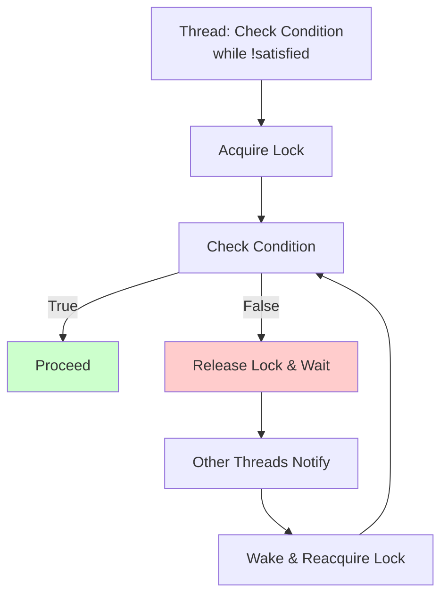

<Hero title="Guarded Suspension Pattern" subtitle="Wait safely for conditions to be met before proceeding using synchronized guard checks and notifications" imageAlt="illustration" size="large" />

## TL;DR

Guarded Suspension synchronizes conditional waiting: acquire a lock, check a condition, and if false, release the lock and wait for notification. When the condition changes, waiting threads are notified and wake to retry. This pattern eliminates busy-waiting, improves responsiveness, and prevents race conditions in condition checking.

## Learning Objectives

You will be able to:
- Understand wait-notify semantics and lock interaction
- Implement guarded suspension correctly
- Handle spurious wakeups (threads waking without notification)
- Avoid race conditions in condition checking
- Apply timeout-based waiting

## Motivating Scenario

A bounded queue must block producers when full and consumers when empty. Without Guarded Suspension, producers would busy-wait (spinning in a loop checking if space exists), wasting CPU. With the pattern, producers wait on a condition variable. When a consumer removes an item, it notifies producers, which wake and retry.

## Core Concepts

<Figure caption="Guarded Suspension flow">

</Figure>

## Practical Example

<Tabs groupId="lang" queryString>
<TabItem value="python" label="Python">
```python
import threading
import time
from typing import Any, Optional

class BoundedQueue:
    def __init__(self, capacity: int):
        self.capacity = capacity
        self.items = []
        self.lock = threading.RLock()
        self.not_full = threading.Condition(self.lock)
        self.not_empty = threading.Condition(self.lock)
    
    def put(self, item: Any, timeout: float = None) -> bool:
        """Producer: add item, blocking if queue is full."""
        with self.not_full:
            # Guard: wait while queue is full
            while len(self.items) >= self.capacity:
                if not self.not_full.wait(timeout=timeout):
                    return False  # Timeout
            
            self.items.append(item)
            print(f"Produced: {item}, queue size: {len(self.items)}")
            
            # Notify waiting consumers
            self.not_empty.notify_all()
            return True
    
    def get(self, timeout: float = None) -> Optional[Any]:
        """Consumer: remove item, blocking if queue is empty."""
        with self.not_empty:
            # Guard: wait while queue is empty
            while len(self.items) == 0:
                if not self.not_empty.wait(timeout=timeout):
                    return None  # Timeout
            
            item = self.items.pop(0)
            print(f"Consumed: {item}, queue size: {len(self.items)}")
            
            # Notify waiting producers
            self.not_full.notify_all()
            return item

# Usage
queue = BoundedQueue(capacity=3)

def producer():
    for i in range(10):
        queue.put(f"item-{i}")
        time.sleep(0.1)

def consumer():
    for _ in range(10):
        queue.get()
        time.sleep(0.2)  # Slower consumer

p = threading.Thread(target=producer)
c = threading.Thread(target=consumer)
p.start()
c.start()
p.join()
c.join()
```
</TabItem>
<TabItem value="go" label="Go">
```go
package main

import (
    "fmt"
    "sync"
    "time"
)

type BoundedQueue struct {
    capacity int
    items    []interface{}
    mu       sync.Mutex
    notFull  *sync.Cond
    notEmpty *sync.Cond
}

func NewBoundedQueue(capacity int) *BoundedQueue {
    mu := &sync.Mutex{}
    return &BoundedQueue{
        capacity: capacity,
        items:    []interface{}{},
        mu:       *mu,
        notFull:  sync.NewCond(mu),
        notEmpty: sync.NewCond(mu),
    }
}

func (q *BoundedQueue) Put(item interface{}) error {
    q.mu.Lock()
    defer q.mu.Unlock()
    
    // Guard: wait while queue is full
    for len(q.items) >= q.capacity {
        q.notFull.Wait()
    }
    
    q.items = append(q.items, item)
    fmt.Printf("Produced: %v, queue size: %d\n", item, len(q.items))
    
    // Notify waiting consumers
    q.notEmpty.Signal()
    return nil
}

func (q *BoundedQueue) Get() interface{} {
    q.mu.Lock()
    defer q.mu.Unlock()
    
    // Guard: wait while queue is empty
    for len(q.items) == 0 {
        q.notEmpty.Wait()
    }
    
    item := q.items[0]
    q.items = q.items[1:]
    fmt.Printf("Consumed: %v, queue size: %d\n", item, len(q.items))
    
    // Notify waiting producers
    q.notFull.Signal()
    return item
}

func main() {
    queue := NewBoundedQueue(3)
    var wg sync.WaitGroup
    
    // Producer
    wg.Add(1)
    go func() {
        defer wg.Done()
        for i := 0; i < 10; i++ {
            queue.Put(fmt.Sprintf("item-%d", i))
            time.Sleep(100 * time.Millisecond)
        }
    }()
    
    // Consumer
    wg.Add(1)
    go func() {
        defer wg.Done()
        for i := 0; i < 10; i++ {
            queue.Get()
            time.Sleep(200 * time.Millisecond)
        }
    }()
    
    wg.Wait()
}
```
</TabItem>
<TabItem value="nodejs" label="Node.js">
```javascript
class BoundedQueue {
    constructor(capacity) {
        this.capacity = capacity;
        this.items = [];
        this.waitingProducers = [];
        this.waitingConsumers = [];
    }

    async put(item) {
        // Wait while queue is full
        while (this.items.length >= this.capacity) {
            await new Promise(resolve => 
                this.waitingProducers.push(resolve)
            );
        }

        this.items.push(item);
        console.log(`Produced: ${item}, queue size: ${this.items.length}`);

        // Notify waiting consumer
        if (this.waitingConsumers.length > 0) {
            const consumer = this.waitingConsumers.shift();
            consumer();
        }
    }

    async get() {
        // Wait while queue is empty
        while (this.items.length === 0) {
            await new Promise(resolve => 
                this.waitingConsumers.push(resolve)
            );
        }

        const item = this.items.shift();
        console.log(`Consumed: ${item}, queue size: ${this.items.length}`);

        // Notify waiting producer
        if (this.waitingProducers.length > 0) {
            const producer = this.waitingProducers.shift();
            producer();
        }

        return item;
    }
}

// Usage
(async () => {
    const queue = new BoundedQueue(3);

    const producer = async () => {
        for (let i = 0; i < 10; i++) {
            await queue.put(`item-${i}`);
            await new Promise(resolve => setTimeout(resolve, 100));
        }
    };

    const consumer = async () => {
        for (let i = 0; i < 10; i++) {
            await queue.get();
            await new Promise(resolve => setTimeout(resolve, 200));
        }
    };

    await Promise.all([producer(), consumer()]);
})();
```
</TabItem>
</Tabs>

## When to Use / When Not to Use

**Use Guarded Suspension when:**
- Threads must wait for conditions to be true before proceeding
- Busy-waiting is unacceptable (energy/CPU efficiency matters)
- Conditions are changed by other threads
- Bounded queues or resource pools need blocking semantics

**Avoid when:**
- Polling/busy-waiting is acceptable (simple cases)
- Conditions are only checked once (simpler approaches exist)
- Non-blocking semantics are preferred

## Real-World Examples

### Producer-Consumer Queue Implementation

```java
// Java: BlockingQueue uses Guarded Suspension internally
import java.util.concurrent.LinkedBlockingQueue;
import java.util.concurrent.BlockingQueue;

BlockingQueue<Message> queue = new LinkedBlockingQueue<>(10);

// Producer
new Thread(() -> {
    for (int i = 0; i < 1000; i++) {
        try {
            queue.put(new Message(i));  // Blocks if queue full
            System.out.println("Produced: " + i);
        } catch (InterruptedException e) {
            Thread.currentThread().interrupt();
        }
    }
}).start();

// Consumer
new Thread(() -> {
    while (true) {
        try {
            Message msg = queue.take();  // Blocks if queue empty
            System.out.println("Consumed: " + msg.id);
        } catch (InterruptedException e) {
            Thread.currentThread().interrupt();
            break;
        }
    }
}).start();
```

The `put()` and `take()` methods use Guarded Suspension: put() waits if queue is full, take() waits if queue is empty.

### Database Connection Pool

```java
public class ConnectionPool {
    private Queue<Connection> availableConnections;
    private Set<Connection> inUseConnections;
    private final int maxSize;

    public synchronized Connection getConnection() throws InterruptedException {
        while (availableConnections.isEmpty() && inUseConnections.size() >= maxSize) {
            // Guard: wait if no available and max reached
            wait();  // Release lock, wait for notification
        }

        if (availableConnections.isEmpty()) {
            // Create new connection if under limit
            Connection conn = createConnection();
            inUseConnections.add(conn);
            return conn;
        }

        Connection conn = availableConnections.poll();
        inUseConnections.add(conn);
        return conn;
    }

    public synchronized void releaseConnection(Connection conn) {
        inUseConnections.remove(conn);
        availableConnections.add(conn);
        notifyAll();  // Wake waiting threads
    }
}
```

## Patterns and Pitfalls

### Pitfall: Spurious Wakeups

Threads can wake without notification (OS kernel behavior). Always use `while` (not `if`) to re-check the condition after waking.

```java
// Bad: if instead of while
synchronized (lock) {
    if (!condition) {
        lock.wait();
    }
    // WRONG: might proceed even if condition still false
    proceedWithWork();
}

// Good: while instead of if
synchronized (lock) {
    while (!condition) {
        lock.wait();
    }
    // Correct: condition definitely true
    proceedWithWork();
}
```

### Pattern: Timeout Protection

Always use timeouts on wait calls to avoid indefinite blocking if notifications are missed.

```java
synchronized (lock) {
    while (!condition) {
        try {
            lock.wait(5000);  // Wait max 5 seconds
        } catch (InterruptedException e) {
            Thread.currentThread().interrupt();
            throw new RuntimeException("Interrupted", e);
        }
    }
    // If timeout expires without notification, still proceed
    // (might be stale data, but avoids deadlock)
}
```

### Pitfall: Missed Notifications

If notification happens before wait() is called, the thread never wakes.

```java
// Bad: race condition
if (!condition) {  // Check condition
    // Another thread changes condition and notifies HERE
    lock.wait();   // Now this never returns
}

// Good: atomic check and wait
synchronized (lock) {
    while (!condition) {  // Check and wait inside synchronized block
        lock.wait();
    }
}
```

### Pattern: Notify vs NotifyAll

```java
// notify(): Wake only one waiting thread (more efficient)
// notifyAll(): Wake all waiting threads (simpler, safer)

synchronized (lock) {
    condition = true;
    notifyAll();  // Use this unless you know only one thread waits
}
```

Use `notifyAll()` unless you're certain only one thread waits. `notify()` can cause other threads to miss their turn.

## Design Review Checklist

- [ ] Conditions are checked in a `while` loop, not `if`
- [ ] Lock is held while checking conditions
- [ ] All modifications to guarded state happen while holding the lock
- [ ] Appropriate threads are notified after state changes
- [ ] Timeouts are applied to prevent indefinite blocking
- [ ] Spurious wakeups are handled (while-loop pattern)

## Self-Check

1. **Why must conditions be checked in a while loop?**
2. **What happens if you use if instead of while?**
3. **How do timeouts prevent deadlocks?**

:::info One Takeaway
Guarded Suspension combines locks and condition variables to wait efficiently for conditions. Always check conditions in while loops and use timeouts to prevent deadlock.

:::

## Next Steps

- Learn [Producer-Consumer](/docs/design-patterns/concurrency-patterns/producer-consumer) for practical queue applications
- Study [Balking](/docs/design-patterns/concurrency-patterns/balking) for non-blocking alternatives
- Explore [Double-Checked Locking](/docs/design-patterns/concurrency-patterns/double-checked-locking) for optimization

## References

1. "Concurrent Programming in Java" by Doug Lea
2. "The Linux Programming Interface" by Michael Kerrisk - Chapter on Pthreads Condition Variables
