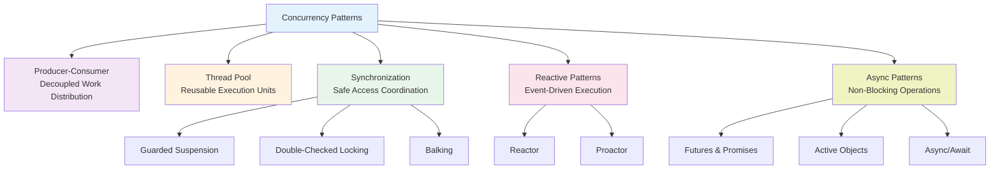

import { useCurrentSidebarCategory } from "@docusaurus/theme-common";

# Concurrency Patterns

Concurrency patterns are proven solutions for managing multiple threads, coordinating their work, and ensuring thread safety in distributed systems. They address fundamental challenges: how to safely share data, coordinate execution, handle timing issues, and scale efficiently under load. These patterns emerge from decades of experience building multithreaded applications, from low-level synchronization to high-level async workflows.

Well-designed concurrent systems exhibit these qualities:

- **Thread Safety**: Operations are atomic or properly synchronized, preventing race conditions
- **Deadlock Avoidance**: Coordinated resource acquisition and release prevent circular dependencies
- **Scalability**: Systems handle increased concurrency without proportional performance degradation
- **Responsiveness**: Long-running operations don't block critical paths
- **Maintainability**: Clear synchronization patterns make concurrency reasoning tractable
- **Fairness**: All threads get reasonable access to resources and execution time

## Why Concurrency Patterns Matter

Without proper concurrency patterns, systems suffer predictable failures:

- **Race Conditions**: Unsynchronized access to shared state produces undefined behavior
- **Deadlocks**: Circular wait dependencies freeze the system indefinitely
- **Livelocks**: Threads spin uselessly trying to resolve conflicts
- **Starvation**: Some threads never get execution time or resource access
- **Performance Collapse**: Contention at synchronization points kills scalability

Concurrency patterns eliminate these failures by providing battle-tested solutions for common coordination scenarios.

## Concurrency Pattern Categories

<Figure caption="Concurrency patterns taxonomy">

</Figure>

### Producer-Consumer

Decouple work production from consumption through shared buffers. Producers generate work items independently of how quickly consumers process them. This pattern scales across multiple producers and consumers with flexible queue depths.

### Thread Pool

Maintain a reusable pool of threads to execute tasks. Rather than creating new threads (expensive) for each task, pull from a pool of pre-allocated threads. This pattern limits concurrent threads, improves resource utilization, and provides natural backpressure.

### Reactor

A single thread multiplexes I/O across many connections using event-driven architecture. When connections become ready (readable/writable), the reactor invokes registered handlers. Ideal for I/O-bound systems serving thousands of concurrent connections with minimal thread overhead.

### Proactor

An asynchronous variant of Reactor where the framework itself initiates I/O operations asynchronously. Instead of polling for readiness, your handlers receive completion notifications. Reduces complexity by removing explicit event loop management.

### Active Object

Encapsulate each concurrent entity as an independent object with its own thread. Communication happens through message passing rather than shared memory. Eliminates synchronization complexity by making concurrency explicit in the design.

### Guarded Suspension

Wait for a condition to become true before proceeding. A thread acquires a lock, checks a condition, and if false, releases the lock and waits for notification. When other threads change the condition, waiters wake and retry.

### Balking

When a condition isn't met, immediately fail rather than waiting. Useful for operations that should complete now or not at all (non-blocking snapshots, optional optimizations). Prevents threads from blocking when results would be stale anyway.

### Double-Checked Locking

Minimize lock acquisition overhead for already-initialized state. Check the condition without a lock, acquire the lock only if re-checking still shows uninitialization. Improves performance when initialization is rare.

### Futures, Promises, and Async/Await

Represent eventual values and asynchronous computations. Futures/promises decouple work submission from result collection. Async/await syntax makes asynchronous code read like synchronous code, improving maintainability.

## How to Use These Articles

Each pattern includes:

- **Clear problem definition** showing what scenario the pattern solves
- **Detailed mechanisms** explaining how the pattern works internally
- **Real-world code examples** in Python, Go, and Node.js
- **When to apply and when to avoid** for context-specific guidance
- **Common pitfalls** to watch for during implementation
- **Performance characteristics** including time and space complexity
- **Design review checklists** for evaluating concurrent code

Patterns build conceptually but can be studied independently based on your current needs.

## Common Misconceptions

**"More threads = faster execution"** - Thread creation and context switching have overhead. Scalability plateaus and reverses with excessive threads. Thread pools and reactive patterns achieve better throughput with fewer threads.

**"Locks guarantee thread safety"** - Improperly scoped locks, forgetting to lock all accessors, or releasing locks early all compromise safety. Locks are necessary but not sufficient.

**"Immutable data removes concurrency needs"** - Sharing immutable data safely requires synchronization for memory visibility. Immutability helps but doesn't eliminate coordination needs.

**"Async always outperforms sync"** - Async adds complexity and overhead. For CPU-bound work, sync threading often wins. For I/O-bound work, async or reactive patterns excel.

**"Concurrency patterns are language-specific"** - Core concepts (buffering, multiplexing, message passing) are universal. Implementation details vary, but the patterns transfer across languages.

## Quick Reference

| Pattern | Problem | Solution | Complexity |
|---------|---------|----------|-----------|
| **Producer-Consumer** | Decoupling work | Shared queue/buffer | Medium |
| **Thread Pool** | Resource overhead | Reusable thread collection | Medium |
| **Reactor** | Handling thousands of connections | Single-threaded multiplexing | High |
| **Proactor** | Simplifying async I/O | Framework-managed async | High |
| **Active Object** | Message-based coordination | Thread per entity | Medium |
| **Guarded Suspension** | Conditional waiting | Wait/notify synchronization | Low |
| **Balking** | Non-blocking operations | Fail fast if unready | Low |
| **Double-Checked Locking** | Initialization overhead | Lock elision | Medium |
| **Futures/Promises** | Deferred computation | Value placeholders | Medium |
| **Async/Await** | Readability of async code | Syntactic sugar | Low |

<DocCardList items={useCurrentSidebarCategory().items} />
