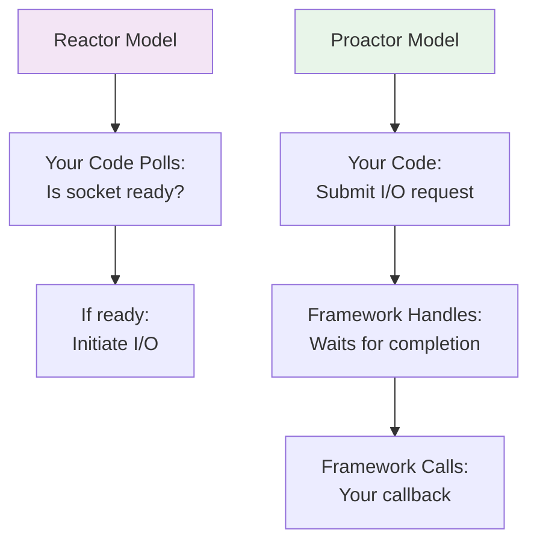

<Hero title="Proactor Pattern" subtitle="Simplify asynchronous I/O by letting the framework manage event notifications and completion handlers" imageAlt="illustration" size="large" />

## TL;DR

Proactor inverts the Reactor model: instead of your code checking when I/O is ready, the framework initiates I/O asynchronously and invokes your completion handler when finished. You submit operations and provide callbacks; the framework handles event loops and multiplexing. This model scales like Reactor but with cleaner code and less boilerplate.

## Learning Objectives

You will be able to:
- Understand proactive vs. reactive I/O models
- Implement proactor-style asynchronous operations
- Design completion handlers for async results
- Avoid blocking completion handlers
- Debug asynchronous call chains

## Motivating Scenario

A file server must read files from disk and send them over the network. With Reactor, you'd manually check socket readiness, then initiate read operations. With Proactor, you submit a read request to the framework; it handles the OS-level multiplexing and calls your handler when data arrives. Your code never explicitly polls—it just reacts to completion events.

## Core Concepts

### Reactor vs. Proactor

<Figure caption="Reactor vs. Proactor I/O models">

</Figure>

## Practical Example

<Tabs groupId="lang" queryString>
<TabItem value="python" label="Python">
```python
import asyncio
from typing import Callable

class FileProactor:
    """Asynchronous file I/O using proactor pattern."""
    
    def __init__(self):
        self.loop = asyncio.get_event_loop()
    
    async def read_file_async(self, filename: str) -> str:
        """Submit read request; framework calls this coroutine."""
        loop = asyncio.get_event_loop()
        # Framework runs this in thread pool to avoid blocking
        return await loop.run_in_executor(None, self._read_file, filename)
    
    def _read_file(self, filename: str) -> str:
        """Synchronous file read (runs in thread pool)."""
        with open(filename, 'r') as f:
            return f.read()
    
    async def write_file_async(self, filename: str, data: str) -> None:
        """Submit write request."""
        loop = asyncio.get_event_loop()
        await loop.run_in_executor(None, self._write_file, filename, data)
    
    def _write_file(self, filename: str, data: str) -> None:
        """Synchronous file write."""
        with open(filename, 'w') as f:
            f.write(data)

async def main():
    proactor = FileProactor()
    
    # Submit async operations; framework multiplexes them
    try:
        # Read multiple files concurrently
        results = await asyncio.gather(
            proactor.read_file_async('/tmp/file1.txt'),
            proactor.read_file_async('/tmp/file2.txt'),
            proactor.read_file_async('/tmp/file3.txt'),
        )
        
        for i, content in enumerate(results):
            print(f"File {i}: {len(content)} bytes")
        
        # Write results
        await proactor.write_file_async('/tmp/output.txt', '\n'.join(results))
    except FileNotFoundError as e:
        print(f"Error: {e}")

# Run proactor
# asyncio.run(main())
```
</TabItem>
<TabItem value="go" label="Go">
```go
package main

import (
    "fmt"
    "io/ioutil"
    "sync"
)

type FileProactor struct{}

// Submit read request; return channel for completion
func (p *FileProactor) ReadFileAsync(filename string) <-chan []byte {
    result := make(chan []byte, 1)
    
    // Framework spawns goroutine to handle I/O
    go func() {
        data, err := ioutil.ReadFile(filename)
        if err != nil {
            result <- nil
        } else {
            result <- data
        }
        close(result)
    }()
    
    return result
}

// Submit write request
func (p *FileProactor) WriteFileAsync(filename string, data []byte) <-chan error {
    result := make(chan error, 1)
    
    go func() {
        err := ioutil.WriteFile(filename, data, 0644)
        result <- err
        close(result)
    }()
    
    return result
}

func main() {
    proactor := &FileProactor{}
    
    // Submit multiple async read operations
    ch1 := proactor.ReadFileAsync("/tmp/file1.txt")
    ch2 := proactor.ReadFileAsync("/tmp/file2.txt")
    ch3 := proactor.ReadFileAsync("/tmp/file3.txt")
    
    // Wait for completion (proactor notifies via channels)
    var wg sync.WaitGroup
    wg.Add(3)
    
    go func() {
        defer wg.Done()
        data := <-ch1
        fmt.Printf("File 1: %d bytes\n", len(data))
    }()
    
    go func() {
        defer wg.Done()
        data := <-ch2
        fmt.Printf("File 2: %d bytes\n", len(data))
    }()
    
    go func() {
        defer wg.Done()
        data := <-ch3
        fmt.Printf("File 3: %d bytes\n", len(data))
    }()
    
    wg.Wait()
}
```
</TabItem>
<TabItem value="nodejs" label="Node.js">
```javascript
const fs = require('fs').promises;

class FileProactor {
    // Submit read request; return promise for completion
    async readFileAsync(filename) {
        try {
            // Framework handles multiplexing transparently
            return await fs.readFile(filename, 'utf-8');
        } catch (error) {
            console.error(`Read error: ${error}`);
            throw error;
        }
    }

    // Submit write request
    async writeFileAsync(filename, data) {
        try {
            await fs.writeFile(filename, data);
        } catch (error) {
            console.error(`Write error: ${error}`);
            throw error;
        }
    }
}

async function main() {
    const proactor = new FileProactor();

    try {
        // Submit multiple async operations
        // Framework multiplexes them invisibly
        const [file1, file2, file3] = await Promise.all([
            proactor.readFileAsync('/tmp/file1.txt'),
            proactor.readFileAsync('/tmp/file2.txt'),
            proactor.readFileAsync('/tmp/file3.txt'),
        ]);

        console.log(`File 1: ${file1.length} bytes`);
        console.log(`File 2: ${file2.length} bytes`);
        console.log(`File 3: ${file3.length} bytes`);

        // Write combined result
        await proactor.writeFileAsync('/tmp/output.txt', 
            `${file1}\n${file2}\n${file3}`);
    } catch (error) {
        console.error(`Error: ${error}`);
    }
}

main();
```
</TabItem>
</Tabs>

## When to Use / When Not to Use

**Use Proactor when:**
- Framework support is available (async/await, promises, coroutines)
- I/O operations significantly outnumber CPU-bound work
- Cleaner, more readable code is a priority
- Building servers or services with complex async workflows

**Avoid when:**
- Framework overhead matters more than code clarity
- CPU-bound work dominates (threading might be better)
- Real-time constraints exist (framework delays may violate them)
- Working with synchronous-only libraries

## Patterns and Pitfalls

### Pitfall: Blocking Completion Handlers

Completion handlers must return quickly. Long-running work blocks the framework. Solution: offload to thread pools or submit a new async operation.

### Pattern: Chaining Async Operations

Use promise/future composition to chain dependent operations elegantly.

## Design Review Checklist

- [ ] Completion handlers are short and non-blocking
- [ ] Error handling is present in all async chains
- [ ] Resource cleanup happens when operations complete
- [ ] No blocking calls in the async path
- [ ] Timeouts exist for long-running operations
- [ ] Backpressure prevents queue explosion

## Advanced Proactor Topics

### Composition of Async Operations

Chaining multiple async I/O operations:

```python
async def process_user_file(user_id: str):
    """Read user file, process, write results."""
    try:
        # Read file
        user_data = await read_file(f"/data/users/{user_id}.json")

        # Parse JSON
        user = json.loads(user_data)

        # Enrich with additional data (async I/O)
        user_details = await fetch_user_details(user['id'])
        user.update(user_details)

        # Write enriched data
        enriched_json = json.dumps(user)
        await write_file(f"/output/users/{user_id}_enriched.json", enriched_json)

        return {"status": "success", "user_id": user_id}
    except FileNotFoundError as e:
        return {"status": "error", "reason": "not_found"}

# Multiple files processed concurrently
results = await asyncio.gather(
    process_user_file("user1"),
    process_user_file("user2"),
    process_user_file("user3"),
    # Framework multiplexes all three
)
```

### Error Handling in Async Chains

```python
async def resilient_operation(url: str, timeout: float = 5.0):
    """Operation with fallback and retry."""
    max_retries = 3
    retry_delay = 0.1

    for attempt in range(max_retries):
        try:
            async with aiohttp.ClientSession() as session:
                async with session.get(url, timeout=timeout) as response:
                    if response.status == 200:
                        return await response.json()
                    elif response.status >= 500:
                        # Retryable error
                        raise Exception(f"Server error: {response.status}")
                    else:
                        # Non-retryable error
                        raise Exception(f"Client error: {response.status}")
        except asyncio.TimeoutError:
            if attempt < max_retries - 1:
                await asyncio.sleep(retry_delay * (2 ** attempt))  # Exponential backoff
                continue
            else:
                raise
        except Exception as e:
            if attempt < max_retries - 1:
                await asyncio.sleep(retry_delay)
                continue
            else:
                raise

    return None  # Should not reach here
```

### Backpressure and Flow Control

Prevent overwhelming the system with too many concurrent operations:

```python
class BoundedQueue:
    """Async queue with concurrency limits."""
    def __init__(self, max_concurrent: int = 10):
        self.semaphore = asyncio.Semaphore(max_concurrent)
        self.queue = asyncio.Queue()

    async def submit(self, item):
        """Submit item, blocking if at max concurrency."""
        await self.queue.put(item)

    async def process(self, handler):
        """Process queued items with concurrency limit."""
        while True:
            item = await self.queue.get()

            # Acquire semaphore (blocks if max concurrency reached)
            async with self.semaphore:
                try:
                    await handler(item)
                finally:
                    self.queue.task_done()

# Usage
queue = BoundedQueue(max_concurrent=5)

# Submit 100 tasks (only 5 run concurrently)
for i in range(100):
    await queue.submit(f"task-{i}")

# Process with handler
async def process_task(task_id):
    print(f"Processing {task_id}")
    await asyncio.sleep(1)

# This runs 100 tasks with max 5 concurrency
await queue.process(process_task)
```

### Comparing Proactor vs Reactor vs Threading

```
Operation: Read 1000 files from disk

REACTOR (Polling):
┌─ Event Loop (single-threaded)
│  ├─ Check file 1 readable? No, continue
│  ├─ Check file 2 readable? Yes, read it
│  ├─ Check file 3 readable? No, continue
│  ├─ ... (loops checking all)
│  └─ (high CPU usage checking readiness)
└─ Efficiency: Medium (manual polling)

PROACTOR (Callbacks):
┌─ Framework
│  ├─ Submit read request for files 1-1000
│  ├─ OS handles I/O (via IOCP, epoll, kqueue)
│  ├─ Framework calls callback for file 1
│  ├─ Framework calls callback for file 2
│  └─ (low CPU usage, OS handles scheduling)
└─ Efficiency: High (OS-level multiplexing)

THREADING:
┌─ Thread Pool (10 threads)
│  ├─ Thread 1: Read file 1 (blocking)
│  ├─ Thread 2: Read file 2 (blocking)
│  ├─ ... Thread 10: Read file 10 (blocking)
│  └─ Threads 11-1000 wait for threads to free
└─ Efficiency: Low (context switches, memory per thread)

Winner: Proactor (combines efficiency of polling with simplicity of callbacks)
```

## Performance Benchmarking

Async file operations under load:

```python
async def benchmark():
    """Compare I/O performance under load."""
    import time

    async def async_read(filename):
        loop = asyncio.get_event_loop()
        return await loop.run_in_executor(None, lambda: open(filename).read())

    files = [f"/tmp/file-{i}.txt" for i in range(100)]

    # Sequential (slow)
    start = time.time()
    results = []
    for f in files:
        result = await async_read(f)
        results.append(result)
    sequential_time = time.time() - start
    print(f"Sequential: {sequential_time:.2f}s")

    # Concurrent (fast)
    start = time.time()
    results = await asyncio.gather(*[async_read(f) for f in files])
    concurrent_time = time.time() - start
    print(f"Concurrent: {concurrent_time:.2f}s")
    print(f"Speedup: {sequential_time / concurrent_time:.1f}x")
```

## Self-Check

1. **What's the key difference between Reactor and Proactor?** Reactor polls "is I/O ready?"; Proactor submits I/O and waits for completion callback.

2. **If your completion handler blocks, what happens?** Framework can't process other events. The entire system stalls. Handlers must return quickly.

3. **How do you chain dependent async operations?** Use async/await syntax or futures composition. Each await yields control back to framework.

4. **When should you use async/await instead of threads?** For I/O-bound workloads. Threads are simpler but have higher overhead and more concurrency bugs.

5. **How do you prevent overwhelming the system with async operations?** Use semaphores or bounded queues to limit concurrency. Just because operations are async doesn't mean unlimited parallelism.

:::info One Takeaway
Proactor provides cleaner asynchronous I/O by letting the framework initiate operations and notify you on completion. Keep completion handlers non-blocking and short. Use async/await for natural expression of async flows. Apply backpressure limits to prevent overwhelming downstream services.

:::

## Next Steps

- Compare with [Reactor](/docs/design-patterns/concurrency-patterns/reactor) for the polling approach
- Learn [Futures & Promises](/docs/design-patterns/concurrency-patterns/futures-promises-async-await) for result representation
- Study async/await in your language of choice

## References

1. "Pattern-Oriented Software Architecture Volume 2" by Kircher & Jän
2. "Asynchronous Programming in Rust" by https://rust-lang.github.io/async-book/
