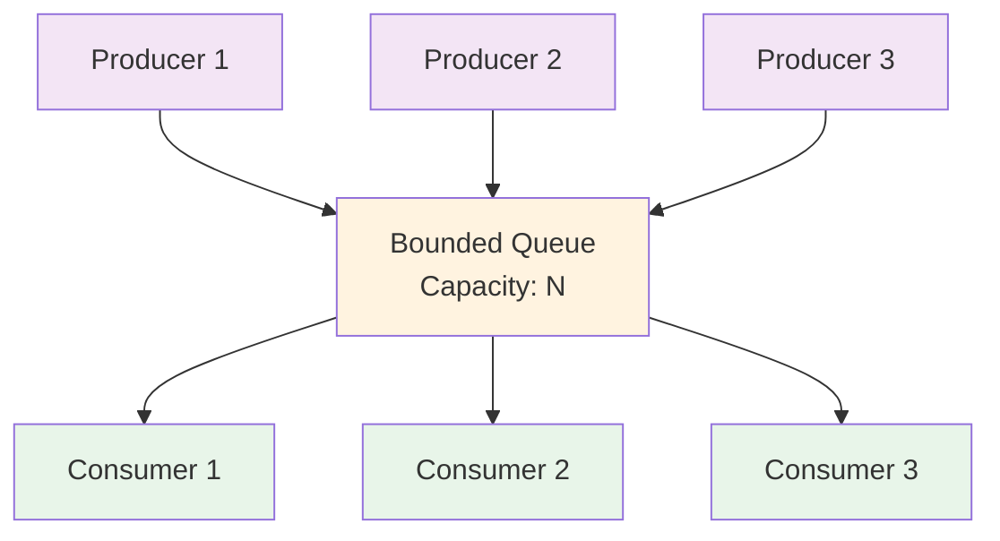

<Hero title="Producer-Consumer Pattern" subtitle="Decouple work production from consumption using shared buffers for flexible, scalable systems" imageAlt="illustration" size="large" />

## TL;DR

Producer-Consumer decouples work generation from processing through a shared buffer (queue). Producers add work items while consumers retrieve and process them independently. This pattern scales with buffer size, handles variable production/consumption rates, and enables natural load leveling. Use bounded queues with blocking semantics to prevent memory exhaustion.

## Learning Objectives

You will be able to:
- Understand how shared queues enable producer-consumer decoupling
- Implement bounded queues with blocking and timeout semantics
- Coordinate multiple producers and consumers safely
- Apply backpressure to prevent system overload
- Recognize blocking vs. non-blocking queue variants and their tradeoffs
- Debug producer-consumer deadlocks and starvation issues

## Motivating Scenario

Your payment processing system accepts requests from users at highly variable rates. Sometimes 10 requests per second, sometimes 1,000. Your backend needs to:

1. **Receive requests immediately** without keeping users waiting
2. **Process payments safely** with transactional consistency
3. **Handle bursts gracefully** without dropping requests
4. **Scale workers independently** based on current load

A naive approach (synchronous handler) blocks each request until payment completes, creating bottlenecks. Producer-Consumer solves this: requests (producers) add items to a bounded queue; payment processors (consumers) pull and handle items at their own pace. When the queue fills, producers block, providing natural backpressure.

## Core Concepts

### The Pattern Structure

<Figure caption="Producer-Consumer architecture with shared buffer">

</Figure>

### Blocking vs. Non-Blocking Queues

**Blocking Queue**: When full, producers block until space becomes available. When empty, consumers block until items arrive. This prevents memory overload and provides automatic backpressure.

**Non-Blocking Queue**: Operations return immediately. Producers must check for success and handle rejections. Useful for real-time systems where blocking is unacceptable, but shifts responsibility to callers.

### Bounded vs. Unbounded Queues

**Bounded**: Fixed maximum size. Prevents unbounded memory growth. Producers block when full—natural load regulation.

**Unbounded**: Grows with demand. Simplifies implementation but risks memory exhaustion under sustained high production rates.

## Practical Example

<Tabs groupId="lang" queryString>
<TabItem value="python" label="Python">
```python
import threading
import queue
import time
from typing import Any

class PaymentProcessor:
    def __init__(self, num_workers: int = 3, queue_size: int = 100):
        self.work_queue = queue.Queue(maxsize=queue_size)
        self.workers = []
        self.shutdown = False
        
        # Start worker threads
        for _ in range(num_workers):
            worker = threading.Thread(target=self._worker_loop, daemon=False)
            worker.start()
            self.workers.append(worker)
    
    def submit_payment(self, payment_id: str, amount: float, timeout: float = 5.0) -> bool:
        """Producers call this to submit work. Blocks if queue is full."""
        try:
            self.work_queue.put(
                {"id": payment_id, "amount": amount}, 
                timeout=timeout
            )
            return True
        except queue.Full:
            print(f"Queue full, rejected payment {payment_id}")
            return False
    
    def _worker_loop(self):
        """Consumer threads run this loop continuously."""
        while not self.shutdown:
            try:
                # Get item with timeout to allow periodic shutdown checks
                payment = self.work_queue.get(timeout=1.0)
                self._process_payment(payment)
                self.work_queue.task_done()  # Signal completion
            except queue.Empty:
                continue
            except Exception as e:
                print(f"Error processing payment: {e}")
    
    def _process_payment(self, payment: dict):
        """Simulate payment processing."""
        print(f"Processing payment {payment['id']}: ${payment['amount']}")
        time.sleep(0.5)  # Simulate work
        print(f"Completed payment {payment['id']}")
    
    def shutdown_gracefully(self, timeout: float = 10.0):
        """Wait for queued items to complete, then shut down."""
        print("Waiting for queue to drain...")
        self.work_queue.join()  # Blocks until all tasks done
        self.shutdown = True
        for worker in self.workers:
            worker.join(timeout=timeout)
        print("Shutdown complete")

# Usage
processor = PaymentProcessor(num_workers=3, queue_size=10)
try:
    for i in range(25):
        processor.submit_payment(f"PAY-{i:04d}", 99.99)
        print(f"Submitted payment {i}")
        time.sleep(0.1)
finally:
    processor.shutdown_gracefully()
```
</TabItem>
<TabItem value="go" label="Go">
```go
package main

import (
    "fmt"
    "sync"
    "time"
)

type Payment struct {
    ID     string
    Amount float64
}

type PaymentProcessor struct {
    workQueue chan Payment
    workers   int
    wg        sync.WaitGroup
    shutdown  chan struct{}
}

func NewPaymentProcessor(workers, queueSize int) *PaymentProcessor {
    return &PaymentProcessor{
        workQueue: make(chan Payment, queueSize),
        workers:   workers,
        shutdown:  make(chan struct{}),
    }
}

func (p *PaymentProcessor) Start() {
    for i := 0; i < p.workers; i++ {
        p.wg.Add(1)
        go p.workerLoop()
    }
}

func (p *PaymentProcessor) SubmitPayment(payment Payment) error {
    select {
    case p.workQueue <- payment:
        return nil
    case <-p.shutdown:
        return fmt.Errorf("processor is shutting down")
    }
}

func (p *PaymentProcessor) workerLoop() {
    defer p.wg.Done()
    for {
        select {
        case payment, ok := <-p.workQueue:
            if !ok {
                return // Channel closed
            }
            p.processPayment(payment)
        case <-p.shutdown:
            return
        }
    }
}

func (p *PaymentProcessor) processPayment(payment Payment) {
    fmt.Printf("Processing payment %s: $%.2f\n", payment.ID, payment.Amount)
    time.Sleep(500 * time.Millisecond) // Simulate work
    fmt.Printf("Completed payment %s\n", payment.ID)
}

func (p *PaymentProcessor) ShutdownGracefully() {
    close(p.workQueue)
    p.wg.Wait()
    fmt.Println("Shutdown complete")
}

func main() {
    processor := NewPaymentProcessor(3, 10)
    processor.Start()
    
    for i := 0; i < 25; i++ {
        payment := Payment{
            ID:     fmt.Sprintf("PAY-%04d", i),
            Amount: 99.99,
        }
        if err := processor.SubmitPayment(payment); err != nil {
            fmt.Printf("Failed to submit: %v\n", err)
        }
        time.Sleep(100 * time.Millisecond)
    }
    
    processor.ShutdownGracefully()
}
```
</TabItem>
<TabItem value="nodejs" label="Node.js">
```javascript
const { EventEmitter } = require('events');

class PaymentProcessor extends EventEmitter {
    constructor(numWorkers = 3, queueSize = 100) {
        super();
        this.queue = [];
        this.queueSize = queueSize;
        this.processing = 0;
        this.maxWorkers = numWorkers;
        this.shutdown = false;
    }

    async submitPayment(paymentId, amount) {
        // Return promise that resolves when item is processed
        return new Promise((resolve, reject) => {
            if (this.shutdown) {
                reject(new Error('Processor is shutting down'));
                return;
            }

            // Check if queue is full
            if (this.queue.length >= this.queueSize) {
                reject(new Error('Queue is full'));
                return;
            }

            this.queue.push({
                id: paymentId,
                amount,
                resolve,
                reject
            });

            // Process next item if workers available
            this.processNext();
        });
    }

    async processNext() {
        if (this.processing >= this.maxWorkers || this.queue.length === 0) {
            return;
        }

        this.processing++;
        const item = this.queue.shift();

        try {
            await this.processPayment(item);
            item.resolve();
        } catch (error) {
            item.reject(error);
        } finally {
            this.processing--;
            // Process next item if queue has items
            if (this.queue.length > 0) {
                setImmediate(() => this.processNext());
            }
        }
    }

    async processPayment(payment) {
        console.log(`Processing payment ${payment.id}: $${payment.amount}`);
        await new Promise(resolve => setTimeout(resolve, 500)); // Simulate work
        console.log(`Completed payment ${payment.id}`);
    }

    async shutdownGracefully() {
        console.log('Waiting for queue to drain...');
        this.shutdown = true;
        
        // Wait for all pending items
        while (this.queue.length > 0 || this.processing > 0) {
            await new Promise(resolve => setTimeout(resolve, 100));
        }
        
        console.log('Shutdown complete');
    }
}

// Usage
(async () => {
    const processor = new PaymentProcessor(3, 10);

    try {
        for (let i = 0; i < 25; i++) {
            processor.submitPayment(`PAY-${String(i).padStart(4, '0')}`, 99.99)
                .catch(err => console.error(`Failed: ${err.message}`));
            await new Promise(resolve => setTimeout(resolve, 100));
        }
    } finally {
        await processor.shutdownGracefully();
    }
})();
```
</TabItem>
</Tabs>

## When to Use / When Not to Use

**Use Producer-Consumer when:**
- Production and consumption rates are different and variable
- You need backpressure to prevent memory exhaustion
- Multiple independent producers or consumers exist
- You want natural load leveling and elasticity
- Decoupling producers from consumers reduces system complexity

**Avoid when:**
- Latency-critical systems cannot tolerate queueing delays
- The buffer size is unpredictable and potentially unbounded
- Synchronous request-response is required (use async patterns instead)
- A single producer-consumer pair with tight synchronization needs simpler approaches

## Patterns and Pitfalls

### Pitfall: Unbounded Queue Growth

Using an unbounded queue "temporarily" often leads to eventual memory exhaustion. Always use bounded queues with explicit overflow handling.

### Pattern: Graceful Shutdown

Implement drain-and-shutdown semantics:
1. Stop accepting new work
2. Wait for queued items to complete
3. Shut down consumer threads cleanly

### Pitfall: Consumer Exceptions Stopping Processing

If a consumer throws an exception without catching and continuing, the worker thread dies. Other workers keep processing, but you've lost capacity. Wrap consumer logic in try-catch.

### Pattern: Multiple Queue Depths

Use separate queues for different work priorities. High-priority work gets a dedicated consumer with lower latency.

## Design Review Checklist

<Checklist items={[
  "Queue is bounded to prevent memory exhaustion",
  "Overflow behavior is explicitly defined (blocking, rejecting, or priority)",
  "Shutdown is graceful (drains queue before terminating)",
  "Consumer exceptions don't kill worker threads",
  "Dead letters or error handling exists for failed items",
  "Queue size is monitored and tuned based on production rates",
  "Multiple producers/consumers coordinate safely via the queue",
  "Timeout values prevent indefinite blocking",
  "Queue metrics (size, throughput) are observable"
]} />

## Self-Check

1. **What happens if producers are 10x faster than consumers? How does your queue handle this?**
2. **Can your consumer threads shut down gracefully without losing in-flight work?**
3. **If a consumer crashes while processing an item, is it recovered or lost?**

:::info One Takeaway
A bounded shared queue decouples producers from consumers, enabling flexible scaling and natural backpressure. Always bound your queues, handle overflows explicitly, and ensure graceful shutdown.

:::

## Next Steps

- Study the [Thread Pool pattern](/docs/design-patterns/concurrency-patterns/thread-pool) for consuming many tasks efficiently
- Learn [Guarded Suspension](/docs/design-patterns/concurrency-patterns/guarded-suspension) for conditional waiting coordination
- Explore [Reactor](/docs/design-patterns/concurrency-patterns/reactor) for high-concurrency I/O scenarios

## References

1. "Concurrent Programming in Java: Design Principles and Patterns" by Doug Lea
2. "Pattern-Oriented Software Architecture Volume 2: Patterns for Concurrent and Distributed Objects" by Kircher & Jän
