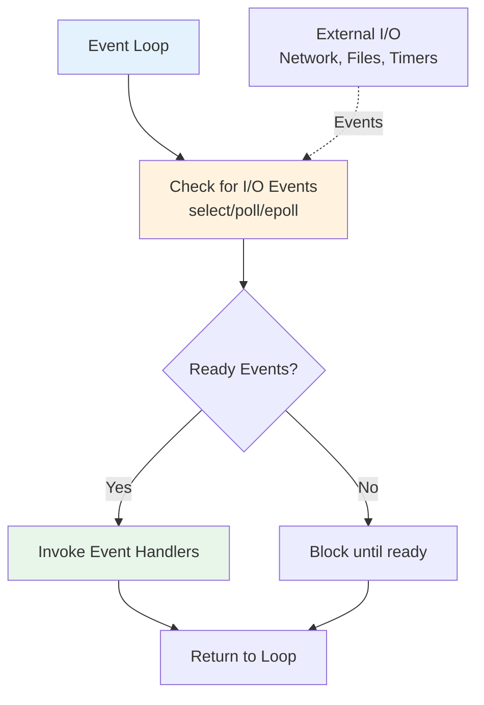

<Hero title="Reactor Pattern" subtitle="Multiplex I/O events across many connections using a single-threaded event-driven architecture" imageAlt="illustration" size="large" />

## TL;DR

Reactor demultiplexes I/O events across many connections using a single-threaded event loop. When connections become ready (readable/writable), the reactor invokes registered event handlers. This pattern scales to thousands of concurrent connections with minimal thread overhead. Ideal for I/O-bound servers like web servers, proxies, and message brokers.

## Learning Objectives

You will be able to:
- Understand event loop multiplexing and non-blocking I/O
- Implement reactor using select/poll/epoll primitives
- Design event handlers for asynchronous operations
- Avoid blocking operations in the event loop
- Debug high-concurrency I/O scenarios

## Motivating Scenario

A WebSocket server must handle 10,000 concurrent client connections. A thread-per-connection approach requires 10,000 threads—each with memory overhead (stack, TLS), causing context-switch storms. Reactor solves this: one thread runs an event loop that monitors all sockets via OS multiplexing. When a socket becomes readable, the loop invokes the handler, which processes the data and returns. The loop moves to the next event, scaling to hundreds of thousands of connections.

## Core Concepts

### The Event Loop Architecture

<Figure caption="Reactor event loop flow">

</Figure>

### Multiplexing Primitives

**select**: Classic POSIX multiplexer. Limited to 1024 file descriptors per process (platform-dependent).

**poll**: Handles unlimited file descriptors but O(n) scanning overhead.

**epoll** (Linux): O(1) event notification. The de-facto standard for high-concurrency I/O.

## Practical Example

<Tabs groupId="lang" queryString>
<TabItem value="python" label="Python">
```python
import select
import socket
import time
from typing import Dict, Callable

class SimpleReactor:
    def __init__(self, host='localhost', port=8000):
        self.host = host
        self.port = port
        self.server_socket = None
        self.connections: Dict[socket.socket, str] = {}
        self.handlers = {}
    
    def register_handler(self, event_type: str, handler: Callable):
        """Register handler for event type."""
        self.handlers[event_type] = handler
    
    def start(self):
        """Start the reactor event loop."""
        # Create server socket
        self.server_socket = socket.socket(socket.AF_INET, socket.SOCK_STREAM)
        self.server_socket.setsockopt(socket.SOL_SOCKET, socket.SO_REUSEADDR, 1)
        self.server_socket.bind((self.host, self.port))
        self.server_socket.listen(128)
        self.server_socket.setblocking(False)
        
        print(f"Reactor listening on {self.host}:{self.port}")
        
        try:
            while True:
                # Multiplex I/O: check which sockets are ready
                readable, _, _ = select.select(
                    [self.server_socket] + list(self.connections.keys()),
                    [],
                    [],
                    timeout=1.0
                )
                
                for sock in readable:
                    if sock == self.server_socket:
                        self._handle_new_connection()
                    else:
                        self._handle_client_readable(sock)
        finally:
            self.shutdown()
    
    def _handle_new_connection(self):
        """Handle incoming connection."""
        client_socket, address = self.server_socket.accept()
        client_socket.setblocking(False)
        self.connections[client_socket] = address
        print(f"New connection from {address}")
        
        if 'connect' in self.handlers:
            self.handlers['connect'](client_socket, address)
    
    def _handle_client_readable(self, sock: socket.socket):
        """Handle readable client socket."""
        try:
            data = sock.recv(1024)
            if data:
                if 'data' in self.handlers:
                    self.handlers['data'](sock, data)
            else:
                # Connection closed
                if 'disconnect' in self.handlers:
                    self.handlers['disconnect'](sock)
                self._close_connection(sock)
        except Exception as e:
            print(f"Error: {e}")
            self._close_connection(sock)
    
    def _close_connection(self, sock: socket.socket):
        """Close client connection."""
        if sock in self.connections:
            del self.connections[sock]
        sock.close()
    
    def shutdown(self):
        """Shutdown reactor."""
        for sock in list(self.connections.keys()):
            self._close_connection(sock)
        if self.server_socket:
            self.server_socket.close()
        print("Reactor shutdown")

# Usage
reactor = SimpleReactor('localhost', 8000)

def on_connect(sock, address):
    sock.send(b"Welcome to Reactor Server\n")

def on_data(sock, data):
    message = data.decode('utf-8', errors='ignore').strip()
    response = f"Echo: {message}\n"
    sock.send(response.encode())

def on_disconnect(sock):
    print(f"Client disconnected")

reactor.register_handler('connect', on_connect)
reactor.register_handler('data', on_data)
reactor.register_handler('disconnect', on_disconnect)

# Run reactor
# reactor.start()
```
</TabItem>
<TabItem value="go" label="Go">
```go
package main

import (
    "fmt"
    "net"
)

type Reactor struct {
    listener net.Listener
    done     chan struct{}
}

func NewReactor(addr string) (*Reactor, error) {
    listener, err := net.Listen("tcp", addr)
    if err != nil {
        return nil, err
    }
    return &Reactor{
        listener: listener,
        done:     make(chan struct{}),
    }, nil
}

func (r *Reactor) Start() error {
    defer r.listener.Close()
    
    fmt.Printf("Reactor listening on %s\n", r.listener.Addr())
    
    for {
        select {
        case <-r.done:
            return nil
        default:
        }
        
        // Accept new connection
        conn, err := r.listener.Accept()
        if err != nil {
            return err
        }
        
        // Handle connection in goroutine
        // (Go's runtime handles multiplexing internally)
        go r.handleConnection(conn)
    }
}

func (r *Reactor) handleConnection(conn net.Conn) {
    defer conn.Close()
    
    addr := conn.RemoteAddr()
    fmt.Printf("New connection from %s\n", addr)
    
    // Send welcome message
    conn.Write([]byte("Welcome to Reactor Server\n"))
    
    // Echo loop
    buffer := make([]byte, 1024)
    for {
        n, err := conn.Read(buffer)
        if err != nil {
            fmt.Printf("Client %s disconnected\n", addr)
            return
        }
        
        message := string(buffer[:n])
        response := fmt.Sprintf("Echo: %s", message)
        conn.Write([]byte(response))
    }
}

func (r *Reactor) Shutdown() {
    close(r.done)
}

func main() {
    reactor, err := NewReactor("localhost:8000")
    if err != nil {
        fmt.Printf("Error: %v\n", err)
        return
    }
    
    if err := reactor.Start(); err != nil {
        fmt.Printf("Reactor error: %v\n", err)
    }
}
```
</TabItem>
<TabItem value="nodejs" label="Node.js">
```javascript
const net = require('net');
const EventEmitter = require('events');

class Reactor extends EventEmitter {
    constructor(host = 'localhost', port = 8000) {
        super();
        this.host = host;
        this.port = port;
        this.server = net.createServer();
        this.connections = new Set();
    }

    start() {
        this.server.on('connection', (socket) => {
            this.handleNewConnection(socket);
        });

        this.server.listen(this.port, this.host, () => {
            console.log(`Reactor listening on ${this.host}:${this.port}`);
        });

        // Error handling
        this.server.on('error', (err) => {
            console.error(`Server error: ${err}`);
        });
    }

    handleNewConnection(socket) {
        this.connections.add(socket);
        const address = socket.remoteAddress;
        console.log(`New connection from ${address}`);

        // Send welcome message
        socket.write('Welcome to Reactor Server\n');

        // Data event (readable)
        socket.on('data', (data) => {
            const message = data.toString('utf-8').trim();
            const response = `Echo: ${message}\n`;
            socket.write(response);
        });

        // Close event
        socket.on('end', () => {
            console.log(`Client ${address} disconnected`);
            this.connections.delete(socket);
            socket.destroy();
        });

        // Error event
        socket.on('error', (err) => {
            console.error(`Socket error: ${err}`);
            this.connections.delete(socket);
        });
    }

    shutdown() {
        this.connections.forEach(socket => socket.destroy());
        this.server.close();
        console.log('Reactor shutdown');
    }
}

// Usage
const reactor = new Reactor('localhost', 8000);
reactor.start();

// Graceful shutdown on SIGTERM
process.on('SIGTERM', () => {
    reactor.shutdown();
    process.exit(0);
});
```
</TabItem>
</Tabs>

## When to Use / When Not to Use

**Use Reactor when:**
- Handling thousands of concurrent I/O connections
- I/O latency dominates (network, disk)
- Resource efficiency matters (minimal threads)
- Building servers, proxies, or message brokers

**Avoid when:**
- CPU-bound workload (blocking computations starve the event loop)
- Synchronous libraries block the loop
- Single-threaded bottleneck becomes critical
- Debugging and error handling are hard in your context

## Patterns and Pitfalls

### Pitfall: Blocking Operations

Never perform CPU-intensive work or blocking I/O directly in the event loop. This starves other connections. Solution: offload to thread pools.

### Pattern: Event Handler Error Isolation

Exceptions in one handler shouldn't crash the entire loop. Wrap handlers in try-catch.

## Design Review Checklist

- [ ] No blocking operations in the event loop
- [ ] CPU-bound work is offloaded to thread pools
- [ ] Event handlers are short-lived and non-blocking
- [ ] Proper error handling in handlers
- [ ] Resource cleanup (closing connections, file handles)
- [ ] Graceful shutdown waits for pending I/O
- [ ] Monitoring tracks connection count and event latency

## Advanced Reactor Implementations

### Thread Pool Integration

```python
from concurrent.futures import ThreadPoolExecutor
import select
import socket

class ReactorWithThreadPool:
    def __init__(self, host='localhost', port=8000, num_workers=4):
        self.host = host
        self.port = port
        self.executor = ThreadPoolExecutor(max_workers=num_workers)
        self.connections = {}
        self.server_socket = None

    def start(self):
        self.server_socket = socket.socket(socket.AF_INET, socket.SOCK_STREAM)
        self.server_socket.setsockopt(socket.SOL_SOCKET, socket.SO_REUSEADDR, 1)
        self.server_socket.bind((self.host, self.port))
        self.server_socket.listen(128)
        self.server_socket.setblocking(False)

        try:
            while True:
                # Multiplex I/O
                readable, _, _ = select.select(
                    [self.server_socket] + list(self.connections.keys()),
                    [],
                    [],
                    timeout=1.0
                )

                for sock in readable:
                    if sock == self.server_socket:
                        client_socket, address = self.server_socket.accept()
                        client_socket.setblocking(False)
                        self.connections[client_socket] = address
                    else:
                        # Submit CPU-bound work to thread pool
                        # Don't block event loop
                        self.executor.submit(self._handle_client, sock)
        finally:
            self.shutdown()

    def _handle_client(self, sock):
        """Handle client in thread pool (blocks OK here)"""
        try:
            data = sock.recv(4096)
            if data:
                # CPU-intensive processing
                result = self._process_data(data)
                sock.send(result)
            else:
                sock.close()
                if sock in self.connections:
                    del self.connections[sock]
        except Exception as e:
            print(f"Error: {e}")
            sock.close()
            if sock in self.connections:
                del self.connections[sock]

    def _process_data(self, data):
        """CPU-bound work (runs in thread pool, not event loop)"""
        # Simulate expensive computation
        result = data.upper()
        return result

    def shutdown(self):
        for sock in list(self.connections.keys()):
            sock.close()
        if self.server_socket:
            self.server_socket.close()
        self.executor.shutdown(wait=True)
```

### Timer Management in Reactor

```python
import heapq
import time

class ReactorWithTimers:
    def __init__(self):
        self.timers = []  # Min-heap of (timeout, callback)
        self.timer_id = 0

    def schedule_timer(self, delay_seconds, callback):
        """Schedule callback after delay_seconds"""
        timeout = time.time() + delay_seconds
        self.timer_id += 1
        heapq.heappush(self.timers, (timeout, self.timer_id, callback))
        return self.timer_id

    def cancel_timer(self, timer_id):
        """Cancel scheduled timer (lazy deletion)"""
        # Timers marked as cancelled; removed when popped
        pass

    def get_next_timeout(self):
        """Get how long to wait until next timer"""
        if not self.timers:
            return None

        next_timeout, _, _ = self.timers[0]
        wait_time = max(0, next_timeout - time.time())
        return wait_time

    def fire_timers(self):
        """Execute any timers that are ready"""
        now = time.time()
        while self.timers and self.timers[0][0] <= now:
            timeout, timer_id, callback = heapq.heappop(self.timers)
            try:
                callback()
            except Exception as e:
                print(f"Timer error: {e}")

    def event_loop(self, sockets):
        """Event loop with timer support"""
        while True:
            # Fire any ready timers
            self.fire_timers()

            # Wait for I/O or next timer
            timeout = self.get_next_timeout()
            readable, _, _ = select.select(sockets, [], [], timeout)

            for sock in readable:
                self._handle_socket(sock)

# Usage
reactor = ReactorWithTimers()

# Schedule a callback after 5 seconds
reactor.schedule_timer(5.0, lambda: print("Timeout fired!"))

# Schedule periodic callback
def periodic_task():
    print("Running periodic task...")
    reactor.schedule_timer(10.0, periodic_task)  # Reschedule

reactor.schedule_timer(10.0, periodic_task)
```

### High-Performance Epoll Implementation (Linux)

```python
import select
import socket

class EpollReactor:
    def __init__(self, host='localhost', port=8000):
        self.host = host
        self.port = port
        self.epoll = select.epoll()
        self.connections = {}
        self.server_socket = None

    def start(self):
        self.server_socket = socket.socket(socket.AF_INET, socket.SOCK_STREAM)
        self.server_socket.setsockopt(socket.SOL_SOCKET, socket.SO_REUSEADDR, 1)
        self.server_socket.bind((self.host, self.port))
        self.server_socket.listen(128)
        self.server_socket.setblocking(False)

        # Register server socket with epoll
        self.epoll.register(self.server_socket.fileno(), select.EPOLLIN)

        try:
            while True:
                # epoll returns events immediately (O(1) vs select O(n))
                events = self.epoll.poll(timeout=1.0)

                for fd, event in events:
                    if fd == self.server_socket.fileno():
                        self._handle_new_connection()
                    else:
                        sock = self.connections.get(fd)
                        if sock:
                            if event & select.EPOLLIN:
                                self._handle_readable(sock, fd)
                            if event & select.EPOLLOUT:
                                self._handle_writable(sock, fd)
        finally:
            self.shutdown()

    def _handle_new_connection(self):
        client_socket, address = self.server_socket.accept()
        client_socket.setblocking(False)
        fd = client_socket.fileno()
        self.connections[fd] = client_socket
        # Register with epoll
        self.epoll.register(fd, select.EPOLLIN | select.EPOLLOUT)

    def _handle_readable(self, sock, fd):
        try:
            data = sock.recv(4096)
            if data:
                print(f"Received: {data}")
                sock.send(b"Echo: " + data)
            else:
                self._close_connection(sock, fd)
        except Exception as e:
            print(f"Error: {e}")
            self._close_connection(sock, fd)

    def _handle_writable(self, sock, fd):
        # Called when socket is ready for writing
        # Most of the time, sockets are writable (buffer has space)
        # So we typically only monitor for read events
        pass

    def _close_connection(self, sock, fd):
        self.epoll.unregister(fd)
        sock.close()
        del self.connections[fd]

    def shutdown(self):
        self.epoll.close()
        for sock in self.connections.values():
            sock.close()
        if self.server_socket:
            self.server_socket.close()
```

## Comparison: Reactor vs. Thread-Per-Connection

| Aspect | Reactor | Threads |
|--------|---------|---------|
| Memory/Connection | ~1-2KB | ~1-2MB |
| Context Switches | Few (event loop) | Many (scheduler) |
| Max Connections | 10,000+ | 100-1,000 |
| Code Complexity | Medium (state machines) | Low (linear code) |
| Debugging | Hard (events, state) | Easy (stack traces) |
| CPU Efficiency | High (no switch overhead) | Low (switch overhead) |
| Latency Variance | Low (predictable) | High (unpredictable) |

## Self-Check

1. **What happens if you call a blocking system call in an event handler?** The entire event loop blocks. No other clients can be served. Your server appears hung. Solution: detect blocking calls, use async versions, or offload to thread pool.

2. **How does epoll scale compared to select?** Select is O(n) scanning. Epoll is O(1) per event. At 10,000 connections, select scans all 10,000 every loop; epoll only touches active ones.

3. **Can your reactor shut down gracefully while clients are connected?** Yes: set flag to stop accepting new connections, let event loop finish processing existing clients, close server socket. Graceful shutdown prevents abrupt disconnects.

4. **What's the biggest performance gotcha in reactor implementation?** Blocking operations in handlers. Single blocking call stops entire server. Always offload blocking work.

5. **When should I use reactor vs. threads?** Reactor: thousands of connections, I/O-bound, low-latency requirements. Threads: simpler code, moderate concurrency (hundreds), CPU tasks, easier debugging.

:::info One Takeaway
Reactor scales to thousands of concurrent I/O connections by multiplexing events in a single thread. Never block the event loop, and offload CPU work to dedicated threads.

:::

## Next Steps

- Study [Proactor](/docs/design-patterns/concurrency-patterns/proactor) for a more asynchronous variant
- Learn [Thread Pool](/docs/design-patterns/concurrency-patterns/thread-pool) for offloading blocking work
- Explore frameworks like Node.js, Netty, or Tokio that implement Reactor patterns

## References

1. "Pattern-Oriented Software Architecture Volume 2" by Kircher & Jän
2. "The Linux Programming Interface" by Michael Kerrisk
