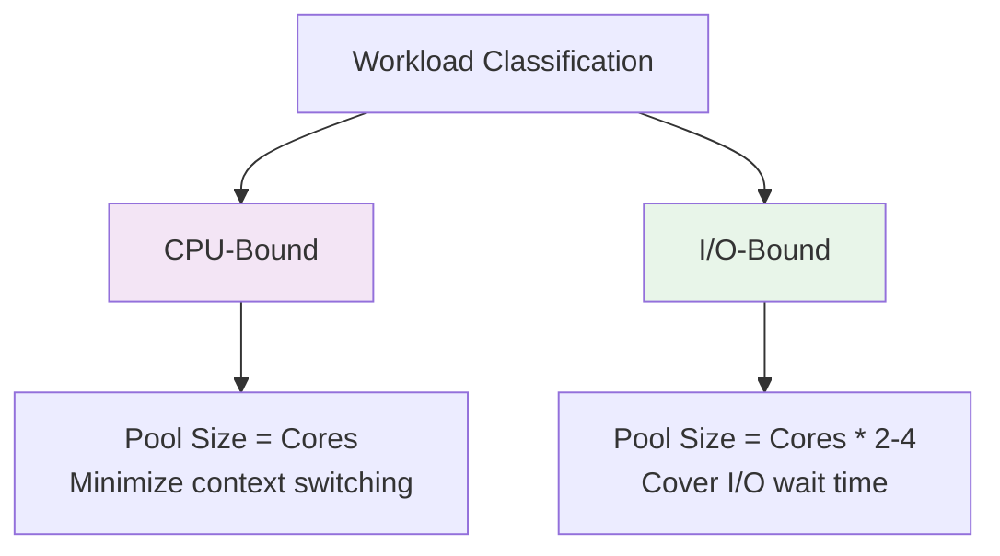

<Hero title="Thread Pool Pattern" subtitle="Reuse threads efficiently by maintaining a pool of pre-allocated workers to process tasks" imageAlt="illustration" size="large" />

## TL;DR

Thread Pool maintains a reusable collection of threads that process tasks from a queue. Rather than creating expensive threads for each task, pull pre-allocated threads from the pool. This pattern limits concurrent threads, improves resource utilization, and reduces GC pressure. Proper pool sizing and queue management are critical for performance.

## Learning Objectives

You will be able to:
- Understand thread lifecycle management and cost models
- Size thread pools appropriately for workload characteristics
- Configure rejection policies and queue depths
- Avoid thread starvation deadlocks
- Monitor pool health and bottlenecks
- Recognize CPU-bound vs. I/O-bound sizing strategies

## Motivating Scenario

Your web server receives 1,000 requests per second. A naive approach creates a new thread for each request. But thread creation has overhead (stack allocation, context switch setup). Under sustained load, you're creating/destroying 86 million threads per day—an unsustainable cost in CPU and memory.

Thread Pool solves this: maintain a fixed set of 50 worker threads. Each request becomes a small task queued for the next available worker. Threads are reused across thousands of requests, amortizing creation costs.

## Core Concepts

### Pool Sizing Strategies

<Figure caption="Thread pool sizing for different workloads">

</Figure>

**CPU-Bound**: Threads are always running. Excess threads only add context-switch overhead. Size the pool to match available CPU cores. On an 8-core machine: 8 threads.

**I/O-Bound**: Threads block on I/O frequently. More threads can execute while others wait. Size larger: cores × 2 to 4, depending on I/O wait ratios.

### Queue Strategies

**Bounded Queue**: Limits memory and provides backpressure. When full, new tasks trigger rejection policies.

**Priority Queue**: Higher-priority tasks execute first, improving responsiveness for critical work.

**Work-Stealing Queue**: Idle threads steal tasks from busy threads, improving load balancing.

### Rejection Policies

**Abort**: Throw an exception. Caller handles the failure.

**Discard**: Silently drop the task. Acceptable for non-critical work.

**Caller Runs**: Execute the task on the submitting thread. Provides backpressure by slowing the producer.

**Discard Oldest**: Remove oldest queued task to make room. For time-sensitive workloads.

## Practical Example

<Tabs groupId="lang" queryString>
<TabItem value="python" label="Python">
```python
import concurrent.futures
import threading
import time
import logging

logging.basicConfig(level=logging.INFO)
logger = logging.getLogger(__name__)

class DatabaseQueryTask:
    def __init__(self, query_id: int, sql: str):
        self.query_id = query_id
        self.sql = sql
    
    def execute(self) -> dict:
        """Simulate I/O-bound database query."""
        logger.info(f"Query {self.query_id}: {self.sql}")
        time.sleep(0.5)  # Simulate network latency
        return {"query_id": self.query_id, "rows": 42}

# Create thread pool
# For I/O-bound: cores * 2 (assuming 4 cores: 8 threads)
with concurrent.futures.ThreadPoolExecutor(
    max_workers=8,
    thread_name_prefix="db-worker"
) as executor:
    
    # Submit 20 queries
    futures = []
    for i in range(20):
        task = DatabaseQueryTask(i, f"SELECT * FROM users WHERE id={i}")
        future = executor.submit(task.execute)
        futures.append(future)
    
    # Collect results
    completed = 0
    for future in concurrent.futures.as_completed(futures, timeout=10):
        try:
            result = future.result()
            completed += 1
            logger.info(f"Completed: {result}")
        except Exception as e:
            logger.error(f"Task failed: {e}")
    
    logger.info(f"All {completed}/{len(futures)} tasks completed")

# Pool is automatically shutdown here
logger.info("Pool shutdown complete")
```
</TabItem>
<TabItem value="go" label="Go">
```go
package main

import (
    "fmt"
    "sync"
    "time"
)

type DatabaseQuery struct {
    ID  int
    SQL string
}

type WorkerPool struct {
    workers   int
    taskChan  chan DatabaseQuery
    resultCh  chan QueryResult
    wg        sync.WaitGroup
}

type QueryResult struct {
    ID   int
    Rows int
    Err  error
}

func NewWorkerPool(workers int) *WorkerPool {
    pool := &WorkerPool{
        workers:  workers,
        taskChan: make(chan DatabaseQuery, 100), // Bounded queue
        resultCh: make(chan QueryResult),
    }
    
    // Start worker threads
    for i := 0; i < workers; i++ {
        pool.wg.Add(1)
        go pool.worker(i)
    }
    
    return pool
}

func (p *WorkerPool) worker(id int) {
    defer p.wg.Done()
    
    for query := range p.taskChan {
        result := QueryResult{ID: query.ID}
        
        // Execute query
        fmt.Printf("Worker %d: %s\n", id, query.SQL)
        time.Sleep(500 * time.Millisecond) // Simulate I/O
        result.Rows = 42
        
        p.resultCh <- result
    }
}

func (p *WorkerPool) Submit(query DatabaseQuery) {
    p.taskChan <- query
}

func (p *WorkerPool) Shutdown() {
    close(p.taskChan)
    p.wg.Wait()
    close(p.resultCh)
}

func main() {
    pool := NewWorkerPool(8) // I/O-bound: 2x cores
    
    // Submit 20 queries
    for i := 0; i < 20; i++ {
        query := DatabaseQuery{
            ID:  i,
            SQL: fmt.Sprintf("SELECT * FROM users WHERE id=%d", i),
        }
        pool.Submit(query)
    }
    
    // Collect results in goroutine
    go func() {
        count := 0
        for result := range pool.resultCh {
            if result.Err != nil {
                fmt.Printf("Error: %v\n", result.Err)
            } else {
                fmt.Printf("Query %d completed: %d rows\n", result.ID, result.Rows)
                count++
            }
        }
        fmt.Printf("All %d queries completed\n", count)
    }()
    
    pool.Shutdown()
}
```
</TabItem>
<TabItem value="nodejs" label="Node.js">
```javascript
// Using Node.js built-in worker_threads pool pattern

const os = require('os');
const { Worker } = require('worker_threads');

class ThreadPool {
    constructor(maxWorkers = os.cpus().length * 2) {
        this.maxWorkers = maxWorkers;
        this.workers = [];
        this.taskQueue = [];
        this.activeWorkers = 0;
        
        // Initialize worker threads
        for (let i = 0; i < maxWorkers; i++) {
            const worker = new Worker('./worker.js');
            worker.on('message', (result) => this.handleWorkerResult(result, worker));
            this.workers.push(worker);
        }
    }
    
    async submit(task) {
        return new Promise((resolve, reject) => {
            this.taskQueue.push({ task, resolve, reject });
            this.processNextTask();
        });
    }
    
    processNextTask() {
        if (this.taskQueue.length === 0 || this.activeWorkers >= this.maxWorkers) {
            return;
        }
        
        const { task, resolve, reject } = this.taskQueue.shift();
        const worker = this.workers[this.activeWorkers];
        
        this.activeWorkers++;
        
        const timeout = setTimeout(() => {
            reject(new Error('Task timeout'));
        }, 10000);
        
        // Wrap task with metadata
        worker.once('message', (result) => {
            clearTimeout(timeout);
            this.activeWorkers--;
            
            if (result.error) {
                reject(new Error(result.error));
            } else {
                resolve(result.data);
            }
            
            this.processNextTask();
        });
        
        worker.postMessage(task);
    }
    
    shutdown() {
        this.workers.forEach(worker => worker.terminate());
    }
}

// Usage
(async () => {
    const pool = new ThreadPool(8); // I/O-bound: 2x cores
    
    const promises = [];
    for (let i = 0; i < 20; i++) {
        promises.push(
            pool.submit({ queryId: i, sql: `SELECT * FROM users WHERE id=${i}` })
                .catch(err => console.error(`Task failed: ${err.message}`))
        );
    }
    
    await Promise.all(promises);
    pool.shutdown();
})();
```
</TabItem>
</Tabs>

## When to Use / When Not to Use

**Use Thread Pool when:**
- Handling many short-lived tasks
- Resource overhead of thread creation matters
- Need to limit concurrent threads to prevent resource exhaustion
- I/O-bound workload with variable latency

**Avoid when:**
- Single long-running background task (use one dedicated thread)
- Real-time constraints cannot tolerate queue delays
- Workload is highly variable and unpredictable in nature
- Simple scripts with minimal concurrency needs

## Patterns and Pitfalls

### Pitfall: Thread Starvation Deadlock

Tasks that submit other tasks to the same pool can deadlock if all pool threads are blocked waiting. Solution: use separate pools for different task types, or unbounded queues.

### Pattern: Adaptive Pool Sizing

Monitor queue depth and latency. If queue grows unbounded, increase pool size. If threads are idle, decrease size. Most frameworks provide this.

### Pitfall: Ignoring Rejection Policy

When the queue fills and rejection policy is "abort," unhandled exceptions propagate. Always handle rejection gracefully or use "caller runs" for backpressure.

## Design Review Checklist

<Checklist items={[
  "Pool size matches workload (CPU-bound: cores, I/O-bound: cores*2-4)",
  "Queue has explicit bounds to prevent memory exhaustion",
  "Rejection policy is defined and handled",
  "Shutdown is graceful (waits for pending tasks)",
  "No inter-task dependencies that could cause starvation",
  "Thread names aid in debugging",
  "Pool metrics are monitored (queue depth, active threads)",
  "Timeout handling exists for long-running tasks",
  "Worker exceptions don't kill the thread"
]} />

## Self-Check

1. **For your CPU-bound workload on an 8-core machine, what pool size minimizes context switching?**
2. **If your I/O-bound tasks block 80% of the time, how many threads should you maintain?**
3. **What happens when the queue is full and rejection policy is "abort"?**

:::info One Takeaway
A properly-sized thread pool reuses threads efficiently, reducing creation overhead and controlling resource consumption. Match pool size to workload characteristics and always bound your queue.

:::

## Next Steps

- Learn [Producer-Consumer](/docs/design-patterns/concurrency-patterns/producer-consumer) for coordinating work distribution
- Study [Reactor](/docs/design-patterns/concurrency-patterns/reactor) for handling thousands of I/O connections efficiently
- Explore [Futures & Promises](/docs/design-patterns/concurrency-patterns/futures-promises-async-await) for better task result handling

## References

1. "Concurrency in Practice" by Goetz, Peierls, Seibel, et al.
2. Java ExecutorService Documentation: https://docs.oracle.com/javase/8/docs/api/java/util/concurrent/ExecutorService.html
