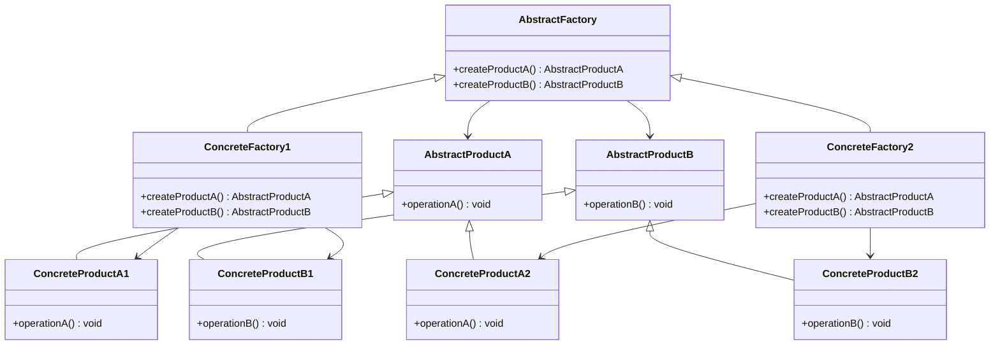

<Hero title="Abstract Factory Pattern" subtitle="Create families of related objects while respecting platform constraints" imageAlt="Abstract Factory pattern illustration" size="large" />

## TL;DR

Abstract Factory provides an interface for creating families of related or dependent objects without specifying their concrete classes. Use it when you need to ensure related objects are created together and swap entire families based on configuration or environment.

## Learning Objectives

- You will be able to identify when products form a family requiring consistent creation.
- You will be able to distinguish Abstract Factory from Factory Method.
- You will be able to implement a concrete factory that creates a coherent family of objects.
- You will be able to swap entire product families without modifying client code.

## Motivating Scenario

Your UI framework supports Windows and macOS. Each platform requires specific button, checkbox, and window implementations. Mixing a Windows button with a macOS window breaks the UI contract. Abstract Factory guarantees that all components come from the same family: either all Windows or all macOS. Adding Linux support means implementing one new factory—no changes to client code.

## Core Concepts

**Abstract Factory** defines interfaces for creating related product families. Each concrete factory implements this interface, producing a complete set of objects that work together.

Key elements:
- **AbstractFactory**: declares methods for creating each product type
- **ConcreteFactory**: implements the factory interface, instantiating specific product families
- **AbstractProduct**: interface for a product type
- **ConcreteProduct**: specific implementations belonging to a family

<Figure caption="Abstract Factory structure">

</Figure>

## Practical Example

<Tabs>
<TabItem value="python" label="Python" default>

```python
from abc import ABC, abstractmethod

# Abstract Products
class Button(ABC):
    @abstractmethod
    def paint(self):
        pass

class Checkbox(ABC):
    @abstractmethod
    def paint(self):
        pass

# Windows Products
class WindowsButton(Button):
    def paint(self):
        return "Render a Windows button"

class WindowsCheckbox(Checkbox):
    def paint(self):
        return "Render a Windows checkbox"

# macOS Products
class MacButton(Button):
    def paint(self):
        return "Render a macOS button"

class MacCheckbox(Checkbox):
    def paint(self):
        return "Render a macOS checkbox"

# Abstract Factory
class GUIFactory(ABC):
    @abstractmethod
    def create_button(self) -> Button:
        pass

    @abstractmethod
    def create_checkbox(self) -> Checkbox:
        pass

# Concrete Factories
class WindowsFactory(GUIFactory):
    def create_button(self) -> Button:
        return WindowsButton()

    def create_checkbox(self) -> Checkbox:
        return WindowsCheckbox()

class MacFactory(GUIFactory):
    def create_button(self) -> Button:
        return MacButton()

    def create_checkbox(self) -> Checkbox:
        return MacCheckbox()

# Client code
def render_ui(factory: GUIFactory):
    button = factory.create_button()
    checkbox = factory.create_checkbox()
    print(button.paint())
    print(checkbox.paint())

# Usage
windows_factory = WindowsFactory()
render_ui(windows_factory)

mac_factory = MacFactory()
render_ui(mac_factory)
```

</TabItem>
<TabItem value="go" label="Go">

```go
package main

import "fmt"

// Abstract Products
type Button interface {
    Paint() string
}

type Checkbox interface {
    Paint() string
}

// Windows Products
type WindowsButton struct{}

func (w *WindowsButton) Paint() string {
    return "Render a Windows button"
}

type WindowsCheckbox struct{}

func (w *WindowsCheckbox) Paint() string {
    return "Render a Windows checkbox"
}

// macOS Products
type MacButton struct{}

func (m *MacButton) Paint() string {
    return "Render a macOS button"
}

type MacCheckbox struct{}

func (m *MacCheckbox) Paint() string {
    return "Render a macOS checkbox"
}

// Abstract Factory
type GUIFactory interface {
    CreateButton() Button
    CreateCheckbox() Checkbox
}

// Concrete Factories
type WindowsFactory struct{}

func (w *WindowsFactory) CreateButton() Button {
    return &WindowsButton{}
}

func (w *WindowsFactory) CreateCheckbox() Checkbox {
    return &WindowsCheckbox{}
}

type MacFactory struct{}

func (m *MacFactory) CreateButton() Button {
    return &MacButton{}
}

func (m *MacFactory) CreateCheckbox() Checkbox {
    return &MacCheckbox{}
}

// Client code
func RenderUI(factory GUIFactory) {
    button := factory.CreateButton()
    checkbox := factory.CreateCheckbox()
    fmt.Println(button.Paint())
    fmt.Println(checkbox.Paint())
}

// Usage
func main() {
    windows := &WindowsFactory{}
    RenderUI(windows)

    mac := &MacFactory{}
    RenderUI(mac)
}
```

</TabItem>
<TabItem value="nodejs" label="Node.js">

```javascript
// Abstract Products (base classes)
class Button {
    paint() {
        throw new Error("Must implement paint()");
    }
}

class Checkbox {
    paint() {
        throw new Error("Must implement paint()");
    }
}

// Windows Products
class WindowsButton extends Button {
    paint() {
        return "Render a Windows button";
    }
}

class WindowsCheckbox extends Checkbox {
    paint() {
        return "Render a Windows checkbox";
    }
}

// macOS Products
class MacButton extends Button {
    paint() {
        return "Render a macOS button";
    }
}

class MacCheckbox extends Checkbox {
    paint() {
        return "Render a macOS checkbox";
    }
}

// Abstract Factory
class GUIFactory {
    createButton() {
        throw new Error("Must implement createButton()");
    }

    createCheckbox() {
        throw new Error("Must implement createCheckbox()");
    }
}

// Concrete Factories
class WindowsFactory extends GUIFactory {
    createButton() {
        return new WindowsButton();
    }

    createCheckbox() {
        return new WindowsCheckbox();
    }
}

class MacFactory extends GUIFactory {
    createButton() {
        return new MacButton();
    }

    createCheckbox() {
        return new MacCheckbox();
    }
}

// Client code
function renderUI(factory) {
    const button = factory.createButton();
    const checkbox = factory.createCheckbox();
    console.log(button.paint());
    console.log(checkbox.paint());
}

// Usage
const windowsFactory = new WindowsFactory();
renderUI(windowsFactory);

const macFactory = new MacFactory();
renderUI(macFactory);
```

</TabItem>
</Tabs>

## When to Use / When Not to Use

<Vs highlight={[1]} items={[
{
    label: "Use Abstract Factory when:",
    points: [
      "You have families of related objects that must be created together",
      "You want to ensure products from different families don't mix",
      "You need to swap entire product families based on configuration",
      "Client code should depend on abstractions, not concrete implementations",
      "You anticipate adding new families (e.g., new platform support)"
    ],
    highlightTone: "positive"
  },
{
    label: "Consider alternatives when:",
    points: [
      "You only have one or two product families (Factory Method may suffice)",
      "Products aren't actually related (simple polymorphism is cleaner)",
      "Configuration is complex and varies per-product (use Dependency Injection)",
      "You need to vary both families and individual products dynamically (use Builder)",
      "The factory itself is trivial or only needed in one place"
    ],
    highlightTone: "warning"
  }
]} />

## Patterns and Pitfalls

<Showcase title="Patterns and Pitfalls" sections={[
  {
    label: "Pattern: Environment-based factory selection",
    body: "Pair Abstract Factory with environment detection to instantiate the right family at startup."
  },
  {
    label: "Pitfall: Tight coupling between families",
    body: "If products from different families have hidden dependencies, refactor to make those dependencies explicit or reconsider the pattern."
  },
  {
    label: "Pattern: Extending with new products",
    body: "Adding a new product type requires extending all concrete factories, but client code remains unchanged."
  }
]} />

## Design Review Checklist

<Checklist items={[
  "Products genuinely form related families that should be created together",
  "The factory interface declares methods for creating each product type",
  "Each concrete factory creates a complete set of products from one family",
  "Client code depends on the AbstractFactory interface, not concrete factories",
  "All products implement their respective abstract interfaces",
  "Swapping one factory for another doesn't require changing client code",
  "Adding a new family only requires implementing one new concrete factory",
  "The pattern actually simplifies client code compared to directly using new"
]} />

## Self-Check

1. **Identify families**: In your domain, what groups of objects are always used together?
2. **Design factories**: Write an abstract factory and at least two concrete implementations.
3. **Verify consistency**: Confirm that a factory's products work cohesively without hidden cross-family dependencies.

:::info
**One Takeaway**: Abstract Factory ensures related objects are created as coherent families. It shines when you need to support multiple platforms, themes, or configurations and want client code unaware of which implementation is active.

:::

## Next Steps

- Compare with **Factory Method** to understand when each applies.
- Study **Builder** when individual products require complex configuration.
- Explore **Strategy** for runtime behavior variation that doesn't require object family changes.

## References

- Gang of Four: *Design Patterns* (Abstract Factory)
- *Refactoring: Improving the Design of Existing Code* (Introduce Factory Method)
- Freeman & Freeman: *Head First Design Patterns*