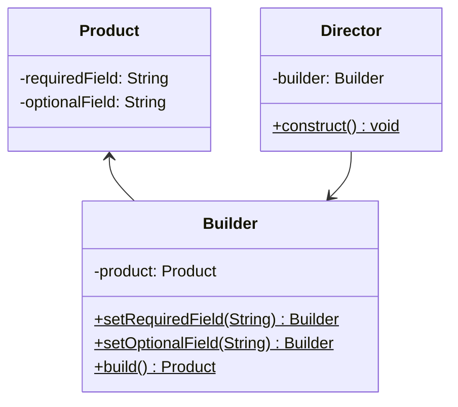

<Hero title="Builder Pattern" subtitle="Construct complex objects step by step while maintaining clean, readable code" imageAlt="Builder pattern illustration" size="large" />

## TL;DR

Builder separates the construction of a complex object from its representation, allowing you to produce different representations using the same construction process. It eliminates the need for telescoping constructors and makes object creation code readable and maintainable.

## Learning Objectives

- You will be able to recognize when constructor parameters become unwieldy.
- You will be able to implement a builder that provides a fluent, chainable interface.
- You will be able to validate partially-constructed objects or ensure consistency at build time.
- You will be able to support optional and required fields elegantly.

## Motivating Scenario

Your `House` class has many optional fields: roof_color, siding_material, number_of_windows, garage_type, etc. You start with `House(color)`, then add `House(color, siding)`, then `House(color, siding, windows)`. Soon you have 20 overloaded constructors—the "telescoping constructor anti-pattern." Builder lets you write: `new HouseBuilder().withColor("red").withSiding("brick").build()` instead—clear, flexible, and maintainable.

## Core Concepts

**Builder** constructs complex objects step by step. A builder accumulates configuration and only when `build()` is called does it create the final immutable object. This separates construction logic from representation.

Key elements:
- **Product**: the complex object being built
- **Builder**: constructs the product step by step
- **Director** (optional): orchestrates the builder for complex, multi-step processes
- **Fluent interface**: builder methods return `this` to enable method chaining

<Figure caption="Builder structure">

</Figure>

## Practical Example

<Tabs>
<TabItem value="python" label="Python" default>

```python
# Product
class House:
    def __init__(self, roof_color, siding, windows, garage):
        self.roof_color = roof_color
        self.siding = siding
        self.windows = windows
        self.garage = garage

    def __str__(self):
        return f"House(roof={self.roof_color}, siding={self.siding}, " \
               f"windows={self.windows}, garage={self.garage})"

# Builder
class HouseBuilder:
    def __init__(self):
        self._roof_color = "brown"
        self._siding = "wood"
        self._windows = 8
        self._garage = False

    def with_roof_color(self, color):
        self._roof_color = color
        return self

    def with_siding(self, siding):
        self._siding = siding
        return self

    def with_windows(self, count):
        self._windows = count
        return self

    def with_garage(self, has_garage):
        self._garage = has_garage
        return self

    def build(self):
        return House(self._roof_color, self._siding,
                    self._windows, self._garage)

# Optional Director for complex construction processes
class HouseDirector:
    def __init__(self, builder: HouseBuilder):
        self._builder = builder

    def build_modern_house(self):
        return self._builder.with_roof_color("black") \
                           .with_siding("aluminum") \
                           .with_windows(12) \
                           .with_garage(True) \
                           .build()

# Usage
simple_house = HouseBuilder() \
    .with_roof_color("red") \
    .with_siding("brick") \
    .build()
print(simple_house)

# Using Director
director = HouseDirector(HouseBuilder())
modern_house = director.build_modern_house()
print(modern_house)
```

</TabItem>
<TabItem value="go" label="Go">

```go
package main

import "fmt"

// Product
type House struct {
    RoofColor string
    Siding    string
    Windows   int
    Garage    bool
}

func (h *House) String() string {
    return fmt.Sprintf("House(roof=%s, siding=%s, windows=%d, garage=%v)",
        h.RoofColor, h.Siding, h.Windows, h.Garage)
}

// Builder
type HouseBuilder struct {
    roofColor string
    siding    string
    windows   int
    garage    bool
}

func NewHouseBuilder() *HouseBuilder {
    return &HouseBuilder{
        roofColor: "brown",
        siding:    "wood",
        windows:   8,
        garage:    false,
    }
}

func (b *HouseBuilder) WithRoofColor(color string) *HouseBuilder {
    b.roofColor = color
    return b
}

func (b *HouseBuilder) WithSiding(siding string) *HouseBuilder {
    b.siding = siding
    return b
}

func (b *HouseBuilder) WithWindows(count int) *HouseBuilder {
    b.windows = count
    return b
}

func (b *HouseBuilder) WithGarage(hasGarage bool) *HouseBuilder {
    b.garage = hasGarage
    return b
}

func (b *HouseBuilder) Build() *House {
    return &House{
        RoofColor: b.roofColor,
        Siding:    b.siding,
        Windows:   b.windows,
        Garage:    b.garage,
    }
}

// Usage
func main() {
    simpleHouse := NewHouseBuilder().
        WithRoofColor("red").
        WithSiding("brick").
        Build()
    fmt.Println(simpleHouse)

    modernHouse := NewHouseBuilder().
        WithRoofColor("black").
        WithSiding("aluminum").
        WithWindows(12).
        WithGarage(true).
        Build()
    fmt.Println(modernHouse)
}
```

</TabItem>
<TabItem value="nodejs" label="Node.js">

```javascript
// Product
class House {
    constructor(roofColor, siding, windows, garage) {
        this.roofColor = roofColor;
        this.siding = siding;
        this.windows = windows;
        this.garage = garage;
    }

    toString() {
        return `House(roof=${this.roofColor}, siding=${this.siding}, ` +
               `windows=${this.windows}, garage=${this.garage})`;
    }
}

// Builder
class HouseBuilder {
    constructor() {
        this.roofColor = "brown";
        this.siding = "wood";
        this.windows = 8;
        this.garage = false;
    }

    withRoofColor(color) {
        this.roofColor = color;
        return this;
    }

    withSiding(siding) {
        this.siding = siding;
        return this;
    }

    withWindows(count) {
        this.windows = count;
        return this;
    }

    withGarage(hasGarage) {
        this.garage = hasGarage;
        return this;
    }

    build() {
        return new House(this.roofColor, this.siding,
                        this.windows, this.garage);
    }
}

// Optional Director for complex construction
class HouseDirector {
    constructor(builder) {
        this.builder = builder;
    }

    buildModernHouse() {
        return this.builder
            .withRoofColor("black")
            .withSiding("aluminum")
            .withWindows(12)
            .withGarage(true)
            .build();
    }
}

// Usage
const simpleHouse = new HouseBuilder()
    .withRoofColor("red")
    .withSiding("brick")
    .build();
console.log(simpleHouse.toString());

const director = new HouseDirector(new HouseBuilder());
const modernHouse = director.buildModernHouse();
console.log(modernHouse.toString());
```

</TabItem>
</Tabs>

## When to Use / When Not to Use

<Vs highlight={[1]} items={[
{
    label: "Use Builder when:",
    points: [
      "An object has many optional and required parameters",
      "You want to avoid telescoping constructors or huge parameter lists",
      "The construction process is multi-step or complex",
      "You want to create immutable objects with optional fields",
      "Different representations of the object are useful",
      "You want to enforce validation at build time, not during configuration"
    ],
    highlightTone: "positive"
  },
{
    label: "Consider alternatives when:",
    points: [
      "The object is simple with few parameters (use a constructor)",
      "Most parameters are always required (constructor is clearer)",
      "Creation is trivial (don't over-engineer with Builder)",
      "You need runtime object modification (use mutable objects instead)",
      "Dependency injection covers your use case (simpler than Builder)"
    ],
    highlightTone: "warning"
  }
]} />

## Patterns and Pitfalls

<Showcase title="Patterns and Pitfalls" sections={[
  {
    label: "Pattern: Validation at build time",
    body: "Enforce invariants only when build() is called, not during configuration."
  },
  {
    label: "Pitfall: Mutable returned objects",
    body: "If build() returns a mutable object, changes later will break the pattern's benefits. Return immutable objects or use copy-on-write."
  },
  {
    label: "Pattern: Director for complex workflows",
    body: "Encapsulate multi-step construction sequences in a Director class."
  }
]} />

## Design Review Checklist

<Checklist items={[
  "The object being built has enough parameters to justify Builder",
  "Builder methods use a fluent interface (return this/self)",
  "Validation occurs in build(), not during configuration steps",
  "The final object is immutable or used immutably",
  "Required fields are enforced; optional fields have sensible defaults",
  "Builder state is independent (creating one house doesn't affect another)",
  "If a Director is used, it orchestrates meaningful construction sequences",
  "The code is more readable than it would be with a large constructor"
]} />

## Builder with Validation

Builders enable validation at build time, not during configuration:

```python
class UserBuilder:
    def __init__(self):
        self.email = None
        self.password = None
        self.age = None
        self.terms_accepted = False

    def with_email(self, email):
        self.email = email
        return self

    def with_password(self, password):
        self.password = password
        return self

    def with_age(self, age):
        self.age = age
        return self

    def with_terms_accepted(self, accepted):
        self.terms_accepted = accepted
        return self

    def build(self):
        """Validate all invariants before creating user."""
        # Required fields
        if not self.email:
            raise ValueError("Email is required")
        if not self.password:
            raise ValueError("Password is required")

        # Validation rules
        if len(self.password) < 12:
            raise ValueError("Password must be at least 12 characters")

        if not '@' in self.email:
            raise ValueError("Email must be valid")

        if self.age and (self.age < 18 or self.age > 120):
            raise ValueError("Age must be 18-120")

        if not self.terms_accepted:
            raise ValueError("Must accept terms")

        return User(
            email=self.email,
            password=self.password,
            age=self.age,
            terms_accepted=self.terms_accepted
        )

# Usage
try:
    user = UserBuilder() \
        .with_email("alice@example.com") \
        .with_password("short")  # Too short
        .with_age(25) \
        .with_terms_accepted(True) \
        .build()  # Raises: "Password must be at least 12 characters"
except ValueError as e:
    # Handle validation error
    print(f"Validation failed: {e}")

# Correct usage
user = UserBuilder() \
    .with_email("alice@example.com") \
    .with_password("SecurePassword123") \
    .with_age(25) \
    .with_terms_accepted(True) \
    .build()  # Success!
```

## Builder vs Factory Method

Both create objects, but with different responsibilities:

```python
# Factory Method: Create object with single responsibility
class UserFactory:
    @staticmethod
    def create_admin(email):
        """Create admin user."""
        return User(
            email=email,
            role='admin',
            permissions=['read', 'write', 'delete']
        )

    @staticmethod
    def create_guest(email):
        """Create guest user."""
        return User(
            email=email,
            role='guest',
            permissions=['read']
        )

# Usage
admin = UserFactory.create_admin("alice@example.com")
guest = UserFactory.create_guest("bob@example.com")

# Builder: Configure object with many optional fields
class UserBuilder:
    def __init__(self):
        self.email = None
        self.role = 'user'
        self.permissions = []
        self.theme = 'light'
        self.language = 'en'
        self.timezone = 'UTC'
        # ... many more optional fields

    def build(self):
        return User(
            email=self.email,
            role=self.role,
            permissions=self.permissions,
            # ... all fields
        )

# Usage: Flexible configuration
user = UserBuilder() \
    .with_email("alice@example.com") \
    .with_theme('dark') \
    .with_language('es') \
    .build()

# Factory good for: Few well-defined variations
# Builder good for: Many optional combinations
```

## Real-World Example: Query Builder

```python
# SQL Query Builder using fluent interface
class QueryBuilder:
    def __init__(self):
        self.select_fields = ['*']
        self.from_table = None
        self.where_conditions = []
        self.joins = []
        self.order_by = None
        self.limit_value = None

    def select(self, *fields):
        self.select_fields = list(fields)
        return self

    def from_table(self, table):
        self.from_table = table
        return self

    def where(self, condition):
        self.where_conditions.append(condition)
        return self

    def join(self, table, on):
        self.joins.append((table, on))
        return self

    def order_by(self, field, direction='ASC'):
        self.order_by = (field, direction)
        return self

    def limit(self, count):
        self.limit_value = count
        return self

    def build(self):
        """Construct SQL query string."""
        query = f"SELECT {', '.join(self.select_fields)} FROM {self.from_table}"

        for table, on in self.joins:
            query += f" JOIN {table} ON {on}"

        for condition in self.where_conditions:
            query += f" WHERE {condition}"

        if self.order_by:
            field, direction = self.order_by
            query += f" ORDER BY {field} {direction}"

        if self.limit_value:
            query += f" LIMIT {self.limit_value}"

        return query

# Usage: Readable, flexible query construction
query = QueryBuilder() \
    .select('users.id', 'users.name', 'orders.id') \
    .from_table('users') \
    .join('orders', 'users.id = orders.user_id') \
    .where('users.age > 18') \
    .where('orders.total > 100') \
    .order_by('users.name', 'ASC') \
    .limit(10) \
    .build()

# Result:
# SELECT users.id, users.name, orders.id FROM users
# JOIN orders ON users.id = orders.user_id
# WHERE users.age > 18 WHERE orders.total > 100
# ORDER BY users.name ASC LIMIT 10
```

## Self-Check

1. **Identify**: What objects in your codebase have many optional parameters?
2. **Refactor**: Convert a telescoping constructor into a fluent builder interface.
3. **Validate**: Ensure that build() validates all invariants and throws clear errors for invalid states.
4. **When to use Director?** When you have predefined construction sequences (e.g., buildModernHouse, buildVictorianHouse).
5. **When to avoid?** Simple objects with few fields don't need builders; constructors are simpler.

:::info
**One Takeaway**: Builder shines when objects have multiple optional parameters or complex construction logic. It trades a few extra classes for code that's far more readable and maintainable than telescoping constructors or massive parameter lists. Combine with validation for safety and clarity.

:::

## Next Steps

- Learn **Factory Method** for simpler object creation without configuration.
- Study **Abstract Factory** when creating families of related objects.
- Explore immutability patterns to maximize the benefits of Builder-created objects.

## References

- Gang of Four: *Design Patterns* (Builder)
- Joshua Bloch: *Effective Java* (Builder Pattern)
- Freeman & Freeman: *Head First Design Patterns*