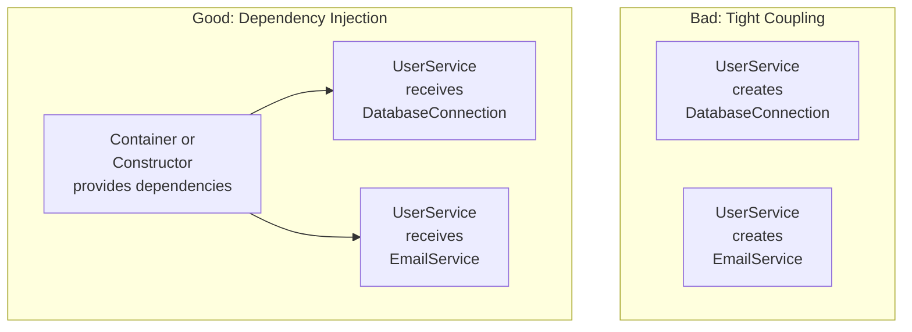

<Hero title="Dependency Injection & Inversion of Control" subtitle="Externalize dependencies for maximum flexibility, testability, and loose coupling" imageAlt="Dependency Injection pattern illustration" size="large" />

## TL;DR

Dependency Injection inverts control: instead of objects creating their dependencies, dependencies are provided (injected) from outside. This decouples code, enables easy testing with mocks, and makes configurations explicit and swappable.

## Learning Objectives

- You will be able to distinguish constructor, setter, and interface injection approaches.
- You will be able to refactor tightly coupled code into injectable dependencies.
- You will be able to implement a simple DI container or use an existing one effectively.
- You will be able to test code with injected dependencies using mocks and stubs.

## Motivating Scenario

Your `UserService` directly instantiates `DatabaseConnection` and `EmailService`. Testing it requires real databases and email. Mocking is impossible. Adding a cache layer means modifying UserService. Instead, pass these dependencies to the constructor. Tests inject mocks. Production wires real implementations. Swapping implementations requires changing configuration, not code.

## Core Concepts

**Dependency Injection** provides objects with their dependencies rather than having them create dependencies themselves. This follows the **Inversion of Control (IoC)** principle—control over object creation moves from the object to an external container or framework.

Three injection styles:
- **Constructor Injection**: dependencies provided in the constructor (preferred)
- **Setter Injection**: dependencies set via property setters (flexible but less safe)
- **Interface Injection**: object implements an interface to receive dependencies

<Figure caption="Dependency Injection vs. tight coupling">

</Figure>

## Practical Example

<Tabs>
<TabItem value="python" label="Python" default>

```python
from abc import ABC, abstractmethod

# Abstractions (contracts)
class Database(ABC):
    @abstractmethod
    def query(self, sql):
        pass

class EmailSender(ABC):
    @abstractmethod
    def send(self, to: str, message: str):
        pass

# Concrete implementations
class PostgresDatabase(Database):
    def query(self, sql):
        return f"PostgreSQL result for: {sql}"

class MockDatabase(Database):
    def query(self, sql):
        return f"Mock result for: {sql}"

class SMTPEmailSender(EmailSender):
    def send(self, to: str, message: str):
        return f"Email sent to {to}: {message}"

class MockEmailSender(EmailSender):
    def __init__(self):
        self.sent_emails = []

    def send(self, to: str, message: str):
        self.sent_emails.append((to, message))
        return f"Mock: email recorded"

# Service with constructor injection
class UserService:
    def __init__(self, db: Database, email: EmailSender):
        self.db = db
        self.email = email

    def create_user(self, name, email_addr):
        # Use injected dependencies
        result = self.db.query(f"INSERT INTO users VALUES ('{name}')")
        self.email.send(email_addr, f"Welcome {name}")
        return result

# Simple DI Container (in real life, use frameworks like Dependency Injector)
class DIContainer:
    def __init__(self):
        self.services = {}

    def register(self, name, factory):
        self.services[name] = factory

    def get(self, name):
        return self.services[name]()

# Setup
container = DIContainer()
container.register('db', lambda: PostgresDatabase())
container.register('email', lambda: SMTPEmailSender())

# Production
service = UserService(container.get('db'), container.get('email'))
service.create_user("Alice", "alice@example.com")

# Testing
mock_db = MockDatabase()
mock_email = MockEmailSender()
test_service = UserService(mock_db, mock_email)
test_service.create_user("TestUser", "test@example.com")
print(f"Emails sent in test: {mock_email.sent_emails}")
```

</TabItem>
<TabItem value="go" label="Go">

```go
package main

import "fmt"

// Abstractions
type Database interface {
    Query(sql string) string
}

type EmailSender interface {
    Send(to, message string) string
}

// Implementations
type PostgresDatabase struct{}

func (p *PostgresDatabase) Query(sql string) string {
    return fmt.Sprintf("PostgreSQL result for: %s", sql)
}

type MockDatabase struct{}

func (m *MockDatabase) Query(sql string) string {
    return fmt.Sprintf("Mock result for: %s", sql)
}

type SMTPEmailSender struct{}

func (s *SMTPEmailSender) Send(to, message string) string {
    return fmt.Sprintf("Email sent to %s: %s", to, message)
}

type MockEmailSender struct {
    SentEmails []struct {
        To      string
        Message string
    }
}

func (m *MockEmailSender) Send(to, message string) string {
    m.SentEmails = append(m.SentEmails, struct {
        To      string
        Message string
    }{to, message})
    return "Mock: email recorded"
}

// Service with constructor injection
type UserService struct {
    db    Database
    email EmailSender
}

func NewUserService(db Database, email EmailSender) *UserService {
    return &UserService{db, email}
}

func (u *UserService) CreateUser(name, emailAddr string) string {
    result := u.db.Query(fmt.Sprintf("INSERT INTO users VALUES ('%s')", name))
    u.email.Send(emailAddr, fmt.Sprintf("Welcome %s", name))
    return result
}

// Usage
func main() {
    // Production
    service := NewUserService(&PostgresDatabase{}, &SMTPEmailSender{})
    fmt.Println(service.CreateUser("Alice", "alice@example.com"))

    // Testing
    mockEmail := &MockEmailSender{}
    testService := NewUserService(&MockDatabase{}, mockEmail)
    testService.CreateUser("TestUser", "test@example.com")
    fmt.Printf("Emails in test: %v\n", mockEmail.SentEmails)
}
```

</TabItem>
<TabItem value="nodejs" label="Node.js">

```javascript
// Abstractions
class Database {
    query(sql) {
        throw new Error("Must implement query()");
    }
}

class EmailSender {
    send(to, message) {
        throw new Error("Must implement send()");
    }
}

// Implementations
class PostgresDatabase extends Database {
    query(sql) {
        return `PostgreSQL result for: ${sql}`;
    }
}

class MockDatabase extends Database {
    query(sql) {
        return `Mock result for: ${sql}`;
    }
}

class SMTPEmailSender extends EmailSender {
    send(to, message) {
        return `Email sent to ${to}: ${message}`;
    }
}

class MockEmailSender extends EmailSender {
    constructor() {
        super();
        this.sentEmails = [];
    }

    send(to, message) {
        this.sentEmails.push({ to, message });
        return "Mock: email recorded";
    }
}

// Service with constructor injection
class UserService {
    constructor(db, email) {
        this.db = db;
        this.email = email;
    }

    createUser(name, emailAddr) {
        const result = this.db.query(`INSERT INTO users VALUES ('${name}')`);
        this.email.send(emailAddr, `Welcome ${name}`);
        return result;
    }
}

// Simple DI Container
class DIContainer {
    constructor() {
        this.services = {};
    }

    register(name, factory) {
        this.services[name] = factory;
    }

    get(name) {
        return this.services[name]();
    }
}

// Setup
const container = new DIContainer();
container.register('db', () => new PostgresDatabase());
container.register('email', () => new SMTPEmailSender());

// Production
const service = new UserService(container.get('db'), container.get('email'));
service.createUser("Alice", "alice@example.com");

// Testing
const mockEmail = new MockEmailSender();
const testService = new UserService(new MockDatabase(), mockEmail);
testService.createUser("TestUser", "test@example.com");
console.log("Emails in test:", mockEmail.sentEmails);
```

</TabItem>
</Tabs>

## When to Use / When Not to Use

<Vs highlight={[1]} items={[
{
    label: "Use Dependency Injection when:",
    points: [
      "Code needs to be easily testable with mocks/stubs",
      "You want to swap implementations without changing code",
      "Objects have dependencies on other objects",
      "Dependencies vary across environments (dev, test, prod)",
      "You want to make dependencies explicit and visible",
      "Tight coupling is preventing code reuse"
    ],
    highlightTone: "positive"
  },
{
    label: "Consider alternatives when:",
    points: [
      "Objects are truly stateless utilities (static methods are fine)",
      "DI framework overhead doesn't justify complexity",
      "Dependencies are simple or constant (hardcoding is acceptable)",
      "You're building a tiny script (over-engineering)",
      "Language doesn't support it well (rare today)"
    ],
    highlightTone: "warning"
  }
]} />

## Patterns and Pitfalls

<Showcase title="Patterns and Pitfalls" sections={[
  {
    label: "Pattern: Constructor vs. Setter injection",
    body: "Constructor injection enforces required dependencies; setter injection allows optional ones."
  ,
    body: "Constructor injection enforces required dependencies; setter injection allows optional ones.",
    tone: "warning"
  },
  {
    label: "Pitfall: Service Locator anti-pattern",
    body: "Service Locator hides dependencies, making them invisible to callers."
  },
  {
    label: "Pattern: Composition root / Wire-up",
    body: "Centralize dependency configuration in one place (usually at application startup)."
  }
]} />

## Design Review Checklist

<Checklist items={[
  "Dependencies are provided via constructor, not created internally",
  "Classes depend on abstractions (interfaces), not concrete implementations",
  "Testable: dependencies can be mocked or stubbed easily",
  "No Service Locator anti-pattern (no hidden dependencies)",
  "Composition root exists: one place where dependencies are wired",
  "Circular dependencies are identified and resolved (or redesigned)",
  "Optional dependencies are clearly marked (e.g., with defaults or Optional types)",
  "Object graphs are manageable (not overly complex)",
  "DI framework/container is optional but not required for small apps"
]} />

## Self-Check

1. **Identify**: Find classes that directly instantiate their dependencies. Refactor them to accept injected parameters.
2. **Test**: Write unit tests for a class with injected dependencies using mocks.
3. **Wire**: Create a composition root that wires up all services for a simple application.

:::info
**One Takeaway**: Dependency Injection makes code testable, flexible, and loosely coupled. Instead of objects creating their dependencies, pass them in. This enables painless testing with mocks and easy swapping of implementations.

:::

## Next Steps

- Learn **Service Locator** pattern (and why it's usually worse than DI).
- Study **Inversion of Control** containers for larger applications (Spring, .NET DI, Python Dependency Injector).
- Explore **Composition Root** pattern for organizing service setup.

## References

- Martin Fowler: *Inversion of Control Containers and the Dependency Injection pattern*
- Google's *Guice* (Java DI framework)
- Robert C. Martin: *Clean Code* (Chapter 11: System Construction)
- *Dependency Injection Principles, Practices, and Patterns* (book)