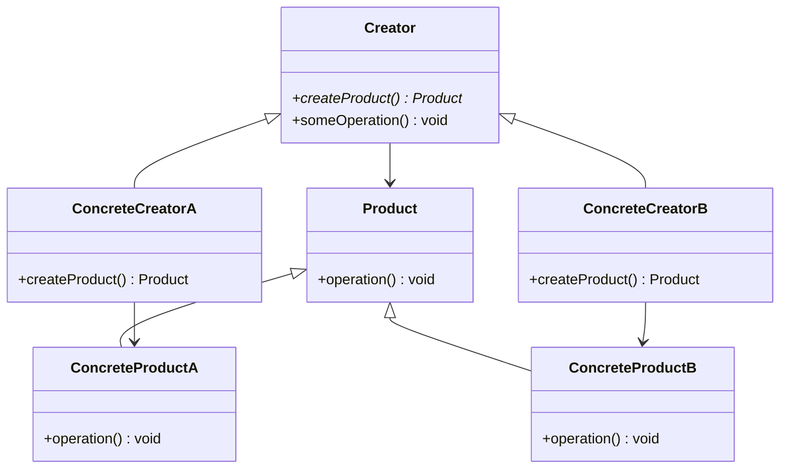

<Hero title="Factory Method Pattern" subtitle="Defer object creation to subclasses for polymorphic instantiation" imageAlt="Factory Method pattern illustration" size="large" />

## TL;DR

Factory Method defines an interface for creating objects, but lets subclasses decide which concrete class to instantiate. It removes object creation from client code, enabling polymorphic instantiation and flexible extension without modifying existing code.

## Learning Objectives

- You will be able to distinguish Factory Method from other creational patterns.
- You will be able to refactor tight coupling from direct instantiation into a factory method.
- You will be able to recognize when adding a subclass now only requires overriding a single method.
- You will be able to design factory methods that balance flexibility with simplicity.

## Motivating Scenario

Your payment processing system directly instantiates payment handlers: `CreditCardHandler handler = new CreditCardHandler();`. Adding PayPal support means modifying every place that creates handlers. Instead, define a `PaymentHandler create()` method that each subclass overrides. Now vendors add a subclass and override one method—no client code changes required.

## Core Concepts

**Factory Method** decouples client code from concrete classes by introducing an abstract method that subclasses override. The client calls the abstract method without knowing which concrete class gets created.

Key elements:
- **Creator** (abstract): defines the factory method and uses its result
- **ConcreteCreator**: overrides the factory method to instantiate a specific type
- **Product** (abstract): interface for objects the factory creates
- **ConcreteProduct**: the actual object that gets instantiated

<Figure caption="Factory Method structure">

</Figure>

## Practical Example

<Tabs>
<TabItem value="python" label="Python" default>

```python
from abc import ABC, abstractmethod

# Product interface
class Transport(ABC):
    @abstractmethod
    def deliver(self):
        pass

# Concrete products
class Truck(Transport):
    def deliver(self):
        return "Deliver via truck"

class Ship(Transport):
    def deliver(self):
        return "Deliver via ship"

class Plane(Transport):
    def deliver(self):
        return "Deliver via plane"

# Creator (abstract)
class Logistics(ABC):
    @abstractmethod
    def create_transport(self) -> Transport:
        pass

    def plan_delivery(self):
        transport = self.create_transport()
        return transport.deliver()

# Concrete creators
class RoadLogistics(Logistics):
    def create_transport(self) -> Transport:
        return Truck()

class SeaLogistics(Logistics):
    def create_transport(self) -> Transport:
        return Ship()

class AirLogistics(Logistics):
    def create_transport(self) -> Transport:
        return Plane()

# Usage
logistics = RoadLogistics()
print(logistics.plan_delivery())  # Deliver via truck

logistics = SeaLogistics()
print(logistics.plan_delivery())  # Deliver via ship
```

</TabItem>
<TabItem value="go" label="Go">

```go
package main

import "fmt"

// Product interface
type Transport interface {
    Deliver() string
}

// Concrete products
type Truck struct{}

func (t *Truck) Deliver() string {
    return "Deliver via truck"
}

type Ship struct{}

func (s *Ship) Deliver() string {
    return "Deliver via ship"
}

type Plane struct{}

func (p *Plane) Deliver() string {
    return "Deliver via plane"
}

// Creator interface
type Logistics interface {
    CreateTransport() Transport
    PlanDelivery() string
}

// Base creator (concrete in Go, uses composition)
type BaseLogistics struct {
    createTransport func() Transport
}

func (b *BaseLogistics) PlanDelivery() string {
    transport := b.createTransport()
    return transport.Deliver()
}

// Concrete creators
type RoadLogistics struct {
    BaseLogistics
}

func NewRoadLogistics() *RoadLogistics {
    return &RoadLogistics{
        BaseLogistics{
            createTransport: func() Transport {
                return &Truck{}
            },
        },
    }
}

type SeaLogistics struct {
    BaseLogistics
}

func NewSeaLogistics() *SeaLogistics {
    return &SeaLogistics{
        BaseLogistics{
            createTransport: func() Transport {
                return &Ship{}
            },
        },
    }
}

// Usage
func main() {
    road := NewRoadLogistics()
    fmt.Println(road.PlanDelivery()) // Deliver via truck

    sea := NewSeaLogistics()
    fmt.Println(sea.PlanDelivery()) // Deliver via ship
}
```

</TabItem>
<TabItem value="nodejs" label="Node.js">

```javascript
// Product interface (base class)
class Transport {
    deliver() {
        throw new Error("Must implement deliver()");
    }
}

// Concrete products
class Truck extends Transport {
    deliver() {
        return "Deliver via truck";
    }
}

class Ship extends Transport {
    deliver() {
        return "Deliver via ship";
    }
}

class Plane extends Transport {
    deliver() {
        return "Deliver via plane";
    }
}

// Creator (abstract)
class Logistics {
    createTransport() {
        throw new Error("Must override createTransport()");
    }

    planDelivery() {
        const transport = this.createTransport();
        return transport.deliver();
    }
}

// Concrete creators
class RoadLogistics extends Logistics {
    createTransport() {
        return new Truck();
    }
}

class SeaLogistics extends Logistics {
    createTransport() {
        return new Ship();
    }
}

class AirLogistics extends Logistics {
    createTransport() {
        return new Plane();
    }
}

// Usage
const road = new RoadLogistics();
console.log(road.planDelivery()); // Deliver via truck

const sea = new SeaLogistics();
console.log(sea.planDelivery()); // Deliver via ship
```

</TabItem>
</Tabs>

## When to Use / When Not to Use

<Vs highlight={[1]} items={[
{
    label: "Use Factory Method when:",
    points: [
      "You don't know ahead of time which concrete classes you'll need",
      "Different subclasses need different instantiation logic",
      "You want client code to depend on abstractions, not concrete types",
      "Adding new types should only require adding a subclass, not modifying client code",
      "You need to provide hooks for subclasses to customize object creation"
    ],
    highlightTone: "positive"
  },
{
    label: "Consider alternatives when:",
    points: [
      "You only have one implementation (no polymorphism needed)",
      "The factory logic is trivial (just call new ClassName())",
      "You need to vary multiple independent aspects (use Abstract Factory instead)",
      "Complex configuration is needed (use Builder instead)",
      "Clients actually instantiate objects based on external config (use dependency injection)"
    ],
    highlightTone: "warning"
  }
]} />

## Patterns and Pitfalls

<Showcase title="Patterns and Pitfalls" sections={[
  {
    label: "Pattern: Template Method Integration",
    body: "Factory Method works naturally with Template Method. The creator defines the overall algorithm in plan_delivery(), while createTransport() is the customization point."
  },
  {
    label: "Pitfall: Over-abstraction",
    body: "Don't create a factory for a single implementation. A factory only makes sense when you have multiple implementations or anticipate needing them."
  },
  {
    label: "Pattern: Parameter-based variation",
    body: "Extend the factory method to accept parameters guiding which concrete type to create."
  }
]} />

## Design Review Checklist

<Checklist items={[
  "The factory method returns an abstraction (interface/base class), not a concrete type",
  "Client code depends on the Product abstraction, not ConcreteProduct classes",
  "Adding a new concrete product only requires a new ConcreteCreator subclass",
  "The factory method name clearly indicates its purpose (create*, make*, build*, etc.)",
  "You have at least two concrete implementations justifying the pattern",
  "Subclasses override the factory method, not client construction logic",
  "The factory method is the only place that instantiates concrete classes",
  "You've considered whether you actually need inheritance or if composition (dependency injection) is simpler"
]} />

## Self-Check

1. **Distinguish**: Explain how Factory Method differs from simply calling `new ConcreteClass()` in a subclass.
2. **Refactor**: Take code that directly instantiates multiple types and introduce a Factory Method.
3. **Extend**: Add a new concrete product and concrete creator without modifying any existing client code.

:::info
**One Takeaway**: Factory Method decouples creation decisions from implementation, letting subclasses decide which type to instantiate. It's most valuable when you have multiple implementations and want clients to remain agnostic to concrete types.

:::

## Next Steps

- Study **Abstract Factory** when you need to create families of related objects.
- Learn **Template Method** to combine with factory methods for customizable algorithms.
- Explore dependency injection as a more decoupled alternative to inheritance-based factories.

## Factory Method in Action

### Evolution: From Direct Construction to Factory Method

**Phase 1: Simple Direct Construction**

```python
class OrderService:
    def process_shipment(self, order):
        if order.destination_country == 'US':
            transport = Truck()  # Direct instantiation
        elif order.destination_country == 'CN':
            transport = Ship()
        else:
            transport = Plane()

        # This works, but coupling is tight to concrete classes
```

**Phase 2: Add Factory Method**

```python
class OrderService:
    def process_shipment(self, order):
        transport = self._create_transport(order)
        # ...

    def _create_transport(self, order):
        if order.destination_country == 'US':
            return Truck()
        elif order.destination_country == 'CN':
            return Ship()
        else:
            return Plane()

# Better, but still tightly coupled
```

**Phase 3: Introduce Abstraction via Subclasses**

```python
class OrderService(ABC):
    def process_shipment(self, order):
        transport = self.create_transport(order)
        # ...

    @abstractmethod
    def create_transport(self, order):
        pass

class DomesticOrderService(OrderService):
    def create_transport(self, order):
        return Truck()

class InternationalOrderService(OrderService):
    def create_transport(self, order):
        if order.destination_country == 'CN':
            return Ship()
        else:
            return Plane()

# Usage
service = DomesticOrderService()
transport = service.create_transport(order)
# Now client doesn't know about Truck, Ship, Plane
```

Benefits of this evolution:
- Phase 1: Works, but tight coupling
- Phase 2: Encapsulates logic, still tightly coupled
- Phase 3: Subclasses can be tested independently, new subclass = zero modification to existing code

## Factory Method Variants

### Static Factory Method

```python
class Transport(ABC):
    @abstractmethod
    def deliver(self):
        pass

class Truck(Transport):
    def deliver(self):
        return "Deliver via truck"

# Static factory method (alternative to inheritance-based)
class Transport:
    @staticmethod
    def for_cargo_type(cargo_type):
        if cargo_type == 'fragile':
            return Truck()
        elif cargo_type == 'perishable':
            return Ship()
        elif cargo_type == 'urgent':
            return Plane()
        raise ValueError(f"Unknown cargo type: {cargo_type}")

# Usage
transport = Transport.for_cargo_type('urgent')  # Returns Plane
```

Pros: Simple, flexible, no inheritance needed.
Cons: Violates Open/Closed Principle (must modify method to add type).

### Parameterized Factory Method

```python
class Transport(ABC):
    @abstractmethod
    def deliver(self):
        pass

class Logistics(ABC):
    def __init__(self, transport_type):
        self.transport_type = transport_type

    @abstractmethod
    def create_transport(self):
        pass

    def plan_delivery(self):
        transport = self.create_transport()
        return transport.deliver()

class ConfigurableLogistics(Logistics):
    def create_transport(self):
        if self.transport_type == 'truck':
            return Truck()
        elif self.transport_type == 'ship':
            return Ship()
        else:
            return Plane()

# Usage
logistics = ConfigurableLogistics('ship')
result = logistics.plan_delivery()
```

### Abstract Factory vs. Factory Method

**Factory Method:** Creates one product.
**Abstract Factory:** Creates families of related products.

```python
# Factory Method: One product
class DatabaseFactory:
    @abstractmethod
    def create_connection():
        pass

# Abstract Factory: Multiple related products
class DatabaseFactory(ABC):
    @abstractmethod
    def create_connection():
        pass

    @abstractmethod
    def create_transaction():
        pass

    @abstractmethod
    def create_query():
        pass
```

## Common Implementations

### Registry-Based Factory

```python
class TransportRegistry:
    _registry = {}

    @classmethod
    def register(cls, key, transport_class):
        cls._registry[key] = transport_class

    @classmethod
    def get(cls, key):
        return cls._registry.get(key)()

# Registration
TransportRegistry.register('truck', Truck)
TransportRegistry.register('ship', Ship)

# Usage
transport = TransportRegistry.get('truck')
```

### Builder + Factory Method

```python
class TransportBuilder(ABC):
    @abstractmethod
    def build(self):
        pass

class TruckBuilder(TransportBuilder):
    def build(self):
        truck = Truck()
        truck.capacity = 10000
        truck.fuel_type = 'diesel'
        return truck

# Usage
builder = TruckBuilder()
truck = builder.build()
```

## Self-Check

1. **Identify**: Where in your code are objects created? Is that creation logic centralized or scattered?

2. **Refactor**: Find a client creating different types directly. Can you introduce Factory Method?

3. **Verify**: After refactoring, can you add a new type without changing client code?

:::info
**One Takeaway**: Factory Method removes object creation from client code, enabling polymorphic instantiation. Most valuable when you have multiple implementations and want clients agnostic to concrete types. Start simple; add inheritance only when you have 2+ implementations needing customization.

:::

## Next Steps

- Study **Abstract Factory** for families of related objects
- Learn **Builder** for complex object construction
- Explore **Singleton** for single-instance objects
- Review **Object Creation Patterns** for comprehensive overview

## References

- Gang of Four: *Design Patterns* (Factory Method)
- Fowler, M. (2018). *Refactoring: Improving the Design of Existing Code* (2nd ed.). Addison-Wesley.
- Bloch, J. (2018). *Effective Java* (3rd ed.). Addison-Wesley.
- Refactoring.guru: Factory Method Pattern
- Gamma, E., Helm, R., Johnson, R., & Vlissides, J. (1994). *Design Patterns: Elements of Reusable Object-Oriented Software*. Addison-Wesley.