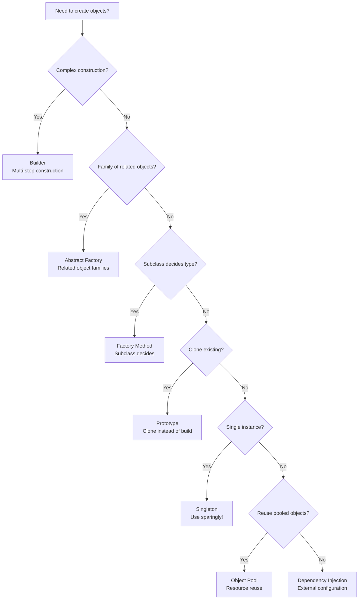

import { useCurrentSidebarCategory } from "@docusaurus/theme-common";

# Creational Patterns

Creational patterns abstract the instantiation process, making systems independent of how objects are composed and represented. They help manage object complexity, promote flexibility, and encourage reuse across your codebase.

These seven patterns fall into two categories:
- **Class-based**: use inheritance to vary the class being instantiated
- **Object-based**: delegate to another object to create the instance

<Figure caption="Creational patterns decision flow">

</Figure>

## When to Use Creational Patterns

**Abstract Factory** isolates concrete classes and simplifies swapping entire families of related objects—ideal for cross-platform UIs or pluggable backends.

**Builder** separates construction logic from representation, making complex object creation readable and maintainable while allowing flexible ordering of setup steps.

**Factory Method** lets subclasses decide which class to instantiate, enabling polymorphic object creation without exposing concrete classes to clients.

**Prototype** avoids expensive object construction by cloning an existing instance, especially valuable when you need many similar objects or construction is costly.

**Singleton** restricts a class to a single instance and provides global access—use sparingly, as it introduces hidden dependencies and complicates testing and concurrency.

**Object Pool** manages a reusable pool of expensive objects to reduce allocation/deallocation overhead and improve latency in resource-constrained environments.

**Dependency Injection** externalizes object dependencies, improving testability, flexibility, and decoupling while making code intent clearer through explicit wiring.

## Anti-patterns to Avoid

- **Over-using Singleton**: creates global mutable state that breaks testability and thread safety
- **Leaky abstractions**: factory methods that expose implementation details to clients
- **Static factory hell**: too many overloaded static methods, reducing readability
- **Mutable shared state in pools**: forgetting to reset pooled objects between uses
- **Tight coupling through creation**: directly instantiating concrete classes instead of using factories

<DocCardList items={useCurrentSidebarCategory().items} />
