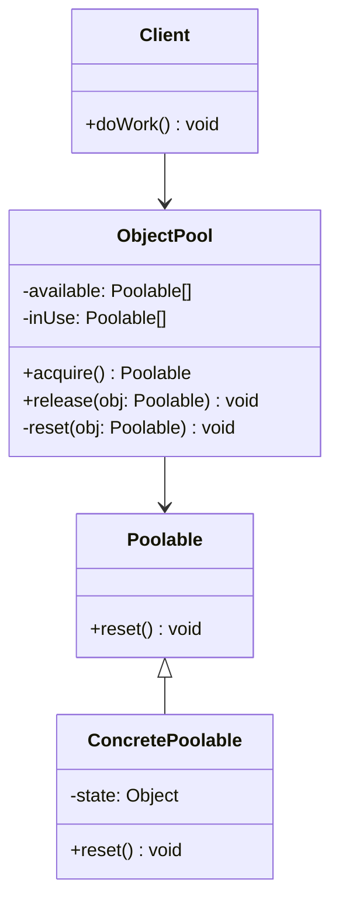

<Hero title="Object Pool Pattern" subtitle="Reuse expensive objects to reduce allocation/deallocation overhead and improve latency" imageAlt="Object Pool pattern illustration" size="large" />

## TL;DR

Object Pool manages a reusable pool of expensive objects, distributing them to clients and reclaiming them for reuse rather than deallocating. It reduces allocation/deallocation overhead and improves latency in resource-constrained environments.

## Learning Objectives

- You will be able to identify when an object's lifecycle cost justifies pooling.
- You will be able to implement a pool that correctly initializes, resets, and manages object reuse.
- You will be able to distinguish pooling from caching and understand when each applies.
- You will be able to measure whether pooling actually improves your system's performance.

## Motivating Scenario

Your game engine creates 10,000 bullets per second. Each bullet allocates memory, initializes physics state, and registers event handlers. Creating and destroying each takes 100μs—that's 1 second of CPU per frame. Instead, pre-allocate 1000 bullet objects, reuse them in a pool, and recycle them back when done. Obtaining a bullet from the pool takes microseconds.

## Core Concepts

**Object Pool** maintains a collection of objects that are expensive to create or destroy. Clients acquire objects from the pool, use them, and return them for reuse. The pool manages initialization, state reset, and lifecycle.

Key elements:
- **Pool**: manages a collection of reusable objects
- **Poolable**: interface indicating an object can be pooled and reset
- **Client**: acquires objects from the pool and returns them
- **Reset logic**: returns the object to a clean state for reuse

<Figure caption="Object Pool structure">

</Figure>

## Practical Example

<Tabs>
<TabItem value="python" label="Python" default>

```python
from abc import ABC, abstractmethod
from typing import List

# Poolable interface
class Poolable(ABC):
    @abstractmethod
    def reset(self):
        """Reset the object to a clean state"""
        pass

# Concrete poolable object
class DatabaseConnection(Poolable):
    def __init__(self):
        self.id = None
        self.is_connected = False
        self.query_count = 0

    def connect(self):
        # Expensive operation (simulated)
        self.is_connected = True
        return self

    def execute_query(self, sql):
        if not self.is_connected:
            raise Exception("Not connected")
        self.query_count += 1
        return f"Result of: {sql}"

    def reset(self):
        """Reset to clean state without reconnecting"""
        self.query_count = 0
        # Keep the connection alive, just reset state

    def close(self):
        self.is_connected = False

# Object Pool
class ConnectionPool:
    def __init__(self, pool_size: int):
        self._available: List[DatabaseConnection] = []
        self._in_use: List[DatabaseConnection] = []

        # Pre-create and connect all objects
        for i in range(pool_size):
            conn = DatabaseConnection()
            conn.id = i
            conn.connect()
            self._available.append(conn)

    def acquire(self) -> DatabaseConnection:
        if not self._available:
            raise Exception("No available connections")

        conn = self._available.pop()
        self._in_use.append(conn)
        return conn

    def release(self, conn: DatabaseConnection):
        if conn not in self._in_use:
            raise Exception("Connection not from this pool")

        conn.reset()  # Reset state for next use
        self._in_use.remove(conn)
        self._available.append(conn)

    def close_all(self):
        for conn in self._available + self._in_use:
            conn.close()

# Usage
pool = ConnectionPool(pool_size=5)

conn1 = pool.acquire()
result1 = conn1.execute_query("SELECT * FROM users")
print(result1)

conn2 = pool.acquire()
result2 = conn2.execute_query("SELECT * FROM products")
print(result2)

pool.release(conn1)
pool.release(conn2)

# Reuse released connections
conn3 = pool.acquire()
print(f"Reused connection: {conn3.id}, query_count reset: {conn3.query_count}")
```

</TabItem>
<TabItem value="go" label="Go">

```go
package main

import (
    "fmt"
    "sync"
)

// Poolable interface
type Poolable interface {
    Reset()
}

// Concrete poolable
type DatabaseConnection struct {
    ID         int
    Connected  bool
    QueryCount int
}

func (d *DatabaseConnection) Connect() {
    d.Connected = true
}

func (d *DatabaseConnection) ExecuteQuery(sql string) string {
    if !d.Connected {
        panic("Not connected")
    }
    d.QueryCount++
    return fmt.Sprintf("Result of: %s", sql)
}

func (d *DatabaseConnection) Reset() {
    d.QueryCount = 0
    // Connection stays alive
}

func (d *DatabaseConnection) Close() {
    d.Connected = false
}

// Object Pool
type ConnectionPool struct {
    available chan *DatabaseConnection
    inUse     []*DatabaseConnection
    mu        sync.Mutex
    poolSize  int
}

func NewConnectionPool(poolSize int) *ConnectionPool {
    pool := &ConnectionPool{
        available: make(chan *DatabaseConnection, poolSize),
        inUse:     make([]*DatabaseConnection, 0),
        poolSize:  poolSize,
    }

    // Pre-create connections
    for i := 0; i < poolSize; i++ {
        conn := &DatabaseConnection{ID: i}
        conn.Connect()
        pool.available <- conn
    }

    return pool
}

func (p *ConnectionPool) Acquire() *DatabaseConnection {
    return <-p.available
}

func (p *ConnectionPool) Release(conn *DatabaseConnection) {
    conn.Reset()
    p.available <- conn
}

func (p *ConnectionPool) CloseAll() {
    close(p.available)
    for conn := range p.available {
        conn.Close()
    }
}

// Usage
func main() {
    pool := NewConnectionPool(5)

    conn1 := pool.Acquire()
    fmt.Println(conn1.ExecuteQuery("SELECT * FROM users"))

    conn2 := pool.Acquire()
    fmt.Println(conn2.ExecuteQuery("SELECT * FROM products"))

    pool.Release(conn1)
    pool.Release(conn2)

    conn3 := pool.Acquire()
    fmt.Printf("Reused connection %d, queries: %d\n", conn3.ID, conn3.QueryCount)
}
```

</TabItem>
<TabItem value="nodejs" label="Node.js">

```javascript
// Poolable interface (abstract class)
class Poolable {
    reset() {
        throw new Error("Must implement reset()");
    }
}

// Concrete poolable
class DatabaseConnection extends Poolable {
    constructor(id) {
        super();
        this.id = id;
        this.connected = false;
        this.queryCount = 0;
    }

    connect() {
        this.connected = true;
        return this;
    }

    executeQuery(sql) {
        if (!this.connected) {
            throw new Error("Not connected");
        }
        this.queryCount++;
        return `Result of: ${sql}`;
    }

    reset() {
        this.queryCount = 0;
        // Connection stays alive
    }

    close() {
        this.connected = false;
    }
}

// Object Pool
class ConnectionPool {
    constructor(poolSize) {
        this.available = [];
        this.inUse = [];

        // Pre-create and connect
        for (let i = 0; i < poolSize; i++) {
            const conn = new DatabaseConnection(i);
            conn.connect();
            this.available.push(conn);
        }
    }

    acquire() {
        if (this.available.length === 0) {
            throw new Error("No available connections");
        }
        const conn = this.available.pop();
        this.inUse.push(conn);
        return conn;
    }

    release(conn) {
        const idx = this.inUse.indexOf(conn);
        if (idx === -1) {
            throw new Error("Connection not from this pool");
        }
        conn.reset();
        this.inUse.splice(idx, 1);
        this.available.push(conn);
    }

    closeAll() {
        for (const conn of this.available.concat(this.inUse)) {
            conn.close();
        }
    }
}

// Usage
const pool = new ConnectionPool(5);

const conn1 = pool.acquire();
console.log(conn1.executeQuery("SELECT * FROM users"));

const conn2 = pool.acquire();
console.log(conn2.executeQuery("SELECT * FROM products"));

pool.release(conn1);
pool.release(conn2);

const conn3 = pool.acquire();
console.log(`Reused connection ${conn3.id}, queries: ${conn3.queryCount}`);
```

</TabItem>
</Tabs>

## When to Use / When Not to Use

<Vs highlight={[1]} items={[
{
    label: "Use Object Pool when:",
    points: [
      "Object creation is expensive (resource-intensive, time-consuming)",
      "You create and destroy objects frequently in a tight loop",
      "Resource constraints limit how many objects can exist simultaneously",
      "Allocation/deallocation causes noticeable GC pauses or latency spikes",
      "You need predictable, low latency (pooling eliminates allocation pauses)",
      "Objects are stateless or easily resettable to a clean state"
    ],
    highlightTone: "positive"
  },
{
    label: "Consider alternatives when:",
    points: [
      "Object creation is cheap (just allocate and collect garbage)",
      "Objects hold external resources that can't be safely reused",
      "Pool management complexity outweighs performance gains",
      "Garbage collection overhead is already minimal",
      "You need objects at varying scales (difficult to size the pool)",
      "State isolation is critical (pooling introduces reset complexity)"
    ],
    highlightTone: "warning"
  }
]} />

## Patterns and Pitfalls

<Showcase title="Patterns and Pitfalls" sections={[
  {
    label: "Pitfall: Forgetting to reset object state",
    body: "Released objects must be fully reset, or state leaks to the next client."
  },
  {
    label: "Pattern: Dynamic pool sizing",
    body: "Grow the pool if demand exceeds capacity, shrink it under-load."
  },
  {
    label: "Pattern: Detect stuck/leaked objects",
    body: "Track checkout time and warn about objects held too long."
  }
]} />

## Design Review Checklist

<Checklist items={[
  "Object creation cost is genuinely high (measured, not assumed)",
  "Reset logic completely clears state for safe reuse",
  "Pool size is appropriately tuned (benchmarked for your workload)",
  "Clients cannot hold onto objects beyond their release (enforce with context managers)",
  "Poolable objects have no external references that can't be reset",
  "Thread-safety is correct if the pool is shared across threads",
  "Memory is pre-allocated (no allocation surprises during operation)",
  "There's monitoring/logging for pool utilization and performance gains",
  "Tests verify reset logic works and prevents state leakage"
]} />

## Self-Check

1. **Profile**: Measure the cost of allocating and deallocating your objects. Is it significant?
2. **Reset**: Write a comprehensive reset method that handles all state fields.
3. **Benchmark**: Compare pooled vs. non-pooled performance in your specific scenario.

:::info
**One Takeaway**: Object Pool trades memory and management complexity for elimination of allocation/deallocation overhead. It's invaluable when creation is expensive and latency matters, but adds complexity that only pays off with measurable performance gains.

:::

## Next Steps

- Study **Lazy initialization** for objects that are created on-demand instead of pooled.
- Learn about garbage collection tuning as a complementary approach to pooling.
- Explore resource management patterns in your language (e.g., context managers, RAII).

## References

- Gang of Four: *Design Patterns* (not explicitly in GoF, but related to Factory patterns)
- *Refactoring: Improving the Design of Existing Code*
- Java: *Object Pools and Performance* (java.util.concurrent)