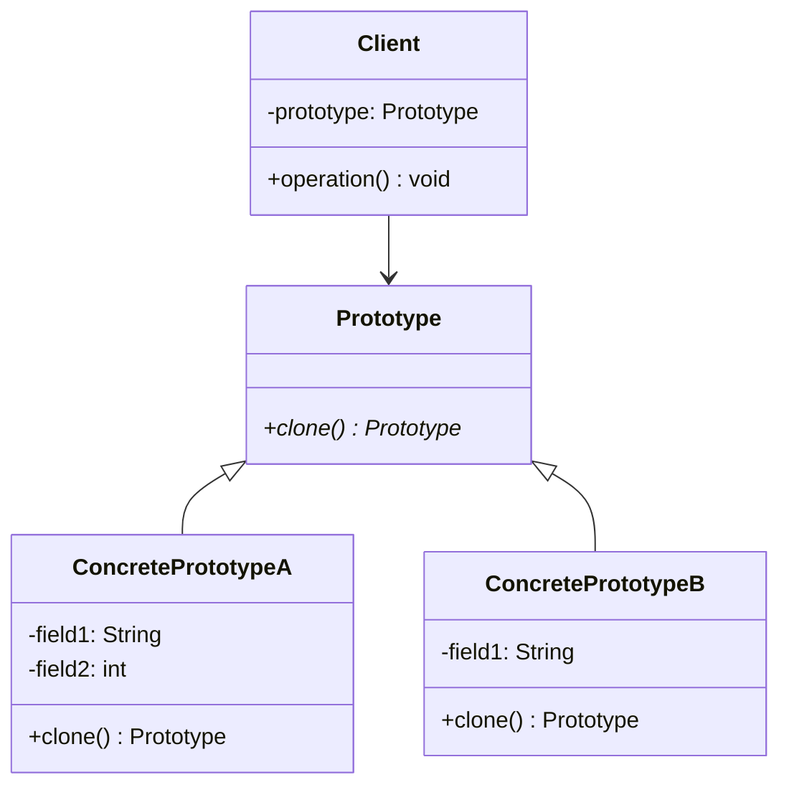

<Hero title="Prototype Pattern" subtitle="Clone objects to avoid expensive construction and enable flexible object variation" imageAlt="Prototype pattern illustration" size="large" />

## TL;DR

Prototype creates new objects by cloning an existing prototype rather than constructing from scratch. It's valuable when object construction is expensive, when you need many similar objects with small variations, or when runtime configuration determines object types.

## Learning Objectives

- You will be able to distinguish shallow copy from deep copy and know when each applies.
- You will be able to implement a clone method that correctly duplicates object state.
- You will be able to recognize scenarios where cloning beats construction for performance.
- You will be able to use a prototype registry to manage reusable templates.

## Motivating Scenario

Creating a detailed graphics shape (loading textures, computing meshes) takes 500ms. Your scene needs 1000 similar shapes. Creating each from scratch takes 500 seconds. Instead, create one prototype, then clone it 999 times in milliseconds. Slight variations (position, rotation) are cheap post-clone adjustments.

## Core Concepts

**Prototype** defines an interface for cloning itself. Concrete prototypes implement clone logic, creating independent copies. Clients request new objects by cloning prototypes rather than calling constructors.

Key elements:
- **Prototype** (abstract): declares the clone interface
- **ConcretePrototype**: implements clone, creating a copy of itself
- **Client**: creates objects by cloning existing prototypes
- **Prototype Registry**: optional; manages and retrieves prototypes by name

<Figure caption="Prototype structure">

</Figure>

## Practical Example

<Tabs>
<TabItem value="python" label="Python" default>

```python
import copy
from abc import ABC, abstractmethod

# Abstract Prototype
class Shape(ABC):
    def __init__(self):
        self.color = "black"
        self.x = 0
        self.y = 0

    @abstractmethod
    def clone(self):
        pass

    @abstractmethod
    def draw(self):
        pass

# Concrete Prototypes
class Circle(Shape):
    def __init__(self):
        super().__init__()
        self.radius = 10

    def clone(self):
        return copy.deepcopy(self)

    def draw(self):
        return f"Circle at ({self.x}, {self.y}), " \
               f"radius={self.radius}, color={self.color}"

class Rectangle(Shape):
    def __init__(self):
        super().__init__()
        self.width = 20
        self.height = 30

    def clone(self):
        return copy.deepcopy(self)

    def draw(self):
        return f"Rectangle at ({self.x}, {self.y}), " \
               f"{self.width}x{self.height}, color={self.color}"

# Prototype Registry
class ShapeRegistry:
    def __init__(self):
        self._shapes = {}

    def register(self, name, shape):
        self._shapes[name] = shape

    def get(self, name):
        return self._shapes[name].clone()

# Usage
registry = ShapeRegistry()
circle = Circle()
circle.color = "red"
registry.register("red_circle", circle)

rect = Rectangle()
rect.color = "blue"
registry.register("blue_rect", rect)

# Clone shapes with variations
shape1 = registry.get("red_circle")
shape1.x, shape1.y = 10, 20
print(shape1.draw())

shape2 = registry.get("red_circle")
shape2.x, shape2.y = 50, 60
print(shape2.draw())

shape3 = registry.get("blue_rect")
shape3.x, shape3.y = 100, 100
print(shape3.draw())
```

</TabItem>
<TabItem value="go" label="Go">

```go
package main

import (
    "fmt"
)

// Prototype interface
type Shape interface {
    Clone() Shape
    Draw() string
    SetColor(color string)
    SetPosition(x, y int)
}

// Abstract base (using composition)
type BaseShape struct {
    Color string
    X     int
    Y     int
}

func (b *BaseShape) SetColor(color string) {
    b.Color = color
}

func (b *BaseShape) SetPosition(x, y int) {
    b.X = x
    b.Y = y
}

// Concrete Prototype: Circle
type Circle struct {
    BaseShape
    Radius int
}

func (c *Circle) Clone() Shape {
    return &Circle{
        BaseShape: c.BaseShape,
        Radius:    c.Radius,
    }
}

func (c *Circle) Draw() string {
    return fmt.Sprintf("Circle at (%d, %d), radius=%d, color=%s",
        c.X, c.Y, c.Radius, c.Color)
}

// Concrete Prototype: Rectangle
type Rectangle struct {
    BaseShape
    Width  int
    Height int
}

func (r *Rectangle) Clone() Shape {
    return &Rectangle{
        BaseShape: r.BaseShape,
        Width:     r.Width,
        Height:    r.Height,
    }
}

func (r *Rectangle) Draw() string {
    return fmt.Sprintf("Rectangle at (%d, %d), %dx%d, color=%s",
        r.X, r.Y, r.Width, r.Height, r.Color)
}

// Prototype Registry
type ShapeRegistry struct {
    shapes map[string]Shape
}

func NewShapeRegistry() *ShapeRegistry {
    return &ShapeRegistry{
        shapes: make(map[string]Shape),
    }
}

func (sr *ShapeRegistry) Register(name string, shape Shape) {
    sr.shapes[name] = shape
}

func (sr *ShapeRegistry) Get(name string) Shape {
    return sr.shapes[name].Clone()
}

// Usage
func main() {
    registry := NewShapeRegistry()

    circle := &Circle{
        BaseShape: BaseShape{Color: "red"},
        Radius:    10,
    }
    registry.Register("red_circle", circle)

    rect := &Rectangle{
        BaseShape: BaseShape{Color: "blue"},
        Width:     20,
        Height:    30,
    }
    registry.Register("blue_rect", rect)

    shape1 := registry.Get("red_circle")
    shape1.SetPosition(10, 20)
    fmt.Println(shape1.Draw())

    shape2 := registry.Get("blue_rect")
    shape2.SetPosition(100, 100)
    fmt.Println(shape2.Draw())
}
```

</TabItem>
<TabItem value="nodejs" label="Node.js">

```javascript
// Abstract Prototype
class Shape {
    constructor() {
        this.color = "black";
        this.x = 0;
        this.y = 0;
    }

    clone() {
        throw new Error("Must implement clone()");
    }

    draw() {
        throw new Error("Must implement draw()");
    }

    setColor(color) {
        this.color = color;
        return this;
    }

    setPosition(x, y) {
        this.x = x;
        this.y = y;
        return this;
    }
}

// Concrete Prototype: Circle
class Circle extends Shape {
    constructor() {
        super();
        this.radius = 10;
    }

    clone() {
        const cloned = new Circle();
        cloned.color = this.color;
        cloned.x = this.x;
        cloned.y = this.y;
        cloned.radius = this.radius;
        return cloned;
    }

    draw() {
        return `Circle at (${this.x}, ${this.y}), ` +
               `radius=${this.radius}, color=${this.color}`;
    }
}

// Concrete Prototype: Rectangle
class Rectangle extends Shape {
    constructor() {
        super();
        this.width = 20;
        this.height = 30;
    }

    clone() {
        const cloned = new Rectangle();
        cloned.color = this.color;
        cloned.x = this.x;
        cloned.y = this.y;
        cloned.width = this.width;
        cloned.height = this.height;
        return cloned;
    }

    draw() {
        return `Rectangle at (${this.x}, ${this.y}), ` +
               `${this.width}x${this.height}, color=${this.color}`;
    }
}

// Prototype Registry
class ShapeRegistry {
    constructor() {
        this.shapes = {};
    }

    register(name, shape) {
        this.shapes[name] = shape;
    }

    get(name) {
        return this.shapes[name].clone();
    }
}

// Usage
const registry = new ShapeRegistry();

const circle = new Circle();
circle.setColor("red");
registry.register("red_circle", circle);

const rect = new Rectangle();
rect.setColor("blue");
registry.register("blue_rect", rect);

const shape1 = registry.get("red_circle");
shape1.setPosition(10, 20);
console.log(shape1.draw());

const shape2 = registry.get("blue_rect");
shape2.setPosition(100, 100);
console.log(shape2.draw());
```

</TabItem>
</Tabs>

## When to Use / When Not to Use

<Vs highlight={[1]} items={[
{
    label: "Use Prototype when:",
    points: [
      "Object construction is expensive (resource-intensive, time-consuming)",
      "You need many similar objects with small variations",
      "Runtime type determination is needed (objects register themselves)",
      "Objects contain complex graphs of sub-objects (cloning is faster than rebuilding)",
      "You want to decouple client code from concrete class hierarchies"
    ],
    highlightTone: "positive"
  },
{
    label: "Consider alternatives when:",
    points: [
      "Object creation is cheap (just use new)",
      "Deep copying is more expensive than construction (rare but possible)",
      "Objects have external references that shouldn't be cloned (use Factory instead)",
      "You need fine-grained control over what gets cloned (use Builder)",
      "Cloning is semantically unclear or problematic for your domain"
    ],
    highlightTone: "warning"
  }
]} />

## Patterns and Pitfalls

<Showcase title="Patterns and Pitfalls" sections={[
  {
    label: "Pattern: Prototype registry with lazy initialization",
    body: "Create prototypes on-demand, caching them for reuse."
  },
  {
    label: "Pitfall: Shallow vs. deep copy confusion",
    body: "Shallow copy shares references; deep copy duplicates everything. Wrong choice breaks isolation."
  },
  {
    label: "Pattern: Copy-on-write for efficiency",
    body: "Defer expensive deep copies until the cloned object is modified."
  }
]} />

## Design Review Checklist

<Checklist items={[
  "Clone method creates a true independent copy, not a reference",
  "Deep vs. shallow copy strategy is intentional and documented",
  "Cloning is actually cheaper than construction for your use case",
  "Objects being cloned have no external dependencies that shouldn't be cloned",
  "The clone method returns the same type (or a compatible interface)",
  "Prototype registry (if used) cleanly separates prototype management",
  "Testing cloned objects confirms they're truly independent",
  "Client code calling clone() is clearer than calling constructors"
]} />

## Self-Check

1. **Identify**: What objects in your codebase would benefit from cloning instead of construction?
2. **Implement**: Write a clone method ensuring deep copy of nested structures.
3. **Benchmark**: Measure whether cloning is actually faster than construction in your scenario.

:::info
**One Takeaway**: Prototype shines for expensive object creation or when you have many similar objects with small variations. It trades a clone implementation for performance gains and cleaner client code.

:::

## Next Steps

- Study **Factory Method** for simpler object creation patterns.
- Learn **Builder** when variation comes from configuration, not cloning.
- Explore immutability to make cloning semantically clearer.

## References

- Gang of Four: *Design Patterns* (Prototype)
- *Refactoring: Improving the Design of Existing Code*
- Joshua Bloch: *Effective Java* (Object copying and cloning)