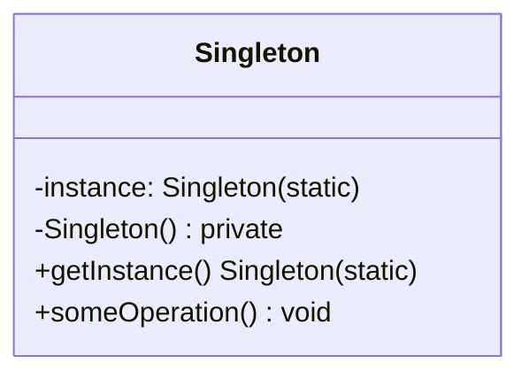

<Hero title="Singleton Pattern" subtitle="Restrict a class to one instance and provide global access—use sparingly" imageAlt="Singleton pattern illustration" size="large" />

## TL;DR

Singleton restricts a class to a single instance and provides global access. While superficially appealing, it couples code to a hidden dependency, complicates testing, and introduces subtle concurrency issues. Dependency injection is almost always superior. Use Singleton only when you have a genuine single-instance requirement and cannot use DI.

## Learning Objectives

- You will be able to implement Singleton safely across different languages.
- You will be able to identify why Singleton complicates unit testing.
- You will be able to recognize when Singleton is actually masking a dependency injection problem.
- You will be able to evaluate Singleton against alternatives like thread-local state or dependency injection.

## Motivating Scenario (And Why It's Problematic)

You build a database connection pool: "We only ever need one pool, so Singleton makes sense." Every class accesses it via `Pool.getInstance()`. Months later, your tests fail mysteriously because test 1 created connections that test 2 sees. Your logging system is also a Singleton, and test isolation breaks. Worse: in a multithreaded environment, race conditions appear. You realize Singleton hid a dependency that should have been explicit and injectable.

## Core Concepts

**Singleton** restricts instantiation to a single instance and provides global access. Implementation approaches vary:

- **Eager initialization**: create the instance at class load time
- **Lazy initialization**: create on first access (requires thread safety)
- **Thread-safe lazy**: use locks or language-specific mechanisms
- **Double-checked locking** (problematic in many languages): check, lock, check, then initialize

Key elements:
- **Static instance**: holds the single instance
- **Static accessor**: provides global access to that instance
- **Private constructor**: prevents direct instantiation

<Figure caption="Singleton structure">

</Figure>

## Practical Example

<Tabs>
<TabItem value="python" label="Python" default>

```python
import threading

# Eager Singleton (simple but inflexible)
class EagerLogger:
    _instance = None

    def __new__(cls):
        if cls._instance is None:
            cls._instance = super().__new__(cls)
            cls._instance._logs = []
        return cls._instance

    def log(self, message):
        self._logs.append(message)

    def get_logs(self):
        return self._logs

# Thread-safe lazy Singleton (metatlass approach - Pythonic)
class SingletonMeta(type):
    _instances = {}
    _lock = threading.Lock()

    def __call__(cls, *args, **kwargs):
        if cls not in cls._instances:
            with cls._lock:
                if cls not in cls._instances:
                    instance = super().__call__(*args, **kwargs)
                    cls._instances[cls] = instance
        return cls._instances[cls]

class SafeLogger(metaclass=SingletonMeta):
    def __init__(self):
        self._logs = []
        self._lock = threading.Lock()

    def log(self, message):
        with self._lock:
            self._logs.append(message)

    def get_logs(self):
        with self._lock:
            return list(self._logs)

# Usage (but know this is problematic!)
logger1 = SafeLogger()
logger2 = SafeLogger()
assert logger1 is logger2  # Same instance

logger1.log("Hello")
print(logger2.get_logs())  # ["Hello"]
```

</TabItem>
<TabItem value="go" label="Go">

```go
package main

import (
    "fmt"
    "sync"
)

// Thread-safe lazy Singleton
type Logger struct {
    logs []string
    mu   sync.Mutex
}

var (
    instance *Logger
    once     sync.Once
)

// GetInstance returns the single Logger instance
func GetInstance() *Logger {
    once.Do(func() {
        instance = &Logger{
            logs: make([]string, 0),
        }
    })
    return instance
}

func (l *Logger) Log(message string) {
    l.mu.Lock()
    defer l.mu.Unlock()
    l.logs = append(l.logs, message)
}

func (l *Logger) GetLogs() []string {
    l.mu.Lock()
    defer l.mu.Unlock()
    // Return a copy to prevent external mutation
    logs := make([]string, len(l.logs))
    copy(logs, l.logs)
    return logs
}

// Usage (problematic for testing!)
func main() {
    logger1 := GetInstance()
    logger2 := GetInstance()

    if logger1 != logger2 {
        fmt.Println("ERROR: Singletons don't match")
    }

    logger1.Log("Hello")
    fmt.Println(logger2.GetLogs())
}
```

</TabItem>
<TabItem value="nodejs" label="Node.js">

```javascript
// Eager Singleton
class EagerLogger {
    constructor() {
        if (EagerLogger.instance === undefined) {
            EagerLogger.instance = this;
            this.logs = [];
        }
        return EagerLogger.instance;
    }

    log(message) {
        this.logs.push(message);
    }

    getLogs() {
        return [...this.logs];
    }
}

// Thread-safe lazy Singleton (using closure)
class SafeLogger {
    static getInstance() {
        if (!SafeLogger.instance) {
            SafeLogger.instance = new SafeLogger();
        }
        return SafeLogger.instance;
    }

    constructor() {
        if (SafeLogger.instance) {
            return SafeLogger.instance;
        }
        this.logs = [];
        SafeLogger.instance = this;
    }

    log(message) {
        this.logs.push(message);
    }

    getLogs() {
        return [...this.logs];
    }
}

// Usage (problematic for testing!)
const logger1 = SafeLogger.getInstance();
const logger2 = SafeLogger.getInstance();

console.log(logger1 === logger2); // true

logger1.log("Hello");
console.log(logger2.getLogs()); // ["Hello"]
```

</TabItem>
</Tabs>

## When to Use / When NOT to Use

<Vs highlight={[1,0]} items={[
{
    label: "Rare cases where Singleton is justified:",
    points: [
      "Genuine hardware resource constraint (e.g., single device file)",
      "External system enforces single instance (e.g., cluster lock provider)",
      "Stateless utility with extreme backward compatibility needs",
      "Performance testing confirms global access overhead is critical"
    ]
  },
{
    label: "Use dependency injection instead when:",
    points: [
      "You need multiple instances (even if rare)",
      "You need to mock/stub for testing (DI enables this easily)",
      "You want clear dependencies visible in constructors",
      "You need different instances in different contexts",
      "Concurrency or thread-safety is relevant (DI is safer)",
      "You anticipate changing single instance to multiple later"
    ],
    highlightTone: "positive"
  }
]} />

## Patterns and Pitfalls

<Showcase title="Patterns and Pitfalls" sections={[
  {
    label: "Pitfall: Hidden dependencies obscure code",
    body: "Singleton hides dependencies, making code harder to understand and test."
  },
  {
    label: "Pitfall: Test pollution and isolation",
    body: "Singleton state persists across tests, breaking isolation."
  },
  {
    label: "Pattern: If you must use Singleton, provide a reset mechanism",
    body: "For testing, allow resetting or replacing the instance."
  }
]} />

## Design Review Checklist

<Checklist items={[
  "You have a genuine single-instance requirement, not just a convenience",
  "Cannot dependency injection be used instead (strongly preferred)?",
  "Concurrency is handled correctly (lazy + thread-safe initialization)",
  "The Singleton is stateless or state is properly protected (locks/immutability)",
  "Tests can reset or mock the Singleton (for testability)",
  "Global access is clearly documented as a trade-off",
  "You've considered whether the instance could ever legitimately be multiple",
  "No circular dependencies between Singletons exist"
]} />

## Self-Check

1. **Evaluate**: Identify Singletons in your codebase. Could dependency injection replace them?
2. **Test**: Write unit tests for a Singleton and experience test isolation challenges.
3. **Refactor**: Convert a Singleton to a dependency-injected parameter and observe the code clarity improvement.

:::info
**One Takeaway**: Singleton couples code to a hidden global dependency, complicates testing, and introduces subtle concurrency bugs. Dependency injection is almost always superior. Use Singleton only when you have a genuine single-instance requirement enforced by external constraints, and even then, explore alternatives first.

:::

## Refactoring Away from Singleton

### Before: Using Singleton

```python
# Using Singleton (hidden dependency, hard to test)
class Logger(metaclass=SingletonMeta):
    pass

class UserService:
    def create_user(self, email):
        user = User(email)
        Logger.instance().log(f"User created: {email}")
        return user

# Problem: UserService depends on Logger, but it's hidden
# Can't test UserService without using the real Logger
class TestUserService(unittest.TestCase):
    def test_create_user(self):
        service = UserService()
        user = service.create_user("test@example.com")
        # Logger.instance() has been called, but we can't verify it
        # We can't inject a mock logger
```

### After: Using Dependency Injection

```python
# DI (explicit dependency, easy to test)
class UserService:
    def __init__(self, logger):  # Explicit dependency
        self.logger = logger

    def create_user(self, email):
        user = User(email)
        self.logger.log(f"User created: {email}")
        return user

# Testing: Simple to inject mock logger
class MockLogger:
    def __init__(self):
        self.logs = []

    def log(self, message):
        self.logs.append(message)

class TestUserService(unittest.TestCase):
    def test_create_user(self):
        mock_logger = MockLogger()
        service = UserService(mock_logger)

        user = service.create_user("test@example.com")

        # Verify logger was called
        assert "User created: test@example.com" in mock_logger.logs
```

### Singleton Test Pollution Example

```python
# Testing with Singleton creates test pollution
class Logger(metaclass=SingletonMeta):
    def __init__(self):
        self.logs = []

    def log(self, message):
        self.logs.append(message)

# Test 1
def test_service_a():
    service = ServiceA()
    service.do_something()
    # Logger.instance().logs now has messages from ServiceA

# Test 2
def test_service_b():
    service = ServiceB()
    service.do_something()
    # Logger.instance().logs still has messages from test 1!
    # Logs are polluted - test isolation broken

# Workaround: Reset Singleton between tests
def tearDown():
    Logger.instance().logs.clear()  # Hacky and error-prone
```

## When Singleton Actually Makes Sense

### Genuine Single Resource

```python
# Hardware resource that's inherently single
class SerialPort:
    """Physical serial port - can only be one instance"""
    def __init__(self, port='/dev/ttyUSB0'):
        self.port = port
        self._serial = None

    @classmethod
    def get_instance(cls):
        if not hasattr(cls, '_instance'):
            cls._instance = SerialPort()
        return cls._instance

    def write(self, data):
        # Write to serial device
        pass

    def read(self):
        # Read from serial device
        pass

# Context: Only one physical serial port exists on the machine
# Multiple instances would conflict
# But even here, Dependency Injection is still better if possible
```

### Registry Pattern (Better Alternative)

```python
# Instead of Singleton, use Registry for discovery
class ServiceRegistry:
    _services = {}

    @classmethod
    def register(cls, name, service):
        cls._services[name] = service

    @classmethod
    def get(cls, name):
        return cls._services.get(name)

# Usage
logger = create_logger()
ServiceRegistry.register('logger', logger)

# In application
class UserService:
    def __init__(self):
        self.logger = ServiceRegistry.get('logger')

# For testing: easy to register mock
class TestUserService(unittest.TestCase):
    def setUp(self):
        ServiceRegistry.register('logger', MockLogger())
```

## Singleton Variants and Their Problems

```
Eager Singleton:
- Created at module load time
- Pro: Simple, thread-safe
- Con: Wasted memory if never used

Lazy Singleton:
- Created on first access
- Pro: Memory efficient
- Con: Thread-safety complexity

Double-Checked Locking:
- Check, lock, check, create
- Pro: Efficient (few locks)
- Con: Broken in many languages (Java before Java 5, C++)

Bill Pugh (Static Holder):
- Inner static class holds instance
- Pro: Thread-safe, lazy, simple
- Con: Still anti-pattern

Thread-Local Singleton:
- Per-thread singleton
- Pro: Useful in some scenarios
- Con: Adds thread complexity
```

## Decision Tree: Should I Use Singleton?

```
START
├─ Is there exactly ONE instance of this resource? (not "should be", but "must be")
│  ├─ NO → Use Dependency Injection (99% of cases)
│  └─ YES
│     ├─ Can you pass it as a parameter? (Dependency Injection possible?)
│     │  ├─ YES → Use Dependency Injection instead
│     │  └─ NO
│     │     ├─ Is the resource hardware (serial port, device file)?
│     │     │  ├─ YES → Singleton acceptable
│     │     │  └─ NO → Still try DI first
│     │        └─ If absolutely must use Singleton:
│     │           - Provide reset mechanism for testing
│     │           - Document as last resort
│     │           - Consider Registry instead

END: Use Dependency Injection
```

## Next Steps

- Learn **Dependency Injection** as the preferred modern alternative.
- Study **Factory Method** for controlled creation without global state.
- Explore **Service Locator** pattern (Registry) as an alternative
- Implement **Inversion of Control containers** for managing dependencies
- Design **Testable architectures** from the start

## References

- Gang of Four: *Design Patterns* (Singleton)
- Joshua Bloch: *Effective Java* (Avoid Singletons)
- *Refactoring: Improving the Design of Existing Code* (Remove Singleton)
- Steve Yegge: *Singletons Considered Harmful*
- Martin Fowler: "Service Locator" (alternative pattern)
- "Dependency Injection Principles, Practices, and Patterns" by Steven van Deursen and Mark Seemann
