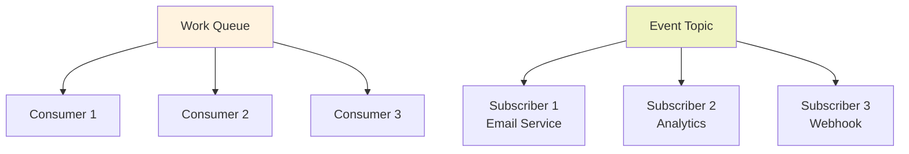

<Hero title="Competing Consumers and Publish-Subscribe" subtitle="Scale work distribution with multiple independent consumers competing for work, and broadcast events to multiple subscribers" imageAlt="illustration" size="large" />

## TL;DR

**Competing Consumers** enables multiple processors to independently pull work from a shared queue. Work is naturally load-balanced: faster processors pull more, slower processors pull less. This scales horizontally—add consumers to increase throughput. **Publish-Subscribe** broadcasts messages to all interested subscribers independently, enabling loose coupling and fan-out communication.

## Learning Objectives

You will be able to:
- Implement competing consumer load balancing
- Scale work distribution by adding consumers
- Handle consumer failures and rebalancing
- Design publish-subscribe topologies
- Avoid duplicate subscriptions and message loss

## Motivating Scenario

An email notification system receives millions of events. A single consumer can't keep up. With Competing Consumers, add 10 workers pulling from the same queue. Each worker independently grabs the next event, processes it, and acknowledges. If one worker crashes, others continue. If load increases, add more workers—zero code changes.

For notifications: different systems (logging, analytics, webhooks) all need to know when orders complete. Publish-Subscribe broadcasts the order completion event to all subscribers independently.

## Core Concepts

<Figure caption="Competing Consumers vs Publish-Subscribe">

</Figure>

## Practical Example

<Tabs groupId="lang" queryString>
<TabItem value="python" label="Python">
```python
import threading
import queue
import time
from typing import Dict, Callable

class CompetingConsumers:
    def __init__(self, queue_size: int = 100):
        self.queue = queue.Queue(maxsize=queue_size)
        self.consumers = []
    
    def add_consumer(self, consumer_id: str, handler: Callable):
        """Add a consumer that processes work from queue."""
        def consumer_loop():
            while True:
                try:
                    # Pull from shared queue
                    work = self.queue.get(timeout=1.0)
                    print(f"Consumer {consumer_id}: Processing {work['id']}")
                    handler(work)
                    self.queue.task_done()
                except queue.Empty:
                    continue
                except Exception as e:
                    print(f"Consumer {consumer_id} error: {e}")
        
        thread = threading.Thread(target=consumer_loop, daemon=True)
        thread.start()
        self.consumers.append(thread)
    
    def submit_work(self, work: Dict):
        """Submit work to queue."""
        self.queue.put(work)

class PubSubBroker:
    def __init__(self):
        self.subscribers = {}
    
    def subscribe(self, topic: str, callback: Callable):
        """Subscribe to topic."""
        if topic not in self.subscribers:
            self.subscribers[topic] = []
        self.subscribers[topic].append(callback)
        print(f"Subscribed to {topic}")
    
    def publish(self, topic: str, message: Dict):
        """Broadcast message to all subscribers."""
        print(f"Publishing to {topic}: {message['id']}")
        for callback in self.subscribers.get(topic, []):
            callback(message)

# Usage
# Competing Consumers
queue_workers = CompetingConsumers()

def process_email(work):
    time.sleep(0.5)  # Simulate processing
    print(f"  Email sent for {work['id']}")

queue_workers.add_consumer("email-worker-1", process_email)
queue_workers.add_consumer("email-worker-2", process_email)

# Submit work
for i in range(10):
    queue_workers.submit_work({"id": f"EMAIL-{i:03d}"})

time.sleep(6)

# Publish-Subscribe
broker = PubSubBroker()

def on_order_completed_logger(msg):
    print(f"  [Logging] Order {msg['id']} completed")

def on_order_completed_analytics(msg):
    print(f"  [Analytics] Recording order {msg['id']}")

broker.subscribe("order.completed", on_order_completed_logger)
broker.subscribe("order.completed", on_order_completed_analytics)

broker.publish("order.completed", {"id": "ORD-12345"})
```
</TabItem>
<TabItem value="go" label="Go">
```go
package main

import (
    "fmt"
    "sync"
    "time"
)

type WorkQueue struct {
    queue chan map[string]interface{}
    wg    sync.WaitGroup
}

func NewWorkQueue(size int) *WorkQueue {
    return &WorkQueue{
        queue: make(chan map[string]interface{}, size),
    }
}

func (wq *WorkQueue) AddConsumer(id string, handler func(map[string]interface{})) {
    wq.wg.Add(1)
    go func() {
        defer wq.wg.Done()
        for work := range wq.queue {
            fmt.Printf("Consumer %s: Processing %v\n", id, work["id"])
            handler(work)
        }
    }()
}

func (wq *WorkQueue) Submit(work map[string]interface{}) {
    wq.queue <- work
}

func (wq *WorkQueue) Close() {
    close(wq.queue)
    wq.wg.Wait()
}

type PubSubBroker struct {
    subscribers map[string][]func(map[string]interface{})
    mu          sync.RWMutex
}

func NewPubSubBroker() *PubSubBroker {
    return &PubSubBroker{
        subscribers: make(map[string][]func(map[string]interface{})),
    }
}

func (ps *PubSubBroker) Subscribe(topic string, callback func(map[string]interface{})) {
    ps.mu.Lock()
    defer ps.mu.Unlock()
    ps.subscribers[topic] = append(ps.subscribers[topic], callback)
    fmt.Printf("Subscribed to %s\n", topic)
}

func (ps *PubSubBroker) Publish(topic string, message map[string]interface{}) {
    ps.mu.RLock()
    callbacks := ps.subscribers[topic]
    ps.mu.RUnlock()
    
    fmt.Printf("Publishing to %s\n", topic)
    for _, callback := range callbacks {
        callback(message)
    }
}

func main() {
    // Competing Consumers
    wq := NewWorkQueue(100)
    
    wq.AddConsumer("worker-1", func(work map[string]interface{}) {
        time.Sleep(500 * time.Millisecond)
        fmt.Printf("  Processed %v\n", work["id"])
    })
    
    wq.AddConsumer("worker-2", func(work map[string]interface{}) {
        time.Sleep(500 * time.Millisecond)
        fmt.Printf("  Processed %v\n", work["id"])
    })
    
    for i := 0; i < 10; i++ {
        wq.Submit(map[string]interface{}{"id": fmt.Sprintf("WORK-%03d", i)})
    }
    
    time.Sleep(6 * time.Second)
    wq.Close()
    
    // Publish-Subscribe
    broker := NewPubSubBroker()
    
    broker.Subscribe("order.completed", func(msg map[string]interface{}) {
        fmt.Printf("  [Logging] Order %v completed\n", msg["id"])
    })
    
    broker.Subscribe("order.completed", func(msg map[string]interface{}) {
        fmt.Printf("  [Analytics] Recording order %v\n", msg["id"])
    })
    
    broker.Publish("order.completed", map[string]interface{}{"id": "ORD-12345"})
}
```
</TabItem>
<TabItem value="nodejs" label="Node.js">
```javascript
const { EventEmitter } = require('events');

class WorkQueue {
    constructor() {
        this.queue = [];
        this.processing = 0;
        this.consumers = [];
    }

    addConsumer(id, handler) {
        this.consumers.push({ id, handler });
        console.log(`Added consumer ${id}`);
    }

    async submit(work) {
        this.queue.push(work);
        this.processNext();
    }

    async processNext() {
        if (this.queue.length === 0 || this.consumers.length === 0) return;

        const work = this.queue.shift();
        const consumer = this.consumers[Math.floor(Math.random() * this.consumers.length)];

        console.log(`Consumer ${consumer.id}: Processing ${work.id}`);
        await consumer.handler(work);
        
        if (this.queue.length > 0) {
            setImmediate(() => this.processNext());
        }
    }
}

class PubSubBroker extends EventEmitter {}

// Usage
const workQueue = new WorkQueue();

workQueue.addConsumer('worker-1', async (work) => {
    await new Promise(resolve => setTimeout(resolve, 500));
    console.log(`  Processed ${work.id}`);
});

workQueue.addConsumer('worker-2', async (work) => {
    await new Promise(resolve => setTimeout(resolve, 500));
    console.log(`  Processed ${work.id}`);
});

for (let i = 0; i < 10; i++) {
    workQueue.submit({ id: `WORK-${String(i).padStart(3, '0')}` });
}

// Publish-Subscribe
const broker = new PubSubBroker();

broker.on('order.completed', (msg) => {
    console.log(`  [Logging] Order ${msg.id} completed`);
});

broker.on('order.completed', (msg) => {
    console.log(`  [Analytics] Recording order ${msg.id}`);
});

broker.emit('order.completed', { id: 'ORD-12345' });
```
</TabItem>
</Tabs>

## When to Use / When Not to Use

**Use Competing Consumers when:**
- Work throughput exceeds single processor capacity
- Scaling by adding consumers is desired
- Load balancing is needed automatically

**Use Publish-Subscribe when:**
- Events must be broadcast to multiple independent subscribers
- Subscribers evolve independently
- Loose coupling is a priority

**Avoid when:**
- Single consumer is sufficient
- Order guarantees across subscribers are needed
- Tightly coupled synchronous responses are required

## Patterns and Pitfalls

### Pattern: Load Balancing Automatically

Fast consumers process more messages. Slow consumers process fewer. If consumer A handles 10 msgs/sec and consumer B handles 5 msgs/sec, put 10 A's and 5 B's on queue. Load naturally distributes.

### Pattern: Message Acknowledgments

Don't remove message from queue until consumer acknowledges. If consumer crashes, message stays in queue for another consumer.

```python
# Good: explicit acknowledgment
message = queue.get()
try:
    process(message)
    queue.task_done()  # Only remove after success
except Exception:
    queue.put(message)  # Return to queue on failure
```

### Pattern: Rebalancing on Failure

If a consumer crashes, in-flight work must be recovered. Use:
- **Message TTL**: Messages expire if not processed in X seconds
- **Requeue on timeout**: After TTL, message returns to queue
- **Dead letter queue**: Permanently failed messages go here for manual review

### Pitfall: Poison Messages

A bad message causes every consumer to crash on receipt. Solution:
- Validate messages before processing
- Move permanently bad messages to dead letter queue after N retry attempts
- Log the bad message for debugging

### Pattern: Competing Consumers + Pub-Sub Hybrid

Some systems combine both:
- Events published to topic (pub-sub)
- Each subscriber has a queue
- Multiple consumers compete for messages on that queue

Example: Order.Created event published. Three services subscribe:
- Email Service: 2 consumers (load balanced)
- Analytics Service: 1 consumer
- Inventory Service: 3 consumers (updates critical)

Each service controls its own scaling independently.

## Design Review Checklist

- [ ] Consumers acknowledge work completion
- [ ] Unacknowledged work is recovered (dead letter/retry)
- [ ] New consumers can be added without code changes
- [ ] Subscriber list is dynamic (can add/remove)
- [ ] Monitoring tracks consumer throughput and queue depth
- [ ] Graceful shutdown drains work before terminating

## Self-Check

1. **How does adding consumers improve throughput?**
2. **What happens if a consumer crashes mid-processing?**
3. **How do subscribers receive the same message independently?**

:::info One Takeaway
Competing Consumers enable horizontal scaling: add workers to increase throughput. Publish-Subscribe broadcasts events to multiple independent subscribers. Together they scale from zero to millions of messages.

:::

## Advanced Scenarios

### Scenario: Scaling to 1 Million Messages/Day

With Competing Consumers:

```
Initial: 1 consumer, 5 msg/sec = slow
Problem: Can only process 432k msgs/day (5 × 86400 seconds)

Solution: Add consumers
├── 3 consumers: 15 msg/sec = 1.3M msgs/day
├── 5 consumers: 25 msg/sec = 2.2M msgs/day
└── No code change, just add workers

Cost: More workers but linear scaling. No re-architecture needed.
```

### Scenario: Heterogeneous Work (Variable Processing Time)

Some messages take 1 second, others take 60 seconds.

```
Without queue: All in single thread - max ~1 msg/sec
With Competing Consumers: Fast messages (1s) and slow (60s) share load

Fast consumer: picks 60 quick messages
Slow consumer: picks 1 slow message
Both finish around same time
Natural load balancing
```

### Scenario: Message Ordering Across Consumers

Problem: Messages must be processed in order, but multiple consumers run in parallel.

Solutions:

1. **Single consumer**: Sacrifices parallelism but guarantees order
2. **Partition key**: Same key always goes to same consumer
   ```python
   partition_id = message.customer_id % num_consumers
   send_to_consumer(partition_id, message)
   ```
3. **Sequence numbers**: Number messages; consumers process in order within their partition

### Scenario: At-Least-Once vs Exactly-Once Delivery

**At-Least-Once**: Every message delivered at least once (may be duplicate)
- Implementation: Acknowledge only after processing
- Risk: Process fails after processing but before acknowledge; message reprocessed

**Exactly-Once**: Each message processed exactly once
- Implementation: Idempotent operations (reprocessing gives same result)
- Harder: requires deduplication or transactions

```python
# At-Least-Once
def process():
    message = queue.get()
    process_message(message)
    queue.acknowledge(message)  # Only acknowledge after success

# Exactly-Once (with idempotency)
def process():
    message = queue.get()
    if already_processed(message.id):
        queue.acknowledge(message)
        return
    process_message(message)  # Idempotent: safe to replay
    queue.acknowledge(message)
```

## Comparison with Related Patterns

### Competing Consumers vs Single Consumer

| Aspect | Competing Consumers | Single Consumer |
|--------|-------------------|-----------------|
| Throughput | O(n) scales linearly with consumers | Fixed at single consumer speed |
| Order | No guarantee (unless partitioned) | Guaranteed order |
| Complexity | Higher (need coordination) | Simple |
| Latency | Low (parallel processing) | Higher (sequential) |
| Cost | More infrastructure, linear scale | Less infrastructure |

### Pub-Sub vs Queue

| Aspect | Queue (Competing Consumers) | Topic (Pub-Sub) |
|--------|---------------------------|-----------------|
| Consumer Behavior | Compete for messages | Each subscriber independent |
| Message Persistence | After consumption, deleted | Until all subscribers received |
| Scaling | Add more consumers | Add more subscribers |
| Coupling | Loose (consumers don't know about each other) | Loose (subscribers don't know about each other) |

## Monitoring and Operations

### Metrics to Track

**For Competing Consumers**:
- Queue depth (messages waiting)
- Consumer lag (age of oldest message)
- Throughput (messages/second)
- Error rate (% of messages failed)
- Requeue count (messages reprocessed)

**Alerts**:
- Queue depth > threshold: add consumers
- Consumer lag > threshold: system falling behind
- Error rate > 1%: investigate poison messages

### Consumer Lifecycle

```
┌─ Consumer starts
│  ├─ Connect to queue
│  ├─ Report ready
│  └─ Begin processing
│
├─ Processing loop
│  ├─ Get message
│  ├─ Process
│  ├─ Acknowledge
│  └─ Repeat
│
└─ Consumer stops
   ├─ Stop getting new messages
   ├─ Finish in-flight work
   ├─ Acknowledge completed
   └─ Disconnect
```

## Next Steps

- Learn [Message Channels](/docs/design-patterns/enterprise-integration-patterns/message-channel-queue-topic) for underlying queue/topic mechanics
- Study [Dead Letter Channel](/docs/design-patterns/enterprise-integration-patterns/dead-letter-channel-poison-message-handling) for recovery
- Explore message brokers: RabbitMQ, Kafka, NATS, AWS SNS/SQS
- Study [Batch Processing](/docs/design-patterns/enterprise-integration-patterns/pipes-and-filters) for handling large volumes

## References

1. "Enterprise Integration Patterns" by Gregor Hohpe and Bobby Woolf
2. "Kafka: The Definitive Guide" by Neha Narkhede et al.
