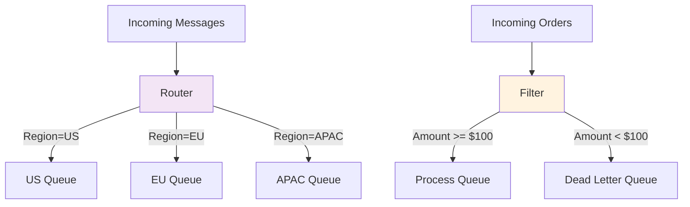

<Hero title="Content-Based Router and Message Filter" subtitle="Route and filter messages based on content, enabling dynamic message direction without coupling" imageAlt="illustration" size="large" />

## TL;DR

**Content-Based Router** examines message content and routes to different destinations based on rules. **Message Filter** selectively processes messages, dropping those that don't match criteria. Both patterns enable dynamic, adaptive message processing without coupling senders to receivers.

## Learning Objectives

You will be able to:
- Implement routing rules based on message content
- Design filtering logic for selective processing
- Avoid coupling routers to specific destinations
- Handle unmatched/filtered messages gracefully
- Monitor routing and filtering decisions

## Motivating Scenario

An order processor receives orders for different regions (US, EU, APAC). Each region has different fulfillment systems. Rather than hard-coding region checks in the main processor, a Content-Based Router examines the order's region field and routes to the appropriate fulfillment queue. Similarly, a Message Filter might exclude orders below a minimum amount from processing, routing them to a separate queue.

## Core Concepts

<Figure caption="Content-Based Router and Message Filter flow">

</Figure>

## Practical Example

<Tabs groupId="lang" queryString>
<TabItem value="python" label="Python">
```python
import json
from typing import Dict, List, Callable
from abc import ABC, abstractmethod

class Router(ABC):
    @abstractmethod
    def route(self, message: Dict) -> str:
        """Return destination queue name."""
        pass

class ContentBasedRouter(Router):
    def __init__(self, rules: Dict[str, Callable]):
        self.rules = rules  # field -> list of (condition, destination)
    
    def route(self, message: Dict) -> str:
        region = message.get("region", "unknown")
        
        if region == "US":
            return "us-fulfillment-queue"
        elif region == "EU":
            return "eu-fulfillment-queue"
        elif region == "APAC":
            return "apac-fulfillment-queue"
        else:
            return "unknown-region-queue"

class MessageFilter:
    def __init__(self, min_amount: float):
        self.min_amount = min_amount
    
    def filter(self, message: Dict) -> bool:
        """Return True if message passes filter."""
        return message.get("amount", 0) >= self.min_amount

# Usage
router = ContentBasedRouter({})
filter = MessageFilter(min_amount=100.0)

orders = [
    {"order_id": "1", "region": "US", "amount": 150.00},
    {"order_id": "2", "region": "EU", "amount": 75.00},
    {"order_id": "3", "region": "APAC", "amount": 200.00},
]

for order in orders:
    # Apply filter
    if not filter.filter(order):
        print(f"Order {order['order_id']}: FILTERED (amount too low)")
        continue
    
    # Route based on content
    destination = router.route(order)
    print(f"Order {order['order_id']}: Route to {destination}")
```
</TabItem>
<TabItem value="go" label="Go">
```go
package main

import (
    "fmt"
)

type Order struct {
    OrderID string
    Region  string
    Amount  float64
}

func routeByRegion(order Order) string {
    switch order.Region {
    case "US":
        return "us-fulfillment-queue"
    case "EU":
        return "eu-fulfillment-queue"
    case "APAC":
        return "apac-fulfillment-queue"
    default:
        return "unknown-region-queue"
    }
}

func filterByMinAmount(order Order, minAmount float64) bool {
    return order.Amount >= minAmount
}

func main() {
    orders := []Order{
        {OrderID: "1", Region: "US", Amount: 150.00},
        {OrderID: "2", Region: "EU", Amount: 75.00},
        {OrderID: "3", Region: "APAC", Amount: 200.00},
    }
    
    minAmount := 100.0
    
    for _, order := range orders {
        // Apply filter
        if !filterByMinAmount(order, minAmount) {
            fmt.Printf("Order %s: FILTERED (amount too low)\n", order.OrderID)
            continue
        }
        
        // Route based on content
        destination := routeByRegion(order)
        fmt.Printf("Order %s: Route to %s\n", order.OrderID, destination)
    }
}
```
</TabItem>
<TabItem value="nodejs" label="Node.js">
```javascript
class ContentBasedRouter {
    route(message) {
        const region = message.region || 'unknown';
        
        switch (region) {
            case 'US':
                return 'us-fulfillment-queue';
            case 'EU':
                return 'eu-fulfillment-queue';
            case 'APAC':
                return 'apac-fulfillment-queue';
            default:
                return 'unknown-region-queue';
        }
    }
}

class MessageFilter {
    constructor(minAmount) {
        this.minAmount = minAmount;
    }

    filter(message) {
        return (message.amount || 0) >= this.minAmount;
    }
}

// Usage
const router = new ContentBasedRouter();
const filter = new MessageFilter(100.0);

const orders = [
    { orderId: '1', region: 'US', amount: 150.00 },
    { orderId: '2', region: 'EU', amount: 75.00 },
    { orderId: '3', region: 'APAC', amount: 200.00 },
];

orders.forEach(order => {
    if (!filter.filter(order)) {
        console.log(`Order ${order.orderId}: FILTERED (amount too low)`);
        return;
    }

    const destination = router.route(order);
    console.log(`Order ${order.orderId}: Route to ${destination}`);
});
```
</TabItem>
</Tabs>

## When to Use / When Not to Use

**Use Content-Based Router when:**
- Routing depends on message payload
- Rules change frequently without code recompilation
- Multiple destinations need different message types
- Decoupling is critical

**Use Message Filter when:**
- Selective processing based on criteria
- Some messages are intentionally dropped
- Filtering logic is independent of downstream processing

**Avoid when:**
- Static routing (hard-coded path) is simpler
- All messages must be processed
- Routing rules are application-specific and unlikely to change

## Patterns and Pitfalls

### Pitfall: Dropped Messages Without Visibility

Silently filtering messages can hide data loss. Log all filtered messages.

### Pattern: Wildcard/Default Routes

Unmatched messages should route to a default queue for investigation.

## Design Review Checklist

- [ ] Routing rules are explicit and documented
- [ ] Unmatched/filtered messages are logged
- [ ] Destination queues exist and are monitored
- [ ] Rules can be updated without code changes
- [ ] Filtering logic is testable in isolation

## Self-Check

1. **How do you handle messages that don't match any routing rule?**
2. **Can routing rules be changed without redeploying code?**
3. **Are filtered messages logged for audit purposes?**

## Advanced Routing Patterns

### Pattern: Rules-Based Router

Instead of hard-coded if/else, use a rules engine for dynamic routing:

```python
class RulesBasedRouter:
    def __init__(self):
        # Rules stored in database or config
        self.rules = [
            {'condition': 'region == "US"', 'destination': 'us-queue'},
            {'condition': 'region == "EU"', 'destination': 'eu-queue'},
            {'condition': 'amount > 10000', 'destination': 'high-value-queue'},
            {'condition': 'priority == "URGENT"', 'destination': 'priority-queue'},
            {'condition': 'default', 'destination': 'default-queue'},
        ]

    def route(self, message: Dict) -> str:
        for rule in self.rules:
            if self.evaluate_condition(rule['condition'], message):
                return rule['destination']
        return 'unknown-queue'

    def evaluate_condition(self, condition: str, context: Dict) -> bool:
        # Simple expression evaluator
        # In production: use dedicated rules engine (Drools, Easy Rules)
        return eval(condition, {"__builtins__": {}}, context)

# Benefits:
# - Rules in database (no code deploy for routing changes)
# - Complex conditions without code (business analysts can write rules)
# - Easy A/B testing (add rule: '10% of users → new-path')
```

### Pattern: Content Enrichment Before Routing

```python
class ContentEnrichingRouter:
    def route_with_enrichment(self, message: Dict) -> str:
        """Enrich message content before routing"""

        # Original message: only user_id
        # Issue: Don't know user's region to route properly

        # Step 1: Enrich with user data
        user = self.user_service.get_user(message['user_id'])
        message['region'] = user.region
        message['priority'] = user.vip_status  # 'STANDARD' or 'VIP'

        # Step 2: Route based on enriched data
        if message['priority'] == 'VIP':
            return 'vip-queue'
        elif message['region'] == 'US':
            return 'us-queue'
        else:
            return 'default-queue'

        # Benefit: Can make smart routing decisions based on context
```

### Pattern: Content-Based Splitting

```python
class ContentBasedSplitter:
    def process_order(self, order: Dict) -> List[str]:
        """Split order into logical queues based on content"""

        destinations = []

        # Route based on order contents
        if any(i['type'] == 'DIGITAL' for i in order['items']):
            destinations.append('digital-fulfillment')

        if any(i['type'] == 'PHYSICAL' for i in order['items']):
            destinations.append('warehouse-fulfillment')

        if any(i.get('gift_wrap') for i in order['items']):
            destinations.append('gift-wrap-service')

        if order.get('express_shipping'):
            destinations.append('priority-shipping')

        return destinations

# Example:
# Order: 1x Book + 1x Gift Card + Express Shipping
# Routes to:
#   - physical-fulfillment (book)
#   - digital-fulfillment (gift card)
#   - priority-shipping (express)
# Three services handle in parallel
```

## Error Handling in Routing

```python
class RobustRouter:
    def route_with_fallback(self, message: Dict, retry_count=0) -> str:
        """Route with fallback for errors"""

        try:
            # Try primary routing
            destination = self.determine_route(message)
            logger.info(f"Routed to {destination}")
            return destination

        except RuleEvaluationError as e:
            # Rule failed to evaluate
            logger.error(f"Rule evaluation failed: {e}")
            # Send to DLQ (dead letter queue) for manual investigation
            return 'dead-letter-queue'

        except ServiceUnavailable as e:
            # Enrichment service down
            if retry_count < 3:
                # Retry with exponential backoff
                time.sleep(2 ** retry_count)
                return self.route_with_fallback(message, retry_count + 1)
            else:
                # Backoff exhausted, use default
                return 'default-queue'

# DLQ (Dead Letter Queue):
#   - Messages that can't be routed
#   - Can be investigated, rules fixed, messages replayed
#   - Prevents message loss due to routing failures
```

## Performance Considerations

```
Routing overhead for 100,000 msg/sec:

Scenario 1: Simple if/else routing
  - ~1μs per message (very fast)
  - Total: 100ms per second overhead

Scenario 2: Rules engine (eval condition)
  - ~10μs per message (10x slower)
  - Total: 1 second overhead per second (unacceptable)
  - Fix: Pre-compile rules, cache evaluations

Scenario 3: Enrichment before routing
  - ~1ms per message (call to user_service)
  - Total: 100 seconds overhead per second (way too slow!)
  - Fix: Cache user data, use async enrichment

Optimization:
  - Cache hot data (user region, recent preferences)
  - Use async enrichment (fire-and-forget)
  - Pre-compile rules (don't eval string expressions)
  - Batch messages if possible
```

## Monitoring Routing Decisions

```python
class RouterMetrics:
    def track_routing_decision(self, message: Dict, destination: str):
        """Monitor routing patterns"""
        metrics = {
            'destination': destination,
            'message_type': message.get('type'),
            'timestamp': datetime.now(),
        }

        # Track distribution
        logger.info(f"Routed {message['id']} to {destination}")
        self.metrics.increment(f"routing.{destination}")

        # Alert if routing becomes unbalanced
        distribution = self.metrics.get_routing_distribution()
        for dest, percentage in distribution.items():
            if percentage > 0.9:  # 90% of traffic to one queue
                logger.warn(f"Unbalanced routing: {dest} has 90%+ of traffic")

# Monitor:
# - Distribution across queues (is one queue overloaded?)
# - Latency per destination (is one slower?)
# - Filtering rate (how many messages filtered? why?)
# - Routing error rate (rule failures?)
```

:::info One Takeaway
Content-Based Router and Message Filter enable dynamic message processing. Use rules engines for complex logic, enrich with context data before routing, and monitor distribution to detect imbalances.

:::

## Next Steps

- Learn [Splitter](/docs/design-patterns/enterprise-integration-patterns/splitter-aggregator-resequencer) for decomposing complex messages
- Study [Message Channels](/docs/design-patterns/enterprise-integration-patterns/message-channel-queue-topic) for multi-destination patterns
- Explore rule engines: Apache Camel, Spring Integration, Kafka Streams
- Learn: Drools (Java), Easy Rules (Java), json-rules-engine (JavaScript)

## References

1. "Enterprise Integration Patterns" by Gregor Hohpe and Bobby Woolf
2. <a href="https://camel.apache.org/" target="_blank" rel="nofollow noopener noreferrer">Apache Camel - Integration Patterns ↗</a>
3. <a href="https://spring.io/projects/spring-integration" target="_blank" rel="nofollow noopener noreferrer">Spring Integration ↗</a>
4. <a href="https://kafka.apache.org/documentation/streams/" target="_blank" rel="nofollow noopener noreferrer">Kafka Streams ↗</a>
