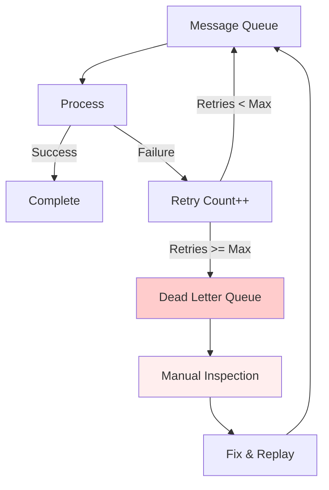

<Hero title="Dead Letter Channel and Poison Message Handling" subtitle="Isolate and handle messages that fail repeatedly, preventing system-wide failures and data loss" imageAlt="illustration" size="large" />

## TL;DR

**Dead Letter Channel** routes messages that fail processing to a separate queue for investigation and recovery. **Poison Message** detection identifies messages that consistently cause failures. When a message exceeds retry limits, it's moved to the dead letter queue rather than being discarded or blocking the main queue. This prevents system hangs and enables manual recovery.

## Learning Objectives

You will be able to:
- Implement dead letter channel patterns
- Detect poison messages automatically
- Configure retry policies and limits
- Route failed messages for investigation
- Monitor and recover from dead letter queues

## Motivating Scenario

An order processing system receives a malformed order (missing required field). Processing fails, triggering a retry. It fails again. Without a dead letter mechanism, the order either blocks the queue indefinitely (if synchronous) or gets lost silently. With dead letter handling, after 3 retries, the message moves to a dead letter queue. Operators inspect it, fix the issue, and replay it.

## Core Concepts

<Figure caption="Dead Letter Channel flow">

</Figure>

## Poison Message Detection and Prevention

### Early Detection of Poison Messages

```python
class PoisonMessageDetector:
    """Identify messages that consistently fail"""
    def __init__(self, threshold_retries=3):
        self.failure_history = {}
        self.threshold = threshold_retries

    def record_failure(self, message_id, error):
        """Track failures per message"""
        if message_id not in self.failure_history:
            self.failure_history[message_id] = []
        self.failure_history[message_id].append({
            'error': str(error),
            'timestamp': datetime.now()
        })

    def is_poison(self, message_id):
        """Check if message exceeds failure threshold"""
        if message_id not in self.failure_history:
            return False
        failures = self.failure_history[message_id]
        return len(failures) >= self.threshold

    def get_poison_messages(self):
        """Return all identified poison messages"""
        return [msg_id for msg_id, failures in self.failure_history.items()
                if len(failures) >= self.threshold]

    def categorize_failures(self, message_id):
        """Analyze error patterns to suggest fixes"""
        failures = self.failure_history.get(message_id, [])
        errors = [f['error'] for f in failures]

        categories = {}
        for error in errors:
            error_type = self._classify_error(error)
            categories[error_type] = categories.get(error_type, 0) + 1

        return categories

    def _classify_error(self, error):
        """Classify error type"""
        if 'timeout' in error.lower():
            return 'timeout'
        elif 'validation' in error.lower():
            return 'validation'
        elif 'rate' in error.lower():
            return 'rate_limit'
        elif 'not found' in error.lower():
            return 'missing_resource'
        else:
            return 'unknown'
```

## Practical Example

<Tabs groupId="lang" queryString>
<TabItem value="python" label="Python">
```python
import json
from typing import Dict, Optional
from datetime import datetime

class MessageProcessor:
    def __init__(self, max_retries: int = 3):
        self.max_retries = max_retries
        self.main_queue = []
        self.dead_letter_queue = []
    
    def process_message(self, message: Dict) -> bool:
        """Attempt to process message. Return True if successful."""
        try:
            # Validate message
            if not message.get("order_id"):
                raise ValueError("Missing order_id")
            if not message.get("amount"):
                raise ValueError("Missing amount")
            
            # Process
            print(f"Processing order {message['order_id']}: ${message['amount']}")
            return True
        except Exception as e:
            print(f"Error: {e}")
            return False
    
    def handle_message(self, message: Dict):
        """Handle message with retry and dead letter logic."""
        retry_count = message.get("_retry_count", 0)
        
        # Attempt processing
        if self.process_message(message):
            print(f"Order {message['order_id']} processed successfully")
            return
        
        # Retry logic
        if retry_count < self.max_retries:
            retry_count += 1
            message["_retry_count"] = retry_count
            print(f"Retrying order {message['order_id']} (attempt {retry_count})")
            self.main_queue.append(message)
        else:
            # Dead letter
            message["_dead_letter_timestamp"] = datetime.now().isoformat()
            message["_failure_count"] = retry_count
            print(f"Order {message['order_id']} moved to dead letter queue")
            self.dead_letter_queue.append(message)
    
    def process_batch(self, messages: list):
        """Process batch of messages."""
        for msg in messages:
            self.handle_message(msg)
        
        # Process main queue items
        while self.main_queue:
            msg = self.main_queue.pop(0)
            self.handle_message(msg)
    
    def get_dead_letters(self) -> list:
        """Get messages in dead letter queue for inspection."""
        return self.dead_letter_queue
    
    def replay_dead_letter(self, message: Dict):
        """Replay a fixed message from dead letter queue."""
        message.pop("_retry_count", None)
        message.pop("_dead_letter_timestamp", None)
        print(f"Replaying order {message['order_id']}")
        self.handle_message(message)

# Usage
processor = MessageProcessor(max_retries=2)

messages = [
    {"order_id": "ORD-001", "amount": 99.99},  # Valid
    {"order_id": "ORD-002"},  # Missing amount
    {"amount": 49.99},  # Missing order_id
    {"order_id": "ORD-004", "amount": 199.99},  # Valid
]

processor.process_batch(messages)

print("\n=== Dead Letter Queue ===")
for msg in processor.get_dead_letters():
    print(json.dumps(msg, indent=2))

# Fix and replay
if processor.dead_letter_queue:
    bad_msg = processor.dead_letter_queue[0]
    bad_msg["order_id"] = "ORD-002"  # Fix the message
    processor.replay_dead_letter(bad_msg)
```
</TabItem>
<TabItem value="go" label="Go">
```go
package main

import (
    "fmt"
    "time"
)

type Order struct {
    OrderID      string
    Amount       float64
    RetryCount   int
    DeadLetterAt string
}

type OrderProcessor struct {
    maxRetries      int
    mainQueue       []Order
    deadLetterQueue []Order
}

func NewOrderProcessor(maxRetries int) *OrderProcessor {
    return &OrderProcessor{
        maxRetries:      maxRetries,
        mainQueue:       []Order{},
        deadLetterQueue: []Order{},
    }
}

func (op *OrderProcessor) Process(order Order) bool {
    // Validate
    if order.OrderID == "" {
        fmt.Println("Error: Missing order_id")
        return false
    }
    if order.Amount == 0 {
        fmt.Println("Error: Missing amount")
        return false
    }
    
    fmt.Printf("Processing order %s: $%.2f\n", order.OrderID, order.Amount)
    return true
}

func (op *OrderProcessor) HandleOrder(order Order) {
    // Attempt processing
    if op.Process(order) {
        fmt.Printf("Order %s processed successfully\n", order.OrderID)
        return
    }
    
    // Retry logic
    if order.RetryCount < op.maxRetries {
        order.RetryCount++
        fmt.Printf("Retrying order %s (attempt %d)\n", order.OrderID, order.RetryCount)
        op.mainQueue = append(op.mainQueue, order)
    } else {
        // Dead letter
        order.DeadLetterAt = time.Now().Format(time.RFC3339)
        fmt.Printf("Order %s moved to dead letter queue\n", order.OrderID)
        op.deadLetterQueue = append(op.deadLetterQueue, order)
    }
}

func (op *OrderProcessor) ProcessBatch(orders []Order) {
    for _, order := range orders {
        op.HandleOrder(order)
    }
    
    for len(op.mainQueue) > 0 {
        order := op.mainQueue[0]
        op.mainQueue = op.mainQueue[1:]
        op.HandleOrder(order)
    }
}

func (op *OrderProcessor) GetDeadLetters() []Order {
    return op.deadLetterQueue
}

func main() {
    processor := NewOrderProcessor(2)
    
    orders := []Order{
        {OrderID: "ORD-001", Amount: 99.99},
        {OrderID: "ORD-002", Amount: 0},  // Missing amount
        {OrderID: "", Amount: 49.99},  // Missing order_id
        {OrderID: "ORD-004", Amount: 199.99},
    }
    
    processor.ProcessBatch(orders)
    
    fmt.Println("\n=== Dead Letter Queue ===")
    for _, order := range processor.GetDeadLetters() {
        fmt.Printf("Order %s (%.2f) - DeadLetteredAt: %s\n", 
            order.OrderID, order.Amount, order.DeadLetterAt)
    }
}
```
</TabItem>
<TabItem value="nodejs" label="Node.js">
```javascript
class OrderProcessor {
    constructor(maxRetries = 3) {
        this.maxRetries = maxRetries;
        this.mainQueue = [];
        this.deadLetterQueue = [];
    }

    process(order) {
        try {
            if (!order.orderId) throw new Error('Missing orderId');
            if (!order.amount) throw new Error('Missing amount');
            
            console.log(`Processing order ${order.orderId}: $${order.amount}`);
            return true;
        } catch (error) {
            console.error(`Error: ${error.message}`);
            return false;
        }
    }

    handleOrder(order) {
        const retryCount = order._retryCount || 0;
        
        if (this.process(order)) {
            console.log(`Order ${order.orderId} processed successfully`);
            return;
        }
        
        if (retryCount < this.maxRetries) {
            order._retryCount = retryCount + 1;
            console.log(`Retrying order ${order.orderId} (attempt ${retryCount + 1})`);
            this.mainQueue.push(order);
        } else {
            order._deadLetterAt = new Date().toISOString();
            console.log(`Order ${order.orderId} moved to dead letter queue`);
            this.deadLetterQueue.push(order);
        }
    }

    processBatch(orders) {
        orders.forEach(order => this.handleOrder(order));
        
        while (this.mainQueue.length > 0) {
            const order = this.mainQueue.shift();
            this.handleOrder(order);
        }
    }

    getDeadLetters() {
        return this.deadLetterQueue;
    }

    replayDeadLetter(order) {
        delete order._retryCount;
        console.log(`Replaying order ${order.orderId}`);
        this.handleOrder(order);
    }
}

// Usage
const processor = new OrderProcessor(2);

const orders = [
    { orderId: 'ORD-001', amount: 99.99 },
    { orderId: 'ORD-002' },  // Missing amount
    { amount: 49.99 },  // Missing orderId
    { orderId: 'ORD-004', amount: 199.99 },
];

processor.processBatch(orders);

console.log('\n=== Dead Letter Queue ===');
processor.getDeadLetters().forEach(order => {
    console.log(`${order.orderId || 'UNKNOWN'}: $${order.amount || 'N/A'}`);
});
```
</TabItem>
</Tabs>

## When to Use / When Not to Use

**Use Dead Letter Channel when:**
- Message processing can fail transiently or permanently
- Manual recovery of failed messages is acceptable
- Visibility into failures is important
- Preventing poison messages from blocking queues is needed

**Avoid when:**
- All-or-nothing semantics are required (use transactions instead)
- Every failure must be immediately fatal (fail-fast preferred)
- Manual intervention is unacceptable

## Patterns and Pitfalls

### Pitfall: Silent Dead Letters

Messages moving to dead letter queue should trigger alerts. Otherwise, failed orders go unnoticed.

### Pattern: Monitoring Dead Letter Queue

Track queue depth and alert if it grows unexpectedly.

## Design Review Checklist

- [ ] Max retry count is configured and documented
- [ ] Dead letter queue is monitored
- [ ] Failed messages include error details
- [ ] Manual replay mechanism exists
- [ ] Dead letter messages are logged
- [ ] Retention policy for dead letters is defined

## Real-World Implementations

### RabbitMQ Dead Letter Exchange

```python
# RabbitMQ implements dead letters via exchange routing
import pika

connection = pika.BlockingConnection(pika.ConnectionParameters('localhost'))
channel = connection.channel()

# Main queue with dead letter routing
channel.queue_declare(queue='main_queue', arguments={
    'x-dead-letter-exchange': 'dlx',  # Route failed messages here
    'x-max-retries': 3  # Retry before dead letter
})

# Dead letter exchange and queue
channel.exchange_declare(exchange='dlx', exchange_type='direct')
channel.queue_declare(queue='dead_letter_queue')
channel.queue_bind(exchange='dlx', queue='dead_letter_queue')

def callback(ch, method, properties, body):
    try:
        process_message(body)
        ch.basic_ack(delivery_tag=method.delivery_tag)
    except Exception as e:
        # Negative ack triggers retry or dead letter routing
        ch.basic_nack(delivery_tag=method.delivery_tag, requeue=True)

channel.basic_consume(queue='main_queue', on_message_callback=callback)
channel.start_consuming()
```

### AWS SQS Dead Letter Queue

```python
# SQS has built-in dead letter queue support
import boto3

sqs = boto3.client('sqs')

# Create main queue with DLQ reference
main_queue_url = sqs.create_queue(
    QueueName='main_queue',
    Attributes={
        'VisibilityTimeout': '300',
        'MessageRetentionPeriod': '86400'
    }
)['QueueUrl']

dlq_url = sqs.create_queue(
    QueueName='main_queue_dlq',
    Attributes={'MessageRetentionPeriod': '1209600'}  # 14 days
)['QueueUrl']

# Bind DLQ to main queue
queue_attrs = sqs.get_queue_attributes(QueueUrl=main_queue_url, AttributeNames=['QueueArn'])
dlq_attrs = sqs.get_queue_attributes(QueueUrl=dlq_url, AttributeNames=['QueueArn'])

sqs.set_queue_attributes(
    QueueUrl=main_queue_url,
    Attributes={
        'RedrivePolicy': {
            'deadLetterTargetArn': dlq_attrs['Attributes']['QueueArn'],
            'maxReceiveCount': '3'  # Move to DLQ after 3 failed attempts
        }
    }
)

# Consumer: process messages with retry
for _ in range(3):  # Retry up to 3 times
    messages = sqs.receive_message(QueueUrl=main_queue_url, MaxNumberOfMessages=10)
    for message in messages.get('Messages', []):
        try:
            process_message(message['Body'])
            sqs.delete_message(QueueUrl=main_queue_url, ReceiptHandle=message['ReceiptHandle'])
        except Exception as e:
            print(f"Error processing message: {e}")
            # SQS automatically moves to DLQ after maxReceiveCount
            break
```

### Kafka Dead Letter Pattern

```python
from kafka import KafkaConsumer, KafkaProducer
from kafka.errors import KafkaError

producer = KafkaProducer(bootstrap_servers=['localhost:9092'])
consumer = KafkaConsumer('main_topic', bootstrap_servers=['localhost:9092'])

for message in consumer:
    try:
        process_message(message.value)
    except Exception as e:
        # Send to dead letter topic on failure
        producer.send('main_topic_dlq', value={
            'original_message': message.value,
            'error': str(e),
            'timestamp': time.time()
        })
        producer.flush()
```

## Dead Letter Monitoring

```python
class DeadLetterMonitor:
    def __init__(self, dlq):
        self.dlq = dlq
        self.thresholds = {
            'depth': 100,  # Alert if DLQ has over 100 messages
            'rate': 10  # Alert if 10 messages/minute arrive
        }

    def check_depth(self):
        depth = self.dlq.get_size()
        if depth > self.thresholds['depth']:
            alert(f"Dead letter queue depth high: {depth}")

    def check_arrival_rate(self):
        messages_per_minute = self.dlq.get_arrival_rate()
        if messages_per_minute > self.thresholds['rate']:
            alert(f"Dead letter queue arrival rate high: {messages_per_minute}/min")

    def categorize_errors(self):
        """Group dead letters by error type for root cause analysis"""
        errors = {}
        for msg in self.dlq.get_all():
            error_type = msg.get('error_type', 'unknown')
            errors[error_type] = errors.get(error_type, 0) + 1
        return errors

    def suggest_remediation(self):
        """Suggest fixes based on error patterns"""
        errors = self.categorize_errors()
        for error_type, count in errors.items():
            if error_type == 'validation':
                print(f"Validation error ({count}): Check message schema")
            elif error_type == 'timeout':
                print(f"Timeout error ({count}): Increase timeout or improve downstream performance")
            elif error_type == 'rate_limit':
                print(f"Rate limit error ({count}): Reduce message rate or increase quota")
```

## Self-Check

1. **What triggers a message moving to dead letter queue?** Exceeding max retry attempts (e.g., 3 failures).
2. **How do you prevent a single bad message from blocking other work?** Retry failed messages; move to dead letter queue after max retries. Continue processing other messages.
3. **How do you replay a fixed message from dead letter queue?** (a) Fix the message manually, (b) Re-send to main queue, (c) Processor handles it normally.
4. **What monitoring is essential for dead letters?** Queue depth (growing = problems), arrival rate (spike = issue), error categorization (identifies root causes).
5. **How long should you retain dead letters?** 1-2 weeks minimum (investigation window); 1-3 months for compliance/debugging.

:::info One Takeaway
Dead Letter Channel isolates messages that fail repeatedly, preventing system hangs and data loss. Configure max retries, monitor the queue, and provide manual replay capability.

:::

## Next Steps

- Learn [Message Channels](/docs/design-patterns/enterprise-integration-patterns/message-channel-queue-topic) for underlying queue mechanics
- Study [Competing Consumers](/docs/design-patterns/enterprise-integration-patterns/competing-consumers-pub-sub) for distributed processing
- Explore message broker features: RabbitMQ TTL, Kafka retention, SQS dead letter queues

## References

1. "Enterprise Integration Patterns" by Gregor Hohpe and Bobby Woolf
2. "Release It!" by Michael Nygard - Chapter on stability patterns
