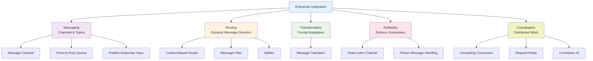

import { useCurrentSidebarCategory } from "@docusaurus/theme-common";

# Enterprise Integration Patterns

Enterprise Integration Patterns (EIP) are proven solutions for connecting heterogeneous systems, applications, and services across distributed networks. They address the fundamental challenges of building loosely-coupled, reliable, scalable systems where components operate asynchronously and independently. These patterns emerged from decades of real-world system integration experiences and formalize approaches that successful enterprises use daily.

Well-designed enterprise systems exhibit these qualities:

- **Loose Coupling**: Applications communicate through defined interfaces, not direct dependencies
- **Reliability**: Messages are guaranteed delivery even when systems temporarily fail
- **Scalability**: Adding processing capacity doesn't require code changes
- **Flexibility**: Systems adapt to new requirements without modifying existing components
- **Visibility**: Operations teams can monitor message flows and system health
- **Recoverability**: Failures are detected and recovery is automatic when possible

## Why Enterprise Integration Patterns Matter

Without EIP, distributed systems suffer predictable failures:

- **Tight Coupling**: A change in one application breaks others
- **Data Loss**: Messages disappear if systems fail during processing
- **Processing Delays**: No visibility into bottlenecks or stuck messages
- **Scaling Limits**: Adding workers requires code changes
- **Duplicate Processing**: No mechanisms to prevent re-processing on retry
- **Complex Error Handling**: Each application implements its own retry logic

Enterprise Integration Patterns eliminate these failures by providing standardized solutions for message-based communication and system coordination.

## Enterprise Integration Pattern Categories

<Figure caption="Enterprise Integration Patterns taxonomy">

</Figure>

### Message Channels

Asynchronous communication backbones that decouple senders from receivers. Channels buffer messages, handle timing mismatches, and enable reliable delivery.

**Point-to-Point (Queue)**: One sender, one receiver. Each message is processed exactly once by exactly one consumer.

**Publish-Subscribe (Topic)**: One sender, many receivers. Each message is delivered to all subscribed consumers independently.

### Routing Patterns

Direct messages to appropriate destinations based on content, type, or rules. Routers enable systems to dynamically adapt to changing business logic.

**Content-Based Router**: Routes messages to different destinations based on message content (header fields, payload values).

**Message Filter**: Selectively processes messages, dropping or passing based on criteria.

**Splitter**: Breaks a single message into multiple messages for parallel processing.

### Transformation Patterns

Adapt message formats between different systems. Translators handle schema differences, protocol conversions, and data enrichment.

### Reliability Patterns

Guarantee message delivery and processing despite failures. Handle poison messages, retries, and error scenarios gracefully.

**Dead Letter Channel**: Routes messages that fail repeatedly to a dead letter queue for manual inspection and recovery.

**Poison Message Handling**: Identifies and isolates messages that consistently cause processing failures.

### Coordination Patterns

Coordinate work across multiple systems. Enable request-reply communication, message correlation, and competing consumer load balancing.

**Competing Consumers**: Multiple processors independently pull messages from a shared queue, naturally balancing load.

**Request-Reply**: Sender waits for a response from the receiver, mimicking synchronous communication over async channels.

**Correlation ID**: Link request and reply messages across systems using unique identifiers.

## How to Use These Articles

Each pattern includes:

- **Clear problem definition** showing the scenario the pattern addresses
- **Detailed mechanisms** explaining how the pattern works
- **Real-world code examples** demonstrating implementation
- **When to apply and when to avoid** for context-specific guidance
- **Common pitfalls** and how to avoid them
- **Configuration considerations** for different platforms
- **Monitoring and observability** approaches

Patterns build on each other but can be studied independently based on your architecture needs.

## Common Misconceptions

**"We just need a message broker; EIP is overkill"** - Message brokers are infrastructure. EIP provides the application-level patterns that make brokers effective.

**"Asynchronous messaging is always slower than RPC"** - Messaging throughput typically exceeds RPC due to batching and decoupling. Latency differs; choose based on requirements.

**"If we implement EIP correctly, systems won't fail"** - EIP helps systems fail gracefully and recover. Failures are inevitable; patterns make them manageable.

**"All messages must be guaranteed delivery"** - Different applications have different requirements. Some can tolerate message loss. EIP provides options for both.

**"Enterprise patterns are only for large systems"** - Even small systems benefit from loose coupling and reliable communication. Start simple and add pattern complexity as needed.

## Quick Reference

| Pattern | Purpose | Trade-off |
|---------|---------|-----------|
| **Message Channel** | Asynchronous communication | Eventual consistency |
| **Point-to-Point Queue** | Reliable 1:1 delivery | Ordering complexity |
| **Publish-Subscribe** | 1:many fan-out | Storage overhead |
| **Content Router** | Dynamic routing | Performance cost |
| **Message Filter** | Selective processing | Dropped messages |
| **Splitter** | Parallel processing | Aggregation complexity |
| **Dead Letter Channel** | Error isolation | Manual recovery |
| **Competing Consumers** | Load balancing | State coordination |
| **Request-Reply** | Sync-like semantics | Temporary coupling |
| **Correlation ID** | Message linking | Complexity |

<DocCardList items={useCurrentSidebarCategory().items} />
