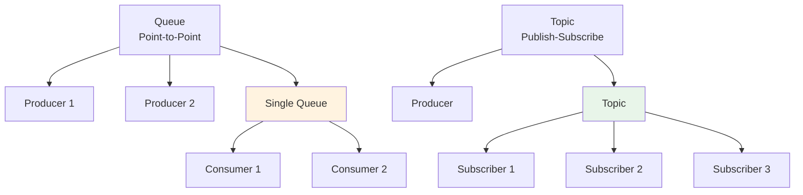

<Hero title="Message Channels, Queues, and Topics" subtitle="Implement asynchronous communication with point-to-point queues and publish-subscribe topics for decoupled systems" imageAlt="illustration" size="large" />

## TL;DR

Message channels decouple senders from receivers through asynchronous messaging. **Queues** (point-to-point) deliver each message to exactly one consumer, providing load distribution and FIFO ordering. **Topics** (publish-subscribe) deliver each message to all subscribers independently, enabling event broadcasting. Choose queues for work distribution, topics for event notification.

## Learning Objectives

You will be able to:
- Understand point-to-point vs. publish-subscribe semantics
- Implement reliable message publishing and consumption
- Design message formats and serialization strategies
- Handle message ordering and delivery guarantees
- Monitor and debug message flows

## Motivating Scenario

An e-commerce platform must notify multiple systems when an order is placed: inventory system needs to decrement stock, fulfillment system needs to pick items, analytics system tracks orders. With tight coupling (direct API calls), changes to one system require updating the order service. With message channels, the order service publishes an event to a topic; subscribers independently consume and process.

## Core Concepts

<Figure caption="Queue vs. Topic messaging patterns">

</Figure>

### Queue Characteristics

- **Exactly Once Delivery**: Each message goes to exactly one consumer
- **Load Distribution**: Multiple consumers share work
- **Ordering**: FIFO (if supported by broker)
- **Use Case**: Work distribution, job queues

### Topic Characteristics

- **Fan-Out Delivery**: Each message goes to all subscribers
- **Independent Processing**: Subscribers work independently
- **Loose Coupling**: Subscribers can be added/removed without changes
- **Use Case**: Event notification, fan-out broadcasting

## Practical Example

<Tabs groupId="lang" queryString>
<TabItem value="python" label="Python">
```python
# Using RabbitMQ-style messaging (pika library pseudocode)
import json
from typing import Callable

class OrderEventBroker:
    def __init__(self):
        # In real implementation, connect to broker (RabbitMQ, NATS, etc.)
        self.subscribers = {}
    
    def publish_order_placed(self, order_id: str, customer_id: str, amount: float):
        """Publish event to topic."""
        event = {
            "event_type": "order.placed",
            "order_id": order_id,
            "customer_id": customer_id,
            "amount": amount,
        }
        
        # In real implementation: send to broker
        print(f"Publishing to topic: {json.dumps(event)}")
        
        # Notify all subscribers
        for callback in self.subscribers.get("order.placed", []):
            callback(event)
    
    def subscribe_to_order_events(self, event_type: str, callback: Callable):
        """Subscribe to event topic."""
        if event_type not in self.subscribers:
            self.subscribers[event_type] = []
        self.subscribers[event_type].append(callback)
        print(f"Subscribed to {event_type}")

# Usage
broker = OrderEventBroker()

# Inventory system subscribes
def on_order_placed_inventory(event):
    print(f"Inventory: Decrementing stock for order {event['order_id']}")

# Fulfillment system subscribes
def on_order_placed_fulfillment(event):
    print(f"Fulfillment: Picking items for order {event['order_id']}")

# Analytics system subscribes
def on_order_placed_analytics(event):
    print(f"Analytics: Recording order amount ${event['amount']}")

broker.subscribe_to_order_events("order.placed", on_order_placed_inventory)
broker.subscribe_to_order_events("order.placed", on_order_placed_fulfillment)
broker.subscribe_to_order_events("order.placed", on_order_placed_analytics)

# Publish event
broker.publish_order_placed("order-123", "customer-456", 99.99)
```
</TabItem>
<TabItem value="go" label="Go">
```go
package main

import (
    "encoding/json"
    "fmt"
)

type OrderPlacedEvent struct {
    EventType  string  `json:"event_type"`
    OrderID    string  `json:"order_id"`
    CustomerID string  `json:"customer_id"`
    Amount     float64 `json:"amount"`
}

type Subscriber func(event OrderPlacedEvent)

type OrderEventBroker struct {
    subscribers map[string][]Subscriber
}

func NewOrderEventBroker() *OrderEventBroker {
    return &OrderEventBroker{
        subscribers: make(map[string][]Subscriber),
    }
}

func (b *OrderEventBroker) PublishOrderPlaced(orderID, customerID string, amount float64) {
    event := OrderPlacedEvent{
        EventType:  "order.placed",
        OrderID:    orderID,
        CustomerID: customerID,
        Amount:     amount,
    }
    
    data, _ := json.Marshal(event)
    fmt.Printf("Publishing to topic: %s\n", string(data))
    
    // Notify all subscribers
    for _, subscriber := range b.subscribers["order.placed"] {
        subscriber(event)
    }
}

func (b *OrderEventBroker) SubscribeToOrderEvents(eventType string, callback Subscriber) {
    b.subscribers[eventType] = append(b.subscribers[eventType], callback)
    fmt.Printf("Subscribed to %s\n", eventType)
}

func main() {
    broker := NewOrderEventBroker()
    
    // Inventory system
    broker.SubscribeToOrderEvents("order.placed", func(e OrderPlacedEvent) {
        fmt.Printf("Inventory: Decrementing stock for order %s\n", e.OrderID)
    })
    
    // Fulfillment system
    broker.SubscribeToOrderEvents("order.placed", func(e OrderPlacedEvent) {
        fmt.Printf("Fulfillment: Picking items for order %s\n", e.OrderID)
    })
    
    // Analytics system
    broker.SubscribeToOrderEvents("order.placed", func(e OrderPlacedEvent) {
        fmt.Printf("Analytics: Recording order amount $%.2f\n", e.Amount)
    })
    
    // Publish event
    broker.PublishOrderPlaced("order-123", "customer-456", 99.99)
}
```
</TabItem>
<TabItem value="nodejs" label="Node.js">
```javascript
class OrderEventBroker {
    constructor() {
        this.subscribers = {};
    }

    publishOrderPlaced(orderId, customerId, amount) {
        const event = {
            eventType: 'order.placed',
            orderId,
            customerId,
            amount,
        };

        console.log(`Publishing to topic: ${JSON.stringify(event)}`);

        // Notify all subscribers
        const callbacks = this.subscribers['order.placed'] || [];
        callbacks.forEach(callback => callback(event));
    }

    subscribeToOrderEvents(eventType, callback) {
        if (!this.subscribers[eventType]) {
            this.subscribers[eventType] = [];
        }
        this.subscribers[eventType].push(callback);
        console.log(`Subscribed to ${eventType}`);
    }
}

// Usage
const broker = new OrderEventBroker();

// Inventory system
broker.subscribeToOrderEvents('order.placed', (event) => {
    console.log(`Inventory: Decrementing stock for order ${event.orderId}`);
});

// Fulfillment system
broker.subscribeToOrderEvents('order.placed', (event) => {
    console.log(`Fulfillment: Picking items for order ${event.orderId}`);
});

// Analytics system
broker.subscribeToOrderEvents('order.placed', (event) => {
    console.log(`Analytics: Recording order amount $${event.amount}`);
});

// Publish event
broker.publishOrderPlaced('order-123', 'customer-456', 99.99);
```
</TabItem>
</Tabs>

## Broker Technologies: Comparison

### RabbitMQ (Traditional Message Broker)

```yaml
Strengths:
  - Durable queues: Messages persisted to disk
  - AMQP protocol: Language-agnostic
  - Flexible routing: Direct, Fanout, Topic exchanges
  - Dead letter queues: Built-in poison message handling

Weaknesses:
  - Not distributed by default (clustering complex)
  - Memory overhead (broker maintains message state)
  - Scaling limited (not designed for massive throughput)

Use Case: Reliable work distribution, enterprise integration
```

### Apache Kafka (Distributed Log)

```yaml
Strengths:
  - Distributed by design: Partitions scale across brokers
  - High throughput: Millions of messages/sec
  - Event log: Complete history of all events
  - Consumer groups: Easy load balancing

Weaknesses:
  - More complex: Multiple brokers, partition management
  - Memory-intensive: Each broker holds partitions
  - Operational overhead: Zookeeper, cluster management

Use Case: Real-time streaming, event sourcing, log aggregation
```

### AWS SQS/SNS (Managed Cloud)

```yaml
Strengths:
  - Fully managed: No operations overhead
  - Scales automatically: Pay per message
  - Integrates with AWS ecosystem
  - Simple HTTP API

Weaknesses:
  - Limited flexibility: Simpler routing model
  - Cost at scale: Expensive for high volume
  - Eventual consistency: No ordering guarantees

Use Case: Cloud-native apps, occasional batch processing
```

## Delivery Guarantees & Trade-offs

### At-Most-Once

Message delivered zero or one times. Fastest but unsafe for critical operations.

```python
# Producer sends, doesn't wait for acknowledgment
def publish_at_most_once(message):
    broker.send(message)  # Fire and forget
```

Use: Analytics, metrics, non-critical telemetry.

### At-Least-Once

Message delivered one or more times. Slower but acceptable if consumers are idempotent.

```python
# Producer retries until broker acknowledges
def publish_at_least_once(message):
    while True:
        try:
            broker.send(message)
            ack = broker.wait_ack(timeout=5)
            if ack:
                break
        except Timeout:
            continue  # Retry
```

Use: Most business operations (payments, orders).

### Exactly-Once

Message delivered exactly once. Hardest to achieve, requires distributed transactions.

```python
# Producer and consumer coordinate via distributed transaction
def process_exactly_once(message_id, data):
    # Store message ID in database within same transaction as processing
    with database.transaction():
        if database.message_processed(message_id):
            return  # Already processed

        process_data(data)
        database.mark_processed(message_id)
```

Use: Critical financial transactions.

## Real-World Example: E-Commerce Order Processing

```python
# Order Service publishes OrderPlaced event
def create_order(user_id, items, shipping_address):
    order = Order.create(user_id, items, shipping_address)
    order.save()

    event = OrderPlacedEvent(
        order_id=order.id,
        user_id=user_id,
        items=items,
        total=order.total,
        timestamp=datetime.now()
    )

    # Publish to topic (all subscribers get notified)
    broker.publish('orders.placed', event)

    return order

# Inventory Service subscribes to orders.placed
def subscribe_inventory_updates():
    def on_order_placed(event):
        # Decrement inventory
        for item in event['items']:
            inventory = Inventory.get(item['product_id'])
            inventory.quantity -= item['quantity']
            inventory.save()

        # Publish InventoryUpdated event for other subscribers
        broker.publish('inventory.updated', {
            'order_id': event['order_id'],
            'items': event['items']
        })

    broker.subscribe('orders.placed', on_order_placed)

# Fulfillment Service also subscribes
def subscribe_fulfillment():
    def on_order_placed(event):
        # Create picking list
        picking_list = PickingList.create(
            order_id=event['order_id'],
            items=event['items'],
            shipping_address=event['shipping_address']
        )
        picking_list.save()

    broker.subscribe('orders.placed', on_order_placed)

# Analytics Service subscribes
def subscribe_analytics():
    def on_order_placed(event):
        analytics.track('order_placed', {
            'order_id': event['order_id'],
            'amount': event['total'],
            'timestamp': event['timestamp']
        })

    broker.subscribe('orders.placed', on_order_placed)
```

Benefits:
- Order Service doesn't know about Inventory, Fulfillment, or Analytics
- New subscribers (e.g., Recommendation Engine) can subscribe without changing Order Service
- All systems process independently; failure in one doesn't block others
- Easy to replay events (e.g., reprocess orders if service was down)

## Advanced Patterns

### Dead Letter Channels

Messages that cause repeated failures are moved to a dead letter queue for inspection.

```python
def process_with_dead_letter(queue_name, max_retries=3):
    message = queue.dequeue(queue_name)

    for attempt in range(max_retries):
        try:
            process(message)
            queue.acknowledge(message)
            return
        except Exception as e:
            if attempt == max_retries - 1:
                # Move to dead letter queue
                queue.send('dead-letter', {
                    'original_message': message,
                    'error': str(e),
                    'failed_at': datetime.now()
                })
            else:
                # Retry with exponential backoff
                time.sleep(2 ** attempt)
```

### Fan-Out with Correlation IDs

Track related messages across multiple systems using correlation IDs.

```python
def publish_with_correlation(parent_message_id, event):
    # Propagate correlation ID through the system
    event['correlation_id'] = parent_message_id
    broker.publish('events', event)

def log_with_correlation(correlation_id, message):
    # All logs for this flow have same correlation ID
    logger.info(f"[{correlation_id}] {message}")
```

Use: Distributed tracing, debugging request flows through microservices.

## When to Use / When Not to Use

**Use Queues when:**
- Work must be processed by exactly one handler
- Load balancing across workers is needed
- FIFO ordering is required
- Retries and dead letters are important

**Use Topics when:**
- Events must be broadcast to many subscribers
- Subscribers are independent and evolve separately
- New subscribers should start seeing future events
- Fanout is needed

**Avoid when:**
- Synchronous request-response is required
- Message ordering across multiple consumers matters
- Real-time latency is critical (under 100ms, may use direct calls instead)

## Patterns and Pitfalls

### Pitfall: Lost Messages

If the broker crashes before persisting a message, it's lost. Use durable/persistent brokers with acknowledgments.

### Pitfall: Unbounded Message Growth

Topic grows indefinitely. Implement retention policies (e.g., keep 7 days of messages).

### Pattern: Idempotent Consumers

Consumers should be idempotent (same message processed multiple times yields same result). Enables safe retries without duplicates.

### Pattern: Message Versioning

As event schemas evolve, subscribers must handle multiple versions.

```python
def process_order_event(event):
    if event.get('schema_version') == 1:
        # Old format: user_id instead of customer_id
        user_id = event['user_id']
    elif event.get('schema_version') == 2:
        # New format: customer_id
        user_id = event['customer_id']
    else:
        raise ValueError(f"Unknown schema version: {event.get('schema_version')}")
```

## Design Review Checklist

- [ ] Message schema is documented
- [ ] Serialization format chosen (JSON, Protobuf, Avro)
- [ ] Ordering requirements are explicit
- [ ] Consumers are idempotent
- [ ] Delivery guarantees match requirements (at-most-once, at-least-once, exactly-once)
- [ ] Monitoring/observability for message flow
- [ ] Retention/TTL policies for messages
- [ ] Dead letter channels configured
- [ ] Correlation IDs propagated for tracing
- [ ] Message versioning strategy documented
- [ ] Consumer failure handling (retry, backoff, dead letter)
- [ ] Performance tested under load

## Self-Check

1. **Should you use a queue or topic for user registration events?** Topic (broadcast to email, SMS, analytics systems).
2. **What happens if a consumer crashes before acknowledging a message?** Message is redelivered to another consumer (at-least-once guarantee).
3. **How do you ensure consumers process the same message idempotently?** Store message ID with result; skip processing if already seen.
4. **Why use correlation IDs?** To trace a business operation across multiple services and systems.

:::info One Takeaway
Message channels decouple systems through asynchronous communication. Queues distribute work to one consumer; topics broadcast events to many. Match the channel type to your communication pattern. Design for idempotency and visibility.

:::

## Next Steps

- Learn [Content-Based Router](/docs/design-patterns/enterprise-integration-patterns/content-based-router-message-filter) for dynamic routing
- Study [Dead Letter Channel](/docs/design-patterns/enterprise-integration-patterns/dead-letter-channel-poison-message-handling) for reliability
- Explore [Competing Consumers](/docs/design-patterns/enterprise-integration-patterns/competing-consumers-pub-sub) for load balancing
- Review **Event Sourcing** for complete event history

## Complex Example: Multi-Service Saga

```python
# Order processing across multiple services using events
# Demonstrates coordination, eventual consistency, and saga pattern

class OrderService:
    """Manages orders."""
    def create_order(self, customer_id, items):
        order = Order.create(customer_id=customer_id, items=items)
        order.save()

        # Publish event for other services to react
        broker.publish('orders.created', {
            'order_id': order.id,
            'customer_id': customer_id,
            'items': items,
            'timestamp': datetime.now().isoformat()
        })

        return order

class PaymentService:
    """Processes payments."""
    def __init__(self, broker):
        self.broker = broker
        # Subscribe to order created events
        broker.subscribe('orders.created', self.on_order_created)

    def on_order_created(self, event):
        try:
            # Process payment
            charge_result = self.charge_customer(
                customer_id=event['customer_id'],
                amount=self.calculate_amount(event['items'])
            )

            # Publish payment success
            self.broker.publish('payments.completed', {
                'order_id': event['order_id'],
                'charge_id': charge_result.id,
                'amount': charge_result.amount
            })
        except PaymentFailedError:
            # Payment failed, publish event for compensating transactions
            self.broker.publish('payments.failed', {
                'order_id': event['order_id'],
                'reason': 'insufficient_funds'
            })

class FulfillmentService:
    """Handles shipping."""
    def __init__(self, broker):
        self.broker = broker
        # Subscribe to payment success (don't start until paid)
        broker.subscribe('payments.completed', self.on_payment_completed)

    def on_payment_completed(self, event):
        try:
            # Create shipping order
            shipment = self.create_shipment(order_id=event['order_id'])

            self.broker.publish('shipments.created', {
                'order_id': event['order_id'],
                'shipment_id': shipment.id,
                'tracking_number': shipment.tracking_number
            })
        except ShippingError:
            # Couldn't create shipment, notify for manual resolution
            self.broker.publish('shipments.failed', {
                'order_id': event['order_id'],
                'reason': 'out_of_stock'
            })

class CompensationService:
    """Handles failures and reversals."""
    def __init__(self, broker):
        self.broker = broker
        broker.subscribe('payments.failed', self.compensate_order)
        broker.subscribe('shipments.failed', self.compensate_order)

    def compensate_order(self, event):
        # Reverse previous steps
        order_id = event['order_id']

        # 1. Cancel payment if not already done
        payment = Payment.find(order_id=order_id, status='completed')
        if payment:
            payment.refund()

        # 2. Cancel shipment if created
        shipment = Shipment.find(order_id=order_id, status='created')
        if shipment:
            shipment.cancel()

        # 3. Update order status
        order = Order.find(id=order_id)
        order.status = OrderStatus.FAILED
        order.save()

        # Notify customer
        self.broker.publish('orders.failed', {
            'order_id': order_id,
            'reason': event.get('reason')
        })

# Usage:
broker = MessageBroker()
order_svc = OrderService()
payment_svc = PaymentService(broker)
fulfillment_svc = FulfillmentService(broker)
compensation_svc = CompensationService(broker)

# Flow:
# 1. Create order
order_svc.create_order('cust-123', [{'product_id': 1, 'qty': 2}])
# → Publishes orders.created

# 2. Payment service reacts
# → Processes payment → Publishes payments.completed (or payments.failed)

# 3. Fulfillment service reacts (if payment succeeded)
# → Creates shipment → Publishes shipments.created (or shipments.failed)

# 4. If any step fails, compensation service handles rollback
# → Refunds, cancels shipment, updates order status
```

This pattern ensures:
- **Loose coupling**: Services don't call each other directly
- **Eventual consistency**: All services eventually process events
- **Resilience**: Failures can be handled with compensating transactions
- **Observability**: Event log shows full order journey

## References

1. "Enterprise Integration Patterns" by Gregor Hohpe and Bobby Woolf
2. "Building Microservices" by Sam Newman - Chapter on integration patterns
3. "Designing Data-Intensive Applications" by Martin Kleppmann - Chapters on messaging and event sourcing
4. "Pattern: Saga" by Chris Richardson
5. "Event-Driven Architecture" by O'Reilly
