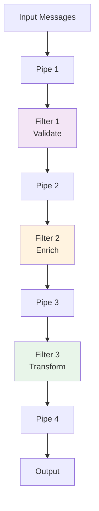

<Hero title="Pipes and Filters Pattern" subtitle="Process messages through a chain of independent processing stages (filters) connected by data flows (pipes)" imageAlt="illustration" size="large" />

## TL;DR

Pipes and Filters decomposes complex message processing into independent stages (filters) connected by message flows (pipes). Each filter performs one transformation, outputs to the next pipe, which feeds the next filter. This enables composability, parallelism (filters run concurrently on different messages), and reusability (filters can be recombined in different orders).

## Learning Objectives

You will be able to:
- Design processing pipelines using independent filters
- Implement filters that are reusable and composable
- Parallelize filter processing across messages
- Handle errors and backpressure in pipelines
- Debug and monitor multi-stage processing

## Motivating Scenario

An image processing service must: resize, watermark, compress, and store images. Without Pipes and Filters, you'd write one monolithic function handling all steps. With the pattern, each step is an independent filter: ResizeFilter → WatermarkFilter → CompressFilter → StorageFilter. Filters can be reordered, replaced, or added without touching others.

## Core Concepts

<Figure caption="Pipes and Filters processing pipeline">

</Figure>

## Practical Example

<Tabs groupId="lang" queryString>
<TabItem value="python" label="Python">
```python
from abc import ABC, abstractmethod
from typing import Any, List
import json

class Filter(ABC):
    """Base filter in the pipeline."""
    
    @abstractmethod
    def execute(self, message: Any) -> Any:
        pass

class ValidateFilter(Filter):
    """Validate message format."""
    def execute(self, message: dict) -> dict:
        if not message.get("order_id"):
            raise ValueError("Missing order_id")
        return message

class EnrichFilter(Filter):
    """Add order details."""
    def execute(self, message: dict) -> dict:
        message["enriched_at"] = "2025-09-10T10:00:00Z"
        message["total"] = message.get("amount", 0) * 1.1  # Add tax
        return message

class TransformFilter(Filter):
    """Transform to output format."""
    def execute(self, message: dict) -> dict:
        return {
            "id": message["order_id"],
            "total": message["total"],
            "status": "processed",
        }

class Pipeline:
    """Orchestrate filters in sequence."""
    
    def __init__(self, filters: List[Filter]):
        self.filters = filters
    
    def process(self, messages: List[dict]) -> List[dict]:
        results = []
        for message in messages:
            try:
                result = message
                for filter in self.filters:
                    result = filter.execute(result)
                results.append(result)
            except Exception as e:
                print(f"Error processing {message}: {e}")
        return results

# Usage
pipeline = Pipeline([
    ValidateFilter(),
    EnrichFilter(),
    TransformFilter(),
])

orders = [
    {"order_id": "ORD-001", "amount": 99.99},
    {"order_id": "ORD-002", "amount": 49.99},
]

processed = pipeline.process(orders)
for order in processed:
    print(json.dumps(order))
```
</TabItem>
<TabItem value="go" label="Go">
```go
package main

import (
    "fmt"
    "time"
)

type Order struct {
    OrderID  string
    Amount   float64
    EnrichedAt string
    Total    float64
    Status   string
}

type Filter interface {
    Execute(order Order) (Order, error)
}

type ValidateFilter struct{}

func (f ValidateFilter) Execute(order Order) (Order, error) {
    if order.OrderID == "" {
        return order, fmt.Errorf("missing order_id")
    }
    return order, nil
}

type EnrichFilter struct{}

func (f EnrichFilter) Execute(order Order) (Order, error) {
    order.EnrichedAt = time.Now().Format(time.RFC3339)
    order.Total = order.Amount * 1.1 // Add tax
    return order, nil
}

type TransformFilter struct{}

func (f TransformFilter) Execute(order Order) (Order, error) {
    order.Status = "processed"
    return order, nil
}

type Pipeline struct {
    filters []Filter
}

func NewPipeline(filters ...Filter) *Pipeline {
    return &Pipeline{filters: filters}
}

func (p *Pipeline) Process(orders []Order) []Order {
    var results []Order
    
    for _, order := range orders {
        result := order
        for _, filter := range p.filters {
            var err error
            result, err = filter.Execute(result)
            if err != nil {
                fmt.Printf("Error: %v\n", err)
                continue
            }
        }
        results = append(results, result)
    }
    
    return results
}

func main() {
    pipeline := NewPipeline(
        ValidateFilter{},
        EnrichFilter{},
        TransformFilter{},
    )
    
    orders := []Order{
        {OrderID: "ORD-001", Amount: 99.99},
        {OrderID: "ORD-002", Amount: 49.99},
    }
    
    processed := pipeline.Process(orders)
    for _, order := range processed {
        fmt.Printf("Order %s: $%.2f (%s)\n", order.OrderID, order.Total, order.Status)
    }
}
```
</TabItem>
<TabItem value="nodejs" label="Node.js">
```javascript
class Filter {
    async execute(message) {
        throw new Error('execute() must be implemented');
    }
}

class ValidateFilter extends Filter {
    async execute(message) {
        if (!message.orderId) {
            throw new Error('Missing orderId');
        }
        return message;
    }
}

class EnrichFilter extends Filter {
    async execute(message) {
        return {
            ...message,
            enrichedAt: new Date().toISOString(),
            total: (message.amount || 0) * 1.1, // Add tax
        };
    }
}

class TransformFilter extends Filter {
    async execute(message) {
        return {
            id: message.orderId,
            total: message.total,
            status: 'processed',
        };
    }
}

class Pipeline {
    constructor(filters) {
        this.filters = filters;
    }

    async process(messages) {
        const results = [];
        
        for (const message of messages) {
            try {
                let result = message;
                for (const filter of this.filters) {
                    result = await filter.execute(result);
                }
                results.push(result);
            } catch (error) {
                console.error(`Error processing ${message.orderId}: ${error.message}`);
            }
        }
        
        return results;
    }
}

// Usage
const pipeline = new Pipeline([
    new ValidateFilter(),
    new EnrichFilter(),
    new TransformFilter(),
]);

const orders = [
    { orderId: 'ORD-001', amount: 99.99 },
    { orderId: 'ORD-002', amount: 49.99 },
];

pipeline.process(orders).then(processed => {
    processed.forEach(order => console.log(JSON.stringify(order)));
});
```
</TabItem>
</Tabs>

## When to Use / When Not to Use

**Use Pipes and Filters when:**
- Message processing involves multiple sequential transformations
- Stages are independently testable and reusable
- Different messages may need different filter chains
- Parallelism is beneficial (different messages through different stages)

**Avoid when:**
- Processing logic is tightly coupled across stages
- Single monolithic function is simpler
- Ordering constraints make decomposition difficult

## Patterns and Pitfalls

### Pitfall: Synchronous Cascading

If filters call each other synchronously, you get sequential processing with no parallelism. Use message-based pipelines (queues between filters) for true parallelism.

### Pattern: Error Handling Per Stage

Some filters should be tolerant of errors; others should fail fast. Make this explicit.

## Design Review Checklist

- [ ] Each filter has a single responsibility
- [ ] Filters are independent and reusable
- [ ] Error handling per filter is explicit
- [ ] Input/output schema of each filter is documented
- [ ] Backpressure is handled (slow filters don't overwhelm upstream)
- [ ] Monitoring/logging at each pipeline stage
- [ ] Filter ordering is flexible or configurable

## Backpressure and Flow Control

When a fast producer feeds a slow consumer, the pipeline can overflow. Backpressure mechanisms prevent this:

### Backpressure Strategies

1. **Blocking (Synchronous)**: Producer waits if queue is full
```python
queue.put(item)  # Blocks if queue size > max_size
```

2. **Buffering (Asynchronous)**: Queue grows; producer never blocks
```python
queue.put_nowait(item)  # Returns immediately, queue can overflow
```

3. **Adaptive (Hybrid)**: Buffer up to limit, then block
```python
queue.put(item, block=True, timeout=5)
# Waits 5 seconds, then raises Full exception
```

### Handling Slow Filters

```python
class Pipeline:
    def process(self, messages):
        for message in messages:
            # Add timeout to detect slow filters
            try:
                result = message
                for filter in self.filters:
                    start = time.time()
                    result = filter.execute(result)
                    elapsed = time.time() - start

                    if elapsed > filter.timeout:
                        logger.warning(
                            f"Slow filter: {filter.__class__.__name__} "
                            f"took {elapsed:.2f}s"
                        )
            except Exception as e:
                logger.error(f"Filter error: {e}")

# Identify bottleneck filters and optimize them
```

## Testing Pipes and Filters

```python
# Unit test each filter independently
def test_validate_filter():
    f = ValidateFilter()
    # Valid message
    assert f.execute({"order_id": "123"}) == {"order_id": "123"}
    # Invalid message
    with pytest.raises(ValueError):
        f.execute({})  # Missing order_id

# Integration test pipeline with test data
def test_pipeline():
    pipeline = Pipeline([
        ValidateFilter(),
        EnrichFilter(),
        TransformFilter(),
    ])
    result = pipeline.process([
        {"order_id": "ORD-001", "amount": 100}
    ])
    assert result[0]["status"] == "processed"

# Test error handling
def test_pipeline_error_handling():
    pipeline = Pipeline([
        BrokenFilter(),  # Raises exception
        ValidateFilter(),
    ])
    result = pipeline.process([
        {"order_id": "ORD-001"}
    ])
    # Should skip broken message, continue with others
    assert len(result) == 0  # Bad message skipped
```

## Self-Check

1. **Can you reorder filters without breaking the pipeline?** Only if they're truly independent.
2. **What happens if one filter is significantly slower?** Backpressure causes upstream buffering or blocking.
3. **How do you test filters in isolation?** Unit test each filter with mock/real data.
4. **What's the longest processing path through your pipeline?** Critical for understanding performance.
5. **How would you add error recovery to a pipeline?** Retry filters or skip bad messages.

:::info One Takeaway
Pipes and Filters decompose complex processing into independent, reusable stages. Each filter transforms messages and passes to the next, enabling flexibility and parallelism. Design for backpressure and test each filter independently.

:::

## Next Steps

- Learn [Splitter](/docs/design-patterns/enterprise-integration-patterns/splitter-aggregator-resequencer) for decomposing complex messages
- Study [Message Channels](/docs/design-patterns/enterprise-integration-patterns/message-channel-queue-topic) for inter-filter communication
- Explore stream processing frameworks like Kafka Streams or Apache Flink

## Parallel Processing with Pipes and Filters

### Multi-threaded Pipeline
```python
import threading
from queue import Queue

class ParallelPipeline:
    def __init__(self, filters):
        self.filters = filters
        self.queues = [Queue() for _ in range(len(filters) + 1)]

    def process(self, messages):
        # Create thread for each filter
        threads = []
        for i, filter in enumerate(self.filters):
            t = threading.Thread(
                target=self._filter_worker,
                args=(filter, self.queues[i], self.queues[i+1])
            )
            t.start()
            threads.append(t)

        # Feed messages into first queue
        for message in messages:
            self.queues[0].put(message)

        # Signal end of input
        for _ in self.filters:
            self.queues[0].put(None)

        # Wait for all to complete
        for t in threads:
            t.join()

        # Collect results from last queue
        results = []
        while True:
            result = self.queues[-1].get()
            if result is None:
                break
            results.append(result)

        return results

    def _filter_worker(self, filter, input_queue, output_queue):
        while True:
            message = input_queue.get()
            if message is None:
                output_queue.put(None)
                break

            try:
                result = filter.execute(message)
                output_queue.put(result)
            except Exception as e:
                logger.error(f"Filter error: {e}")

# Benefits:
# - Filter 1 processes message A while Filter 2 processes message B
# - Parallelism without explicit coordination
# - Each filter isolated in its own thread
```

### Handling Back pressure
```python
class BackpressurePipeline:
    def __init__(self, filters, max_queue_size=100):
        self.filters = filters
        self.queues = [
            Queue(maxsize=max_queue_size)
            for _ in range(len(filters) + 1)
        ]

    def _filter_worker(self, filter, input_queue, output_queue):
        while True:
            message = input_queue.get()
            if message is None:
                output_queue.put(None)
                break

            try:
                result = filter.execute(message)
                # Backpressure: wait if output queue full
                output_queue.put(result, block=True, timeout=30)
            except Exception as e:
                logger.error(f"Filter error: {e}")
                # Could also retry or send to error queue

# When output queue full:
# - put() blocks until space available
# - Upstream filter naturally slows down
# - Prevents memory exhaustion
```

## Comparing Pipes and Filters to Other Approaches

| Approach | Use Case | Pros | Cons |
|----------|----------|------|------|
| **Pipes and Filters** | Sequential transformations | Composable, testable, parallel | Overhead, complex coordination |
| **Direct function calls** | Simple, linear processing | Fast, simple | Hard to reuse, test |
| **Map/Reduce** | Distributed batch processing | Scalable, fault-tolerant | Overkill for small data |
| **Message Queues** | Asynchronous workflows | Loose coupling, resilient | Complex debugging, eventual consistency |
| **Monolithic function** | Critical path | Fast | Hard to maintain, extend |

## Real-World Pipes and Filters: ETL Pipelines

```yaml
ETL (Extract, Transform, Load) Pipeline Example:

Extract:
  - Read from database
  - Read from API
  - Read from files

Transform:
  - Validate data
  - Clean data (remove duplicates, handle nulls)
  - Normalize formats
  - Enrich (add derived fields)
  - Filter (remove non-matching)

Load:
  - Write to data warehouse
  - Write to cache
  - Write to search index
  - Trigger notifications

Pipelines and Filters ideal for ETL because:
- Each stage independent and testable
- Can parallelize: different records at different stages
- Can swap implementations: change data source without affecting transform
- Can reorder: add new validation before load
- Can branch: some records to cache, others to warehouse
```

## References

1. "Enterprise Integration Patterns" by Gregor Hohpe and Bobby Woolf
2. "The Art of Readable Code" - Chapter on modularity
3. Apache Beam Documentation on Pipeline Design
4. Kafka Streams: Processing Topology Examples
