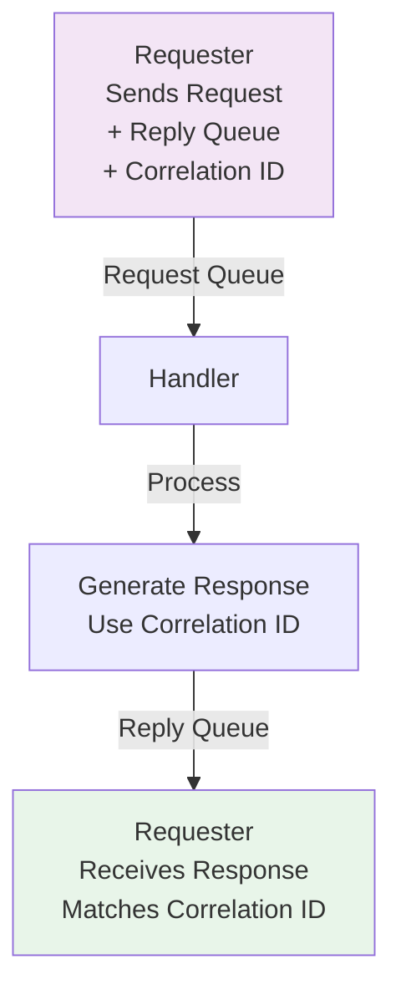

<Hero title="Request-Reply and Correlation ID" subtitle="Implement synchronous request-response semantics over asynchronous messaging channels" imageAlt="illustration" size="large" />

## TL;DR

**Request-Reply** implements synchronous semantics (caller waits for response) using asynchronous messaging. Sender includes a reply queue address and correlation ID. Receiver processes the request and sends a response to the reply queue. **Correlation ID** is a unique identifier linking requests to their corresponding replies, enabling matching in systems with concurrent requests.

## Learning Objectives

You will be able to:
- Implement request-reply patterns on async messaging
- Use correlation IDs to match requests and responses
- Handle timeouts and missing responses
- Manage temporary reply queues
- Debug request-reply issues

## Motivating Scenario

A service must call another service for data (e.g., pricing service) but wants to use async messaging for decoupling and reliability. Rather than direct RPC calls, the service sends a request message with a reply queue address. The pricing service responds on that queue. The requester waits (with timeout) for the response on its reply queue.

## Core Concepts

<Figure caption="Request-Reply with Correlation ID">

</Figure>

## Practical Example

<Tabs groupId="lang" queryString>
<TabItem value="python" label="Python">
```python
import json
import time
import uuid
from typing import Dict, Optional
import threading

class RequestReplyService:
    def __init__(self):
        self.pending_requests = {}  # corr_id -> result
        self.reply_queues = {}  # requester_id -> results
    
    def send_request(self, service_name: str, data: Dict, timeout: float = 5.0) -> Optional[Dict]:
        """Send request and wait for reply."""
        correlation_id = str(uuid.uuid4())
        requester_id = f"requester-{threading.current_thread().ident}"
        
        # Create request
        request = {
            "correlation_id": correlation_id,
            "reply_queue": requester_id,
            "service": service_name,
            "data": data,
        }
        
        # Register pending request
        self.pending_requests[correlation_id] = None
        
        print(f"Sending request {correlation_id} to {service_name}")
        
        # Simulate sending to service queue
        # In real system: send to message broker
        self._handle_request(request)
        
        # Wait for reply with timeout
        start = time.time()
        while time.time() - start < timeout:
            if correlation_id in self.pending_requests and self.pending_requests[correlation_id] is not None:
                response = self.pending_requests[correlation_id]
                del self.pending_requests[correlation_id]
                return response
            time.sleep(0.01)
        
        print(f"Request {correlation_id} TIMEOUT")
        return None
    
    def _handle_request(self, request: Dict):
        """Simulate service handling request."""
        corr_id = request["correlation_id"]
        reply_queue = request["reply_queue"]
        
        # Simulate processing
        result = {"status": "success", "data": "response_value"}
        
        # Send reply back to requester's queue
        reply = {
            "correlation_id": corr_id,
            "result": result,
        }
        
        print(f"Service: Sending reply {corr_id} to {reply_queue}")
        self._deliver_reply(reply)
    
    def _deliver_reply(self, reply: Dict):
        """Deliver reply to requester."""
        corr_id = reply["correlation_id"]
        self.pending_requests[corr_id] = reply["result"]

# Usage
service = RequestReplyService()
response = service.send_request("pricing-service", {"item_id": "ITEM-123"}, timeout=5.0)
print(f"Response: {response}")
```
</TabItem>
<TabItem value="go" label="Go">
```go
package main

import (
    "fmt"
    "time"
    "sync"
    "github.com/google/uuid"
)

type RequestReplyService struct {
    pendingRequests map[string]chan interface{}
    mu              sync.Mutex
}

func NewRequestReplyService() *RequestReplyService {
    return &RequestReplyService{
        pendingRequests: make(map[string]chan interface{}),
    }
}

func (rs *RequestReplyService) SendRequest(serviceName string, timeout time.Duration) interface{} {
    corrID := uuid.New().String()
    
    // Create channel for receiving response
    responseChan := make(chan interface{}, 1)
    
    rs.mu.Lock()
    rs.pendingRequests[corrID] = responseChan
    rs.mu.Unlock()
    
    fmt.Printf("Sending request %s to %s\n", corrID, serviceName)
    
    // Simulate sending to service
    go rs.handleRequest(corrID)
    
    // Wait for response with timeout
    select {
    case response := <-responseChan:
        fmt.Printf("Received response for %s\n", corrID)
        return response
    case <-time.After(timeout):
        fmt.Printf("Request %s TIMEOUT\n", corrID)
        return nil
    }
}

func (rs *RequestReplyService) handleRequest(corrID string) {
    // Simulate processing
    time.Sleep(100 * time.Millisecond)
    
    response := map[string]interface{}{
        "status": "success",
        "data":   "response_value",
    }
    
    rs.mu.Lock()
    defer rs.mu.Unlock()
    
    if ch, ok := rs.pendingRequests[corrID]; ok {
        ch <- response
        delete(rs.pendingRequests, corrID)
    }
}

func main() {
    service := NewRequestReplyService()
    response := service.SendRequest("pricing-service", 5*time.Second)
    fmt.Printf("Response: %v\n", response)
}
```
</TabItem>
<TabItem value="nodejs" label="Node.js">
```javascript
const { randomUUID } = require('crypto');

class RequestReplyService {
    constructor() {
        this.pendingRequests = new Map();
    }

    async sendRequest(serviceName, data, timeout = 5000) {
        const correlationId = randomUUID();
        
        const request = {
            correlationId,
            replyQueue: `requester-${process.pid}`,
            service: serviceName,
            data,
        };

        // Create promise for response
        const responsePromise = new Promise((resolve, reject) => {
            this.pendingRequests.set(correlationId, { resolve, reject });
            
            // Set timeout
            setTimeout(() => {
                if (this.pendingRequests.has(correlationId)) {
                    this.pendingRequests.delete(correlationId);
                    reject(new Error(`Request ${correlationId} TIMEOUT`));
                }
            }, timeout);
        });

        console.log(`Sending request ${correlationId} to ${serviceName}`);
        
        // Simulate sending to service
        this.handleRequest(request);
        
        return responsePromise;
    }

    async handleRequest(request) {
        const { correlationId } = request;
        
        // Simulate processing
        await new Promise(resolve => setTimeout(resolve, 100));
        
        const reply = {
            correlationId,
            result: { status: 'success', data: 'response_value' },
        };

        console.log(`Service: Sending reply ${correlationId}`);
        this.deliverReply(reply);
    }

    deliverReply(reply) {
        const { correlationId, result } = reply;
        
        if (this.pendingRequests.has(correlationId)) {
            const { resolve } = this.pendingRequests.get(correlationId);
            this.pendingRequests.delete(correlationId);
            resolve(result);
        }
    }
}

// Usage
(async () => {
    const service = new RequestReplyService();
    try {
        const response = await service.sendRequest('pricing-service', { itemId: 'ITEM-123' }, 5000);
        console.log(`Response: ${JSON.stringify(response)}`);
    } catch (error) {
        console.error(`Error: ${error.message}`);
    }
})();
```
</TabItem>
</Tabs>

## When to Use / When Not to Use

**Use Request-Reply when:**
- Caller needs a response before proceeding
- Async messaging is preferred for decoupling and reliability
- Asynchronous RPC semantics are acceptable
- Timeouts are manageable

**Avoid when:**
- True fire-and-forget is needed
- Caller doesn't need/use the response
- Synchronous RPC is simpler and acceptable

## Patterns and Pitfalls

### Pitfall: Orphaned Replies

If correlatio ID is lost or incorrectly matched, replies pile up. Always clean up expired pending requests.

### Pattern: Unique Correlation IDs

Use UUIDs or sequences that guarantee uniqueness across concurrent requests.

## Design Review Checklist

- [ ] Correlation IDs are unique
- [ ] Timeouts are configured and enforced
- [ ] Orphaned replies are cleaned up
- [ ] Reply queues are properly created and destroyed
- [ ] Error replies are handled
- [ ] Monitoring tracks pending request count

## Advanced Patterns

### Request-Reply with Message Expiration

Prevent stale requests from cluttering the system:

```python
import time
from dataclasses import dataclass
from typing import Dict, Optional

@dataclass
class PendingRequest:
    correlation_id: str
    created_at: float
    timeout: float
    result: Optional[dict] = None

class RequestReplyServiceWithExpiration:
    def __init__(self, cleanup_interval: float = 60.0):
        self.pending_requests: Dict[str, PendingRequest] = {}
        self.cleanup_interval = cleanup_interval
        self.last_cleanup = time.time()

    def cleanup_expired(self):
        """Remove requests that have exceeded timeout."""
        now = time.time()
        if now - self.last_cleanup < self.cleanup_interval:
            return

        expired = [
            corr_id for corr_id, req in self.pending_requests.items()
            if now - req.created_at > req.timeout
        ]

        for corr_id in expired:
            del self.pending_requests[corr_id]
            print(f"Cleaned up expired request: {corr_id}")

        self.last_cleanup = now

    def send_request(self, service_name: str, data: dict, timeout: float = 5.0):
        """Send request with automatic cleanup."""
        import uuid
        correlation_id = str(uuid.uuid4())

        self.pending_requests[correlation_id] = PendingRequest(
            correlation_id=correlation_id,
            created_at=time.time(),
            timeout=timeout
        )

        print(f"Sending request {correlation_id} to {service_name}")

        # Simulate async processing
        self._deliver_reply({
            "correlation_id": correlation_id,
            "result": {"status": "success"}
        })

        # Wait for response
        start = time.time()
        while time.time() - start < timeout:
            self.cleanup_expired()
            req = self.pending_requests.get(correlation_id)
            if req and req.result:
                del self.pending_requests[correlation_id]
                return req.result
            time.sleep(0.01)

        # Timeout
        del self.pending_requests[correlation_id]
        return None

    def _deliver_reply(self, reply: dict):
        corr_id = reply["correlation_id"]
        if corr_id in self.pending_requests:
            self.pending_requests[corr_id].result = reply["result"]
```

### Request-Reply with Circuit Breaker

Prevent cascading failures by failing fast when service is down:

```python
from enum import Enum
import time

class CircuitState(Enum):
    CLOSED = "closed"         # Normal operation
    OPEN = "open"             # Fail fast, don't call service
    HALF_OPEN = "half_open"   # Testing if service recovered

class RequestReplyWithCircuitBreaker:
    def __init__(self, failure_threshold: int = 5, timeout: float = 60.0):
        self.failure_count = 0
        self.failure_threshold = failure_threshold
        self.state = CircuitState.CLOSED
        self.last_failure_time = None
        self.timeout = timeout

    def send_request(self, service_name: str, data: dict):
        """Send request with circuit breaker protection."""
        # Check circuit state
        if self.state == CircuitState.OPEN:
            if time.time() - self.last_failure_time > self.timeout:
                self.state = CircuitState.HALF_OPEN
                print(f"Circuit HALF_OPEN: Testing {service_name}")
            else:
                raise Exception(f"Circuit OPEN: {service_name} unavailable")

        try:
            # Attempt request
            result = self._make_request(service_name, data)
            if self.state == CircuitState.HALF_OPEN:
                self.state = CircuitState.CLOSED
                self.failure_count = 0
                print(f"Circuit CLOSED: {service_name} recovered")
            return result
        except Exception as e:
            self.failure_count += 1
            self.last_failure_time = time.time()

            if self.failure_count >= self.failure_threshold:
                self.state = CircuitState.OPEN
                print(f"Circuit OPEN: {service_name} failed {self.failure_count} times")

            raise

    def _make_request(self, service_name: str, data: dict):
        # Simulate request
        return {"status": "success"}
```

### Correlation IDs for Distributed Tracing

Track requests across multiple services:

```python
import uuid
import json
from typing import Dict, List

class DistributedTracingContext:
    """Context for tracking request flow across services."""

    def __init__(self):
        self.correlation_id = str(uuid.uuid4())
        self.trace_id = str(uuid.uuid4())
        self.span_stack: List[str] = []

    def start_span(self, operation_name: str) -> str:
        """Create new span for operation."""
        span_id = str(uuid.uuid4())
        self.span_stack.append(span_id)
        return span_id

    def end_span(self):
        """End current span."""
        if self.span_stack:
            self.span_stack.pop()

    def to_headers(self) -> Dict[str, str]:
        """Convert context to HTTP headers for propagation."""
        return {
            "X-Correlation-ID": self.correlation_id,
            "X-Trace-ID": self.trace_id,
            "X-Span-ID": self.span_stack[-1] if self.span_stack else ""
        }

    def log_event(self, event: str, details: dict):
        """Log event with full context."""
        print(json.dumps({
            "timestamp": "2025-02-14T10:00:00Z",
            "correlation_id": self.correlation_id,
            "trace_id": self.trace_id,
            "span_id": self.span_stack[-1] if self.span_stack else "",
            "event": event,
            "details": details
        }))

# Usage
context = DistributedTracingContext()
context.start_span("checkout")
context.log_event("order_created", {"order_id": "ORD-123"})
headers = context.to_headers()
# Headers propagated to downstream services
context.end_span()
```

## Timing and Performance Considerations

Request-Reply latency breakdown for typical scenario:

| Component | Typical Latency |
|-----------|-----------------|
| Network roundtrip | 10-50ms |
| Serialization | 1-5ms |
| Service processing | 50-500ms |
| Deserialization | 1-5ms |
| **Total** | **60-560ms** |

For comparison, direct RPC calls (REST) have similar latency but without the messaging overhead. Request-Reply is valuable for decoupling, not speed.

## Common Pitfalls and Solutions

**Pitfall: No timeout handling**
- Solution: Always set reasonable timeouts (5-30 seconds depending on operation)

**Pitfall: Unbounded pending requests**
- Solution: Implement automatic cleanup of expired requests

**Pitfall: Lost replies**
- Solution: Use durable message queues with persistence and replication

**Pitfall: Correlation ID collision**
- Solution: Use UUID v4 or similar guaranteed-unique identifiers

**Pitfall: Synchronous waiting in request-reply**
- Solution: Use this pattern only when response is actually needed synchronously; otherwise use one-way messaging

## Self-Check

1. **How do you match a reply to its request?** Via unique correlation IDs that flow through request and response messages.

2. **What happens if the reply queue doesn't exist?** The request times out. Ensure reply queues are created before requests are sent.

3. **How do you prevent orphaned replies?** Implement automatic cleanup of expired pending requests based on timeout duration.

4. **When should you use circuit breakers with request-reply?** When calling potentially failing services to prevent cascading failures.

5. **How do correlation IDs help in distributed systems?** They allow tracking of a single logical request across multiple services for debugging and monitoring.

:::info One Takeaway
Request-Reply implements synchronous semantics over async messaging using correlation IDs. Always include correlation IDs and timeout handling to match requests to replies reliably. Add circuit breakers and expiration cleanup for production robustness.

:::

## Next Steps

- Learn [Message Channels](/docs/design-patterns/enterprise-integration-patterns/message-channel-queue-topic) for implementing reply queues
- Study [Dead Letter Channel](/docs/design-patterns/enterprise-integration-patterns/dead-letter-channel-poison-message-handling) for handling failed requests
- Explore timeout and retry strategies in distributed systems

## References

1. "Enterprise Integration Patterns" by Gregor Hohpe and Bobby Woolf
2. "Building Microservices" by Sam Newman
