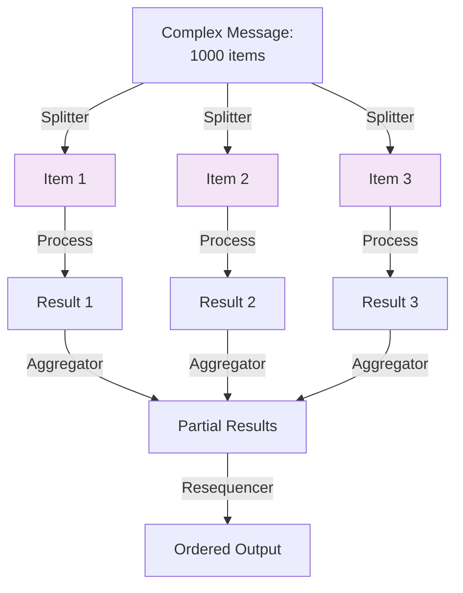

<Hero title="Splitter, Aggregator, and Resequencer" subtitle="Decompose complex messages into parts, recombine them, and restore ordering in distributed processing" imageAlt="illustration" size="large" />

## TL;DR

**Splitter** breaks a large message into smaller independent messages for parallel processing. **Aggregator** collects related messages and combines them back together. **Resequencer** reorders out-of-order messages to restore sequence. Together they enable decomposing complex operations into parallel units, then recombining results while maintaining correctness.

## Learning Objectives

You will be able to:
- Design splitters for decomposing complex work
- Implement aggregators that collect and recombine results
- Handle timeouts and incomplete aggregations
- Resequence out-of-order messages
- Avoid deadlocks in aggregation scenarios

## Motivating Scenario

A bulk order for 1,000 items from different suppliers must be split (one message per supplier), processed in parallel, then recombined. If suppliers respond out-of-order, a resequencer restores the original order before confirming the consolidated order.

## Core Concepts

<Figure caption="Splitter → Aggregator → Resequencer flow">

</Figure>

## Practical Example

<Tabs groupId="lang" queryString>
<TabItem value="python" label="Python">
```python
import json
import time
from typing import Dict, List
from collections import defaultdict

class BulkOrderSplitter:
    def split_order(self, order: Dict) -> List[Dict]:
        """Split bulk order into individual item orders."""
        items = order.get("items", [])
        split_messages = []
        
        for idx, item in enumerate(items):
            msg = {
                "correlation_id": order["order_id"],
                "sequence": idx,
                "item_id": item["id"],
                "quantity": item["quantity"],
                "supplier_id": item["supplier_id"],
            }
            split_messages.append(msg)
        
        print(f"Splitter: Split order {order['order_id']} into {len(split_messages)} items")
        return split_messages

class ResultAggregator:
    def __init__(self):
        self.aggregations = defaultdict(list)
    
    def add_result(self, result: Dict) -> bool:
        """Add result to aggregation. Return True if complete."""
        corr_id = result["correlation_id"]
        self.aggregations[corr_id].append(result)
        
        # For demo: assume we know total count
        # In real system: use timeout or explicit completion signals
        print(f"Aggregator: Added result for {corr_id}, count: {len(self.aggregations[corr_id])}")
        
        return len(self.aggregations[corr_id]) >= 3  # Arbitrary completion
    
    def get_aggregated(self, corr_id: str) -> Dict:
        """Return aggregated results."""
        results = self.aggregations[corr_id]
        return {
            "order_id": corr_id,
            "items": results,
            "status": "completed",
        }

class Resequencer:
    def resequence(self, items: List[Dict]) -> List[Dict]:
        """Reorder items by sequence number."""
        return sorted(items, key=lambda x: x.get("sequence", 0))

# Usage
splitter = BulkOrderSplitter()
aggregator = ResultAggregator()
resequencer = Resequencer()

bulk_order = {
    "order_id": "BULK-001",
    "items": [
        {"id": "ITEM-1", "quantity": 5, "supplier_id": "SUP-A"},
        {"id": "ITEM-2", "quantity": 3, "supplier_id": "SUP-B"},
        {"id": "ITEM-3", "quantity": 2, "supplier_id": "SUP-C"},
    ]
}

# Split
split_items = splitter.split_order(bulk_order)

# Process (simulated out-of-order)
results = [
    {"correlation_id": "BULK-001", "sequence": 2, "item_id": "ITEM-3", "fulfilled": True},
    {"correlation_id": "BULK-001", "sequence": 0, "item_id": "ITEM-1", "fulfilled": True},
    {"correlation_id": "BULK-001", "sequence": 1, "item_id": "ITEM-2", "fulfilled": True},
]

# Aggregate
for result in results:
    if aggregator.add_result(result):
        aggregated = aggregator.get_aggregated("BULK-001")
        
        # Resequence
        resequenced = resequencer.resequence(aggregated["items"])
        print(f"\nFinal resequenced order:")
        for item in resequenced:
            print(json.dumps(item))
```
</TabItem>
<TabItem value="go" label="Go">
```go
package main

import (
    "fmt"
    "sort"
)

type OrderItem struct {
    ID         string
    Quantity   int
    SupplierID string
}

type Result struct {
    CorrelationID string
    Sequence     int
    ItemID       string
    Fulfilled    bool
}

func splitOrder(orderID string, items []OrderItem) []Result {
    var results []Result
    for idx, item := range items {
        results = append(results, Result{
            CorrelationID: orderID,
            Sequence:      idx,
            ItemID:        item.ID,
        })
    }
    fmt.Printf("Splitter: Split into %d items\n", len(results))
    return results
}

func resequenceResults(results []Result) []Result {
    sort.Slice(results, func(i, j int) bool {
        return results[i].Sequence < results[j].Sequence
    })
    return results
}

func main() {
    items := []OrderItem{
        {ID: "ITEM-1", Quantity: 5, SupplierID: "SUP-A"},
        {ID: "ITEM-2", Quantity: 3, SupplierID: "SUP-B"},
        {ID: "ITEM-3", Quantity: 2, SupplierID: "SUP-C"},
    }
    
    // Split
    split := splitOrder("BULK-001", items)
    
    // Simulate out-of-order results
    results := []Result{
        {CorrelationID: "BULK-001", Sequence: 2, ItemID: "ITEM-3", Fulfilled: true},
        {CorrelationID: "BULK-001", Sequence: 0, ItemID: "ITEM-1", Fulfilled: true},
        {CorrelationID: "BULK-001", Sequence: 1, ItemID: "ITEM-2", Fulfilled: true},
    }
    
    // Resequence
    resequenced := resequenceResults(results)
    
    fmt.Println("Final resequenced order:")
    for _, result := range resequenced {
        fmt.Printf("Sequence %d: %s (fulfilled: %v)\n", result.Sequence, result.ItemID, result.Fulfilled)
    }
}
```
</TabItem>
<TabItem value="nodejs" label="Node.js">
```javascript
class BulkOrderSplitter {
    splitOrder(order) {
        const items = order.items || [];
        const splitMessages = items.map((item, idx) => ({
            correlationId: order.orderId,
            sequence: idx,
            itemId: item.id,
            quantity: item.quantity,
            supplierId: item.supplierId,
        }));
        
        console.log(`Splitter: Split into ${splitMessages.length} items`);
        return splitMessages;
    }
}

class ResultAggregator {
    constructor() {
        this.aggregations = {};
    }

    addResult(result) {
        const corrId = result.correlationId;
        if (!this.aggregations[corrId]) {
            this.aggregations[corrId] = [];
        }
        this.aggregations[corrId].push(result);
        console.log(`Aggregator: Added result, count: ${this.aggregations[corrId].length}`);
        
        return this.aggregations[corrId].length >= 3;
    }

    getAggregated(corrId) {
        return {
            orderId: corrId,
            items: this.aggregations[corrId],
            status: 'completed',
        };
    }
}

class Resequencer {
    resequence(items) {
        return items.sort((a, b) => a.sequence - b.sequence);
    }
}

// Usage
const splitter = new BulkOrderSplitter();
const aggregator = new ResultAggregator();
const resequencer = new Resequencer();

const bulkOrder = {
    orderId: 'BULK-001',
    items: [
        { id: 'ITEM-1', quantity: 5, supplierId: 'SUP-A' },
        { id: 'ITEM-2', quantity: 3, supplierId: 'SUP-B' },
        { id: 'ITEM-3', quantity: 2, supplierId: 'SUP-C' },
    ],
};

splitter.splitOrder(bulkOrder);

const results = [
    { correlationId: 'BULK-001', sequence: 2, itemId: 'ITEM-3', fulfilled: true },
    { correlationId: 'BULK-001', sequence: 0, itemId: 'ITEM-1', fulfilled: true },
    { correlationId: 'BULK-001', sequence: 1, itemId: 'ITEM-2', fulfilled: true },
];

for (const result of results) {
    if (aggregator.addResult(result)) {
        const aggregated = aggregator.getAggregated('BULK-001');
        const resequenced = resequencer.resequence(aggregated.items);
        console.log('Final resequenced:');
        resequenced.forEach(item => {
            console.log(`Seq ${item.sequence}: ${item.itemId}`);
        });
    }
}
```
</TabItem>
</Tabs>

## When to Use / When Not to Use

**Use Splitter when:**
- Large messages can be decomposed into independent units
- Parallelization is beneficial
- Unit processing has different costs or requirements

**Use Aggregator when:**
- Results from parallel processing must be recombined
- Completeness is critical before downstream steps

**Use Resequencer when:**
- Message order is significant
- Asynchronous processing naturally reorders messages

**Avoid when:**
- Operations are tightly sequential
- Decomposition adds more complexity than value
- In-order processing is guaranteed by the transport

## Detailed Patterns and Pitfalls

### Pattern: Correlation IDs

Track related messages across splitting and aggregation using unique identifiers:

```python
# When splitting: attach correlation_id
split_messages = []
for idx, item in enumerate(order.items):
    msg = {
        "correlation_id": order.order_id,  # Links all splits
        "sequence": idx,
        "item": item,
    }
    split_messages.append(msg)

# When aggregating: group by correlation_id
def aggregate_results(results):
    by_correlation = defaultdict(list)
    for result in results:
        by_correlation[result["correlation_id"]].append(result)
    return by_correlation
```

### Pitfall: Incomplete Aggregations

If a message is lost, the aggregator waits indefinitely. Solution: timeouts.

```python
class Aggregator:
    def __init__(self, timeout_seconds=300):
        self.aggregations = {}
        self.timeout_seconds = timeout_seconds

    def add_result(self, result):
        corr_id = result["correlation_id"]
        timestamp = time.time()

        if corr_id not in self.aggregations:
            self.aggregations[corr_id] = {
                "results": [],
                "created_at": timestamp,
            }

        agg = self.aggregations[corr_id]
        agg["results"].append(result)

        # Check for timeout
        if time.time() - agg["created_at"] > self.timeout_seconds:
            # Aggregation timed out; log and handle
            self.log_timeout(corr_id, agg)
            del self.aggregations[corr_id]
            # Send to dead letter queue for manual inspection
```

### Pattern: Dead Letter Queues

Incomplete aggregations go to a separate queue for manual review:

```python
def handle_incomplete_aggregation(corr_id, partial_results):
    dead_letter_message = {
        "correlation_id": corr_id,
        "partial_results": partial_results,
        "received_count": len(partial_results),
        "expected_count": "UNKNOWN",  # May not know expected count
        "reason": "timeout",
        "timestamp": datetime.now(),
    }
    dead_letter_queue.send(dead_letter_message)
    # Alert ops team to investigate
```

### Pitfall: Duplicate Sequence Numbers

Messages arrive with duplicate sequence numbers (network duplication).

```python
# Bad: assumes unique sequence numbers
def resequence(items):
    return sorted(items, key=lambda x: x["sequence"])

# Good: handle duplicates
def resequence(items):
    # Group by sequence, take first one
    by_sequence = defaultdict(list)
    for item in items:
        by_sequence[item["sequence"]].append(item)

    # Return unique items in sequence order
    result = []
    for seq in sorted(by_sequence.keys()):
        result.append(by_sequence[seq][0])  # First of each sequence
    return result
```

### Pitfall: Message Loss in Parallel Processing

One worker crashes after processing but before sending result. Message is lost.

```python
# Solution: Ensure idempotency
# Processing same message twice should give same result

def process_message(msg):
    if already_processed(msg["id"]):
        return previous_result(msg["id"])  # Cached result
    else:
        result = do_work(msg)
        cache_result(msg["id"], result)
        return result
```

### Pattern: Batch Splitting

Sometimes splitting every message isn't efficient. Batch them:

```
Input: BulkOrder with 1,000 items
Splitter creates: 10 batches of 100 items each
Parallel processing: 10 workers process batches
Aggregator: Combines 10 results
```

More efficient than 1,000 individual messages.

### Self-Check Deep Dive

1. **How do you ensure all split messages are aggregated?**
   - Use correlation IDs to track related messages
   - Count expected splits
   - Timeout if not all received
   - Send incomplete to dead letter queue

2. **What happens if a message is lost during parallel processing?**
   - Aggregation timeout; moved to dead letter queue
   - Manual intervention or retry from source
   - Alert ops team
   - Implement idempotency so reprocessing is safe

3. **How do you resequence when messages arrive completely out of order?**
   - Sort by sequence number
   - Handle duplicates (take first)
   - Handle gaps (log as warning, continue)

## Design Review Checklist

- [ ] Splitter logic is deterministic and reproducible
- [ ] Correlation IDs uniquely identify related messages
- [ ] Aggregator has timeout mechanism
- [ ] Incomplete aggregations are logged
- [ ] Resequencer handles missing or duplicate sequence numbers
- [ ] Monitoring tracks split/aggregate/resequence operations

## Self-Check

1. **How do you ensure all split messages are aggregated?**
2. **What happens if a message is lost during parallel processing?**
3. **How do you resequence when messages arrive completely out of order?**

:::info One Takeaway
Splitter decomposes for parallelism, Aggregator recombines results, Resequencer restores order. Together they enable scaling while maintaining correctness.

:::

## Next Steps

- Learn [Pipes and Filters](/docs/design-patterns/enterprise-integration-patterns/pipes-and-filters) for sequential processing
- Study [Dead Letter Channel](/docs/design-patterns/enterprise-integration-patterns/dead-letter-channel-poison-message-handling) for handling incomplete aggregations
- Explore batch processing frameworks (Spark, MapReduce)

## Real-World Scenarios

### Scenario: Bulk Email Sending

Split message with 10,000 email addresses into batches:

```
Input: {"recipient_ids": [1, 2, ..., 10000], "subject": "Sale Alert"}
Splitter: Creates 100 messages, each with 100 recipient IDs
├─ Batch 1: [1-100]
├─ Batch 2: [101-200]
└─ ...
└─ Batch 100: [9901-10000]

Parallel: 100 workers process batches simultaneously
├─ Worker 1: Sends to recipients 1-100
├─ Worker 2: Sends to recipients 101-200
└─ ...

Aggregator: Collects 100 results
├─ Result 1: {sent: 98, failed: 2}
├─ Result 2: {sent: 100, failed: 0}
└─ ...

Final: Aggregate results
└─ Total: {sent: 9950, failed: 50}
```

### Scenario: Data Pipeline with Transformations

Split CSV, transform fields, reaggregate:

```
Input CSV: customers.csv (1M rows)
Splitter: 100 chunks of 10k rows each
Transforms (parallel):
├─ Validation: Check format, drop invalids
├─ Enrichment: Look up additional data
├─ Normalization: Standardize formats
Aggregator: Combine valid rows into output
└─ Output: cleaned_customers.csv
```

### Scenario: Request/Response with Splitter

Distribute request processing, collect responses:

```
Input: MapReduce job with N tasks
Splitter: Creates N subtask messages
Map phase: Multiple workers process subtasks
Aggregator: Collects all results
Reduce phase: Combine results into final answer
```

### Scenario: Order Fulfillment

Bulk order from multiple suppliers:

```
Order: [Item1 from Supplier A, Item2 from Supplier B, Item3 from Supplier C]
Splitter:
├─ Supplier A message: [Item1]
├─ Supplier B message: [Item2]
└─ Supplier C message: [Item3]

Parallel fulfillment:
├─ Supplier A: Picks Item1 (2 hours)
├─ Supplier B: Picks Item2 (1 hour)
└─ Supplier C: Picks Item3 (3 hours)

Aggregator:
├─ Collects shipment confirmations
├─ Waits for all (timeout 24 hours)
└─ Triggers combined shipment notification

Resequencer:
├─ Ensures consolidated invoice shows items in original order
```

## Optimization Patterns

### Pattern: Partition by Work Size

Not all splits equal. Adjust partition size:

```python
def smart_split(items, max_partition_size=1000):
    """Split into partitions, but not too large or too small"""
    if len(items) < max_partition_size:
        return [items]  # No split needed

    # Estimate optimal partition count
    optimal_partitions = (len(items) + max_partition_size - 1) // max_partition_size
    partition_size = (len(items) + optimal_partitions - 1) // optimal_partitions

    partitions = []
    for i in range(0, len(items), partition_size):
        partitions.append(items[i:i+partition_size])
    return partitions

# 10 items, max 1000: 1 partition (no split)
# 100 items, max 1000: 1 partition (no split)
# 1000 items, max 1000: 1 partition (borderline, could split)
# 5000 items, max 1000: 5 partitions
```

### Pattern: Adaptive Resequencing

If many messages are missing, don't wait forever:

```python
def resequence_with_gaps(items, expected_count, timeout=300):
    """Resequence but handle missing items"""
    by_sequence = defaultdict(list)
    received_time = time.time()

    while True:
        try:
            item = receive_with_timeout(1)  # 1 second timeout per item
        except TimeoutException:
            if time.time() - received_time > timeout:
                break
            continue

        seq = item["sequence"]
        by_sequence[seq].append(item)

        # Check if we have enough (e.g., 90% of expected)
        if len(by_sequence) >= expected_count * 0.9:
            break

    # Resequence what we have
    result = []
    for seq in sorted(by_sequence.keys()):
        result.append(by_sequence[seq][0])  # First of each sequence

    # Log missing sequences
    for i in range(max(by_sequence.keys())):
        if i not in by_sequence:
            logger.warning(f"Missing sequence {i}")

    return result
```

## References

1. "Enterprise Integration Patterns" by Gregor Hohpe and Bobby Woolf
2. "Building Microservices" by Sam Newman (Chapter on asynchronous integration)
3. Apache Spark / MapReduce documentation (Split/Map/Reduce/Collect patterns)
